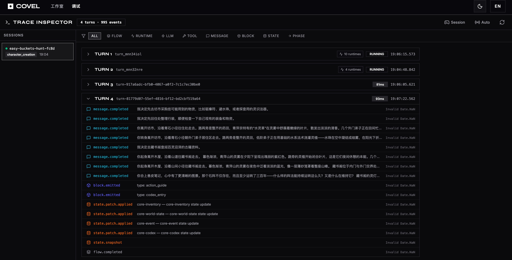

# Covel

> 插件化的 AI 文字冒险平台 —— 每个玩法都是一个 Agent。

[](https://github.com/AcKnEsS/covel)
[](https://github.com/AcKnEsS/covel/releases)
[](https://www.typescriptlang.org/)
[](https://nodejs.org/)
[](https://pnpm.io/)
[](./LICENSE)


> [English](./README.en.md) · 中文（当前）
>
> ⚠️ **Work in Progress** — 项目处于 `v0.0.x` 早期阶段，API、数据格式、插件 frontmatter 字段都可能随版本破坏性变化。不建议在生产环境部署。

---

## 它是什么

Covel 是一个基于大模型的文字冒险游戏平台，所有玩法都通过插件扩展。

每个插件是一个**自主 Agent Runtime**：自己决定什么时候触发、读取哪些上下文、调用哪些工具、写入什么状态。叙事、行动引导、NPC 关系图、知识典籍、角色创建、世界初始化都是独立插件，**可以装、可以卸、可以热切换**，也可以自己写。

内置 8 个核心插件开箱即玩，也可直接作为二次开发的样板。

## 特性

- **插件即 Agent** — 每个插件独立声明触发规则 / 上下文注入 / 工具清单 / 写入代理，LLM 调度完全受插件驱动
- **多 LLM Provider** — DeepSeek · Qwen (DashScope) · OpenAI · Anthropic，按 slot 配置，不改代码切换模型
- **多存储后端** — MemoryStore (dev) · IndexedDB (浏览器) · SQLite (桌面) · PostgreSQL (生产)，统一契约
- **三种部署形态** — Web / Electron / Tauri（后两者共享同一个 Node sidecar，Tauri bundle 更小）
- **文件式世界包** — `world.yaml` + `WORLD.md`，维度可 LLM 自动抽取
- **json-render 声明式 UI** — 插件用 JSON spec 声明面板与消息块，无需写 React 代码
- **Graph-RAG 记忆** — NPC 关系图提取 + 2-hop 检索 + 三层记忆系统（Core / Recall / Archival）
- **浏览器持 Key** — API Key 留在 localStorage，逐请求通过 `X-Provider-Keys` 传递，不落盘

## 界面一览

| 主叙事 + 插件消息 | 右侧插件面板 | 调试页：Turn / Prompt / Trace |
|:-:|:-:|:-:|
|  |  |  |

## 快速开始

### 普通用户 · 下载桌面版

> ⚠️ 项目极早期，[Releases](https://github.com/AcKnEsS/covel/releases) 里的预编译包**随时可能下架或重置**。想稳定跟进请走源码构建路径。

目前仅提供 **macOS arm64**（Apple Silicon）预编译包，同时提供两种桌面壳：

| 壳 | 安装包 | 推荐 | 说明 |
|------|--------|:-:|------|
| **Electron** | `Covel-electron-<version>-mac-arm64.dmg` | ⭐ | 功能更完整，我们日常开发 & 调试都跑这个 |
| Tauri | `Covel-tauri_<version>_aarch64.dmg` | | bundle 更小，原生 WebView，实验性质 |

两者共用同一个 Node sidecar 和后端，数据互通。首次启动进 **Settings** 填 LLM API Key 即可。Windows 与 Intel Mac 版本暂不提供，需要请自行用源码构建（见下一节）。

桌面版的配置目录、`config.toml`、`keys.env`、`llm.toml` 细节见 [`docs/guide/desktop-config.md`](./docs/guide/desktop-config.md)。

### 开发者 · 源码运行

**前提**：Node.js ≥ 22，pnpm 10.7+。

```bash
pnpm install
cp llm.toml.example llm.toml        # 填模型 ID 和端点
cp .env.llm.example .env.llm        # 填 provider API Key
pnpm dev                            # 前端 5173 + 后端 3001（默认 SQLite，数据库落在 ./data/covel.db）
```

打开 `http://localhost:5173`；调试页在 `/debug`。

需要内存存储（跳过落盘、进程退出即清空）：在 `.env` 中设置 `STORE_BACKEND=memory` 后再运行 `pnpm dev`。

切换 PostgreSQL：`cp .env.example .env && pnpm db:up && pnpm dev:pg && pnpm dev:web`（后端另起一个终端）。

### 自部署 · Docker 一键

```bash
cp .env.example .env
cp llm.toml.example llm.toml && cp .env.llm.example .env.llm
pnpm docker:build   # 构建并启动 前端 + 后端 + PostgreSQL
```

访问 `http://localhost:3001`。

### 桌面壳本地构建

```bash
pnpm dev:electron      # Electron 壳热重载（dev）
pnpm dev:tauri         # Tauri 壳热重载（dev）
pnpm build:electron    # 当前平台 Electron 安装包 → release/
pnpm build:tauri       # 当前平台 Tauri 安装包   → release/
pnpm build:desktop     # 两个一起打
```

签名与公证细节：[`apps/desktop/PACKAGING.md`](./apps/desktop/PACKAGING.md)。

## 写一个插件

最小插件 = `PLUGIN.md` + `package.json`。frontmatter 声明触发方式、上下文注入、工具清单；markdown 正文就是 LLM 的 agent skill prompt。

```yaml
---
name: my-plugin/main
priority: 500
model: plugin
trigger:
  type: scheduled
  interval: 1
tools:
  builtin: [create-form, plugin-data-set]
---

你是一个 XXX agent。本回合需要……
```

完整教程：[插件作者指南](./docs/guide/plugin-authoring.md)。
已实现插件参考：[插件注册表](./docs/reference/plugins.md) · [工具注册表](./docs/reference/tools.md)。

## 项目结构

```
covel/
├── apps/
│   ├── web/              React 19 + Vite 8 前端（含 json-render 驱动的插件面板）
│   ├── server/           Hono API + Drizzle ORM
│   ├── desktop/          Electron 壳
│   └── desktop-tauri/    Tauri 壳
├── packages/             内部包（shared / runtime / context / ai-provider / …）
├── plugins/              核心插件（narrator / codex / npc-graph / char-creator / …）
├── worlds/               世界包（cloudmere / mistport / neonridge）
├── prompts/              外部化 prompt 模板
└── docs/                 参考文档与作者指南
```

完整依赖关系与包说明见 [`CLAUDE.md`](./CLAUDE.md#monorepo-structure)。

## 文档

| 角色 | 入口 |
|------|------|
| **想读懂项目** | [架构 flow](./docs/architecture/flow.md) · [`CLAUDE.md`](./CLAUDE.md) |
| **写插件** | [插件作者指南](./docs/guide/plugin-authoring.md) · [插件注册表](./docs/reference/plugins.md) · [工具注册表](./docs/reference/tools.md) |
| **接 API** | [API 参考](./docs/reference/api.md) · [通讯协议](./docs/reference/protocol.md) |
| **做 UI** | [前端面板架构](./docs/reference/ui-panels.md) · [Prompt 结构](./docs/reference/prompt-structure.md) |
| **跑桌面版** | [桌面版配置](./docs/guide/desktop-config.md) · [打包发布](./apps/desktop/PACKAGING.md) |
| **发版 / 贡献** | [CONTRIBUTING](./docs/CONTRIBUTING.md) · [CHANGELOG](./docs/CHANGELOG.md) |

完整索引：[`docs/README.md`](./docs/README.md)。

## Roadmap

- ✅ 插件系统 + 8 个核心插件 + json-render UI 架构
- ✅ 多 Provider / 多 Storage / 桌面双壳（Electron + Tauri）
- 🚧 长会话上下文预算与智能截断
- 🚧 Lorebook 关键字触发扫描与 Reserved Tokens 预算
- 📋 Character Card V2/V3 导入导出（SillyTavern / RisuAI 互通）
- 📋 跨会话长期记忆（embedding / vector recall）

详细改进评估见 [`devs/docs/insights/covel-improvement-plan.md`](./devs/docs/insights/covel-improvement-plan.md)。

## 贡献

欢迎 Issue 与 Pull Request。请先阅读 [`docs/CONTRIBUTING.md`](./docs/CONTRIBUTING.md)。

发版由 Git tag 触发：推送 `v*` tag → [`.github/workflows/release.yml`](./.github/workflows/release.yml) 在 macOS runner 上并行构建 Electron + Tauri 的 arm64 dmg，生成 Release 草稿。暂不提供 Windows / Intel Mac / Linux 预编译包。

## License

[MIT](./LICENSE) © 2026 Covel Contributors
