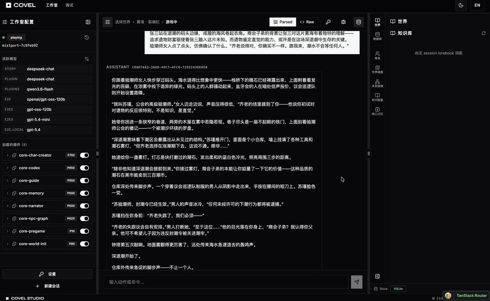

# Covel

插件驱动的 AI 交互式叙事引擎。Kernel 提供执行原语，Plugin 承载所有玩法逻辑。

> 🇬🇧 [English version](./docs/README.en.md)

[](https://github.com/AcKnEsS/covel/releases)
[](https://www.typescriptlang.org/)
[](https://nodejs.org/)
[](https://pnpm.io/)
[](./LICENSE)



---

Covel 是一个为 AI RPG 设计的插件平台。每个回合走固定的优先级管线（触发 → 调度 → 上下文组装 → LLM 推理 → 提案提交），游戏机制完全由插件实现，可以在运行时增减或热切换。

支持 DeepSeek · Qwen (DashScope) · OpenAI · Anthropic，通过 `llm.toml` 配置 Slot，不改代码切换模型。

## 下载

预编译的桌面版本可在 [Releases](https://github.com/AcKnEsS/covel/releases) 页面下载：

| 平台 | 安装包 | 架构 |
|---|---|---|
| macOS | `Covel-<version>-arm64.dmg` / `Covel-<version>-x64.dmg` | Apple Silicon / Intel |
| macOS | `Covel-<version>-arm64-mac.zip` / `Covel-<version>-x64-mac.zip` | Apple Silicon / Intel |
| Windows | `Covel Setup <version>.exe` | x64 / arm64 |
| Windows | `Covel-<version>-portable.exe` | x64 |

> 首次运行需要配置 LLM provider（进入应用后在设置页填写 API Key）。

## 快速开始（源码）

**前提**：Node.js ≥ 22，pnpm 10.7+

```bash
# 安装依赖
pnpm install

# 配置 LLM（必须）
cp llm.toml.example llm.toml    # 填写模型 ID 和端点
cp .env.llm.example .env.llm    # 填写对应 provider 的 API Key

# 启动（内存存储，无需数据库）
pnpm dev
```

打开 `http://localhost:5173`，调试页在 `/debug`。

### 使用 PostgreSQL

```bash
cp .env.example .env
pnpm db:up       # 启动 PostgreSQL 容器
pnpm dev:pg      # 后端切换到 pg 存储
pnpm dev:web     # 另开终端启动前端
```

### Docker 一键部署

```bash
cp .env.example .env
cp llm.toml.example llm.toml && cp .env.llm.example .env.llm

pnpm docker:build   # 构建并启动（前端 + 后端 + PostgreSQL）
```

服务启动后访问 `http://localhost:3001`。

### 桌面版本地构建

```bash
pnpm desktop:build   # 构建 web + 后端资源打包
pnpm desktop:dist    # 生成当前平台 installer (release/)
```

更多签名/公证细节见 [`apps/desktop/PACKAGING.md`](apps/desktop/PACKAGING.md)。

## 项目结构

```
covel/
├── apps/
│   ├── web/          React 19 + Vite 8 + TanStack Router 前端（含插件驱动 UI）
│   ├── desktop/      Electron 桌面应用（封装 web + server）
│   └── server/       Hono API 服务器 + Drizzle ORM
├── packages/
│   ├── shared/            共享类型与契约
│   ├── runtime/           执行引擎（LLM tool-calling loop + 智能重试）
│   ├── context/           上下文构建（TurnContextStore + PromptAssembler）
│   ├── ai-provider/       多 Provider LLM 抽象（2597 模型能力数据库）
│   ├── plugin-loader/     插件发现与注册表
│   ├── store/             存储抽象（Memory / SQLite / IndexedDB / PostgreSQL）
│   ├── tools/             工具系统（注册表 + builtin 工具）
│   ├── lorebook/          世界/会话 lorebook
│   ├── approval/          RPC 审批管线
│   └── state / events / memory / plugin-test-utils
├── plugins/          核心插件（pregame / narrator / codex / npc-graph / guide / ...）
├── worlds/           世界包（cloudmere / mistport / neonridge）
├── prompts/          外部化 prompt 模板（本地化 markdown）
└── docs/             参考文档与开发指南
```

## 常用命令

```bash
pnpm dev                   # 前端 + 后端
pnpm dev:pg                # 后端（PostgreSQL 模式）
pnpm build                 # 构建所有包
pnpm lint                  # 类型检查
pnpm test                  # 全部测试
pnpm e2e                   # Playwright E2E 测试
pnpm desktop:dev           # 桌面版开发模式
```

## 文档

| | |
|---|---|
| [API 参考](docs/reference/api.md) | HTTP 端点、请求格式、curl 示例 |
| [插件注册表](docs/reference/plugins.md) | 所有插件、触发方式、frontmatter 字段说明 |
| [工具注册表](docs/reference/tools.md) | builtin + local 工具列表 |
| [通讯协议](docs/reference/protocol.md) | SSE 事件类型与信封格式 |
| [前端面板](docs/reference/ui-panels.md) | 插件驱动 UI 架构（json-render）|
| [插件作者指南](docs/guide/plugin-authoring.md) | 从零开始写插件 |

完整文档索引：[`docs/README.md`](docs/README.md)。目录包含 [`reference/`](docs/reference/)（API/协议/工具）、[`guide/`](docs/guide/)（上手与作者指南）、[`architecture/`](docs/architecture/)（系统设计与历史）。

## 发布

版本号通过 Git tag 驱动：

```bash
git tag v0.0.1-beta
git push origin v0.0.1-beta
```

推送 `v*` tag 后，[`.github/workflows/release.yml`](.github/workflows/release.yml) 将自动在 GitHub-hosted macOS 与 Windows runner 上并行构建 Electron 安装包，并生成一个 GitHub Release 草稿。详情见 [贡献指南 · Release Process](./docs/CONTRIBUTING.md#release-process)。

## 贡献

欢迎通过 Issue 与 Pull Request 参与。请先阅读 [`docs/CONTRIBUTING.md`](./docs/CONTRIBUTING.md)。

## Changelog

发布记录见 [`docs/CHANGELOG.md`](./docs/CHANGELOG.md)。

## License

[MIT](./LICENSE) © 2026 Covel Contributors
