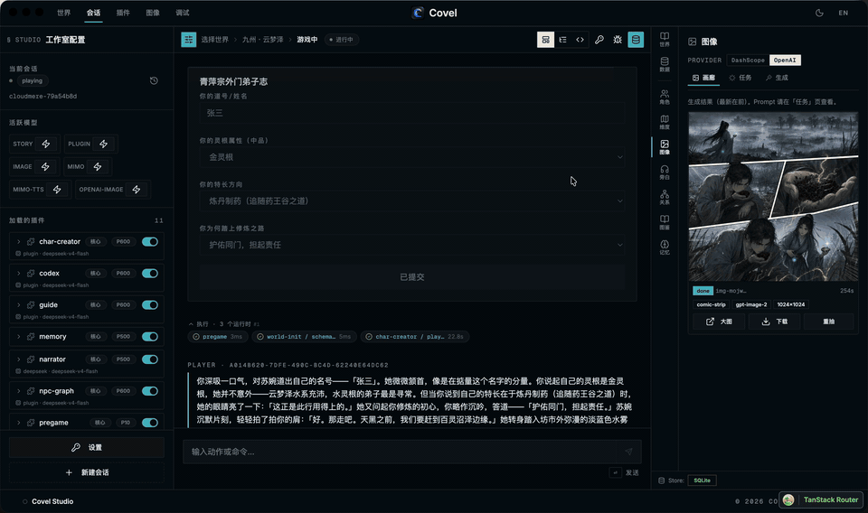
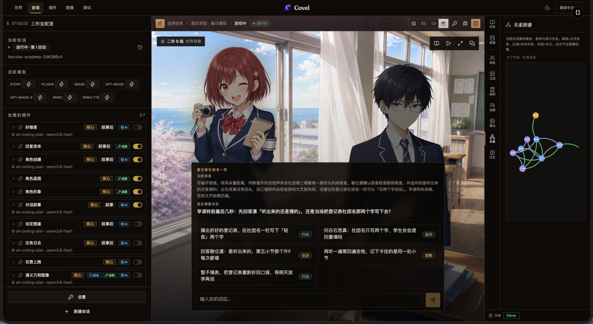
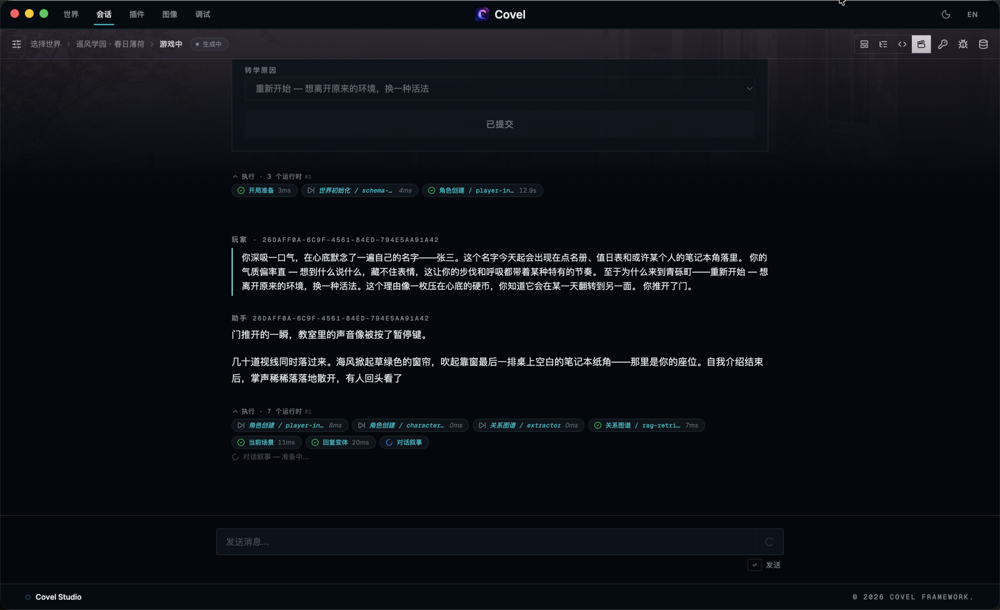
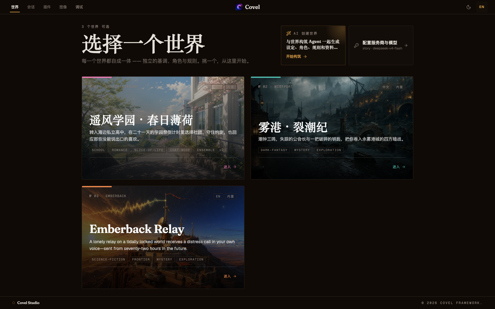

# Covel

**A modern, agentic AI RPG. Customize every mechanic with a plugin.**

**English** · [简体中文](./README.zh-CN.md)

[](https://github.com/ackness/covel/releases/tag/v0.0.19)
[](./LICENSE)
[](<>)
[](https://deepwiki.com/ackness/covel)



Covel is an AI RPG where the world keeps running between your turns: NPCs track how they feel about you, lore accumulates as you play, and memory carries the thread across the session. Every mechanic behind that is an **autonomous agent shipped as a plugin** — disable one, swap one, or write your own.

> **Current public release: v0.0.19**, early access — APIs, data formats, and plugin frontmatter may change between versions. Prebuilt binaries target macOS Apple Silicon and Windows x64; other platforms build from source.

## Highlights

- 🎭 **Stage mode** — a full-screen visual novel: scene backdrops, character sprites, typewriter dialog, and choice overlays. Backdrops for brand-new locations are generated on demand, mid-session.
- 🤖 **Multi-agent turns** — while the narrator writes the scene, other agents extract NPC relationships, grow the world codex, pick the on-stage cast, and maintain long-range memory — in parallel, every turn.
- 🧩 **Everything is a plugin** — 23 bundled agents. A plugin is a `PLUGIN.md`: YAML frontmatter for triggers/tools/events, markdown body as the agent's prompt.
- 🌍 **Two flagship worlds** — a dark-fantasy mystery and a visual-novel school romance, both hand-built and ready to fork.
- 🔌 **Bring your own model** — OpenAI / Anthropic / DeepSeek / Qwen model slots. Local-first: SQLite on disk, API keys never persisted server-side.

## Two ways to play

|                                 Stage mode (visual novel)                                  |                                     Story mode (text)                                      |
| :----------------------------------------------------------------------------------------: | :----------------------------------------------------------------------------------------: |
|                                       |                                        |
| Backdrops, sprites, and typewriter dialog; scene art resolves and generates as you explore | Classic narrated turns with inline choices, forms, and the per-turn agent timeline visible |

Worlds declare their default (`defaultViewMode: stage`); you can switch any time in-session.

## Quick start

### Play

Download the **macOS Apple Silicon** build from [Releases](https://github.com/ackness/covel/releases), then: open Settings → paste an LLM API key → pick a world → play.

Your data lives in `~/.covel/` (config, keys, SQLite, custom worlds, logs) — details in the [desktop config guide](./docs/guide/desktop-config.en.md). Per-release notes: [`docs/CHANGELOG.md`](./docs/CHANGELOG.md).

### Run from source

```bash
pnpm install
cp llm.toml.example llm.toml        # model IDs and endpoints
cp .env.llm.example .env.llm        # provider API keys
pnpm dev                            # web :5173 + server :3001 (SQLite)
```

Open <http://localhost:5173> — debug tooling lives at `/debug`. PostgreSQL, in-memory mode, and other knobs: [env registry](./docs/guide/env-registry.md).

## Worlds in the box



- **Mistport Chronicles** (雾港·裂潮纪) — dark-fantasy mystery in traditional-story mode. A fog-shrouded port where every ebb bares different ruins; a guildmaster vanishes and four powers race for a key to what sleeps in the deep. Bilingual, with a seed cast and investigation-flavored memory.
- **Haruka Academy** (遥风学园) — school romance in stage mode. Clubs, exams, rumors, and quiet crushes at a seaside high school, told through a cast of eight — portraits and scene art included.

## Create your own

Open Claude Code in this repository and use the bundled skills:

- **`/create-world`** — describe a setting; get a validated `world.yaml` + `WORLD.md` + world data, ready for `~/.covel/worlds/`.
- **`/create-plugin`** — describe the agent you want; get a validated `PLUGIN.md` + `package.json`.

An official hub for sharing plugins and world packs is on the roadmap — for now, share via Gist or fork.

## Develop

- [Plugin authoring guide](./docs/guide/plugin-authoring.md) — start here; bundled plugins under [`plugins/`](./plugins/) are working references
- [Architecture & turn pipeline](./docs/architecture/flow.md) — how a turn flows through trigger → schedule → agents → commit
- Reference: [plugin registry](./docs/reference/plugins.md) · [tool registry](./docs/reference/tools.md) · [HTTP API](./docs/reference/api.md) · [full doc index](./docs/README.md)

pnpm workspaces + Turborepo · ESM-only · TypeScript strict · React 19 + Hono + Drizzle. Repo layout and package list → [`CLAUDE.md`](./CLAUDE.md#monorepo-structure).

## Roadmap

- Windows / Linux / Intel Mac builds
- Official community hub for plugins and world packs
- Plugin marketplace inside the desktop app

## Contributing & license

Issues and PRs welcome — please read [`docs/CONTRIBUTING.en.md`](./docs/CONTRIBUTING.en.md) first. Releases are tag-driven: pushing `v*` builds and publishes the macOS installer via [GitHub Actions](./.github/workflows/release.yml).

[MIT](./LICENSE) © 2026 Covel Contributors
