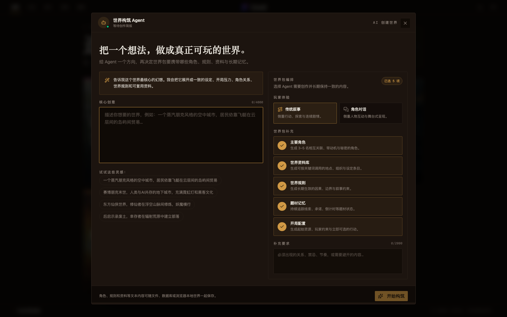
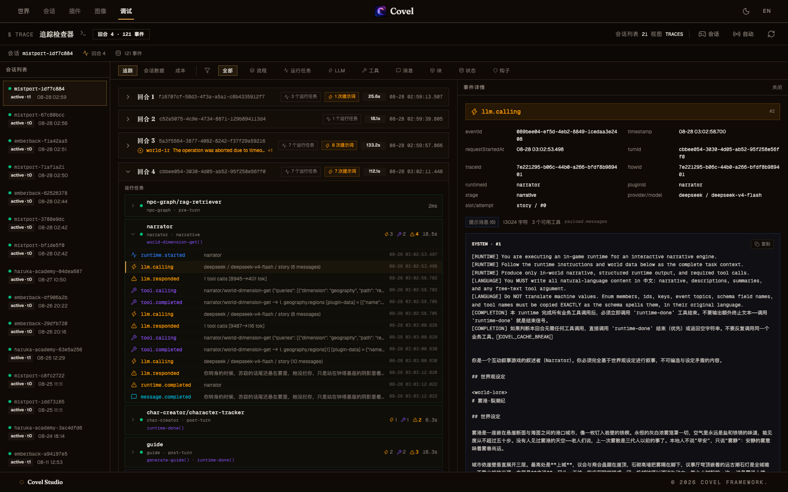

# Covel

**A modular, agentic AI RPG. Compose mechanics as plugins and ship settings as portable world packs.**

**English** · [简体中文](./README.zh-CN.md)

[](https://github.com/ackness/covel/releases/tag/v0.0.31)
[](./LICENSE)
[](./docs/CHANGELOG.md)
[](https://deepwiki.com/ackness/covel)


Covel is an AI RPG framework and playable studio where NPC relationships, lore, quests, inventory, memory, stage direction, and media can evolve between turns. Its architecture has three clear layers: the **kernel provides primitives and orchestration**, **plugins provide behavior**, and **world packs provide settings, resources, and a default plugin composition**.

> **Current public release: v0.0.31**, early access. APIs, world data, and plugin manifests may change between versions. Current binaries target macOS Apple Silicon and Windows x64 and are unsigned; read [`docs/CHANGELOG.md`](./docs/CHANGELOG.md) and back up custom content before upgrading.

## Highlights

- 🎭 **Stage mode** — a full-screen visual novel: scene backdrops, character sprites, typewriter dialog, and choice overlays. Backdrops for brand-new locations are generated on demand, mid-session.
- ⚙️ **Composable plugin runtimes** — combine LLM agents, deterministic functions, UI panels, data schemas, events, and lifecycle hooks in one capability-driven pipeline.
- 🎲 **RPG mechanics built in** — pre-rolled dice checks with visible receipts, an auto-tracked quest log, a player-managed inventory, and per-NPC affinity meters. All optional plugins; worlds can seed quests, gear, and starting affinity.
- 🧩 **Plugins stay replaceable** — the kernel discovers `capabilities` and `outputKind`; framework code does not branch on concrete plugin IDs.
- 🌍 **Portable world packs** — bundle lore, character schemas, cast, rules, memory blocks, quests, items, portraits, scenes, and plugin defaults behind one `WorldData` import protocol.
- 🔄 **One shared WorldIR** — a post-turn fact projection lets quests, inventory, affinity, the codex, and relationship plugins reuse the same evidence instead of independently re-reading the story.
- 🔌 **Bring your own model** — OpenAI / Anthropic / DeepSeek / Qwen model slots. Local-first: SQLite on disk, API keys never persisted server-side.

## Two ways to play

|                                 Stage mode (visual novel)                                  |                                      Story mode (text)                                       |
| :----------------------------------------------------------------------------------------: | :------------------------------------------------------------------------------------------: |
|                                       |                                          |
| Backdrops, sprites, and typewriter dialog; scene art resolves and generates as you explore | Classic narrated turns with suggested actions, inline forms, and the per-turn agent timeline |

Worlds declare their default (`defaultViewMode: stage`); you can switch any time in-session.

## How the pieces fit together

| Layer              | Owns                                     | Typical contents                                                                              |
| ------------------ | ---------------------------------------- | --------------------------------------------------------------------------------------------- |
| **Kernel**         | Stable primitives and orchestration      | scheduling, context assembly, tools, proposals, validation, persistence, rendering            |
| **Plugin package** | Reusable gameplay behavior               | agent/function runtimes, UI, schemas, tools, events, projections, lifecycle hooks             |
| **World pack**     | Portable setting and product composition | lore, characters, rules, plugin policy/settings, memory blocks, world data, portraits, scenes |

The boundary matters: a world can select a different narrator or omit quests without changing the kernel; a plugin can work in many worlds without knowing their IDs; and a world author can add genre-specific data without forking a plugin.

## Plugins are capability packages

A plugin is not necessarily one autonomous agent. It may contain one runtime, several cooperating runtimes, no LLM at all, or only a UI/data contract.

| Form                      | What it does                                                               | Bundled examples                                      |
| ------------------------- | -------------------------------------------------------------------------- | ----------------------------------------------------- |
| **Agent runtime**         | Uses a model for narration or structured extraction                        | `narrator`, `codex`, `core-quest`                     |
| **Function runtime**      | Runs deterministic, zero-token game logic                                  | `pregame`, `dice-check/roller`, `scene-cast`          |
| **Mixed package**         | Combines deterministic retrieval with agent extraction                     | `npc-graph`, `dice-check`, image-generation plugins   |
| **Lifecycle hooks**       | Applies cross-cutting policy around scheduling, models, tools, and commits | `cost-gate`, `story-guard`, `director`                |
| **UI and data contracts** | Declares panels, memory blocks, schemas, or world-data targets             | `memory`, `character-blueprint`, `character-presence` |

`PLUGIN.md` frontmatter declares scheduling, tools, events, `capabilities`, and `outputKind` (`story`, `plugin`, or `system`). For an agent runtime, its Markdown body is also the model instruction. A multi-runtime package keeps package metadata at the root and puts executable manifests under `runtimes/*/PLUGIN.md`:

```text
plugins/npc-graph/
├── PLUGIN.md                         # package identity and shared metadata
└── runtimes/
    ├── rag-retriever/PLUGIN.md       # deterministic pre-turn retrieval
    └── extractor/PLUGIN.md           # post-turn relationship agent
```

The kernel connects these pieces through declared capabilities and typed outputs. That is what makes a narrator, image provider, stage director, or rules system swappable without framework branches for a particular plugin ID.

## World packs make a setting playable



A world pack is the portable content layer. `world.yaml` describes identity, locales, presentation, character attributes, memory blocks, and the desired plugin composition. `WORLD.md` provides canonical lore. `data/world.data.yaml` maps typed sources into world metadata, characters, lorebook entries, media indexes, or plugin-owned namespaces.

```text
worlds/my-world/
├── world.yaml                        # identity, pluginPolicy, pluginSettings
├── WORLD.md                          # canonical setting and opening premise
├── data/
│   ├── world.data.yaml               # ordered source → schema → target imports
│   ├── dimensions.yaml
│   └── rules/
├── characters/main-cast.json
└── media/
    ├── portraits/
    ├── scenes/
    └── presence and scene indexes
```

`pluginPolicy` chooses a preset and marks plugins as required, recommended, or excluded; optional choices remain player-configurable. `pluginSettings` supplies world defaults below player overrides. `memoryBlocks` adds genre-specific memory such as clues, suspects, signal logs, or countdowns without modifying the memory system.

`WorldData` is the shared import protocol, not a second world format. Its sources can be YAML, JSON, Markdown, text, or media and can target canonical characters/lorebook data or a plugin namespace that explicitly accepts world data. The in-app AI builder produces the same standard package: it can generate the manifest, lore, dimensions, main cast, lorebook, and rules from a structured creative brief. File-backed packs can include full media; browser/store-backed generated worlds retain a portable text fallback while media remains file- or asset-backed.

## Internationalization across UI, plugins, and worlds

Covel ships with `zh-CN` and `en-US` UI catalogs. The selected locale is used consistently for interface labels, plugin metadata and prompts, world metadata, character fields, and WorldData sources. Short natural-language fields use `I18nText` maps such as `{ zh, en }`; longer content lives in locale-specific files:

```text
apps/web/src/i18n/locales/ja-JP.json       # application UI catalog
plugins/my-plugin/PLUGIN.ja.md             # localized agent instructions
worlds/my-world/WORLD.ja.md                 # localized setting document
worlds/my-world/characters/main-cast.ja.json
worlds/my-world/data/rules/core.ja.yaml
```

World packs declare `defaultLocale` and `supportedLocales`. The loader first tries the current language variant and then falls back to the canonical source, so a partial translation remains playable. Mistport demonstrates a bilingual pack with localized lore, characters, rules, and media metadata. **Emberback Relay** is the built-in English-default world pack (`defaultLocale: en-US`), with its manifest, setting, cast, rules, quests, and other starting content authored in English.

Players, world authors, and plugin authors can follow the [i18n guide](./docs/reference/i18n.md) to add another language. Full application support requires adding a UI catalog and registering its locale; content support adds translated `I18nText` values plus `PLUGIN.<lang>.md`, `WORLD.<lang>.md`, and WorldData source variants as needed. Only natural-language content is translated—stable IDs, capabilities, tools, paths, and scheduling remain canonical. Run `pnpm check:i18n` to validate the result.

## Debug every turn end to end



The built-in Trace Inspector groups execution by session and turn, then exposes each runtime and every flow, LLM, tool, message, block, state, and hook event. Expand a runtime to see its call sequence, token counts, timings, tool arguments, and results; open an event to inspect request metadata, prompt messages, available tool definitions, and the raw payload. Separate Session Data and Cost views make the same workspace useful for gameplay QA, plugin authoring, and provider-cost analysis.

## Every roll leaves a receipt


A risky action resolves against dice rolled **before** the narrator writes, so the outcome cannot be retconned to fit the prose — and the arithmetic posts inline: `19 + 2 = 21 vs DC 16`. Quest progress, gear changes, and affinity shifts land in the turn the same way, then accumulate into their own panels. Dice, quests, inventory, and affinity are four separate plugins; a world seeds the opening quests, starting gear, and initial affinity, or ships without any of them.

## What persists between turns


Open a side panel mid-play and you are reading the state carried forward from the world pack and this session: core memory (running plot, current scene, player state), the NPC relationship graph, the world codex, and the on-stage cast. World authors can seed characters, rules, quests, items, affinity, and media; plugins keep that state evolving as you play, then feed the relevant parts back into later turns.

## Quick start

### Play

Download the **macOS Apple Silicon** or **Windows x64** build from [Releases](https://github.com/ackness/covel/releases), then: open Settings → paste an LLM API key → pick a world → play.

Your data lives in `~/.covel/` (config, keys, SQLite, custom worlds, logs). If `config.toml` redirects `data_root`, that separate directory also holds data. See the [desktop config guide](./docs/guide/desktop-config.en.md) and [`docs/CHANGELOG.md`](./docs/CHANGELOG.md) before upgrading.

### Run from source

```bash
pnpm install
cp llm.toml.example llm.toml        # model IDs and endpoints
cp .env.llm.example .env.llm        # provider API keys
pnpm dev                            # web :5173 + server :3001 (SQLite)
```

Open <http://localhost:5173> — debug tooling lives at `/debug`. PostgreSQL, in-memory mode, and other knobs: [env registry](./docs/guide/env-registry.md).

## Worlds in the box


- **Mistport Chronicles** (雾港·裂潮纪) — dark-fantasy investigation in traditional-story mode. Its custom plugin pack, bilingual lore, investigation memory, cast blueprints, rules, and portraits show how a world can specialize the framework without forking it.
- **Haruka Academy** (遥风学园) — school ensemble romance in stage mode. Dialogue policy, character relationships, memory blocks, transparent sprites, and day/night scene registries turn the same kernel into a visual novel.
- **Emberback Relay** — an English-default (`en-US`) science-fiction frontier mystery in traditional-story mode. A lonely relay on a tidally locked world receives a distress call in your own voice from seventy-two hours ahead. Seeded quests, inventory, affinity, rules, character blueprints, portraits, and five check attributes make it the RPG-suite reference pack.

## Create your own

Use **AI Create World** in the world picker to turn a creative brief into a validated, playable world pack. Choose traditional narration or character dialogue, then include the cast, lorebook, rules, genre memory, and opening configuration you need.

Repository authors can also use the bundled helpers:

- **`/create-world`** — generate and validate `world.yaml`, `WORLD.md`, and WorldData files for `~/.covel/worlds/`.
- **`/create-plugin`** — scaffold the right combination of runtime manifests, handlers, schemas, tools, UI, and tests for a capability package.

An official hub for sharing plugins and world packs is on the roadmap — for now, share via Gist or fork.

## Develop

- [Plugin authoring guide](./docs/guide/plugin-authoring.md) — start here; bundled plugins under [`plugins/`](./plugins/) are working references
- [Architecture & turn pipeline](./docs/architecture/flow.md) — how a turn flows through trigger → schedule → agents → commit
- Reference: [plugin registry](./docs/reference/plugins.md) · [tool registry](./docs/reference/tools.md) · [HTTP API](./docs/reference/api.md) · [full doc index](./docs/README.md)

pnpm workspaces + Turborepo · ESM-only · TypeScript strict · React 19 + Hono + Drizzle. Repo layout and package list → [`CLAUDE.md`](./CLAUDE.md#monorepo-structure).

## Roadmap

- Linux / Intel Mac builds (macOS arm64 and Windows x64 already ship)
- Official community hub for plugins and world packs
- Plugin marketplace inside the desktop app

## Contributing & license

Issues and PRs welcome — please read [`docs/CONTRIBUTING.en.md`](./docs/CONTRIBUTING.en.md) first. Releases are tag-driven: pushing `v*` builds and publishes the macOS and Windows installers via [GitHub Actions](./.github/workflows/release.yml).

[MIT](./LICENSE) © 2026 Covel Contributors
