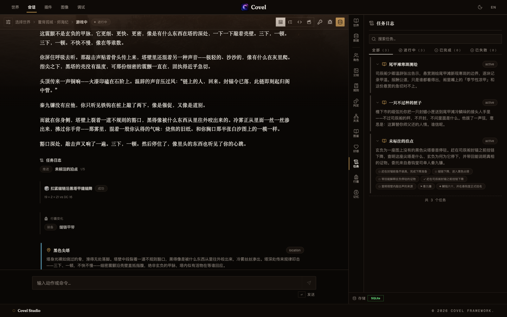
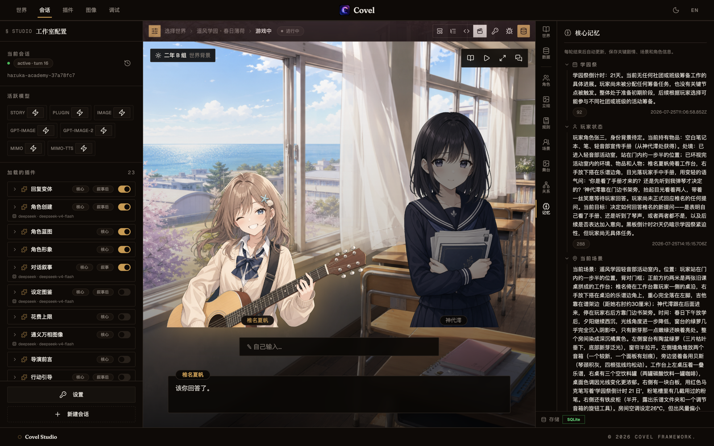

# Covel

**现代化、agent 化的 AI RPG。每个机制都是一个插件，由你定义。**

[English](./README.md) · **简体中文**

[](https://github.com/ackness/covel/releases/tag/v0.0.26)
[](./LICENSE)
[](<>)
[](https://deepwiki.com/ackness/covel)


Covel 是一款 AI 驱动的 RPG，回合之间世界仍在运转：NPC 记录着对你的态度、世界典籍随游玩积累、记忆贯穿整局。支撑这一切的每个机制都是一个**以插件形式分发的自主 agent** —— 禁用一个、替换一个，或者自己写一个。

> **当前公开版本：v0.0.26**，早期阶段 —— API、数据格式、插件 frontmatter 可能随版本变化。官方预编译包面向 macOS Apple Silicon 与 Windows x64，其余平台从源码构建。

## 亮点

- 🎭 **舞台模式** —— 全屏视觉小说：场景背景、角色立绘、打字机对话框与选择肢浮层。走到没画过的新地点时，背景图会在会话中按需生成。
- 🤖 **多 agent 回合** —— 叙事 agent 写场景的同时，其他 agent 并行抽取 NPC 关系、扩写世界典籍、决定在场角色、维护长程记忆 —— 每一回合都是如此。
- 🎲 **内置 RPG 玩法** —— 预掷骰判定（可视化回执）、自动跟踪的任务日志、玩家可直接操作的行囊、逐 NPC 好感度。全部是可选插件；世界包可以预置任务、开局装备与初始好感。
- 🧩 **一切皆插件** —— 内置 26 个 agent。一个插件就是一份 `PLUGIN.md`：YAML frontmatter 声明触发/工具/事件，Markdown 正文就是 agent 的提示词。
- 🌍 **三个旗舰世界** —— 黑暗奇幻悬疑、视觉小说校园恋爱、末世 RPG 远征，都是精心手作、可直接 fork 的范例。
- 🔌 **自带模型** —— OpenAI / Anthropic / DeepSeek / Qwen 模型槽位。本地优先：SQLite 落盘，API 密钥绝不在服务端持久化。

## 两种玩法

|                 舞台模式（视觉小说）                 |                      叙事模式（文字）                       |
| :--------------------------------------------------: | :---------------------------------------------------------: |
|   |           |
| 背景、立绘与打字机对话；场景美术随探索自动解析与生成 | 经典叙事回合，内嵌行动建议与表单，每回合的 agent 时间线可见 |

世界声明自己的默认档（`defaultViewMode: stage`），游戏中可随时切换。

## 每一次判定都有回执



有风险的行动，判定用的骰子在叙事**动笔之前**就已经掷好，结果不会被行文倒推改写 —— 算式直接落在正文里：`19 + 2 = 21 vs DC 16`。任务推进、装备变动、好感升降也以同样方式回执在这一回合里，再沉淀进各自的面板。骰子、任务、行囊、好感是四个独立插件；世界包预置开局任务、初始装备与初始好感，也可以一个都不装。

## agent 在后台留下了什么



游戏中随手打开侧栏，看到的就是后台 agent 这一回合写下的东西：核心记忆（进行中的剧情、当前场景、主角状态）、NPC 关系图谱、世界典籍、在场角色。这些都不是手写的 —— 它们随着你游玩不断累积，也正是叙事 agent 下一回合会读回去的内容。

## 快速开始

### 直接玩

从 [Releases](https://github.com/ackness/covel/releases) 下载 **macOS Apple Silicon** 或 **Windows x64** 安装包，然后：打开设置 → 粘贴 LLM API 密钥 → 选一个世界 → 开玩。

你的数据都在 `~/.covel/`（配置、密钥、SQLite、自定义世界、日志）—— 详见[桌面配置指南](./docs/guide/desktop-config.md)。版本说明：[`docs/CHANGELOG.md`](./docs/CHANGELOG.md)。

### 从源码运行

```bash
pnpm install
cp llm.toml.example llm.toml        # 模型 ID 与端点
cp .env.llm.example .env.llm        # provider API 密钥
pnpm dev                            # web :5173 + server :3001（SQLite）
```

打开 <http://localhost:5173>，调试工具在 `/debug`。PostgreSQL、内存模式等其它选项：[环境变量注册表](./docs/guide/env-registry.md)。

## 内置世界


- **雾港·裂潮纪（Mistport Chronicles）** —— 传统叙事模式，黑暗奇幻悬疑。被浓雾包裹的港口，每次退潮都露出不同的遗迹；公会长失踪，四方势力争夺一把通往深处之物的钥匙。中英双语，内置种子角色与调查向记忆维度。
- **遥风学园（Haruka Academy）** —— 舞台模式（stage mode），校园恋爱日常。海边高中的社团、考试、传闻与未说出口的喜欢，由八名角色的群像展开 —— 立绘与场景美术开箱即含。
- **鳌背孤城·烬海纪（Emberback）** —— 传统叙事模式，末世 RPG 远征。世上最后一头巨鳌驮着最后一座城横渡烬海——破晓时分，它毫无征兆地停在一座图上没有的沉城尖塔之上。RPG 玩法套件的展示世界：预置任务、开局装备、NPC 初始好感与接入骰子系统的五项判定属性，主要角色配有立绘。

## 创造你自己的

在本仓库中打开 Claude Code，使用内置技能：

- **`/create-world`** —— 描述一个设定，得到校验通过的 `world.yaml` + `WORLD.md` + 世界数据，可直接放进 `~/.covel/worlds/`。
- **`/create-plugin`** —— 描述你想要的 agent，得到校验通过的 `PLUGIN.md` + `package.json`。

插件与世界包的官方分享社区在路线图上 —— 目前可通过 Gist 或 fork 分享。

## 开发

- [插件编写指南](./docs/guide/plugin-authoring.md) —— 从这里开始；[`plugins/`](./plugins/) 下的内置插件都是可运行的参考
- [架构与回合管线](./docs/architecture/flow.md) —— 一个回合如何流经触发 → 调度 → agents → 提交
- 参考：[插件注册表](./docs/reference/plugins.md) · [工具注册表](./docs/reference/tools.md) · [HTTP API](./docs/reference/api.md) · [完整文档索引](./docs/README.md)

pnpm workspaces + Turborepo · ESM-only · TypeScript strict · React 19 + Hono + Drizzle。仓库布局与包清单 → [`CLAUDE.md`](./CLAUDE.md#monorepo-structure)。

## 路线图

- Linux / Intel Mac 构建（macOS arm64 与 Windows x64 已发布）
- 插件与世界包的官方分享社区
- 桌面应用内置插件市场

## 贡献与许可

欢迎 Issue 和 PR —— 请先阅读 [`docs/CONTRIBUTING.md`](./docs/CONTRIBUTING.md)。发布由 Git 标签驱动：推送 `v*` 标签即由 [GitHub Actions](./.github/workflows/release.yml) 构建并发布 macOS 安装包。

[MIT](./LICENSE) © 2026 Covel Contributors
