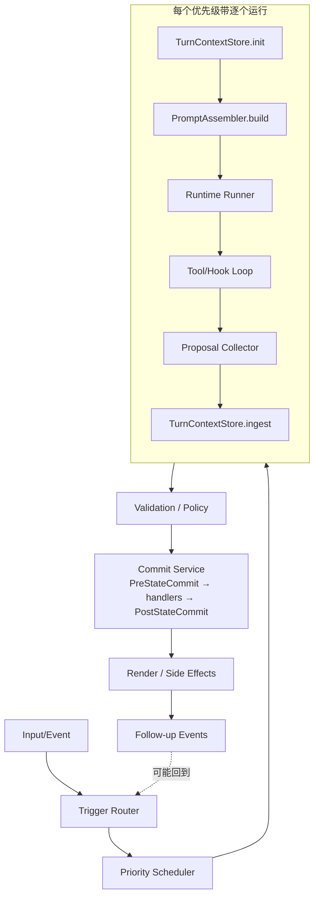

# F7 · `docs/architecture/flow.md` 架构图重绘 + Mermaid 化

**Status**: pending · **Est**: 2.5 hours · **Risk**: low (纯文档, 无运行时影响) · **Depends on**: F1 已完成(phase 模型迁移)

---

## 1. 背景:为什么需要这个

### 1.1 `flow.md` 是什么

[`docs/architecture/flow.md`](../../../docs/architecture/flow.md) 是 Covel 架构的**总览文档**:

- README 把它作为"深入理解框架"的第一入口
- `CLAUDE.md` 的 Documentation Index 把它列为"End-to-end turn pipeline, full architecture"
- 新工程师入职 / 社区贡献者上手 / 架构讨论时它是主要参考

### 1.2 F1 之后图文不一致

审计 F1(`phase` 模型迁移)已经在代码层彻底清除 `phase.transition` / `phase.changed` —— 权威状态模型是 `(status, turnCount, preGameCompleted)`。

F6 的文档 pass 已经:
- 删除了文档开头的"图示仍然保留旧 phase 流程"disclaimer
- 改写了三处关于 `phase` 的散文段落
- **但 ASCII 图本身没动**

具体来说 flow.md 里仍然有类似这样的图(具体位置施工时定位, 搜 `pre-game\|character_creation\|phase`):

```
┌─────────────┐      ┌──────────────────┐      ┌─────────────┐
│  pre-game   │ ───> │ character_create │ ───> │   playing   │
└─────────────┘      └──────────────────┘      └─────────────┘
```

而新模型里并没有这种"三节点单向转移":

- 不是"三个阶段一条线"—— 而是 `(status, turnCount, preGameCompleted)` 三元组合成的状态机
- Pre-Game 阶段不是一个"状态",而是 `turnCount === 0 && preGameCompleted 不全`
- character_creation 根本不是一个独立阶段,它只是"一个标记为 pre-game runtime 的插件正在跑"

### 1.3 这不是 bug 但是**信任问题**

散文被修好了,但图没改,读者:

1. 新工程师打开 flow.md 找架构总览
2. 看到三节点 phase 图,对照代码搜 `phase` → 发现代码里 phase 是 derived display label 而不是真实模型
3. 开始怀疑:"这文档是不是过期了?哪些能信?"
4. 进一步对整个 `docs/` 产生疑虑,以后懒得看、懒得维护

**文档可信度的塌陷是非线性的**——一处明显过时的图能拖垮整份文档的读者信任。

### 1.4 ASCII 图本身的维护成本高

即便内容对,ASCII 图也有二次问题:

- 对齐 `├──` `│` 这种字符耗时
- 微调一个节点常常要重画整片
- GitHub / VSCode 不是所有字体宽度一致, 有时渲染错位
- 工程师修完架构后不想碰图, 就让它继续漂移

结果:架构图要么过时, 要么永远不敢改。

---

## 2. 目标

1. **重绘三类图**,反映"phase 已退役、`(status, turnCount, preGameCompleted)` 为真相源"的新模型。
2. **切换到 Mermaid**,所有图源都是 2-10 行纯文本,GitHub + VSCode 原生渲染,以后改架构只改几行字。
3. **保持语义完整**——不是删图,是把每张现存图重做对应的新图,维持"看这一个文档能懂 Covel 架构"的承诺。

---

## 3. 三张要重绘的图

施工前先做一次 grep 走查:

```bash
grep -nE "pre-game|character_creation|phase\s*=|phase:" docs/architecture/flow.md
```

定位所有仍含 phase 标签的图和段落。以下是已知要重绘的三类(**具体数量以 grep 为准, 可能有更多小图**):

### 3.1 会话生命周期状态机

**旧版(ASCII)概念图**:
```
  pre-game ──> character_creation ──> playing ──> (pause/end)
```

**新版(Mermaid)**:

````markdown
```mermaid
stateDiagram-v2
    [*] --> PreGame: createSession()

    state PreGame {
        direction LR
        [*] --> RunningPreGamePlugins
        RunningPreGamePlugins --> AllPreGameDone: 所有 Pre-Game runtime 报 preGameDone
        AllPreGameDone --> [*]
    }

    PreGame --> Playing: turnCount 0 → 1

    state Playing {
        direction LR
        [*] --> WaitingForInput
        WaitingForInput --> ExecutingTurn: POST /api/actions
        ExecutingTurn --> WaitingForInput: turn 收尾
    }

    Playing --> Paused: pauseSession()
    Paused --> Playing: resumeSession()
    Playing --> Ended: endSession()
    Paused --> Ended: endSession()
    Ended --> [*]
```
````

**配套散文**(放 Mermaid 图下方):

> 权威状态模型 = `(status, turnCount, preGameCompleted)`:
>
> - **Pre-Game**: `status === 'active' && turnCount === 0` — 此时调度 Pre-Game band (priority 0–99) 的 runtime。`preGameCompleted` 累积每个报 `preGameDone: true` 的 runtimeId,集齐后框架自动把 turnCount 推到 1,进入 Playing。
> - **Playing**: `status === 'active' && turnCount >= 1` — 每次 `/api/actions` 触发一轮完整 turn pipeline(Pre-Turn → Narrator → After-Turn → Audit)。
> - **Paused / Ended**: `status === 'paused' | 'ended'` — 调度器跳过,`/api/actions` 拒绝。Paused 可恢复,Ended 是终态。
>
> 向前兼容:`SessionSnapshot.session.phase` 是 [`snapshot-builder.ts`](../../packages/runtime/src/snapshot-builder.ts) 从 `(status, turnCount)` 派生的**显示态标签**(值 = `pre-game | playing | paused | ended`),仅用于 UI 展示层的空态分支,不是持久字段。

### 3.2 Turn Pipeline(回合执行流程)

**旧版**:ASCII 横向 pipeline,可能带 `phase.transition` proposal 作为一条分支。

**新版(Mermaid)**:

````markdown

````

**配套散文**:

> **优先级带**(kernel 强制):
>
> | Turn | 可用 priority | 阶段 |
> |------|---------|------|
> | 0 | 0–99 | Pre-Game |
> | ≥1 | 100–499 | Pre-Turn |
> | ≥1 | 500 | Narrator |
> | ≥1 | 501–999 | After-Turn |
> | ≥1 | 1000 | Audit |
>
> **Proposal 类型**(都过 commit chain):`narrative.append`、`state.patch`、`event.emit`、`record.upsert`、`ui.render`、`asset.generate`、`lorebook.upsert`。(若 F3 已落地: 加 `plugin-data.set`、`plugin-data.set-batch`。)

### 3.3 SSE 事件时序图(客户端视角)

**旧版**:可能是时序图或散文列表,包含已退役的 `phase.changed`。

**新版(Mermaid sequenceDiagram)**:

````markdown
```mermaid
sequenceDiagram
    participant Client
    participant Server
    participant Kernel
    participant Plugin
    participant Store

    Client->>Server: POST /api/actions { content }
    Server->>Kernel: runSingleAction(sessionId, input)
    Kernel-->>Client: turn.started
    Kernel->>Plugin: runtime.started (for each)
    Plugin-->>Client: runtime.started
    Plugin->>Kernel: proposals[]
    Kernel->>Store: PreStateCommit → commit
    Kernel-->>Client: narrative.delta (streaming)
    Kernel-->>Client: proposal.committed
    Kernel-->>Client: runtime.completed { status }
    Note over Kernel,Client: runtime may report status=suspended;<br/>see F4 for client handling
    Kernel-->>Client: turn.completed
```
````

**配套散文**:

> `runtime.completed.payload.status` 有三种取值:
>
> - `completed` — 正常结束
> - `suspended` — runtime 等待外部输入(详见 [F4](./F4-suspend-resume-web.md) 的前端接入)
> - `failed` — runtime 抛错
>
> 挂起 runtime 会额外发 `turn.suspended` 事件;外部系统调 `POST /api/sessions/:id/resume` 唤醒后发 `turn.resumed`。
>
> **已退役的事件类型**:`phase.changed`、`phase.transition`(F1 清理,不再发出)。

---

## 4. 实施方案(顺序)

### 4.1 Step 1 · 盘点(~15min)

```bash
# 列出所有受影响的地方
grep -nE "pre-game|character_creation|phase\\.(transition|changed)|phase\\s*=\\s*['\"]|session\\.phase" docs/architecture/flow.md

# 定位所有 ASCII 图(方框字符)
grep -nE "^\\s*┌|^\\s*│|^\\s*└|^\\s*▼" docs/architecture/flow.md | head -30
```

把结果写一份清单,每张图都要有**新图 + 对应位置**配对。

### 4.2 Step 2 · 起草新图(~1h)

在 `audits/2026-04-21-architecture-code-audit/followups/flow-diagrams-draft.md`(临时文件,落地后删除)写出所有 Mermaid 源码。在 GitHub preview 里验证每张图能渲染。

- 状态机优先 stateDiagram-v2
- Pipeline 优先 flowchart TB
- 时序图优先 sequenceDiagram
- **避免** classDiagram / graph(已 deprecated 语法)

### 4.3 Step 3 · 替换(~45min)

一张一张替换到 flow.md:

1. 找到 ASCII 图起点
2. 删除整片 ASCII
3. 粘贴 Mermaid fenced code block
4. 在图下方检查配套散文是否仍然语义一致,不一致就微调(**不重写**,保留原意)

### 4.4 Step 4 · 交叉引用修正(~15min)

检查文档内部其他位置是否**引用了已被删除的 phase 概念**作为"见 XX 小节":

```bash
grep -n "见.*phase\|参见.*phase\|phase 小节" docs/
```

有则更新链接目标。

### 4.5 Step 5 · 其他架构图(可选, ~15min)

顺手检查同一目录其他 md 是否也有 phase 残留:

- `docs/architecture/` 下其他文件
- `docs/reference/protocol.md`
- `docs/reference/ui-panels.md`

如果工作量小就一并处理;大就另开 ticket。

---

## 5. 风险清单

| 风险 | 缓解 |
|------|------|
| Mermaid 在离线 PDF / 某些静态文档站(Docusaurus 某些版本)不渲染 | Covel 现在没有离线文档场景;GitHub 原生 ✅、VSCode 原生 ✅、Claude Code markdown 渲染 ✅ |
| 状态机图过于详细导致视觉拥挤 | stateDiagram-v2 支持嵌套 state, 用 PreGame / Playing 两层避免一张图塞太多节点 |
| 内部 wiki 或外部文章引用过特定 ASCII 行号(比如 `flow.md:L120`) | `rg "flow\\.md[:#]" docs/ apps/ packages/` 走查, 必要时更新 |
| 架构含义理解不对 | 施工前找一个懂全局的同事 15 分钟 review Mermaid 草稿 |

---

## 6. 交付物验收

- [ ] `docs/architecture/flow.md` 里没有任何 `pre-game`、`character_creation`、`phase.transition`、`phase.changed` 作为**模型概念**的出现(允许作为历史说明提及)
- [ ] 所有 ASCII 图替换为 Mermaid;grep `┌|│|└|▼` 在文件里 0 命中或只剩无关 ASCII
- [ ] 三类核心图(生命周期 / pipeline / SSE 时序)都存在且在 GitHub preview 能渲染
- [ ] 配套散文与新模型一致(`(status, turnCount, preGameCompleted)` 作为真相源)
- [ ] 内部引用更新
- [ ] 无 `pnpm lint` 失败(文档改动不应影响,但 CLAUDE.md 的 Documentation Index 若 touched 要检查 markdown link 语法)

---

## 7. 参考文件清单

实施时必读:

- [`docs/architecture/flow.md`](../../../docs/architecture/flow.md) — 要改的主文件
- [`packages/runtime/src/snapshot-builder.ts`](../../../packages/runtime/src/snapshot-builder.ts) — 派生 phase 的权威源,理解图和代码的关系
- [`packages/shared/src/types/session.ts`](../../../packages/shared/src/types/session.ts) — `SessionRecord` 的真实字段(验证"权威状态模型")
- [`packages/runtime/src/session-kernel.ts`](../../../packages/runtime/src/session-kernel.ts) — turn pipeline 的真实实现
- [`packages/shared/src/types/protocol.ts`](../../../packages/shared/src/types/protocol.ts) — `ProtocolEventType` 列表(验证时序图里列的事件都是真存在的)
- Mermaid 状态机语法: https://mermaid.js.org/syntax/stateDiagram.html
- Mermaid 流程图语法: https://mermaid.js.org/syntax/flowchart.html
- Mermaid 时序图语法: https://mermaid.js.org/syntax/sequenceDiagram.html
- 审计原始记录:`audits/2026-04-21-architecture-code-audit/README.md`(审计原始产出,本地 gitignored) 第 6 节 + F6 落地 commit

## 8. 可选延展(不在本 ticket 范围)

- 把 Mermaid 图抽出到独立文件(`docs/architecture/diagrams/*.mmd`),文档里 include —— Covel 当前规模不必要
- 给每张图加 alt-text / 可访问性描述
- 整个 `docs/` 统一做一次 Mermaid 化 pass(本 ticket 仅 flow.md;其他文档若也有 ASCII 图,单独开 ticket)
