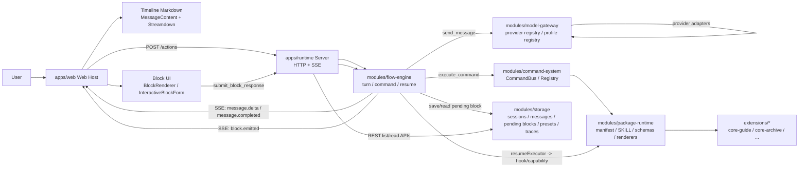

# 当前对话渲染与交互块架构

更新时间：`2026-03-26`

这张图描述的是仓库**当前实际落地**的链路，不是目标态。

## 当前架构图



## 这套架构已经具备的能力

- 消息流和交互块已经**协议分离**：
  - 文本走 `message.delta / message.completed`
  - 结构化交互走 `block.emitted`
- 前端已经有宿主级 block 渲染入口：
  - `apps/web/src/block-renderer-registry.tsx`
- block 响应已经是正式协议，不是拼回普通聊天文本：
  - `BlockResponse`
  - `submit_block_response`
  - `resume flow`
- package 已经是一等公民：
  - `manifest.json`
  - `SKILL.md`
  - `schemas`
  - `client/renderers`

## 和 Claude 那版相比，当前还差的核心点

### 1. 目前不是“LLM 输出 widget JSON -> 前端扫描 Markdown”

当前实现是：

- runtime/flow-engine 原生支持 `BlockEnvelope`
- Web Host 直接渲染 `block.emitted`

不是：

- 在 assistant 文本里插入 ````widget` fenced block
- 前端流式扫描 Markdown 再拆出 widget

这意味着当前协议更干净，但和你描述的“LLM 在叙事正文中自然夹带 widget 块”还不是同一路径。

### 2. LLM 主叙事链路还没有真正产出 block

`FlowEngine` 支持 model turn 返回：

- `content`
- `blocks`

但当前 runtime composition 里，`modelGateway.generateText(...)` 最终只把模型结果映射成：

- `content`
- `traceId`

没有把模型结构化 block 接进主链路。

也就是说：

- 架构内核支持
- 当前产品装配还没接完

### 3. Package renderer 目前是声明了，但 Web Host 还没动态装载

当前状态：

- package manifest 已支持 `contributes.blocks` 和 `contributes.renderers`
- `core-guide` 也已经有 `client/renderers/choices.tsx`

但 Web Host 现在实际使用的是宿主内建静态注册表，不是动态从 package 装载 renderer。

### 4. block schema / response schema 校验还没完全接入 submit 主链路

规范要求：

- runtime 收到 `BlockResponse` 时先按 schema 校验

但当前实现进度文档明确写了，这部分还没接完。

## 对你这个 RPG 对话插件层的判断

如果对照你的目标，可以这样理解：

- **已经有的**：SSE 主链路、结构化 block 协议、resume flow、package manifest、前端 block 容器
- **还没到位的**：LLM 原生输出 block、package renderer 动态加载、schema 驱动通用表单/组件、真正的“叙事文本 + 结构块混排”

## 最接近你目标的目标态

如果继续沿当前仓库方向演进，最顺的路线不是回退到 Markdown fenced widget parser，而是：

1. 让 model layer 直接返回 `content + blocks[]`
2. 让 `message` 与 `block` 在同一 turn 内按顺序进入 timeline
3. 让 package renderer 从 manifest 动态注册到 Web Host
4. 用 `dataSchema/responseSchema` 驱动默认 schema UI，custom renderer 只覆盖少数块

这样会比“前端再去扫 Markdown fenced JSON”更稳，也更符合你仓库现有架构。
