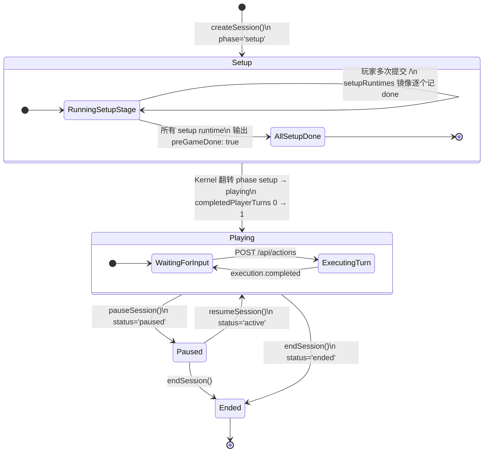
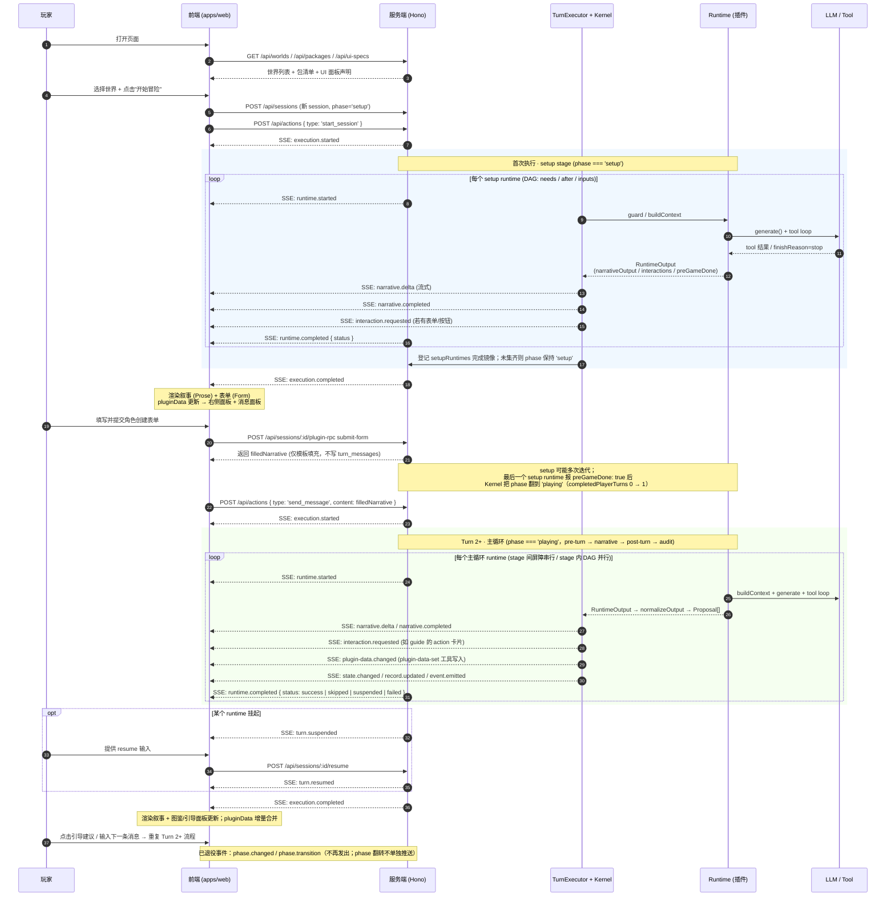

# Covel 框架架构与执行流程

> 从设置、游玩前、游玩中、游玩后到状态存储，完整描述框架运行机制。
> 包含玩家 ↔ LLM Agent 之间的翻译层、消息流动、插件设计和前端交互。
>
> **状态模型（业务真值）**：会话的权威状态由 `status`（`active` / `paused` / `ended`）加上会话时钟三字段组成——`phase`（`'setup' | 'playing'`，stage 分带选择器）、`completedPlayerTurns`（已完成的玩家回合数）、`setupRuntimes`（setup 阶段各 runtime 的解析状态镜像）。`phase === 'setup'` 时只运行 `setup` stage；所有 setup runtime 报告完成后，Kernel 把 `phase` 翻到 `'playing'` 进入主循环。`turnCount` / `preGameCompleted` 是内核不再写入的 legacy 字段：DB 列冻结保留（供旧内核 / 回滚读取），API 响应与 snapshot 在读取时经 `deriveLegacyClockForSession`（`packages/shared/src/scheduling/session-clock.ts`）从会话时钟派生，响应形状不变。

## 一、系统全景

```
┌─────────────────────────────────────────────────────────────────────────────┐
│                              Covel 全景架构                                 │
│                                                                             │
│  ┌──────────────┐    SSE/HTTP     ┌──────────────────────────────────────┐  │
│  │   Frontend    │ ◄─────────────► │            Server (Hono)             │  │
│  │  (apps/web)   │                │                                      │  │
│  │              │                │  ┌────────────────────────────────┐   │  │
│  │ json-render  │                │  │       Turn Executor            │   │  │
│  │ catalog      │                │  │  ┌──────────────────────────┐  │   │  │
│  │ pluginData   │                │  │  │    Stage Scheduler       │  │   │  │
│  │ SSE client   │                │  │  │ setup→pre-turn→narrative │  │   │  │
│  └──────────────┘                │  │  │ →post-turn→audit + DAG   │  │   │  │
│                                  │  │  │                         │  │   │  │
│  ┌──────────────┐                │  │  └──────────────────────────┘  │   │  │
│  │   Plugins     │                │  │           │                    │   │  │
│  │  PLUGIN.md    │────加载────────►│  │     ┌─────▼──────┐            │   │  │
│  │  tools/*.js   │                │  │     │ LLM Gateway │            │   │  │
│  │  ui/*.json    │                │  │     └─────┬──────┘            │   │  │
│  └──────────────┘                │  │           │                    │   │  │
│                                  │  │     ┌─────▼──────┐            │   │  │
│  ┌──────────────┐                │  │     │ Tool Loop   │            │   │  │
│  │   Worlds      │                │  │     └─────┬──────┘            │   │  │
│  │  world.yaml   │────加载────────►│  │           │                    │   │  │
│  │  WORLD.md     │                │  │     ┌─────▼──────┐            │   │  │
│  └──────────────┘                │  │     │Session Kernel│            │   │  │
│                                  │  │     │ (Proposal →  │            │   │  │
│                                  │  │     │  Commit)     │            │   │  │
│                                  │  │     └─────┬──────┘            │   │  │
│                                  │  └───────────┼────────────────────┘   │  │
│                                  │              │                        │  │
│                                  │  ┌───────────▼────────────────────┐   │  │
│                                  │  │        DataStore               │   │  │
│                                  │  │  sessions │ messages │ plugin  │   │  │
│                                  │  │  results  │ characters│ data   │   │  │
│                                  │  └────────────────────────────────┘   │  │
│                                  └──────────────────────────────────────┘  │
└─────────────────────────────────────────────────────────────────────────────┘
```

## 二、生命周期状态机

### 2.1 会话生命周期



**业务真值** = `(status, phase, completedPlayerTurns, setupRuntimes)`：

- **Setup**：`status === 'active' && phase === 'setup'`。调度器只运行 `stage: setup` 的 runtime；每个 runtime 以显式完成信号（输出 `preGameDone: true`，或 guard 返回 `{ skip: true }`）记入 `setupRuntimes` 状态镜像（`pending` / `done` / `blocked`），玩家可以多次提交表单/消息迭代（例如 `char-creator` 的 `framework.submit-form`）。耗尽重试预算（`maxTriggerCount`）不算完成——该 runtime 落到 `blocked`，会话停留在 setup 阶段等待玩家重试或豁免，不再"跳过坏掉的 setup 继续推进"。
- **phase 翻转**：所有 setup runtime 都报告完成后，Kernel 在提交事务内把 `phase` 从 `'setup'` 翻到 `'playing'`、把 `completedPlayerTurns` 推进到 1，进入主循环；提交失败则计数、phase 翻转和 setup 镜像一并回滚。
- **Setup completion followup**：角色表单这类最后一个 setup 输入提交后，`/api/actions` 的同一个请求会先完成 setup，再立即补跑本次已触发的主循环 runtime。这样玩家提交表单后能直接看到第一段正式叙事；审计、trace 和 snapshot 里该请求同时包含 setup completion 与 main-loop followup。
- **会话提交原子边界**：同一 session 的玩家输入、runtime 执行、proposal commit、会话时钟写入（`phase` / `completedPlayerTurns` / `setupRuntimes`）和自动 snapshot 由同一 session lock 串行化。自动 snapshot 在全部 proposal 提交后捕获，确保对话 cursor、角色、state 与 plugin data 属于同一个已提交回合。
- **例外：后台执行只有提交在锁内**。`execution: background` 的 runtime（deferred follower 与 background 模式的 manual 触发）把 handler 跑在 session lock **外**，只有 `processTurnResults`（finalize 事务 + auto-snapshot）进锁。这类 runtime 通常是几分钟的 provider 调用（出图、TTS），持锁执行会让玩家的下一条消息一直排队，PG 部署下更会直接撞上 30s 的锁获取上限。之所以安全：这条路径不写会话时钟（不传 `sessionClock`，且 `completedPlayerTurns` 只数 `origin: "player"`），域写入经 writeBuffer 汇入同一个提交事务而非执行期零散落盘，也不追加对话消息。同一 runtime 的并发执行由 `<sessionId>::<runtimeId>` 作业锁串行，保住 handler 里"是否已生成"这类 check-then-act 的原子性（否则会重复计费）；提交前在锁内重读会话状态，玩家中途暂停/结束会话时结果被丢弃而非写入。
- **Playing**：`status === 'active' && phase === 'playing'`。每次 `POST /api/actions` 触发一轮完整 Turn pipeline，按 `pre-turn → narrative → post-turn → audit` 四个 stage 依次运行（stage 间严格屏障）。`completedPlayerTurns` 只统计已提交的玩家回合——manual plugin-rpc、后台 follower、嵌套 `recursiveCall` 等非玩家执行各自落 `turn_results` 行（带 `origin` 标记）但不计数；多个执行共享同一 `turnId` 时只计一次。
- **Paused / Ended**：`status === 'paused' | 'ended'`。调度器直接返回空，`/api/actions` 被服务端拒绝。Paused 可 `resumeSession()` 恢复，Ended 是终态。

`turnCount` / `preGameCompleted` 是内核不再写入的 legacy 字段：API 响应与 `SessionSnapshot.session` 仍暴露 `turnCount` 等字段，但其值在读取时经 `deriveLegacyClockForSession` 从会话时钟派生（`phase === 'setup'` → `turnCount = 0`；`'playing'` 且有进展 → `max(1, completedPlayerTurns)`），DB 列冻结保留供回滚读取，未带 `phase` 的存量会话在下次执行时做一次性懒回填。phase 翻转不推送任何 SSE 事件，也没有对应的 proposal 类型——客户端从会话响应里读 `phase`。

### 2.2 单轮 Turn Pipeline

```mermaid
flowchart TB
    In(["POST /api/actions<br/>玩家输入 / 开始游戏"]) --> Exec[executeTurn]
    Exec --> StartEvt["SSE: execution.started"]
    StartEvt --> Hook1[TurnStart hook]
    Hook1 --> Filter["selectTriggeredRuntimes<br/>manual: 按名字匹配（绕过 shouldTrigger）<br/>setup runtime: 按 setupRuntimes 镜像取 pending<br/>其余: shouldTrigger（auto / scheduled / event<br/>+ startTurn / maxTriggerCount / cooldownTurns）"]
    Filter --> PreSched["PreSchedule hook<br/>(可收窄本回合 runtime 集)"]
    PreSched --> Band{"phase?"}
    Band -->|setup| SetupBand["setup stage<br/>DAG（needs / after / inputs）"]
    Band -->|playing| MainBand["主循环<br/>pre-turn → narrative → post-turn → audit<br/>stage 间严格屏障，stage 内 DAG"]

    SetupBand --> Group
    MainBand --> Group

    subgraph Group["每个 DAG 层级组（同组并行，跨组串行；name 做并列 tiebreak）"]
      direction TB
      G1["guard? (agent runtime)"] --> G2["SSE: runtime.started"]
      G2 --> G3["PreRuntime hook"]
      G3 --> G4["buildContext<br/>PLUGIN.md + 注入块 + 消息历史<br/>→ PostContextAssembly hook(改写 systemPrompt/历史)"]
      G4 --> G5["LLM + ToolExecutor loop<br/>每次调用: PreLLMCall → LLM → PostLLMResponse<br/>每个工具: PreToolUse → execute → PostToolUse(可 terminate)"]
      G5 --> G6["normalizeOutput → Proposal[]"]
      G6 --> G7["PostRuntime hook"]
      G7 --> G8["SSE: runtime.completed<br/>status = success|skipped|suspended|failed"]
    end

    Group --> Commit["CommitPipeline.commitAll<br/>PreStateCommit → handler → PostStateCommit"]
    Commit --> SSE["发 SessionEvent<br/>narrative.delta / narrative.completed<br/>interaction.requested / state.changed<br/>plugin-data.changed / event.emitted / record.updated"]
    SSE --> PreGameTick{"phase === 'setup' 且<br/>所有 setup runtime<br/>都已报告完成?"}
    PreGameTick -->|是| Advance["Kernel: phase setup → playing<br/>completedPlayerTurns 0 → 1"]
    PreGameTick -->|否| Keep["保持 phase 不变"]
    Advance --> End["SSE: execution.completed"]
    Keep --> End
```



**Stage 分带**（`packages/runtime/src/turn-executor/scheduling.ts` + `packages/runtime/src/schedule/` 硬性约束）：

| phase       | 可调度 stage                               | 语义                                                                                                                                                                                                                                                                                                  |
| ----------- | ------------------------------------------ | ----------------------------------------------------------------------------------------------------------------------------------------------------------------------------------------------------------------------------------------------------------------------------------------------------- |
| `'setup'`   | `setup`                                    | 游戏初始化（如 `pregame`、`world-init/schema-gen`、`char-creator/player-init`）；顺序完全由声明边决定（`schema-gen` 用 `after: [pregame]` 保持 `pregame → schema-gen` 串行）                                                                                                                          |
| `'playing'` | `pre-turn → narrative → post-turn → audit` | 每轮依次跑四个 stage，stage 间严格屏障（上一 stage 全部 settle——成功/失败/skip——才进下一个）。同一 stage 内由 `needs` / `after` / `inputs` 绑定推导的 DAG 排序，独立 runtime 并行，`name` 做稳定 tiebreak。依赖成环的 runtime（及其下游）本回合被 `skipped: dependency-cycle`，不会回退成任意顺序执行 |

**Proposal 类型**（全部过 commit chain，源自 `ProposalPayloadMap`）：`narrative.append`、`interaction.request`、`state.patch`、`event.emit`、`ui.render`、`asset.generate`、`plugin.data` / `plugin.data.batch`、`character.upsert`、`working_memory.set`、`lorebook.upsert`。

## 三、消息翻译层（玩家 ↔ LLM Agent）

这是框架最核心的部分：玩家发的是自然语言，LLM 收到的是结构化 prompt，LLM 返回的是结构化 output，玩家看到的是渲染后的 UI。

### 3.1 输入方向：玩家 → LLM

```
玩家输入                      框架翻译层                         LLM 收到的
─────────                    ────────                         ──────────

"我去探索沼泽"     ──►    Context Builder     ──►    System Prompt:
                          │                          │  你是主叙事生成器...
                          │ 1. 加载 PLUGIN.md         │  <world-lore>九州・云梦泽...</world-lore>
                          │    (agent 指令)           │  <world-dimensions>...</world-dimensions>
                          │                          │  <player-character>
                          │ 2. 注入世界观              │    名字: 陆青云, 灵根: 水灵根...
                          │    {{ world.lore }}       │  </player-character>
                          │                          │
                          │ 3. 注入角色数据            │  History:
                          │    {{ player.character }} │  [user] 我去探索沼泽
                          │                          │
                          │ 4. 注入上游输出            │  Tools available:
                          │    {{ inputs.xxx }}       │  (根据 manifest.tools 注入)
                          │                          │
                          │ 5. 注入消息历史            │
                          │    (append-only store)    │
                          │                          │
                          │ 6. 语言约束               │
                          │    "用中文回复"            │
```

### 3.2 输出方向：LLM → 玩家

```
LLM 返回                     框架翻译层                        玩家看到的
────────                    ────────                         ──────────

narrativeOutput:    ──►    Session Kernel      ──►    ┌─────────────────┐
"沼泽的雾气..."              │                         │  叙事文本         │
                            │ normalizeOutput()        │  (Prose 组件)    │
interactions:       ──►     │ → Proposal[]      ──►    ├─────────────────┤
create-form / form          │                         │  角色创建表单    │
                            │ commitAll()              │  (Form 组件)     │
state.patch:        ──►     │ → SessionEvent[]  ──►    ├─────────────────┤
plugin_data 写入      ──►    │ SSE emit()               │  插件消息面 /    │
                            │                         │  右侧面板         │
                            │                  ──►    ├─────────────────┤
                            │                         │  状态更新        │
                                                      └─────────────────┘

                            每个 SessionEvent 通过 SSE 推送到前端
                            MessageList 渲染 turn messages
                            MessagePluginSurface / RightPanel 渲染 plugin surfaces
```

### 3.3 翻译细节：Tool 调用链

```
LLM 决定调用工具                框架处理                        结果
──────────────               ────────                       ──────

LLM: "调用 unlock-         ToolExecutor:
      codex-entries"       1. findTool(name, context)
      { entries: [...] }      ├─ builtin? → 直接访问
                              └─ local? → 检查 pluginToolAccess
                                          (声明了才能用)
                           2. approval.check()
                              ├─ builtin → auto-allow
                              └─ local → allow (或需审批)
                           3. tool.execute(params, context)
                              ├─ 工具逻辑执行
                              ├─ 写入 plugin-data / lorebook / characters
                              ├─ eventBus emit plugin-data.changed ──► SSE → 前端 surface 更新
                              └─ 返回结构化结果或 `_text`
                           4. 结果序列化为 tool message
                              → `_text` 优先作为 LLM 可读文本
                              → 结构化结果保留给 trace / commit / 调试
                           5. LLM 看到结果，决定是否继续调用

                           Tool Loop 直到 LLM 返回 finishReason: 'stop'
```

## 四、插件设计

### 4.1 插件结构

```
plugins/my-plugin/
│
├── PLUGIN.md              ← 核心：frontmatter(配置) + markdown(LLM 指令)
│   │
│   │  frontmatter 定义：
│   │  ┌─────────────────────────────────┐
│   │  │ name, description               │ ← 身份
│   │  │ stage, needs, after, inputs     │ ← 调度声明（阶段 + 依赖）
│   │  │ trigger: { type, interval, ... } │ ← 何时触发
│   │  │ model: "fast"                   │ ← 用哪个 LLM slot
│   │  │ tools: { plugin: [...], builtin: [...] }│ ← 可用工具（名字列表）
│   │  │ input: { inject: [...] }        │ ← 依赖上游输出
│   │  │ ui: { right: [...], message: [...] }    │ ← 前端 UI
│   │  │ capabilities: [...]             │ ← 能力标签（框架发现用）
│   │  │ outputKind: story|plugin|system │ ← 输出可见性
│   │  └─────────────────────────────────┘
│   │
│   │  markdown body = LLM System Prompt：
│   │  ┌─────────────────────────────────┐
│   │  │ 你是xxx agent。                  │
│   │  │ ## 当前叙事                      │
│   │  │ {{ player.message }}             │ ← 模板变量，运行时填充
│   │  │ ## 你的任务                      │
│   │  │ 1. 分析叙事...                   │
│   │  │ 2. 调用 tool-name 工具...         │
│   │  └─────────────────────────────────┘
│
├── server/index.js        ← 统一服务端入口（frontmatter `entry` 指向）
│   └── export default function (covel) {
│         covel.registerTool(makeMyTool(covel.toolkit));  // 工具注册
│         covel.on("PostLLMResponse", handler);            // hook
│         covel.registerRpc("my-action", handler);         // RPC
│         covel.registerWires({ image: [myWire] });        // 媒体 wire
│       }
│
├── tools/                 ← 工具实现（工厂式，参数即 covel.toolkit）
│   └── my-tool.js
│       export default function ({ tool, z, store, shortIdBatch }) {
│         return tool({
│           name: 'my-tool',
│           parameters: z.object({ ... }),
│           execute: async (params, context) => {
│             // 写入 plugin-data（会触发 SSE 事件）
│             await store.setPluginData({ ... });
│             // 返回结果给 LLM + UI block 给前端
│             return { data: ..., ui: [{ type: 'my-block', ... }] };
│           },
│         });
│       }
│
├── ui/                    ← 前端 UI 声明（json-render spec）
│   ├── my-panel.json      → 右侧面板
│   └── my-block.json      → 消息区 block
│
└── package.json
```

### 4.2 插件间通信

```
插件不直接通信。通过框架中介：

  narrator（stage: narrative）           guide / codex / extractor / char-tracker（stage: post-turn）
  ────────────────────                  ──────────────────────────────────
  capabilities: [narrative-engine]       PLUGIN.md 声明:
  输出: { narrativeOutput: "..." }         stage: post-turn
          │                              needs:
          │                                - capability: narrative-engine
          │                              input.inject:
          │                                - from: narrator
          │                                  field: narrativeOutput
          │                                  as: "<narrator-output>"
          │                                     │
          ▼                                     ▼
  completedResults Map                   Context Builder
  ┌────────────────────┐                 注入:
  │ "narrator" →  │ ───────────────► <narrator-output>
  │  { narrativeOutput │                   沼泽的雾气...
  │    : "沼泽的雾气"}  │                  </narrator-output>
  └────────────────────┘

  关键点：
  · stage 屏障保证 narrative stage 全部结束后 post-turn stage 才开始；
    同 post-turn stage 的 guide / codex / extractor / character-tracker
    互相独立，并行执行。
  · `needs`（强依赖：排序 + 门控）优先写 capability 形式——上面四个
    下游都声明 `needs: [{ capability: narrative-engine }]`，同时适配
    narrator（传统模式）与 chat-mode-narrator（对话模式）；叙事引擎
    本轮失败时下游被 skipped。`after` 是弱排序（只排序、不设门）。
  · `inputs` 绑定把上游输出升级为有类型的同回合绑定——例如
    mimo-tts/auto-narrate 声明
      inputs:
        narrative:
          from: { capability: narrative-engine, cardinality: one }
          select: "/narrativeOutput"
    function runtime 从 ctx.inputs.narrative.value 读取，不需要按
    名字翻 completedResults（agent runtime 则注入保留 prompt 块）。
  · `needs` 是唯一的上游门控声明；同一条依赖不需要、也无法
    再用其他字段表达。
```

### 4.3 插件触发决策树

```
        selectTriggeredRuntimes（packages/runtime/src/turn-executor/scheduling.ts）
                              │
                    ┌─────────┴──────────┐
                    │ manual 触发？       │ ← plugin-rpc 显式点名 = 触发决策本身，
                    │ → 按 name 匹配入选  │    绕过 shouldTrigger 及其全部门控
                    └─────────┬──────────┘
                              │ 非 manual
                    ┌─────────┴──────────┐
                    │ setup runtime？     │ ← 按 setupRuntimes 镜像取 pending，
                    │ → done/blocked 不跑 │    同样绕过 shouldTrigger
                    └─────────┬──────────┘
                              │ 主循环 runtime
                shouldTrigger(manifest, context)
              （packages/runtime/src/trigger/trigger.ts，
                回合内事件 fan-out 复用同一函数）
                              │
                    ┌─────────┴──────────┐
                    │ startTurn?         │ ← 逻辑回合数 < startTurn？
                    │ maxTriggerCount?   │ ← 超过 session 最大次数？
                    │ cooldownTurns?     │ ← 冷却中？
                    └─────────┬──────────┘
                              │ 通过
                    ┌─────────┴──────────┐
                    │   trigger.type     │
                    ├────────────────────┤
                    │ auto    → true     │
                    │ scheduled → 逻辑回合 % interval == 0 │
                    │ event   → topic in pendingEvents  │
                    └────────────────────┘

  trigger 枚举就是 auto / manual / scheduled / event 四种，
  其余取值的 manifest 在加载时被 loader 拒绝，不进入触发决策。
```

## 五、前端交互设计

### 5.1 渲染管线

```
┌──────────────────────────────────────────────────────────────────┐
│                       前端渲染管线                                │
│                                                                  │
│  SSE 事件                  消息转换层                 渲染层       │
│  ──────────               ────────                 ──────        │
│                                                                  │
│  narrative.delta    ──►  appendDelta()      ──►  Prose           │
│  narrative.completed ──► addMessage(story)  ──►  组件            │
│                                                                  │
│  interaction.requested ──► addMessage(block) ──► messageToSpec() │
│                                                  │               │
│                                                  ▼               │
│                                            nestedToFlat()        │
│                                                  │               │
│                                                  ▼               │
│                                            ┌─────────────┐      │
│                                            │  Renderer    │      │
│                                            │ (json-render)│      │
│                                            │              │      │
│                                            │ catalog:     │      │
│                                            │  Prose       │      │
│                                            │  Form        │      │
│                                            │  Button      │      │
│                                            │  EntryCard   │      │
│                                            │  Alert       │      │
│                                            │  ...48个组件  │      │
│                                            └─────────────┘      │
│                                                                  │
│  plugin-data.changed ──► pluginData store  ──► MessagePluginSurface │
│                          更新 namespace         + RightPanel         │
│                                                  json-render        │
│                                                  Renderer           │
│                                                                  │
│  execution.started  ──►  executionSteps[]  ──►  进度条           │
│  runtime.completed  ──►                                          │
│  (无 phase.changed 事件) ── 状态标签由前端基于会话字段            │
│           (status + phase / 派生 turnCount) 计算，无服务端推送    │
│                                                                  │
└──────────────────────────────────────────────────────────────────┘
```

### 5.2 插件面板数据流

```
  插件工具执行                     服务端                      前端
  ────────────                   ──────                     ──────

  unlock-codex-entries
  params: { entries: [...] }
        │
        ▼
  store.setPluginDataBatch()   ──► 写入 plugin_data 表
        │                          (sessionId, pluginId,
        │                           namespace, key, value)
        │
        ▼
  eventBus.emit({              ──► SSE /events/stream
    topic: "plugin",                或 /actions 流
    _subType: "plugin-data.changed",
    payload: {
      pluginId: "codex",
      changes: [{
        namespace: "entries",
        key: "codex-fire-magic",
        value: { title: "火焰魔法", ... },
        operation: "set"
      }]
    }
  })
        │
        ▼                          ──► 前端 SSE handler
                                       │
                                       ▼
                                  applyChanges(pluginId, changes)
                                       │
                                       ▼
                                  pluginData["codex"]["entries"]["codex-fire-magic"]
                                  = { title: "火焰魔法", ... }
                                       │
                                       ▼
                                  useSyncExternalStore → notify listeners
                                       │
                                       ▼
                                  PluginPanel re-render
                                       │
                                       ▼
                                  JSONUIProvider state={pluginData}
                                  Renderer spec={codex-panel.json}
                                       │
                                       ▼
                                  SearchInput + FilterBar + CardList
                                  (自动显示新的图鉴条目)
```

### 5.3 表单交互完整流程

```
  ┌─────────────────────────────────────────────────────────────────┐
  │                    角色创建表单流程                               │
  │                                                                 │
  │  首次执行 (phase === 'setup'，只运行 setup stage):              │
  │  ┌────────────────────────────────────────────────────────────┐ │
  │  │ pregame               → 初始化会话级元数据             │ │
  │  │ world-init/schema-gen → 生成/复用世界维度 schema        │ │
  │  │   (schema-gen 的 after: [pregame] 保证两者串行；           │ │
  │  │    narrative / post-turn stage 的 runtime 在 setup 阶段    │ │
  │  │    不会被调度——后续 setup 子轮继续派发剩余 runtime)         │ │
  │  └────────────────────────────────────────────────────────────┘ │
  │  ┌────────────────────────────────────────────────────────────┐ │
  │  │ 随后的 setup 子轮：char-creator/player-init →          │ │
  │  │   开场引导 + create-form 表单                          │ │
  │  │   (同为 stage: setup，turn-scoped needs 依赖            │ │
  │  │    pregame + world-init/schema-gen)                    │ │
  │  └────────────────────────────────────────────────────────────┘ │
  │                          │                                      │
  │                          ▼ SSE: interaction.requested           │
  │                                                                 │
  │  前端:                                                          │
  │  ┌────────────────────────────────────────────────────────────┐ │
  │  │ messageToSpec(block) → formToSpec(data)                    │ │
  │  │   → FormHeader + FormField[] + SubmitButton                │ │
  │  │   → json-render Renderer 渲染为交互表单                    │ │
  │  │                                                            │ │
  │  │ 玩家填写：陆青云 / 水灵根 / 渔民之子 / 灵识敏锐            │ │
  │  │                                                            │ │
  │  │ 点击提交 → submitFormInputs():                             │ │
  │  │   1. POST /api/sessions/:id/plugin-rpc                     │ │
  │  │      { pluginId: "framework", action: "submit-form",       │ │
  │  │        payload: { turnId, submissions: [...] } }            │ │
  │  │                                                            │ │
  │  │   服务端 submit-form:                                      │ │
  │  │   ├─ 找到 narrativeTemplate                                │ │
  │  │   ├─ 填充 {{characterName}} → "陆青云"                      │ │
  │  │   ├─ 生成叙事文本（自然语言，非 JSON）                      │ │
  │  │   └─ 返回 filledNarrative（不写 turn_messages，不建角色）   │ │
  │  │                                                            │ │
  │  │   下一次 /api/actions 由 char-creator 运行：                │ │
  │  │   create-character() → upsertCharacter                     │ │
  │  │   （setup runtime 用 `preGameDone: true` 登记完成；集齐后   │ │
  │  │    Kernel 在提交事务内把 phase 翻到 'playing'，             │ │
  │  │    无 phase.changed SSE 推送）                             │ │
  │  │                                                            │ │
  │  │   2. POST /api/actions (player_action)                     │ │
  │  │      → 同请求完成 setup 并补跑 main-loop followup           │ │
  │  │      → narrator + guide + codex                            │ │
  │  └────────────────────────────────────────────────────────────┘ │
  └─────────────────────────────────────────────────────────────────┘
```

## 六、数据存储设计

### 6.1 存储层次

```
┌─────────────────────────────────────────────────────────────────┐
│                        DataStore 接口                            │
│                                                                 │
│  会话级                                                         │
│  ├── sessions          会话记录 (id, worldId, status, phase,    │
│  │                                 completedPlayerTurns,        │
│  │                                 setupRuntimes, plugins；     │
│  │                                 legacy 列 turnCount /        │
│  │                                 preGameCompleted 冻结保留)    │
│  ├── turn_results      每轮聚合结果                              │
│  ├── runtime_results   每个 runtime 的执行结果                   │
│  ├── tool_calls        工具调用审计日志                          │
│  ├── trace_events      追踪事件（调试用）                        │
│  │                                                              │
│  消息级                                                         │
│  ├── turn_messages     追加式消息历史 (system/user/assistant/tool)│
│  ├── player_inputs     玩家表单/选择提交记录                     │
│  │                                                              │
│  游戏数据                                                       │
│  ├── characters        角色记录 (name, type, fields)             │
│  ├── state_schemas     动态状态表 schema                        │
│  ├── state_entries     状态键值对                                │
│  ├── state_changes     状态变更历史                              │
│  ├── events            业务事件（append-only）                   │
│  │                                                              │
│  插件数据                                                       │
│  └── plugin_data       插件持久化 KV (sessionId+pluginId+ns+key) │
│  │                                                              │
│  世界级                                                         │
│  ├── worlds            世界包记录 (name, lore, dimensions)       │
│  └── approvals         审批记录                                  │
│                                                                 │
│  后端实现:                                                      │
│  ├── MemoryStore      → 内存（开发/测试）                        │
│  ├── PgStore          → PostgreSQL（生产）                       │
│  ├── IdbStore         → IndexedDB（浏览器端 T1/T2）              │
│  └── SqliteStore      → SQLite（轻量部署）                       │
└─────────────────────────────────────────────────────────────────┘
```

### 6.2 plugin_data 隔离模型

```
plugin_data 表 (核心持久化接口):

  ┌──────────────────────────────────────────────────────────┐
  │  Primary Key: (sessionId, pluginId, namespace, key)      │
  │                                                          │
  │  session-1                                               │
  │  ├── codex                                          │
  │  │   └── entries                                         │
  │  │       ├── codex-fire-magic → { title, category, ... } │
  │  │       ├── codex-ice-shield → { ... }                  │
  │  │       └── codex-dragon    → { ... }                   │
  │  ├── world-init                                     │
  │  │   ├── schema                                          │
  │  │   │   └── character-attributes → { attributes: [...] }│
  │  │   └── entries                                         │
  │  │       ├── geography → { regions: [...] }              │
  │  │       ├── factions  → { ... }                         │
  │  │       └── history   → { ... }                         │
  │  └── char-creator                                   │
  │      └── character                                       │
  │          └── player → { name, attributes, ... }          │
  │                                                          │
  │  session-2 (同 world, 不同 session)                       │
  │  ├── world-init                                     │
  │  │   └── (guard 只读世界声明 / dimensions 决定 schema，   │
  │  │      **绝不从 session-1 复制** —— 跨 session 拷贝      │
  │  │      等于泄露 + 投毒，见 world-data.md 快路径一节)     │
  │  └── ...                                                 │
  └──────────────────────────────────────────────────────────┘

  写入: plugin-data-set / plugin-data-set-batch (builtin tools)
        → 自动触发 plugin-data.changed SSE 事件
  读取: plugin-data-get / plugin-data-list (builtin tools)
  前端: pluginData[pluginId][namespace][key] = value
```

### 6.3 消息历史模型

```
turn_messages (追加式，永不删除):

  ┌────────┬──────────┬────────────┬──────────────────────────────┐
  │ turnId │ source   │ role       │ content                      │
  ├────────┼──────────┼────────────┼──────────────────────────────┤
  │ turn-1 │ system   │ system     │ [世界观摘要]                  │
  │ turn-1 │ player   │ user       │ (空 - 首轮无输入)             │
  │ turn-1 │ runtime  │ assistant  │ 午后的坊市弥漫着灵植的甜香... │
  │ turn-1 │ runtime  │ assistant  │ [角色创建叙事]                │
  │ turn-1 │ player-input│ user    │ [narrativeTemplate 填充结果]  │
  │ turn-2 │ player   │ user       │ 我决定跟师姐去探查灵脉       │
  │ turn-2 │ runtime  │ assistant  │ 清晨，你在老槐树下等到了...   │
  │ turn-2 │ tool     │ tool       │ {"entries":[...]}             │
  │ turn-2 │ runtime  │ assistant  │ (codex 分析结果)              │
  └────────┴──────────┴────────────┴──────────────────────────────┘

  消息历史是 LLM 上下文的一部分。
  每次 Turn 执行时，完整历史传给 Context Builder。
  Context Builder 组装为 LLM messages[] 数组。

  注意：玩家输入只以 `user` 角色追加一行（叙事模板填充结果），
  框架不再为 player-input 生成合成的 `assistant` 镜像消息。
```

### 6.4 Observability — TurnEmitter

Per-turn observability is fanned out through a small `TurnEmitter`
abstraction (`packages/runtime/src/trace/turn-emitter.ts`). One `emit(type, payload)`
call writes a row into `trace_events` AND broadcasts through the global
`EventBus`, where the `/actions` SSE route re-forwards it to the connected
client. New events include: `tool.calling` / `tool.completed` / `tool.failed`,
`llm.calling` / `llm.responded`, `message.completed`, `block.emitted`,
`state.patch.applied`, `hook.fired` / `hook.rewrote` / `hook.aborted`.

The runtime lifecycle events (`turn.started`, `turn.completed`,
`runtime.started`, `runtime.completed`, `runtime.failed`) continue to be
written by `TraceRecorder`; the two mechanisms coexist. Streaming narrative
deltas are not persisted — only the final `message.completed` per runtime is,
to keep the table compact.

See [../reference/protocol.md](../reference/protocol.md) section 七 for the
full payload schemas.

## 七、完整游戏流程时序图



## 八、Package 职责与依赖

### 8.1 包在执行流程中的参与

```
执行阶段                     参与的包                          职责
──────────                  ──────                           ──────

启动 → 插件发现              @covel/plugin-loader             扫描 plugins/ 目录
                             ├── discoverPlugins()            发现所有插件
                             ├── loadPluginManifest()         解析 PLUGIN.md frontmatter
                             ├── loadRuntime()                加载 prompt + tools + ui specs
                             └── createPluginRegistry()       内存索引 + session 激活

启动 → LLM 初始化            @covel/ai-provider               多供应商 LLM 抽象
                             ├── presetRegistry               管理 LLM 预设 (llm.toml)
                             ├── slotRegistry                 slot 路由 (default/fast/balance/image)
                             ├── createGateway()              统一 generate() 接口
                             └── model-db                     2967 模型能力数据库

启动 → 依赖注入              @covel/tools                     工具系统
                             ├── tool()                       工具定义 wrapper
                             ├── builtinUITools               create-form/choice/notification
                             ├── createPluginDataTools()      plugin-data CRUD + 事件发射
                             └── shortId/shortIdBatch()       LLM 友好的语义 ID 生成

启动 → 状态管理              @covel/state                     动态表 + 变更追踪
                             @covel/events                    EventBus pub/sub + SSE 基础
                             @covel/store                     DataStore 接口 + 4 个后端实现
                             @covel/approval                  工具审批管线

Turn 执行                    @covel/runtime                   核心执行引擎
                             ├── executeTurn()                完整 Turn 管线
                             ├── shouldTrigger()              触发路由 (auto/scheduled/event)
                             ├── selectTriggeredRuntimes()    触发选择 (manual 名字匹配 /
                             │                                  setup 镜像 / shouldTrigger)
                             ├── scheduleTriggeredRuntimes()  stage 分带 + scheduleByDag()
                             │                                  同 stage 内 DAG 分层
                             ├── executeOneRuntime()          单 runtime 执行
                             ├── createToolExecutor()         工具执行器 + 访问控制
                             └── normalizeOutput()            输出 → Proposal 标准化

上下文组装                    @covel/context                   Prompt 组装
                             ├── buildContext()               模板变量 + 注入块 + 消息历史
                             ├── interpolateTemplate()        {{ }} 占位符替换
                             ├── applyBudget()                硬裁剪兜底（窗口按叙事 slot 的
                             │                                  模型 capability 动态解析）
                             └── Compactor                    长对话压缩（同一窗口来源，
                                                                COVEL_COMPACTOR_CONTEXT_WINDOW
                                                                可选覆盖）

类型共享                      @covel/shared                   跨包类型定义
                             ├── types/plugin.ts              RuntimeManifest, UISpec, etc.
                             ├── types/protocol.ts            ProtocolEventType, SessionCommand
                             ├── types/execution.ts           TurnResult, RuntimeResult
                             ├── schemas/plugin.ts            Zod 校验 (runtimeManifestSchema)
                             └── schemas/world.ts             世界包校验

测试支持                      @covel/plugin-test-utils         插件作者测试工具
                             ├── MockLLM                      模拟 LLM 响应
                             ├── makeManualFunctionContext()  function handler 测试 context
                             ├── expectAssetGenerated()       断言 asset.generate proposal
                             └── factory functions             makeTurnInput, etc.
```

### 8.2 包依赖关系

```
  @covel/shared  (纯类型，零运行时依赖)
       │
       ├──► @covel/context         (模板插值，prompt 组装)
       │         │
       ├──► @covel/ai-provider     (LLM 适配器，模型路由)
       │         │
       ├──► @covel/plugin-loader   (插件发现，PLUGIN.md 解析)
       │         │
       ├──► @covel/store           (DataStore 接口 + 实现)
       │         │
       ├──► @covel/state           (动态状态管理)
       │         │
       ├──► @covel/events          (事件总线 + SSE 订阅)
       │         │
       ├──► @covel/tools           (工具定义 + 内置工具)
       │         │
       ├──► @covel/approval        (审批管线)
       │         │
       └──► @covel/runtime         (组装以上所有包，执行 Turn)
                 │
                 ▼
            @covel/server          (Hono HTTP 层，SSE 流，路由)
                 │
                 ▼
            @covel/web             (前端：json-render + pluginData)
```

### 8.3 各包核心接口

| 包                    | 核心导出                                                            | 调用方                    |
| --------------------- | ------------------------------------------------------------------- | ------------------------- |
| **shared**            | `RuntimeManifest`, `UISpec`, `ProtocolEventType`, Zod schemas       | 所有包                    |
| **plugin-loader**     | `discoverPlugins()`, `loadRuntime()`, `PluginRegistry`              | server bootstrap          |
| **ai-provider**       | `createGateway()`, `createPresetRegistry()`, `createSlotRegistry()` | server bootstrap, runtime |
| **context**           | `buildContext()`, `interpolateTemplate()`                           | runtime (per-runtime)     |
| **runtime**           | `executeTurn()`, `createToolExecutor()`, `shouldTrigger()`          | server actions route      |
| **store**             | `DataStore` interface, `createMemoryStore()`, `createPgStore()`     | server, tools, runtime    |
| **events**            | `createEventBus()`, `EventBus.emit()`, `EventBus.onEmit()`          | server, plugin-data-tools |
| **tools**             | `tool()`, `createPluginDataTools()`, `shortIdBatch()`               | bootstrap, plugin tools   |
| **state**             | `createStateManager()`, `StateManager`                              | server, runtime           |
| **approval**          | `createApprovalPipeline()`, `ApprovalPipeline.check()`              | tool executor             |
| **plugin-test-utils** | `MockLLM`, `makeManualFunctionContext()`, `expectAssetGenerated()`  | plugin tests only         |

## 九、设计约束与原则

### 框架-插件隔离

```
  ✅ 框架代码中禁止出现具体插件 ID
  ✅ 插件通过 capabilities 标签被发现（不是名字）
  ✅ 工具通过注入获得依赖（不是 import）
  ✅ UI 通过 json-render spec 声明（不是 React 组件）
  ✅ 数据通过 pluginData namespace 隔离（不是共享 state key）
  ✅ 删除任何插件不会导致框架报错
```

### 数据所有权

```
  框架拥有:  session, characters, messages, state
  插件拥有:  plugin_data (按 pluginId 隔离)
  世界拥有:  worlds, lore, dimensions
  玩家拥有:  player inputs, form submissions
```

### 通信协议

```
  前端 → 服务端:  HTTP POST (JSON)
  服务端 → 前端:  SSE (ProtocolEvent)
  服务端 → LLM:   LLM Provider Protocol (OpenAI/Anthropic/etc.)
  插件 → 框架:    Tool return values + Proposal pattern
  框架 → 插件:    Context injection (template variables)
  插件 → 前端:    plugin-data.changed SSE events
  前端 → 插件:    json-render Actions (apiCall / emitEvent)
```
