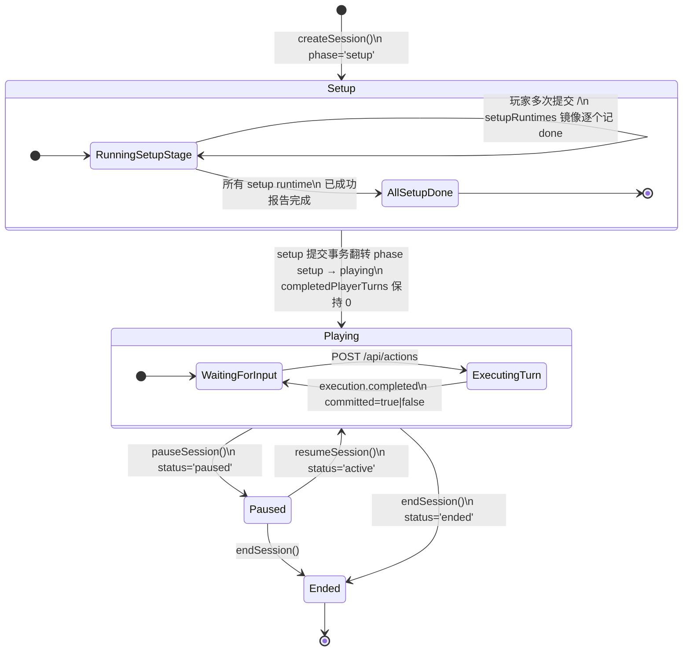
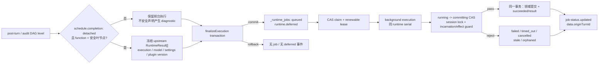
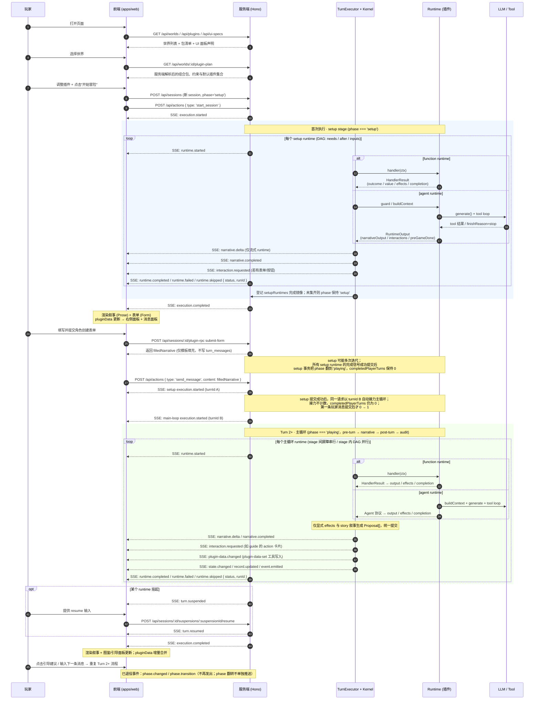

# Covel 框架架构与执行流程

> 从设置、游玩前、游玩中、游玩后到状态存储，完整描述框架运行机制。
> 包含玩家 ↔ LLM Agent 之间的翻译层、消息流动、插件设计和前端交互。
>
> **状态模型（业务真值）**：会话的权威状态由 `status`（`active` / `paused` / `ended`）加上会话时钟三字段组成——必填的 `phase`（`'setup' | 'playing'`，stage 分带选择器）、`completedPlayerTurns`（已完成的玩家回合数）、`setupRuntimes`（setup 阶段各 runtime 的解析状态镜像）。`phase === 'setup'` 时只运行 `setup` stage；所有 setup runtime 报告完成后，Kernel 把 `phase` 翻到 `'playing'` 进入主循环。客户端和存档直接消费这三个字段；开发版不保留旧时钟字段或回填路径。

## 一、系统全景

```
┌─────────────────────────────────────────────────────────────────────────────┐
│                              Covel 全景架构                                 │
│                                                                             │
│  ┌──────────────┐    SSE/HTTP     ┌──────────────────────────────────────┐  │
│  │   Frontend    │ ◄─────────────► │            Server (Hono)             │  │
│  │  (apps/web)   │                │                                      │  │
│  │              │                │  ┌────────────────────────────────┐   │  │
│  │ json-render  │                │  │       Turn Executor            │   │  │
│  │ catalog      │                │  │  ┌──────────────────────────┐  │   │  │
│  │ pluginData   │                │  │  │    Stage Scheduler       │  │   │  │
│  │ SSE client   │                │  │  │ setup→pre-turn→narrative │  │   │  │
│  └──────────────┘                │  │  │ →post-turn→audit + DAG   │  │   │  │
│                                  │  │  │                         │  │   │  │
│  ┌──────────────┐                │  │  └──────────────────────────┘  │   │  │
│  │   Plugins     │                │  │           │                    │   │  │
│  │  PLUGIN.md    │────加载────────►│  │     ┌─────▼──────┐            │   │  │
│  │  tools/*.js   │                │  │     │ LLM Gateway │            │   │  │
│  │  ui/*.json    │                │  │     └─────┬──────┘            │   │  │
│  └──────────────┘                │  │           │                    │   │  │
│                                  │  │     ┌─────▼──────┐            │   │  │
│  ┌──────────────┐                │  │     │ Tool Loop   │            │   │  │
│  │   Worlds      │                │  │     └─────┬──────┘            │   │  │
│  │  world.yaml   │────加载────────►│  │           │                    │   │  │
│  │  WORLD.md     │                │  │     ┌─────▼──────┐            │   │  │
│  └──────────────┘                │  │     │Session Kernel│            │   │  │
│                                  │  │     │ (Proposal →  │            │   │  │
│                                  │  │     │  Commit)     │            │   │  │
│                                  │  │     └─────┬──────┘            │   │  │
│                                  │  └───────────┼────────────────────┘   │  │
│                                  │              │                        │  │
│                                  │  ┌───────────▼────────────────────┐   │  │
│                                  │  │        DataStore               │   │  │
│                                  │  │  sessions │ messages │ plugin  │   │  │
│                                  │  │  results  │ characters│ data   │   │  │
│                                  │  └────────────────────────────────┘   │  │
│                                  └──────────────────────────────────────┘  │
└─────────────────────────────────────────────────────────────────────────────┘
```

## 二、生命周期状态机

### 2.1 会话生命周期


```mermaid
stateDiagram-v2
    [*] --> Setup: createSession()\n phase='setup'

    state Setup {
        direction LR
        [*] --> RunningSetupStage
        RunningSetupStage --> RunningSetupStage: 玩家多次提交 /\n setupRuntimes 镜像逐个记 done
        RunningSetupStage --> AllSetupDone: 所有 setup runtime\n 已成功报告完成
        AllSetupDone --> [*]
    }

    Setup --> Playing: setup 提交事务翻转 phase setup → playing\n completedPlayerTurns 保持 0

    state Playing {
        direction LR
        [*] --> WaitingForInput
        WaitingForInput --> ExecutingTurn: POST /api/actions
        ExecutingTurn --> WaitingForInput: execution.completed\n committed=true|false
    }

    Playing --> Paused: pauseSession()\n status='paused'
    Paused --> Playing: resumeSession()\n status='active'
    Playing --> Ended: endSession()\n status='ended'
    Paused --> Ended: endSession()
    Ended --> [*]
```

**业务真值** = `(status, phase, completedPlayerTurns, setupRuntimes)`：

- **Setup**：`status === 'active' && phase === 'setup'`。调度器只运行 `stage: setup` 的 runtime；每个 runtime 以显式完成信号（function 返回 `outcome: "success"` + `completion: "done"`，agent 输出 `preGameDone: true`，或 guard 返回 `{ skip: true }`）记入 `setupRuntimes` 状态镜像（`pending` / `done` / `blocked`），玩家可以多次提交表单/消息迭代（例如 `char-creator` 的 `framework.submit-form`）。耗尽重试预算（`maxTriggerCount`）不算完成——该 runtime 落到 `blocked`，会话停留在 setup 阶段等待玩家重试或豁免，不再"跳过坏掉的 setup 继续推进"。
- **phase 翻转**：所有 setup runtime 都报告完成后，Kernel 在 setup 提交事务内把 `phase` 从 `'setup'` 翻到 `'playing'`；该事务的 `completedPlayerTurns` 仍为 0。提交失败时 phase 翻转和 setup 镜像一并回滚。
- **Setup completion followup**：角色表单这类最后一个 setup 输入提交后，`/api/actions` 的同一个请求会先提交 setup，再以新的 `turnId` 和独立事务立即补跑主循环 runtime。接力执行的 origin 是 `continuation`，不计入 `completedPlayerTurns`：它保持 0，直到第一条主循环玩家消息提交后才推进到 1，因此开场叙事与第一回合共用 `logicalTurn = 1`（`startTurn` / `interval` 按此计算）。玩家可直接看到第一段正式叙事；同一 SSE 流、trace 和 snapshot 会覆盖 setup completion 与 main-loop followup 两次执行。
- **会话提交原子边界**：同一 session 的玩家输入、runtime 执行、proposal commit、对话 execution journal（玩家/runtime `TurnMessage`）、会话时钟写入（`phase` / `completedPlayerTurns` / `setupRuntimes`）、suspension artifact 和自动 snapshot 由同一 session lock 串行化；journal、proposal、时钟与 suspension 在同一 `finalizeExecution` transaction 中提交或回滚；唯一例外是 setup attempt 账本结算——它在事务之后更新 `setupRuntimes` 的尝试计数（回滚的尝试也消耗预算），但不翻转 `phase`。`turn.suspended` 只在 commit 后发出。自动 snapshot 在全部 proposal 提交后捕获，确保对话 cursor、角色、state 与 plugin data 属于同一个已提交回合。`execution.completed.committed` 是客户端收敛 optimistic 输出的终态信号。
- **RPC/event 后台执行只有提交在锁内**。`schedule.manual.execution: background` 的 runtime（deferred follower 与 background 模式的 manual 触发）作为持久 runtime job（`_runtime_jobs`，`origin.activation` 为 `manual` / `event`）排队，由 runtime job worker 认领后把 handler 跑在 session lock **外**，只有 `processTurnResults`（finalize 事务 + auto-snapshot）进锁，任务终态与领域写入同事务提交；follower 在触发它的执行的提交事务内排队。这类 runtime 通常是几分钟的 provider 调用（出图、手动 TTS），持锁执行会让玩家的下一条消息一直排队，PG 部署下更会直接撞上 30s 的锁获取上限。之所以安全：这条路径不写会话时钟（不传 `sessionClock`，且 `completedPlayerTurns` 只数 `origin: "player"`），域写入经 writeBuffer 汇入同一个提交事务而非执行期零散落盘，也不追加对话消息。同一 runtime 的并发执行由 `<sessionId>::<runtimeId>` 作业锁串行，保住 handler 里"是否已生成"这类 check-then-act 的原子性（否则会重复计费）；提交前在锁内重读会话状态，玩家中途暂停/结束会话时结果被丢弃而非写入。
- **staged detached 是独立的 durable 完成屏障**。`schedule.completion.mode: detached` 只对通过安全检查的 `post-turn` / `audit` function 叶节点生效，和 `execution` 正交。调度器在原 DAG 层开始时冻结上游结果（只有该 runtime 声明依赖的上游保留输出，其余只留身份与状态），把 descriptor 随原始回合的 proposal/journal/session clock 原子写入 `_runtime_jobs`；提交后立即发 `runtime.deferred` 并释放玩家回合。worker 以 CAS lease claim，执行期间不持主 session lock，同一 runtime 串行；进入 commit 前必须从 `running` CAS 到 `committing`，并在 session lock 内重验 session/plugin incarnation、版本和实际 effects。任何取消、超时、stale 或 lease 失效都会让迟到结果无法提交。
- **Playing**：`status === 'active' && phase === 'playing'`。每次 `POST /api/actions` 触发一轮完整 Turn pipeline，按 `pre-turn → narrative → post-turn → audit` 四个 stage 依次运行（stage 间严格屏障）。`completedPlayerTurns` 只统计已提交的玩家回合——manual plugin-rpc、后台 follower、嵌套 `recursiveCall` 等非玩家执行各自落 `turn_results` 行，`origin` 为 `player` / `continuation` / `manual` / `background` / `recursive` / `resume` 之一，且不计数；多个执行共享一个 logical turn 时只计一次。
- **Paused / Ended**：`status === 'paused' | 'ended'`。调度器直接返回空，`/api/actions` 被服务端拒绝。Paused 可 `resumeSession()` 恢复，Ended 是终态。

`phase` 翻转不推送独立 SSE 事件，也没有对应的 proposal 类型——客户端从会话响应或快照读出当前的 `phase`、`completedPlayerTurns` 与 `setupRuntimes`。

### 2.2 单轮 Turn Pipeline


```mermaid
flowchart TB
    In(["POST /api/actions<br/>玩家输入 / 开始游戏"]) --> Settle["等待 before-next-execution 作业<br/>锁外等待，锁内重查"]
    Settle --> Capture["冻结 registry / extension generation<br/>加载 canonical 历史并投影"]
    Capture --> Exec[executeTurn]
    Exec --> StartEvt["SSE: execution.started"]
    StartEvt --> Hook1[TurnStart hook]
    Hook1 --> Filter["selectTriggeredRuntimes<br/>manual: 按名字匹配（绕过 shouldTrigger）<br/>setup runtime: 按 setupRuntimes 镜像取 pending<br/>其余: shouldTrigger（auto / scheduled / event<br/>+ startTurn / maxTriggerCount / cooldownTurns）"]
    Filter --> PreSched["PreSchedule hook<br/>(可收窄本回合 runtime 集)"]
    PreSched --> Band{"phase?"}
    Band -->|setup| SetupBand["setup stage<br/>DAG（needs / after / inputs）"]
    Band -->|playing| MainBand["主循环<br/>pre-turn → narrative → post-turn → audit<br/>stage 间严格屏障，stage 内 DAG"]

    SetupBand --> Group
    MainBand --> Group

    subgraph Group["每个 DAG 层级组（同组并行，跨组串行；name 做并列 tiebreak）"]
      direction TB
      Gate["框架依赖 / 输入 / 权限检查"] --> G3["PreRuntime hook"]
      G3 --> G1["guard? (agent runtime)"]
      G1 --> G2["SSE: runtime.started"]
      G2 --> RT{"runtimeType"}
      RT -->|function| F1["handler(ctx) → HandlerResult<br/>校验 outcome，分别保存 output / effects / completion"]
      F1 --> G6
      RT -->|agent| G4["buildContext<br/>runtime 正文 + prompt.segment 扩展段<br/>+ typed inputs + 投影历史<br/>→ 首个 agent 按真实 system prompt 压缩并重建<br/>→ PostContextAssembly hook 后再次预算"]
      G4 --> G5["LLM + ToolExecutor loop<br/>PreLLMCall → LLM → PostLLMResponse 审查<br/>接受后才执行工具；拒绝时限次纠正<br/>PreToolUse → execute → PostToolUse"]
      G5 -->|拆分 agent 协议| G6["RuntimeResult: output / effects / completion"]
      G6 --> G7["PostRuntime hook"]
      G7 --> Final["校验故事输出 / 超时 / 父级取消"]
      Final --> G8["唯一终态 + turnId / runId<br/>runtime.completed / runtime.failed / runtime.skipped"]
    end

    Group --> Commit["effects + story 输出 → Proposal[] → CommitPipeline.commitAll<br/>PreStateCommit → handler → PostStateCommit"]
    Commit --> SSE["发 SessionEvent<br/>narrative.delta / narrative.completed<br/>interaction.requested / state.changed<br/>plugin-data.changed / event.emitted / record.updated"]
    SSE --> PreGameTick{"phase === 'setup' 且<br/>所有 setup runtime<br/>都已报告完成?"}
    PreGameTick -->|是| Advance["setup 提交: phase setup → playing<br/>completedPlayerTurns 保持 0"]
    PreGameTick -->|否| Keep["保持 phase 不变"]
    Advance --> End["SSE: execution.completed"]
    Keep --> End
```

**Stage 分带**（`packages/runtime/src/turn-executor/scheduling.ts` + `packages/runtime/src/schedule/` 硬性约束）：

| phase       | 可调度 stage                               | 语义                                                                                                                                                                                                                                                                                                  |
| ----------- | ------------------------------------------ | ----------------------------------------------------------------------------------------------------------------------------------------------------------------------------------------------------------------------------------------------------------------------------------------------------- |
| `'setup'`   | `setup`                                    | 游戏初始化（如 `pregame`、`world-init/schema-gen`、`char-creator/player-init`）；顺序完全由声明边决定（`schema-gen` 用 `schedule.after: [pregame]` 保持 `pregame → schema-gen` 串行）                                                                                                                 |
| `'playing'` | `pre-turn → narrative → post-turn → audit` | 每轮依次跑四个 stage，stage 间严格屏障（上一 stage 全部 settle——成功/失败/skip——才进下一个）。同一 stage 内由 `needs` / `after` / `inputs` 绑定推导的 DAG 排序，独立 runtime 并行，`name` 做稳定 tiebreak。依赖成环的 runtime（及其下游）本回合被 `skipped: dependency-cycle`，不会回退成任意顺序执行 |

**Proposal 类型**（全部过 commit chain，源自 `ProposalPayloadMap`）：`narrative.append`、`interaction.request`、`state.patch`、`event.emit`、`ui.render`、`asset.generate`、`plugin.data` / `plugin.data.batch` / `plugin.data.delete`、`character.schema.set`、`character.upsert`、`lorebook.upsert`。

**插件依赖与提供者选择**：会话以显式 `requested` / `excluded`、授权状态、core 声明和版本化 `provides` / `requires` 解析 active set。显式排除也适用于 core；缺失依赖先选择唯一普通 provider，再考虑唯一 default provider。显式替代默认 provider 的处理在冲突检测之前。`conflicts` 与 single 扩展点竞争会拒绝组合；普通输出契约可以有多个 provider，由 `cardinality: one | all` 说明消费者需求。启停后的显式选择保存在 `session.metadata.pluginSelection`，推荐列表本身不自动启用插件。

进入触发与 DAG 调度前，`resolveRuntimeProviders` 按编译后的 `outputContract` / `defaultProvider` 去掉已被替代的默认 runtime。community server-code 和 runtime 授权仍单独校验，批准状态不由依赖声明授予。框架不按具体插件 ID 分支。

**失败任务恢复**：单项和批量重试创建新执行 ID，保留原始故事回合作为 `sourceTurnId`。
只有来源和已提交重试中成功的非目标结果，以及 guard 明确 `skip: true` 的输出，才能作为上游
种子；依赖失败产生的 skipped 不满足依赖。种子不重复提交，重试不重写已完成正文、不增加玩家
回合数。插件消息在提交时关联原故事锚点，舞台快捷回复和刷新恢复使用同一归属规则。

### 2.3 Staged Runtime 后台流水线


```mermaid
flowchart LR
    DAG["post-turn / audit DAG level"] --> Plan{"schedule.completion: detached<br/>且 function + 安全叶节点?"}
    Plan -->|否| Foreground["保留前台执行<br/>不安全声明产生 diagnostic"]
    Plan -->|是| Freeze["冻结 upstream RuntimeResult[]<br/>execution / model / settings / plugin version"]
    Foreground --> Tx["finalizeExecution transaction"]
    Freeze --> Tx
    Tx -->|commit| Queued["_runtime_jobs: queued<br/>runtime.deferred"]
    Tx -->|rollback| None["无 job / 无 deferred 事件"]
    Queued --> Claim["CAS claim + renewable lease"]
    Claim --> Run["background execution<br/>同 runtime serial"]
    Run --> Guard["running -> committing CAS<br/>session lock + incarnation/effect guard"]
    Guard -->|pass| Success["同一事务：领域提交 + succeeded/result"]
    Guard -->|reject| Terminal["failed / timed_out / cancelled<br/>stale / orphaned"]
    Success --> Status["job-status.updated<br/>data.originTurnId"]
    Terminal --> Status
```

`maxQueueMs` 从 `enqueuedAt` 限制 claim 等待，`maxExecutionMs` 从 running 限制后台控制面期限；它们不代替 runtime 的 `timeoutMs`。worker 默认最多并行 4 个不同 runtime，以 session round-robin 取队列，同一 `(session, plugin, runtime)` 只允许一个 active job。入队、retry、resume、等待屏障和任务结束都按会话唤醒 worker，平时只认领被唤醒会话的队列；启动、不带会话的唤醒和 30 秒维护轮扫描全部会话，其他进程排入的作业也由此接走。重启后，未过排队期限且从未 claim 的 `queued` 作业可以继续执行；排队超时会变为 `timed_out`，lease 已过期的在途作业会变为 `orphaned`，后两者不会自动 replay。玩家明确 retry 时创建新 jobId。

worker 进入提交屏障前排空自身续租；`extraInTx` 在领域提交事务内完成 job 的成功 CAS。业务失败、完成 CAS 失败和事务末尾失败均回滚领域写入及 job 成功。成功事件在事务外发布；事件丢失可从已持久化终态补齐，不重跑任务。worker 首次唤醒及后续 30 秒维护间隔扫描过期租约，扫描失败 1 秒后重试；维护不受执行槽满影响。`committing` 任务须先非阻塞取得同一提交锁，锁忙时留待下一轮。关闭会停止后续调度并等待在途扫描及锁回调。

detached runtime 必须声明 effects；框架允许隔离的 assets/media、本插件非保留 plugin-data、UI 和 HTTP effects，提交前再次验证实际 proposal。存在前台消费者、`recordAs` 导出、事件输出或直接修改角色、状态与交互等不安全行为时，调度器保留前台执行并发出 diagnostic。

### 2.4 下一次执行前的 settle 屏障

需要让下一轮读到结果的 post-turn/audit function 可声明 `schedule.completion.settle: before-next-execution` 和 `maxSettleWaitMs`。这类任务可读取自身 plugin-data，由 worker 按来源任务顺序串行处理；输入中的 `turn-digest@1` 是内核冻结的来源回合摘要，不需要绑定某个叙事插件。`memory/extract` 使用这一机制更新自己的记忆块。

玩家动作、RPC、resume 和会话变更入口先查询 durable pending jobs，在主 session lock 外唤醒 worker 并等待。取得锁后再次查询，避免检查与入锁间新任务被漏过；worker 提交始终使用原始 session lock，不进入自己的等待屏障。到达最早等待期限仍未结束时记录 `execution.settle-timeout`，随后允许新执行继续，超时不代表后台任务已成功或被取消。

通过屏障后才捕获 registry、工具、服务、hook 与扩展注册的执行版本。热重载发布新版本不改变已经开始的执行；授权撤销仍以 live 状态检查。嵌套调用沿用已准入的执行，不在持锁时重复等待。

## 三、消息翻译层（玩家 ↔ LLM Agent）

这是框架最核心的部分：玩家发的是自然语言，LLM 收到的是结构化 prompt，LLM 返回的是结构化 output，玩家看到的是渲染后的 UI。

### 3.1 输入方向：玩家 → LLM

```
玩家输入                      框架翻译层                         LLM 收到的
─────────                    ────────                         ──────────

"我去探索沼泽"     ──►    Context Builder     ──►    System Prompt:
                          │                          │  你是主叙事生成器...
                          │ 1. 加载 PLUGIN.md         │  <world-lore>九州・云梦泽...</world-lore>
                          │    (agent 指令)           │  <world-dimensions>...</world-dimensions>
                          │                          │  <player-character>
                          │ 2. 注入世界观              │    名字: 陆青云, 灵根: 水灵根...
                          │    {{ world.lore }}       │  </player-character>
                          │                          │
                          │ 3. 注入角色数据            │  History:
                          │    {{ player.character }} │  [user] 我去探索沼泽
                          │                          │
                          │ 4. 注入上游输出            │  Tools available:
                          │    {{ inputs.xxx }}       │  (根据 manifest.tools 注入)
                          │                          │
                          │ 5. 注入消息历史            │
                          │    (append-only store)    │
                          │                          │
                          │ 6. 语言约束               │
                          │    "用中文回复"            │
```

### 3.2 输出方向：LLM → 玩家

```
LLM 返回                     框架翻译层                        玩家看到的
────────                    ────────                         ──────────

narrativeOutput:    ──►    Session Kernel      ──►    ┌─────────────────┐
"沼泽的雾气..."              │                         │  叙事文本         │
                            │ normalizeOutput()        │  (Prose 组件)    │
interactions:       ──►     │ → Proposal[]      ──►    ├─────────────────┤
create-form / form          │                         │  角色创建表单    │
                            │ commitAll()              │  (Form 组件)     │
state.patch:        ──►     │ → SessionEvent[]  ──►    ├─────────────────┤
plugin_data 写入      ──►    │ SSE emit()               │  插件消息面 /    │
                            │                         │  右侧面板         │
                            │                  ──►    ├─────────────────┤
                            │                         │  状态更新        │
                                                      └─────────────────┘

                            每个 SessionEvent 通过 SSE 推送到前端
                            MessageList 渲染 turn messages
                            MessagePluginSurface / RightPanel 渲染 plugin surfaces
```

### 3.3 翻译细节：Tool 调用链

```
LLM 决定调用工具                框架处理                        结果
──────────────               ────────                       ──────

LLM: "调用 sync-           ToolExecutor:
      codex-entries"       1. findTool(name, context)
      { entries: [...] }      ├─ builtin? → 直接访问
                              └─ local? → 检查 pluginToolAccess
                                          (声明了才能用)
                           2. approval.check()
                              ├─ builtin → auto-allow
                              └─ local → allow (或需审批)
                           3. tool.execute(params, context)
                              ├─ 工具逻辑执行
                              ├─ 生成领域 proposal / execution-local 写入
                              ├─ commit 成功后发布数据事件 ──► SSE → surface 更新
                              └─ 返回结构化结果或 `_text`
                           4. 结果序列化为 tool message
                              → `_text` 优先作为 LLM 可读文本
                              → 结构化结果保留给 trace / commit / 调试
                           5. LLM 看到结果，决定是否继续调用

                           Tool Loop 按完成契约、预算和取消条件收敛
```

`finishReason: stop` 本身不能证明结构化任务成功。`requireToolUse` 要求成功的工具执行；
`completeAfterTools` 可在终结工具成功且本批无未解决工具错误时结束；允许无变化的任务通过
`requireExplicitCompletion` 要求真实写入或显式 `runtime-done`。纯正文和伪工具 JSON 不算写入，
错误结果也不能变成结构化成功。function runtime 可通过声明的 `ctx.tools.call()` 走相同工具、
权限、参数校验与事务边界，社区 handler 使用 `ctx.pluginData`，不获得完整可写 store。

输出审查发生在工具分发之前。插件可通过 `PreLLMCall` 缓冲输出，在 `PostLLMResponse` 拒绝草稿
并给出纠正要求，最多纠正两次，仍受原预算限制。两个内置叙事插件用它检查 `narrativePerson`：
默认第二人称，允许第一或第三人称；对白保留自己的视角。它们在检查后整段展示正文，框架仍支持
其他插件流式输出。这是有限文本检查，不保证所有剧情推断正确。

## 四、插件设计

### 4.1 插件结构

```text
plugins/my-plugin/
  PLUGIN.md                  包身份、contracts、contributes；可内联一个 runtime
  PLUGIN.en.md               根自然语言字段与固定提示段的 locale 变体
  runtimes/extract/
    RUNTIME.md               独立 runtime 配置与正文
    RUNTIME.en.md            runtime 正文的 locale 变体
  server/index.js            声明过的 tools/actions/services/extensions 等注册
  server/extract.js          function handler
  schemas/                   输入、输出和 namespace JSON Schema
  ui/                        json-render specs
  package.json
```

根清单以 `id`、`kind` 标识包，`provides` / `requires` / `optional` / `conflicts` 描述契约关系，`contracts` 声明 schema，`contributes` 声明工具、RPC actions、服务、扩展、设置、数据和 UI。`contributes.commands` 是 slash command 元数据，其 action 必须同时声明在 `contributes.actions`。entry 的实际注册必须与根清单匹配。

runtime 作者格式固定分为 `schedule`、`io`、`agent` 或 `function`，另有 `guard`、`effects`、`permissions`。正文属于该 runtime；根内联 runtime 和 `runtimes/*/RUNTIME.md` 两种组织方式互斥。`agent.tools` 与 `function.tools` 都是工具白名单。`io.output.contract` 必须由所属包提供，同一个包内不能由两个 runtime 重复声明同一输出契约。

包级字段只属于根，不从子 runtime 合并。旧平铺 frontmatter、子目录 `PLUGIN.md` 和专用记忆/提示字段均不接受。固定跨 runtime 指令通过根 `contributes.prompt`，动态内容通过 `prompt.segment@1`；旧开发数据需要重新创建。完整字段见 [插件参考](../reference/plugins.md)。

### 4.2 插件间通信

插件通过版本化契约和宿主能力协作，不能读取其他插件的私有 namespace。

| 需求             | 接口                                                  | 边界                                                                      |
| ---------------- | ----------------------------------------------------- | ------------------------------------------------------------------------- |
| 本轮上游输出     | `io.inputs`，`from: { contract: narrative-engine@1 }` | agent 获得 typed input 数据块，function 使用 `ctx.inputs`；保留来源信息。 |
| 强依赖与顺序     | `schedule.needs` / `schedule.after`                   | needs 排序并门控；after 只排序。turn 输入绑定也形成 DAG 边。              |
| 已提交导出       | `io.inputs` 的 `scope: committed`                     | 读取显式导出，不扫描其他插件存储。                                        |
| 查询业务能力     | `ctx.services.discover/call`                          | 使用 service contract 与 provider 身份，不绑定私有表。                    |
| 提示词、历史、UI | 声明并注册 extension point                            | collect、pipeline 或 single 决定组合方式和竞争规则。                      |
| 世界角色         | 只读 `ctx.world` 与领域 proposal                      | schema 和角色由内核验证、提交；插件没有角色镜像。                         |

```yaml
io:
  inputs:
    narrative:
      from: { contract: narrative-engine@1, cardinality: one }
      scope: turn
      select: /narrativeOutput
      required: true
```

stage 屏障保证 narrative 阶段结束后才运行 post-turn。stage 内独立 runtime 并行，输入和声明依赖确定先后；缺失 required input 会阻止消费者。可选输入明确使用 `required: false`，不把暂时缺失的 provider 变成必需依赖。

领域读视图包含 committed CharacterSchema/Characters、已校验上游 proposal 和本 runtime 待提交写入，使工具写后读保持一致。扩展 provider 的 world / plugin-data 则在 execution 创建时冻结，避免同一扩展在并行 runtime 中看到不同内容。

### 4.3 插件触发决策树

```
        selectTriggeredRuntimes（packages/runtime/src/turn-executor/scheduling.ts）
                              │
                    ┌─────────┴──────────┐
                    │ manual 触发？       │ ← plugin-rpc 显式点名 = 触发决策本身，
                    │ → 按 name 匹配入选  │    绕过 shouldTrigger 及其全部门控
                    └─────────┬──────────┘
                              │ 非 manual
                    ┌─────────┴──────────┐
                    │ setup runtime？     │ ← 按 setupRuntimes 镜像取 pending，
                    │ → done/blocked 不跑 │    同样绕过 shouldTrigger
                    └─────────┬──────────┘
                              │ 主循环 runtime
                shouldTrigger(manifest, context)
              （packages/runtime/src/trigger/trigger.ts，
                回合内事件 fan-out 复用同一函数）
                              │
                    ┌─────────┴──────────┐
                    │ startTurn?         │ ← 逻辑回合数 < startTurn？
                    │ maxTriggerCount?   │ ← 超过 session 最大次数？（trigger 台账）
                    │ cooldownTurns?     │ ← 冷却中？（trigger 台账）
                    └─────────┬──────────┘
                              │ 通过
                    ┌─────────┴──────────┐
                    │   trigger.type     │
                    ├────────────────────┤
                    │ auto    → true     │
                    │ scheduled → 逻辑回合 % interval == 0 │
                    │ event   → topic in pendingEvents  │
                    └────────────────────┘

  trigger 枚举就是 auto / manual / scheduled / event 四种，
  其余取值的 manifest 在加载时被 loader 拒绝，不进入触发决策。
```

## 五、前端交互设计

### 5.1 渲染管线

```
┌──────────────────────────────────────────────────────────────────┐
│                       前端渲染管线                                │
│                                                                  │
│  SSE 事件                  消息转换层                 渲染层       │
│  ──────────               ────────                 ──────        │
│                                                                  │
│  narrative.delta    ──►  appendDelta()      ──►  Prose           │
│  narrative.completed ──► addMessage(story)  ──►  组件            │
│                                                                  │
│  interaction.requested ──► addMessage(block) ──► messageToSpec() │
│                                                  │               │
│                                                  ▼               │
│                                            nestedToFlat()        │
│                                                  │               │
│                                                  ▼               │
│                                            ┌─────────────┐      │
│                                            │  Renderer    │      │
│                                            │ (json-render)│      │
│                                            │              │      │
│                                            │ catalog:     │      │
│                                            │  Prose       │      │
│                                            │  Form        │      │
│                                            │  Button      │      │
│                                            │  EntryCard   │      │
│                                            │  Alert       │      │
│                                            │  ...48个组件  │      │
│                                            └─────────────┘      │
│                                                                  │
│  plugin-data.changed ──► pluginData store  ──► MessagePluginSurface │
│                          更新 namespace         + RightPanel         │
│                                                  json-render        │
│                                                  Renderer           │
│                                                                  │
│  execution.started  ──►  executionSteps[]  ──►  进度条           │
│  runtime.completed  ──►                                          │
│  (无 phase.changed 事件) ── 状态标签由前端基于会话字段            │
│           (status + phase + completedPlayerTurns) 计算，无服务端推送 │
│                                                                  │
└──────────────────────────────────────────────────────────────────┘
```

上图中的 `narrative.delta` 适用于启用流式输出的 runtime。当前内置叙事插件先缓冲并审查正文；
客户端不能依赖每轮都收到 delta。只有 `execution.completed.committed` 或已提交记录才能确认
本轮落库，单个 runtime 的成功事件不是整个回合的提交凭据。

### 5.2 插件面板数据流

```
  插件工具执行                     服务端                      前端
  ────────────                   ──────                     ──────

  sync-codex-entries
  params: { entries: [...] }
        │
        ▼
  withPendingProposals()       ──► execution write buffer
        │                          (plugin.data / plugin.data.batch)
        ▼
  turn finalizer transaction  ──► 原子写入 plugin_data 表
        │                          (sessionId, pluginId,
        │                           namespace, key, value)
        │
        ▼
  eventBus.emit({              ──► SSE /events/stream
    topic: "plugin",                或 /actions 流
    _subType: "plugin-data.changed",
    payload: {
      pluginId: "codex",
      changes: [{
        namespace: "entries",
        key: "codex-fire-magic",
        value: { title: "火焰魔法", ... },
        operation: "set"
      }]
    }
  })
        │
        ▼                          ──► 前端 SSE handler
                                       │
                                       ▼
                                  applyChanges(pluginId, changes)
                                       │
                                       ▼
                                  pluginData["codex"]["entries"]["codex-fire-magic"]
                                  = { title: "火焰魔法", ... }
                                       │
                                       ▼
                                  useSyncExternalStore → notify listeners
                                       │
                                       ▼
                                  PluginPanel re-render
                                       │
                                       ▼
                                  JSONUIProvider state={pluginData}
                                  Renderer spec={codex-panel.json}
                                       │
                                       ▼
                                  SearchInput + FilterBar + CardList
                                  (自动显示新的图鉴条目)
```

### 5.3 表单交互完整流程

```
  ┌─────────────────────────────────────────────────────────────────┐
  │                    角色创建表单流程                               │
  │                                                                 │
  │  首次执行 (phase === 'setup'，只运行 setup stage):              │
  │  ┌────────────────────────────────────────────────────────────┐ │
  │  │ pregame               → 初始化会话级元数据             │ │
  │  │ world-init/schema-gen → 初始化角色 schema/维度声明        │ │
  │  │   (schema-gen 的 after: [pregame] 保证两者串行；           │ │
  │  │    narrative / post-turn stage 的 runtime 在 setup 阶段    │ │
  │  │    不会被调度——后续 setup 子轮继续派发剩余 runtime)         │ │
  │  └────────────────────────────────────────────────────────────┘ │
  │  ┌────────────────────────────────────────────────────────────┐ │
  │  │ 随后的 setup 子轮：char-creator/player-init →          │ │
  │  │   开场引导 + create-form 表单                          │ │
  │  │   (同为 stage: setup，turn-scoped needs 依赖            │ │
  │  │    pregame + world-init/schema-gen)                    │ │
  │  └────────────────────────────────────────────────────────────┘ │
  │                          │                                      │
  │                          ▼ SSE: interaction.requested           │
  │                                                                 │
  │  前端:                                                          │
  │  ┌────────────────────────────────────────────────────────────┐ │
  │  │ messageToSpec(block) → formToSpec(data)                    │ │
  │  │   → FormHeader + FormField[] + SubmitButton                │ │
  │  │   → json-render Renderer 渲染为交互表单                    │ │
  │  │                                                            │ │
  │  │ 玩家填写：陆青云 / 水灵根 / 渔民之子 / 灵识敏锐            │ │
  │  │                                                            │ │
  │  │ 点击提交 → submitFormInputs():                             │ │
  │  │   1. POST /api/sessions/:id/plugin-rpc                     │ │
  │  │      { pluginId: "framework", action: "submit-form",       │ │
  │  │        payload: { turnId, submissions: [...] } }            │ │
  │  │                                                            │ │
  │  │   服务端 submit-form:                                      │ │
  │  │   ├─ 定位已提交交互、来源插件、字段与跨字段校验             │ │
  │  │   ├─ 填充 {{characterName}} → "陆青云"                      │ │
  │  │   ├─ 生成叙事文本（自然语言，非 JSON）                      │ │
  │  │   └─ 原子保存 player_inputs，返回 filledNarrative          │ │
  │  │                                                            │ │
  │  │   下一次 /api/actions 由 char-creator 的 guard 运行：       │ │
  │  │   生成 character.upsert + plugin.data proposals            │ │
  │  │   （guard 用 `preGameDone: true` 登记完成；集齐后           │ │
  │  │    Kernel 在提交事务内把 phase 翻到 'playing'，             │ │
  │  │    无 phase.changed SSE 推送）                             │ │
  │  │                                                            │ │
  │  │   2. POST /api/actions (player_action)                     │ │
  │  │      → 同请求完成 setup 并补跑 main-loop followup           │ │
  │  │      → narrator + guide + codex                            │ │
  │  └────────────────────────────────────────────────────────────┘ │
  └─────────────────────────────────────────────────────────────────┘
```

`number` / `integer` 字段保持数值类型，`min` / `max` / `step` 和插件注册的纯表单校验器在服务端
再次检查。一个批次全部通过后才写入；失败保留可编辑表单。社区校验器在重启后需要重新授权来源
插件，批准后重发原提交。`tabletop-rules` 是使用这些公共接口的可选配点插件，不是内核特殊路径。

## 六、数据存储设计

### 6.1 存储层次

```
┌─────────────────────────────────────────────────────────────────┐
│                        DataStore 接口                            │
│                                                                 │
│  会话级                                                         │
│  ├── sessions          会话记录 (id, worldId, status, phase,    │
│  │                                 completedPlayerTurns,        │
│  │                                 setupRuntimes, plugins)      │
│  ├── turn_results      每次执行的产物（含全部 runtime 结果）     │
│  ├── tool_calls        工具调用审计日志                          │
│  ├── trace_events      追踪事件（调试用）                        │
│  │                                                              │
│  消息级                                                         │
│  ├── turn_messages     追加式消息历史 (system/user/assistant/tool)│
│  ├── player_inputs     玩家表单/选择提交记录                     │
│  │                                                              │
│  游戏数据                                                       │
│  ├── character_schemas  会话角色类型与属性定义、version          │
│  ├── characters        角色记录 (name, type, fields)             │
│  ├── lorebook_entries  世界 / 玩家 / 插件 owner 的世界书条目     │
│  ├── state_schemas     动态状态表 schema                        │
│  ├── state_entries     状态键值对                                │
│  ├── state_changes     状态变更历史                              │
│  ├── events            业务事件（append-only）                   │
│  │                                                              │
│  插件数据                                                       │
│  └── plugin_data       插件持久化 KV (sessionId+pluginId+ns+key) │
│      └── _runtime_jobs staged detached 作业真值（不进 snapshot）│
│  │                                                              │
│  世界级                                                         │
│  ├── worlds            世界包记录 (name, lore, dimensions)       │
│                                                                 │
│  后端实现:                                                      │
│  ├── MemoryStore      → 内存（开发/测试）                        │
│  ├── PgStore          → PostgreSQL（生产）                       │
│  └── SqliteStore      → SQLite（轻量部署）                       │
└─────────────────────────────────────────────────────────────────┘

浏览器私有模式不实现 DataStore：Dexie BrowserVault 保存完整版本化
checkpoint，服务端 MemoryStore 只作为单次执行的临时工作区。
```

### 6.2 数据所有权与导入

`plugin_data` 的内部主键为 `(sessionId, pluginId, namespace, key)`。插件公开 facade 已绑定 session 和自身身份，读取使用 `getPluginData(namespace, key)` / `listPluginData(namespace)`，写入只提供本插件记录。UI binding 与 action target 同样不能指定其他插件的身份。

角色模型是一等领域数据：`CharacterSchema` 保存开放的角色 types 与属性定义，角色记录使用该 schema 校验；`player` 保持单例。`character.schema.set` 由内核增加版本并校验已有角色，`character.upsert` 使用同一验证器。插件不在私有数据中保存世界 schema 或角色副本。

Lorebook 使用 `(sessionId, owner, id)` 标识条目；owner 为 world、player 或指定 plugin，因此相同 id 可以归属不同所有者。普通 HTTP 世界书编辑只写 player owner。snapshot/checkpoint 携带角色 schema 和带 owner 的世界书；旧开发存档需要重建。

世界包的数据来源声明版本化 contract，插件通过 `contributes.data.<namespace>.accepts` 接收匹配数据。框架校验 contract 与 namespace schema，并向匹配的启用消费者分发；它不识别蓝图、立绘或规则插件的具体 ID，也不写某个插件的私有 wrapper。世界级 characterSchema、lore 和 metadata 是领域导入，业务数据由接收插件解释。

例如，`character.blueprints@1` 承载原始蓝图记录，`memory.blocks@1` 承载 `{ id: "world", blocks: [...] }` 定义。动态维度由世界包声明开放 definition map，会话单一提供者管理当前值。捆绑的 `world-init` 在 pre-turn 发布 `world.dimensions@1` 冻结快照，通过 single `session.world-context@1` 提供公共读取；post-turn 绑定叙事来源结算，值与回执使用 batch CAS 同事务提交。它不合并 `entries`，不回退 metadata 初值，不双写 constant lorebook；pending 义务需在下次叙事前解决。参见 [世界数据参考](../reference/world-data.md#动态世界维度dimensions)与 [World Model](../reference/world-model.md#动态维度快照)。

### 6.3 消息历史模型

```
turn_messages (canonical 追加式执行日志):

  ┌────────┬──────────┬────────────┬──────────────────────────────┐
  │ turnId │ source   │ role       │ content                      │
  ├────────┼──────────┼────────────┼──────────────────────────────┤
  │ turn-1 │ system   │ system     │ [世界观摘要]                  │
  │ turn-1 │ player   │ user       │ (空 - 首轮无输入)             │
  │ turn-1 │ runtime  │ assistant  │ 午后的坊市弥漫着灵植的甜香... │
  │ turn-1 │ runtime  │ assistant  │ [角色创建叙事]                │
  │ turn-1 │ player-input│ user    │ [narrativeTemplate 填充结果]  │
  │ turn-2 │ player   │ user       │ 我决定跟师姐去探查灵脉       │
  │ turn-2 │ runtime  │ assistant  │ 清晨，你在老槐树下等到了...   │
  │ turn-2 │ tool     │ tool       │ {"entries":[...]}             │
  └────────┴──────────┴────────────┴──────────────────────────────┘

  runtime 行只把 narrativeOutput / content 文本写入 content，并携带表单
  （pendingInput）与 UI 附件。结构化输出保留在 turn_results；既无文本也
  无附件的运行（如 codex 只写结构化条目）不写 runtime 行。

  trigger 台账（kernel 所有的 plugin data，owner `__kernel:triggers`）
  按 runtime 记录已提交的运行次数和最后一次运行时的
  completedPlayerTurns，随 finalize 事务写入，回滚的执行不计数。
  maxTriggerCount / cooldownTurns 读它，不再数 runtime 行，也不受压缩影响。

  canonical 未压缩后缀
    → prompt.history-transform@1 投影
    → runtime 历史过滤与 summary substitution
    → prompt.segment@1 + 世界书 + 当前玩家输入
    → token budget → LLM messages[]

  玩家消息计数读取 canonical 日志，trigger 历史读取台账；prompt 投影不改写它们。
  history.compact@1 生成摘要，框架原子保存摘要与压缩标记。

  注意：玩家输入只以 `user` 角色追加一行（叙事模板填充结果），
  框架不再为 player-input 生成合成的 `assistant` 镜像消息。
```

### 6.4 Observability — TurnEmitter

Per-turn observability is fanned out through a small `TurnEmitter`
abstraction (`packages/runtime/src/trace/turn-emitter.ts`). One `emit(type, payload)`
call writes a row into `trace_events` AND broadcasts through the global
`EventBus`, where the `/actions` SSE route re-forwards it to the connected
client. New events include: `tool.calling` / `tool.completed` / `tool.failed`,
`llm.calling` / `llm.responded`, `message.completed`, `block.emitted`,
`state.patch.applied`, `hook.fired` / `hook.rewrote` / `hook.aborted`.

The runtime lifecycle events (`turn.started`, `turn.completed`,
`runtime.started`, `runtime.completed`, `runtime.failed`) continue to be
written by `TraceRecorder`; the two mechanisms coexist. Streaming narrative
deltas are not persisted — only the final `message.completed` per runtime is,
to keep the table compact.

See [../reference/protocol.md](../reference/protocol.md) section 七 for the
full payload schemas.

## 七、完整游戏流程时序图


```mermaid
sequenceDiagram
    autonumber
    participant Player as 玩家
    participant Web as 前端 (apps/web)
    participant Server as 服务端 (Hono)
    participant Kernel as TurnExecutor + Kernel
    participant Plugin as Runtime (插件)
    participant LLM as LLM / Tool

    Player->>Web: 打开页面
    Web->>Server: GET /api/worlds / /api/plugins / /api/ui-specs
    Server-->>Web: 世界列表 + 包清单 + UI 面板声明
    Player->>Web: 选择世界
    Web->>Server: GET /api/worlds/:id/plugin-plan
    Server-->>Web: 服务端解析后的组合包、约束与默认插件集合
    Player->>Web: 调整插件 + 点击"开始冒险"
    Web->>Server: POST /api/sessions (新 session, phase='setup')
    Web->>Server: POST /api/actions { type: 'start_session' }
    Server-->>Web: SSE: execution.started

    rect rgb(240, 248, 255)
    Note over Server,Plugin: 首次执行 · setup stage (phase === 'setup')
    loop 每个 setup runtime (DAG: needs / after / inputs)
        Server-->>Web: SSE: runtime.started
        alt function runtime
            Kernel->>Plugin: handler(ctx)
            Plugin-->>Kernel: HandlerResult<br/>(outcome / value / effects / completion)
        else agent runtime
            Kernel->>Plugin: guard / buildContext
            Plugin->>LLM: generate() + tool loop
            LLM-->>Plugin: tool 结果 / finishReason=stop
            Plugin-->>Kernel: RuntimeOutput<br/>(narrativeOutput / interactions / preGameDone)
        end
        Kernel-->>Web: SSE: narrative.delta (仅流式 runtime)
        Kernel-->>Web: SSE: narrative.completed
        Kernel-->>Web: SSE: interaction.requested (若有表单/按钮)
        Server-->>Web: SSE: runtime.completed / runtime.failed / runtime.skipped { status, runId }
    end
    Kernel->>Server: 登记 setupRuntimes 完成镜像；未集齐则 phase 保持 'setup'
    end
    Server-->>Web: SSE: execution.completed
    Note over Web: 渲染叙事 (Prose) + 表单 (Form)<br/>pluginData 更新 → 右侧面板 + 消息面板

    Player->>Web: 填写并提交角色创建表单
    Web->>Server: POST /api/sessions/:id/plugin-rpc submit-form
    Server-->>Web: 返回 filledNarrative (仅模板填充，不写 turn_messages)

    Note over Server,Plugin: setup 可能多次迭代；<br/>所有 setup runtime 的完成信号成功提交后<br/>setup 事务把 phase 翻到 'playing'，completedPlayerTurns 保持 0
    Web->>Server: POST /api/actions { type: 'send_message', content: filledNarrative }
    Server-->>Web: SSE: setup execution.started (turnId A)
    Note over Server,Plugin: setup 提交成功后，同一请求以 turnId B 自动接力主循环；<br/>接力不计数，completedPlayerTurns 仍为 0；<br/>第一条玩家消息提交后才 0 → 1
    Server-->>Web: SSE: main-loop execution.started (turnId B)

    rect rgb(245, 255, 240)
    Note over Server,Plugin: Turn 2+ · 主循环 (phase === 'playing'，pre-turn → narrative → post-turn → audit)
    loop 每个主循环 runtime (stage 间屏障串行 / stage 内 DAG 并行)
        Server-->>Web: SSE: runtime.started
        alt function runtime
            Kernel->>Plugin: handler(ctx)
            Plugin-->>Kernel: HandlerResult → output / effects / completion
        else agent runtime
            Plugin->>LLM: buildContext + generate + tool loop
            Plugin-->>Kernel: Agent 协议 → output / effects / completion
        end
        Note over Kernel: 仅显式 effects 与 story 叙事生成 Proposal[]，统一提交
        Kernel-->>Web: SSE: narrative.delta / narrative.completed
        Kernel-->>Web: SSE: interaction.requested (如 guide 的 action 卡片)
        Kernel-->>Web: SSE: plugin-data.changed (plugin-data-set 工具写入)
        Kernel-->>Web: SSE: state.changed / record.updated / event.emitted
        Server-->>Web: SSE: runtime.completed / runtime.failed / runtime.skipped { status, runId }
    end
    end

    opt 某个 runtime 挂起
        Server-->>Web: SSE: turn.suspended
        Player->>Web: 提供 resume 输入
        Web->>Server: POST /api/sessions/:id/suspensions/:suspensionId/resume
        Server-->>Web: SSE: turn.resumed
    end

    Server-->>Web: SSE: execution.completed
    Note over Web: 渲染叙事 + 图鉴/引导面板更新；pluginData 增量合并
    Player->>Web: 点击引导建议 / 输入下一条消息 → 重复 Turn 2+ 流程

    Note over Server,Web: 已退役事件：phase.changed / phase.transition（不再发出；phase 翻转不单独推送）
```

## 八、Package 职责与依赖

### 8.1 包在执行流程中的参与

```
执行阶段                     参与的包                          职责
──────────                  ──────                           ──────

启动 → 插件发现              @covel/plugin-loader             扫描 plugins/ 目录
                             ├── discoverPlugins()            发现所有插件
                             ├── loadPluginDefinition()       解析包声明与显式 runtime 列表
                             ├── loadPluginUi()               加载包级静态 UI
                             ├── loadRuntime()                加载 runtime prompt / handler / schemas
                             └── createPluginRegistry()       内存索引 + session 激活

启动 → LLM 初始化            @covel/ai-provider               多供应商 LLM 抽象
                             ├── presetRegistry               管理 LLM 预设 (llm.toml)
                             ├── slotRegistry                 slot 路由 (default/fast/balance/image)
                             ├── createGateway()              统一 generate() 接口
                             └── model-db                     2967 模型能力数据库

启动 → 依赖注入              @covel/tools                     工具系统
                             ├── tool()                       工具定义 wrapper
                             ├── builtinUITools               create-form/choice/notification
                             ├── createPluginDataTools()      plugin-data 读取 + 写入提案（Kernel 提交及发事件）
                             └── shortId/shortIdBatch()       LLM 友好的语义 ID 生成

启动 → 状态管理              @covel/store                     DataStore 接口 + 3 个服务端后端实现
                             ├── listStateSchemas()            动态表 schema
                             ├── listStateEntries()            状态表数据
                             └── listStateChanges()            变更追踪
                             @covel/events                    EventBus pub/sub + SSE 基础
                             @covel/approval                  工具审批管线

Turn 执行                    @covel/runtime                   核心执行引擎
                             ├── executeTurn()                完整 Turn 管线
                             ├── shouldTrigger()              触发路由 (auto/scheduled/event)
                             ├── selectTriggeredRuntimes()    触发选择 (manual 名字匹配 /
                             │                                  setup 镜像 / shouldTrigger)
                             ├── scheduleTriggeredRuntimes()  stage 分带 + scheduleByDag()
                             │                                  同 stage 内 DAG 分层
                             ├── executeOneRuntime()          单 runtime 执行
                             ├── createToolExecutor()         工具执行器 + 访问控制
                             └── normalizeOutput()            输出 → Proposal 标准化

上下文组装                    @covel/context                   Prompt 组装
                             ├── buildContext()               模板变量 + 注入块 + 消息历史
                             ├── interpolateTemplate()        {{ }} 占位符替换
                             ├── applyBudget()                硬裁剪兜底（窗口按叙事 slot 的
                             │                                  模型 capability 动态解析）
                             └── Compactor                    长对话压缩（同一窗口来源，
                                                                COVEL_COMPACTOR_CONTEXT_WINDOW
                                                                可选覆盖）

类型共享                      @covel/shared                   跨包类型定义
                             ├── types/plugin.ts              RuntimeManifest, UISpec, etc.
                             ├── types/protocol.ts            CovelEventType, SessionCommand
                             ├── types/execution.ts           TurnResult, RuntimeResult
                             ├── schemas/plugin.ts            Zod 校验 (runtimeManifestSchema)
                             └── schemas/world.ts             世界包校验

测试支持                      @covel/plugin-test-utils         插件作者测试工具
                             ├── MockLLM                      模拟 LLM 响应
                             ├── makeManualFunctionContext()  function handler 测试 context
                             ├── expectAssetGenerated()       断言 asset.generate proposal
                             └── factory functions             makeTurnInput, etc.
```

### 8.2 包依赖关系

```
  @covel/shared  (纯类型，零运行时依赖)
       │
       ├──► @covel/context         (模板插值，prompt 组装)
       │         │
       ├──► @covel/ai-provider     (LLM 适配器，模型路由)
       │         │
       ├──► @covel/plugin-loader   (插件发现，PLUGIN.md 解析)
       │         │
       ├──► @covel/store           (DataStore 接口 + 实现)
       │         │
       ├──► @covel/events          (事件总线 + SSE 订阅)
       │         │
       ├──► @covel/tools           (工具定义 + 内置工具)
       │         │
       ├──► @covel/approval        (审批管线)
       │         │
       └──► @covel/runtime         (组装以上所有包，执行 Turn)
                 │
                 ▼
            @covel/server          (Hono HTTP 层，SSE 流，路由)
                 │
                 ▼
            @covel/web             (前端：json-render + pluginData)
```

### 8.3 各包核心接口

| 包                    | 核心导出                                                                                                                                                                                | 调用方                    |
| --------------------- | --------------------------------------------------------------------------------------------------------------------------------------------------------------------------------------- | ------------------------- |
| **shared**            | `RuntimeManifest`, `UISpec`, `CovelEventType`, Zod schemas                                                                                                                              | 所有包                    |
| **plugin-loader**     | `discoverPlugins()`, `loadRuntime()`, `PluginRegistry`                                                                                                                                  | server bootstrap          |
| **ai-provider**       | `createGateway()`, `createPresetRegistry()`, `createSlotRegistry()`                                                                                                                     | server bootstrap, runtime |
| **context**           | `buildContext()`, `interpolateTemplate()`                                                                                                                                               | runtime (per-runtime)     |
| **runtime**           | `executeTurn()`, `createToolExecutor()`, `shouldTrigger()`                                                                                                                              | server actions route      |
| **store**             | `DataStore`, `createStore()`, `createStoreFromEnv()`, `createMemoryStore()`, `createSqliteStore()`, `createPgStore()`, `listStateSchemas()`, `listStateEntries()`, `listStateChanges()` | server, tools, runtime    |
| **events**            | `createEventBus()`, `EventBus.emit()`, `EventBus.onEmit()`                                                                                                                              | server, plugin-data-tools |
| **tools**             | `tool()`, `createPluginDataTools()`, `shortIdBatch()`                                                                                                                                   | bootstrap, plugin tools   |
| **approval**          | `createApprovalPipeline()`, `ApprovalPipeline.check()`                                                                                                                                  | tool executor             |
| **plugin-test-utils** | `MockLLM`, `makeManualFunctionContext()`, `expectAssetGenerated()`                                                                                                                      | plugin tests only         |

## 九、设计约束与原则

### 框架-插件隔离

```
  ✅ 框架代码中禁止出现具体插件 ID
  ✅ 插件通过版本化 contracts 和 extension points 被发现
  ✅ 工具通过注入获得依赖（不是 import）
  ✅ UI 通过 json-render spec 声明（不是 React 组件）
  ✅ 数据通过 pluginData namespace 隔离（不是共享 state key）
  ✅ 删除任何插件不会导致框架报错
```

### 数据所有权

```
  框架拥有:  session, character schema, characters, messages, state, lorebook ownership
  插件拥有:  plugin_data (按 pluginId 隔离)
  世界拥有:  worlds, lore, dimensions
  玩家拥有:  player inputs, form submissions
```

### 通信协议

```
  前端 → 服务端:  HTTP POST (JSON)
  服务端 → 前端:  SSE (ProtocolEvent)
  服务端 → LLM:   LLM Provider Protocol (OpenAI/Anthropic/etc.)
  插件 → 框架:    Tool return values + Proposal pattern
  框架 → 插件:    Context injection (template variables)
  插件 → 前端:    plugin-data.changed SSE events
  前端 → 插件:    UI Actions → plugin-rpc (invokeRuntime / invokePluginAction / invokeCommand / emitEvent)
```
