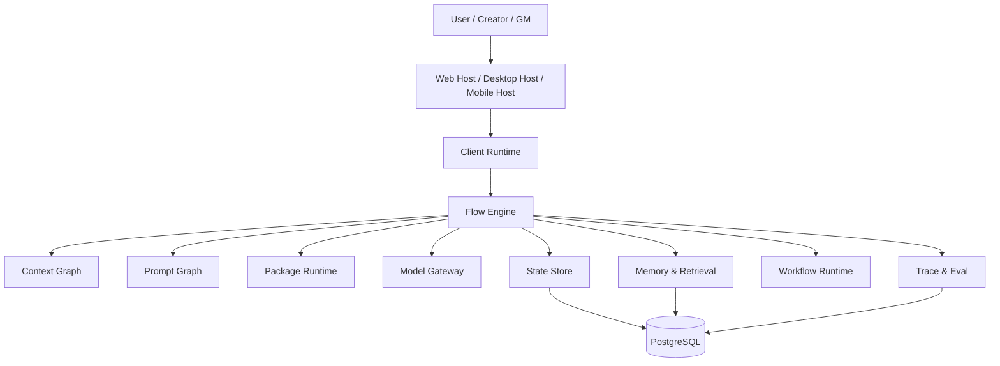

# 01. 目标平台：把 `covel` 设计成现代 AI 叙事运行时

## 1. 目标不是“补功能”，而是换平台形态

你现在缺的不是几个页面，也不是几个 block renderer。

真正缺的是：**把 `covel` 从一个薄宿主，长成一个现代 AI Narrative Runtime Platform。**

这意味着它必须同时满足：

- 长会话
- 世界状态持续演化
- agent / workflow / package 共用一套执行模型
- text / object / block / artifact 共用一套输出模型
- 检索、记忆、归档、追踪是内建能力，不是外挂
- Web 前端不是一个页面，而是一个 host runtime

## 2. 现代目标形态



## 3. 为什么这比旧项目更现代

旧项目强在“可玩”和“工作台完整”，但它仍然偏：

- page-centric
- plugin-centric
- session-centric

新平台应该进一步升级成：

- runtime-centric
- capability-centric
- context-centric
- artifact-native
- host-agnostic

也就是：

- 不再围绕“发送一条消息”组织系统
- 而是围绕“执行一次 flow，更新状态，生成一组输出”组织系统

## 4. 六个核心子系统

### 4.1 Context System

负责把世界、角色、persona、记忆、事件、当前会话、工具输出，组织成可预算、可投影、可追踪的上下文图。

### 4.2 Narrative / Agent Runtime

负责 turn execution、tool invocation、block emission、artifact emission、state patch 和 resume。

### 4.3 Workflow Runtime

负责长任务、审批、恢复、定时、后台流程、异步生成、索引、总结、导出。

### 4.4 Memory & Retrieval Runtime

负责 semantic memory、episodic memory、archive memory、GraphRAG retrieval、budget packing、provenance。

### 4.5 State & Persistence Runtime

负责世界状态、实体状态、事件状态、会话状态、artifact 元数据、event log、同步。

### 4.6 Host Runtime

负责 timeline、panels、inspectors、renderer registry、action registry、local state、offline cache、optimistic UI。

## 5. 推荐分层

```text
Experience Shells
  apps/web
  apps/desktop
  apps/mobile

Client Core
  client state / panels / renderer registry / command palette / local cache

Runtime Kernel
  flow-engine / workflow-runtime / package-runtime / model-gateway

Knowledge Layer
  context-graph / prompt-graph / memory-rag / archive / artifacts

Persistence Layer
  postgres / pgvector / entity_edges / event log / trace tables
```

## 6. 现代化原则

### 6.1 Postgres-first

除非明确证明不够，否则不要过早拆成：

- 图数据库
- 独立向量数据库
- 独立状态数据库
- 独立日志平台

第一阶段用一套 `PostgreSQL + pgvector + JSONB + entity_edges + partitioned events` 就够了。

### 6.2 State Patch First

Flow 的输出不应只有消息文本。

标准输出应该至少包括：

- `message`
- `block`
- `artifact`
- `state_patch`
- `event`
- `trace`

### 6.3 Memory is not one thing

不要把“memory”设计成一个表或一个 summary 文本。

至少要拆成：

- hot context
- session memory
- semantic memory
- episodic memory
- archive memory
- retrieval run

### 6.4 Frontend is a host runtime

前端不是一页聊天页面，而是：

- timeline surface
- block surface
- artifact surface
- inspectors
- contextual panels
- action system
- local state runtime

### 6.5 Workflow shares the same execution model

turn flow、后台任务、索引、导出、图像生成、审批，都应该是同一个 flow/workflow 体系的不同模板，而不是多套机制。

## 7. 对 `covel` 的具体建议

### 现在保留什么

- `modules/model-gateway`
- `flow-engine`
- `package-runtime`
- `context-graph`
- `prompt-graph`
- `memory-rag`
- `archive`

### 需要重构什么

- 让 `context-graph -> prompt-graph -> flow-engine` 真正接入主回合
- 把 block/response 升级成 package-owned suspend/resume
- 把 world/session/task binding 变成正式产品模型
- 把 Web 从“单页宿主”升级成“多面板 workbench”

## 8. 最小落地 demo

一个现代化回合应该长这样：

```text
用户输入
  -> Flow Engine 建 turn
  -> Context Graph 取子图
  -> Retrieval Runtime 补记忆与世界资料
  -> Prompt Graph 编译成 story/system model 输入
  -> Model Gateway 调用模型
  -> Package Runtime 调工具/技能
  -> 输出 message + block + state_patch + trace
  -> Host Runtime 同步更新 timeline、status panels、inspectors
```

## 9. 对应仓库参考

- `langgraph`：stateful graph execution、checkpoint、memory/store
- `langmem`：memory layering
- `mem0`：session/user/agent/app scope memory
- `mastra`：workflow、streaming UI、typed tools
- `temporal`：durable workflow / resume 思路
- `electric`：local-first sync / optimistic UI
