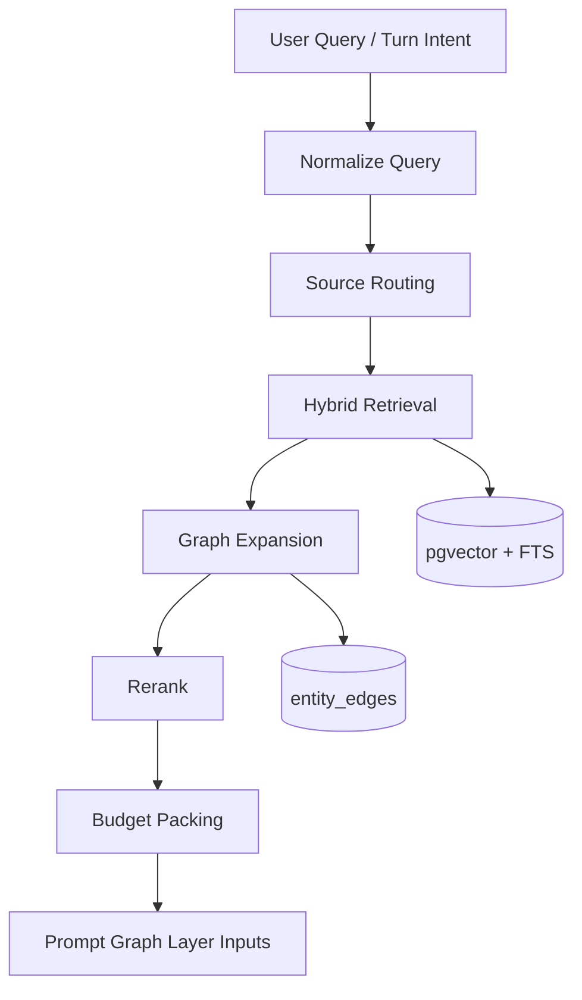

# 02. GraphRAG、Agent Memory 与长期上下文

## 1. 为什么 `covel` 不能只做普通 RAG

普通向量检索适合“找相似段落”，不适合：

- 多角色关系推理
- 复杂事件链追踪
- 世界设定中的跨文档连接
- 长会话中的隐含状态与前因后果
- “这个角色为什么会这样做”这类叙事性问题

对 `covel` 来说，最合适的不是纯 GraphRAG，也不是纯 Vector RAG，而是：

**Hybrid RAG + Lightweight GraphRAG + Typed Memory Layers**

## 2. 推荐的现代化检索架构



## 3. 不要一开始就上重型 GraphRAG

`microsoft/graphrag` 给出的启发很重要，但不应该被原样照搬进 `covel` v1。

对叙事产品，更现实的演进是：

### 阶段 A：Hybrid RAG

- heading-aware chunking
- Postgres full text search
- pgvector semantic retrieval
- simple fusion / RRF
- provenance tagging

### 阶段 B：Entity-aware Retrieval

- 从 worldbook、persona、角色卡、session transcript 中抽实体
- 建 `entities` + `entity_edges`
- 命中 chunk 后做一跳邻居扩展

### 阶段 C：Lightweight GraphRAG

- 为世界/章节/剧情线生成 community summaries
- 支持 local query / global query / drift query 三种模式

### 阶段 D：Selective Full GraphRAG

- 只对大型世界包、知识包、百科包做完整社区图构建
- 不要求每个 session transcript 都跑重型图管线

## 4. 记忆必须分层

结合 `langgraph`、`langmem`、`mem0`，推荐 `covel` 采用 6 层记忆：

### 4.1 Turn Working Memory

只在当前 turn 存活：

- 当前用户输入
- 当前工具输出
- 当前块交互数据
- 当前临时决策

它是 execution memory，不应直接持久化成长期知识。

### 4.2 Session Memory

作用域是单个 session：

- 本次冒险中的短期约定
- 当前场景临时设定
- 进行中的多步选择
- 当前回合链上的临时状态

这层适合存在 `session_state` / `session_memory_items`。

### 4.3 Semantic Memory

长期可检索事实：

- 世界规则
- 角色事实
- 用户偏好
- 设定常识
- 经过验证的剧情事实

这层适合做 embedding + metadata + provenance。

### 4.4 Episodic Memory

保存“发生过什么”的可回忆片段：

- 关键剧情节点
- 战斗结果
- 关系变化
- 重要承诺
- 重大失败或成功

推荐是“结构化摘要 + 可回放指针”，而不是只保存全文 transcript。

### 4.5 Archive Memory

用于长会话压缩和恢复：

- turn cutoff
- archive summary
- working summary
- state snapshot
- retrieval hints

### 4.6 Retrieval Memory

不是新类型，而是上述多层记忆在查询时被筛选、融合、重排后的消费视图。

## 5. 现代生产级记忆模型

```text
scope
  app -> world -> session -> actor/user -> run

memory kinds
  semantic
  episodic
  summary
  archive
  derived_fact

storage
  documents
  chunks
  entity nodes
  entity edges
  memory items
  retrieval runs
```

## 6. 推荐表设计

### 6.1 `memory_documents`

保存可索引原文：

- `id`
- `scope_type`
- `scope_id`
- `source_type`
- `title`
- `body_markdown`
- `metadata jsonb`
- `provenance jsonb`
- `version`

### 6.2 `memory_chunks`

- `id`
- `document_id`
- `chunk_index`
- `text`
- `token_count`
- `embedding vector`
- `fts tsvector`
- `metadata jsonb`

### 6.3 `memory_items`

适合保存短而重要的事实/偏好/记忆条目：

- `id`
- `kind` (`semantic`, `episodic`, `preference`, `rule`, `summary`)
- `scope_type`
- `scope_id`
- `subject_entity_id`
- `content`
- `importance`
- `confidence`
- `valid_from`
- `valid_to`
- `embedding`
- `metadata`

### 6.4 `entities` / `entity_edges`

不要一开始引入图数据库。

用轻量表足够：

- `entities(id, type, name, canonical_name, aliases, metadata)`
- `entity_edges(id, from_entity_id, to_entity_id, edge_type, weight, provenance)`

### 6.5 `retrieval_runs`

这张表非常重要，因为它把检索从“黑盒”变成“可回放系统”：

- `query`
- `normalized_query`
- `rewritten_queries`
- `selected_sources`
- `candidate_chunks`
- `selected_chunks`
- `rerank_model`
- `critique`
- `latency_ms`

## 7. Query 模式建议

### 7.1 Local Search

适合：

- 某角色现在知道什么
- 某事件之前发生过什么
- 某地点有哪些已知事实

做法：

- 先查实体/关键词命中
- 再查向量近邻
- 再做一跳邻居扩展

### 7.2 Global Search

适合：

- 当前世界大势如何
- 近 30 回合总体发生了什么
- 某条剧情线的整体变化

做法：

- 不是 top-k chunk 拼接
- 而是基于 archive summary / community summary / storyline summary

### 7.3 Drift Search

适合“从一个实体出发，带一点全局背景”的查询。

比如：

- 这个 NPC 与最近的政变有什么关系
- 这个地点和主线任务的关系是什么

## 8. 如何接入 `covel`

### 8.1 放在 `modules/memory-rag`

拆成这些子能力：

- `indexer`
- `query-normalizer`
- `source-router`
- `hybrid-retriever`
- `graph-expander`
- `reranker`
- `budget-packer`
- `retrieval-recorder`

### 8.2 由 `flow-engine` 调用

标准 turn flow：

1. receive intent
2. resolve active entities
3. run retrieval plan
4. feed prompt graph
5. call story/system model
6. persist retrieval run and trace

### 8.3 包如何贡献记忆

package 不应直接操作数据库表。

而应通过 capability：

- `memory.document.upsert`
- `memory.item.write`
- `memory.entity.link`
- `memory.search`

## 9. 简单 demo：回合中的检索装配

```ts
const retrievalPlan = await buildRetrievalPlan({
  sessionId,
  worldId,
  intent,
  activeEntities,
  mode: "turn-local"
});

const retrievalResult = await runRetrieval(retrievalPlan);

promptGraph.addLayer({
  key: "retrieved-memory",
  priority: 70,
  budgetTokens: 1200,
  content: retrievalResult.packedContext,
  provenance: retrievalResult.provenance
});
```

## 10. 推荐接入顺序

1. 先把当前 spec 落成 Hybrid RAG
2. 再引入 `entities` / `entity_edges`
3. 再加 summary graph / storyline graph
4. 最后再挑高价值知识包做完整 GraphRAG

## 11. 文档与仓库参考

- 当前仓库：`docs/architecture/specs/03-memory-rag-archive-observability-spec.md`
- 当前仓库：`docs/plans/next/04-context-prompt-and-flow-engine.md`
- 仓库参考：`microsoft/graphrag`
- 仓库参考：`langchain-ai/langgraph`
- 仓库参考：`langchain-ai/langmem`
- 仓库参考：`mem0ai/mem0`
