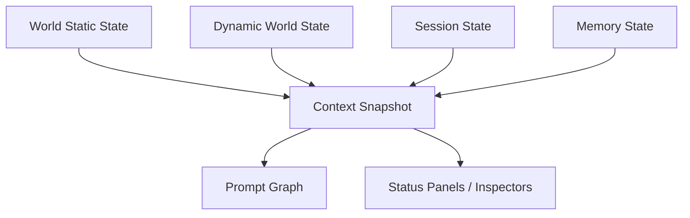

# 03. 世界状态、实体模型与状态演化

## 1. `covel` 的状态管理不能再停留在 session timeline

真正的叙事系统，至少有四类状态：

- 内容状态：世界、角色、设定、卡片、世界书
- 运行状态：scene、active events、quest、flags、resources
- 会话状态：turn、messages、blocks、pending actions
- 认知状态：memory、summary、known facts、relationship view

如果这些都混在 session message 里，系统永远做不深。

## 2. 推荐状态分层



## 3. 世界状态应分成静态层和动态层

### 3.1 静态层

变化少、可版本化：

- 世界文档
- 地图与地点
- 角色基础设定
- 派系设定
- 规则设定
- 世界书条目

### 3.2 动态层

随着会话推进变化：

- 当前 scene
- 角色关系
- 阵营态度
- 资源数值
- 任务阶段
- 活跃事件
- 已触发 flag

## 4. 推荐实体模型

### 4.1 核心实体

- `World`
- `WorldEntry`
- `Character`
- `Persona`
- `Location`
- `Faction`
- `Quest`
- `Event`
- `Session`
- `Scene`
- `Artifact`
- `ArchiveVersion`

### 4.2 状态对象

- `WorldState`
- `CharacterState`
- `RelationshipState`
- `QuestState`
- `EventState`
- `SessionState`
- `WorkflowRunState`

## 5. 不要只做 JSON 大对象

现代化做法不是“把全部状态塞进一个 giant jsonb”。

更合理的是：

- 核心实体表结构化
- 快速演化的部分用 `jsonb`
- 变更历史写 event log
- 当前投影写 read model

也就是：

- `write model` 用事件和 patch
- `read model` 用当前快照和索引表

## 6. 推荐状态更新模型

### 6.1 Flow 输出 `state_patch`

模型或 package 不直接写数据库。

它们产出：

```json
{
  "target": "quest-state",
  "scope": { "sessionId": "sess_1" },
  "op": "merge",
  "payload": {
    "questId": "quest_find_heir",
    "stage": "discovered-clue",
    "progress": 0.45
  }
}
```

### 6.2 Runtime 统一应用 patch

优点：

- 审计清晰
- trace 清晰
- rollback 更容易
- package 权限可控

### 6.3 事件表记录演化

每次 patch 同时生成 domain event：

- `quest.updated`
- `scene.changed`
- `relationship.changed`
- `resource.changed`

## 7. 推荐数据库读写模型

```text
model/package output
  -> proposed state_patch
  -> policy validation
  -> state reducer
  -> state tables + event log
  -> derived read models
  -> UI refresh + trace
```

## 8. 现代化世界状态管理建议

### 8.1 Scene 作为一等对象

不要把“当前场景”只当一个字符串。

Scene 应至少有：

- active location
- active participants
- scene goals
- unresolved tensions
- visible artifacts
- active blocks

### 8.2 Relationship 要结构化

不要只在描述文本里隐含人物关系。

至少要有：

- `from_character_id`
- `to_character_id`
- `affinity`
- `trust`
- `fear`
- `tags[]`
- `last_changed_at`

### 8.3 Quest / Event 要状态机化

不是一段文案，而是：

- current stage
- prerequisites
- completion conditions
- failure conditions
- visible summary
- internal notes

### 8.4 World Flags 要可检索

推荐做 `world_flags` 或 `state_flags` 表，而不是散在 JSON 里。

## 9. 如何对接 Prompt Graph

Prompt Graph 不应直接拿整个世界状态对象。

而应拿“裁剪后的视图”：

- active scene slice
- active quest slice
- recent world changes slice
- current actor relationship slice
- retrieval-backed lore slice

## 10. 如何对接前端

前端需要的不只是 timeline。

至少应有这些 read models：

- `session_timeline_view`
- `world_state_summary_view`
- `character_summary_view`
- `quest_board_view`
- `event_feed_view`
- `resource_panel_view`
- `relationship_inspector_view`

## 11. 简单 demo：状态 reducer

```ts
const result = applyStatePatch({
  currentState,
  patch: {
    target: "relationship-state",
    scope: { sessionId, worldId },
    op: "merge",
    payload: {
      fromCharacterId: "hero",
      toCharacterId: "captain",
      trustDelta: 0.2,
      tagsToAdd: ["saved-in-battle"]
    }
  }
});

await persistStateAndEvent(result);
```

## 12. 推荐接入点

- `modules/domain`：定义 entity / state contracts
- `modules/storage`：定义 repositories 和 read models
- `apps/runtime`：实现 state reducers 和 patch application
- `apps/web`：用 panel/inspector 消费 read models

## 13. 仓库参考

- `electric-sql/electric`：local-first state / sync
- `liveblocks/liveblocks`：协作状态与 shared presence
- `mastra-ai/mastra`：typed state / workflow state
