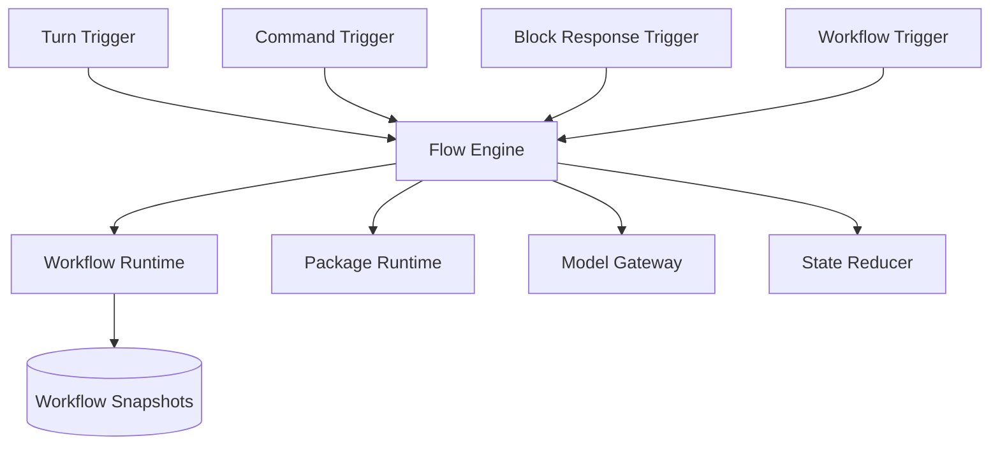

# 05. Agent Runtime、Durable Workflow 与 Suspend/Resume

## 1. 真正的目标不是“加 agent”，而是统一执行模型

对 `covel`，最重要的问题不是“要不要多 agent”，而是：

**turn、tool、block interaction、approval、background job、artifact generation，能否共用一套执行模型。**

推荐答案是：能，而且必须能。

## 2. 推荐执行层结构



## 3. 为什么要引入 durable workflow 思路

从 `mastra` 和 `temporal` 可借鉴的核心不是 API，而是这些模式：

- step-based execution
- durable snapshots
- suspend for human input
- resume with typed payload
- retry and backoff
- child workflows
- idempotent step results

这正适合 `covel` 的这些场景：

- 等待用户点击 block
- 审批高风险工具调用
- 等待图像生成完成
- 后台做 archive / summary / indexing
- 长时间运行的世界生成流程

## 4. 推荐 turn flow

### 4.1 标准回合

1. receive user action
2. load session snapshot
3. resolve context graph
4. run retrieval
5. build prompt graph
6. call story model
7. run package/system capabilities
8. collect outputs
9. apply state patches
10. persist traces / memory / events

### 4.2 输出不是字符串

输出对象应统一成：

- `messages[]`
- `blocks[]`
- `artifacts[]`
- `statePatches[]`
- `notifications[]`
- `events[]`
- `traceSpans[]`

## 5. Block interaction 应如何现代化

当前 `covel` 的 block response 还偏“简单恢复”。

推荐升级成：

- block 由某个 workflow step 发出
- step 进入 `suspended`
- block response 作为 typed `resumeData`
- workflow 从该 step 继续

也就是：block 不再只是 UI 组件，而是 durable workflow 中的人机交互节点。

## 6. 推荐 Workflow 对象

### 6.1 `WorkflowDefinition`

- `id`
- `triggerKinds`
- `inputSchema`
- `steps[]`
- `retryPolicy`
- `timeoutPolicy`

### 6.2 `WorkflowRun`

- `id`
- `workflowId`
- `status`
- `input`
- `currentStep`
- `resumeToken`
- `createdAt`
- `updatedAt`

### 6.3 `WorkflowSnapshot`

- `runId`
- `stepId`
- `state`
- `completedStepResults`
- `suspendPayload`
- `resumeSchema`

## 7. Step 类型建议

- `resolve_context`
- `retrieve_memory`
- `ask_model`
- `call_capability`
- `emit_block`
- `await_user_input`
- `update_state`
- `create_artifact`
- `emit_event`
- `summarize_and_archive`

## 8. 重试与幂等性

durable workflow 最重要的工程要求之一是：**step 可重放但不能乱写副作用。**

推荐：

- 模型调用结果可以记录 `idempotency_key`
- 数据库副作用通过 command/event 写入
- artifact 生成先落任务表，再异步更新状态
- step 完成结果进入 snapshot cache

## 9. Agent 应该怎么定位

不要让 Agent 成为一个神秘黑盒。

更好的做法是：

- Agent 是 workflow 中的一类 reasoning node
- tool call 是 capability invocation
- long-term memory 由 memory subsystem 管
- 业务状态由 state reducer 管

也就是说：

**agent 不拥有世界真相，它只参与推理和决策。**

## 10. 推荐 agent 分工

### 10.1 Story Agent

负责叙事文本、角色表现、对话推进。

### 10.2 System Agent

负责结构化判断：

- 需要触发哪些 state patch
- 需要发哪些 block
- 需要做哪些 archive/memory 更新

### 10.3 Specialist Agent

负责专门任务：

- summary
- retrieval critique
- image prompt drafting
- world consistency checking

## 11. 简单 demo：block suspend/resume

```ts
const chooseActionStep = createStep({
  id: "choose-action",
  execute: async ({ suspend, resumeData, emitBlock }) => {
    if (!resumeData) {
      await emitBlock({
        type: "choices",
        data: {
          prompt: "你要怎么做？",
          options: ["交涉", "潜入", "直接进攻"]
        }
      });

      await suspend({ reason: "await-choice" }, { resumeLabel: "player-choice" });
    }

    return { chosenAction: resumeData.choice };
  }
});
```

## 12. 如何落到 `covel`

### 12.1 `flow-engine`

继续作为中央编排层，但内部要正式区分：

- `turn flow`
- `resume flow`
- `background workflow`

### 12.2 `package-runtime`

package 可注册：

- command
- context provider
- prompt layer provider
- block type
- workflow step
- state contributor

### 12.3 `model-gateway`

保持 capability-first，不让业务层直接绑定 provider。

## 13. 仓库参考

- `mastra-ai/mastra`
- `temporalio/sdk-typescript`
- `langchain-ai/langgraph`
