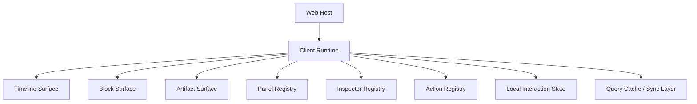

# 06. 前端现代化：从单页宿主到多面板 Narrative Workbench

## 1. 当前前端真正缺的是什么

不是“少几个组件”，而是缺一个前端运行时模型。

推荐目标：

**把 `apps/web` 从单页工作区升级成 host runtime + multi-panel workbench。**

## 2. 推荐客户端总结构



## 3. 客户端状态必须分两类

### 3.1 Server-backed State

- sessions
- worlds
- timeline
- artifacts
- trace entries
- world state summaries

### 3.2 Local Interaction State

- 哪个 panel 展开
- inspector 当前 tab
- 当前编辑草稿
- 当前筛选器
- 当前播放位置
- optimistic pending action

不要把这两类状态混在一个大 store 里。

## 4. 推荐 UI 表面（surfaces）

### 4.1 Timeline Surface

展示：

- user / assistant messages
- streaming deltas
- inline blocks
- inline artifacts

### 4.2 Block Surface

对复杂交互块使用独立布局，不必都塞在消息气泡里。

### 4.3 Artifact Surface

图片、音频、导出文档、结构化结果都应有标准 card、loading、preview、version switch。

### 4.4 Panels

推荐至少有：

- session info
- world state
- characters
- quests
- events
- packages
- presets/profiles
- traces/debug
- archive/history

### 4.5 Inspectors

对单个对象做深入查看：

- character inspector
- event inspector
- artifact inspector
- retrieval run inspector
- workflow run inspector

## 5. 现代前端 pattern 建议

### 5.1 Streaming UI

参考 `vercel/ai` 和 `mastra` 的现代做法：

- message 不只是 text
- stream 应该支持 typed parts
- tool result / workflow progress / block 都可增量渲染

### 5.2 Registry-based UI

前端必须有统一 registry：

- `rendererRegistry`
- `panelRegistry`
- `inspectorRegistry`
- `actionRegistry`
- `formRegistry`

这样 package 才能真正扩展前端。

### 5.3 Panel-first workbench

旧项目其实已经有这个方向，但现在 `covel` 需要更明确地做成框架，而不是把一堆面板硬编码在 `App.tsx`。

### 5.4 Local-first selectively

不是整站都 local-first。

更合理：

- timeline / world list 继续 server-backed
- 编辑器、草稿、协作面、form-heavy 面采用 persistent optimistic state

## 6. 推荐的 store 结构

```text
query cache
  worlds
  sessions
  timeline
  traces
  archives
  views

local interaction store
  layout
  active panels
  drafts
  filters
  playback
  optimistic actions

runtime event store
  streams
  pending blocks
  workflow status
  notifications
```

## 7. 推荐数据传输协议

不要只有 SSE message delta。

推荐统一 envelope：

- `message.delta`
- `message.completed`
- `block.emitted`
- `artifact.updated`
- `state.patch.applied`
- `workflow.suspended`
- `workflow.resumed`
- `trace.recorded`
- `notification.emitted`

## 8. 多面板布局建议

### 8.1 主布局

```text
左栏  : worlds / sessions / packages / presets
中栏  : timeline / blocks / artifacts
右栏  : state panels / inspectors / traces / archive
```

### 8.2 移动端

切换成：

- 底部 tab
- 可滑出的 inspector drawer
- timeline 仍是主轴

## 9. 推荐接入现代同步能力的方式

### 阶段 1

- 继续 `HTTP + SSE`
- IndexedDB 缓存读取结果和草稿

### 阶段 2

- 引入 shared optimistic store
- 面板级持久草稿

### 阶段 3

- 对协作编辑或世界编辑器引入 `electric` 风格 local-first sync

## 10. 简单 demo：typed stream parts

```ts
type StreamPart =
  | { type: "text-delta"; value: string }
  | { type: "block"; block: BlockEnvelope }
  | { type: "artifact"; artifact: ArtifactEnvelope }
  | { type: "state-summary"; payload: StateSummary }
  | { type: "workflow-progress"; payload: WorkflowProgress };
```

前端渲染层收到后，可以按 surface 分发，而不是都塞进 markdown 文本。

## 11. 对 `covel` 的直接建议

### 11.1 立刻做

- 把 `App.tsx` 拆成 host shell + panel surfaces
- 正式定义 client registries
- 扩展 SSE envelope
- 增加 state panels

### 11.2 接着做

- package 详情面
- workflow/trace inspectors
- world/character/quest panels

### 11.3 最后做

- offline / local-first selective adoption
- collaboration / shared editing

## 12. 仓库参考

- `mastra-ai/mastra`
- `vercel/ai`
- `electric-sql/electric`
- `liveblocks/liveblocks`
