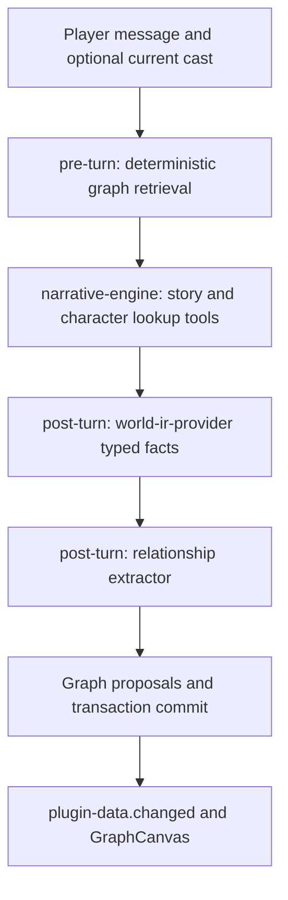

# NPC Graph + Graph-RAG Architecture

> Single-page reference for the `npc-graph` plugin and its supporting
> infrastructure across `@covel/store`, `@covel/shared`, and `@covel/web`.

## Why

Inspired by [MiroFish](https://github.com/666ghj/MiroFish), but built
without external graph services (no Zep, no Neo4j). The goal is a
self-contained **session-scoped knowledge graph** that:

1. Tracks NPCs, factions, and the relationships the LLM mentions
2. Survives across turns and re-injects relevant relationship facts
   into the narrator prompt so character behaviour stays consistent
3. Provides a live force-directed visualization in the right panel
4. Stays optional — every backend (Memory / SQLite / Postgres / IDB)
   keeps working whether or not the vector capability is available

## Component Map



The retriever first matches names and aliases in the player's message. If none
match, it uses the optional same-execution `currentCast` input and requires an
unambiguous full-name/alias match to an individual graph node. Character IDs
and graph IDs are separate namespaces. It keeps the newest open edge for each
`(source, target, relation)`, excludes invalidated edges from traversal, follows
at most two adjacency hops, then ranks reachable edges by `validAt` descending
and absolute `strength` descending, capped at 20. It loads nodes and edges
before traversal; this is not a vector query or constant-time full retrieval.

The extractor consumes the required typed `worldIR` input from capability
`world-ir-provider`, rather than independently rereading the entire narrative.
Existing nodes and relations are injected into its prompt. `toolChoice: required`
requests a real tool call; `requireExplicitCompletion` accepts a successful
`upsert-npc-graph` or an explicit `runtime-done` when nothing changed. Prose or
JSON that merely claims an update cannot commit a graph change. Actual writes
and the adjacency index are committed before the UI receives data events.

These inputs improve grounding but do not guarantee correct model inference or
entity classification. Narrators also have session-scoped `list-characters` /
`get-character` tools for full profiles, including characters not in the cast;
the graph is supplementary context, not the canonical character record.

## Data Model

Defined in `packages/shared/src/types/npc-graph.ts`.

```ts
type NpcNodeType = "individual" | "group" | "faction";

interface NpcNode {
  id: string; // opaque persistent ID; preserve existing IDs
  name: string; // canonical, used for LLM joins
  aliases?: readonly string[];
  type: NpcNodeType;
  labels: readonly string[]; // ontology tags, max 5
  summary: string; // ≤200 chars
  firstSeenTurn: number;
  lastSeenTurn: number;
  attributes?: Readonly<Record<string, unknown>>;
}

interface NpcEdge {
  id: string; // opaque persistent edge ID
  source: string; // node ID
  target: string; // node ID
  relation: string; // UPPER_SNAKE_CASE
  strength: number; // [-1, 1]
  fact: string; // single sentence — RAG unit
  validAt: number;
  invalidAt?: number; // end of the fact's validity interval
  evidenceTurnIds: readonly string[];
}
```

## Storage Layout

All persisted via `plugin_data` under `pluginId = 'npc-graph'`:

| namespace | key                  | value                 |
| --------- | -------------------- | --------------------- |
| `nodes`   | `{npcId}`            | `NpcNode`             |
| `edges`   | `{edgeId}`           | `NpcEdge`             |
| `index`   | `by-source:{nodeId}` | `string[]` (edge IDs) |
| `index`   | `by-target:{nodeId}` | `string[]` (edge IDs) |
| `meta`    | `ontology`           | `NpcGraphOntology`    |

The adjacency index is maintained inside `upsert-npc-graph` so the
retriever can load each frontier node's adjacent edge IDs by key. Nodes and
edges are still loaded once to resolve names and current relation versions.

## Plugin Tools

`plugins/npc-graph/tools/`:

- **`list-npc-graph.js`** — compatibility read tool for custom runtimes.
  The bundled extractor no longer declares it because nodes and edges are
  injected into its prompt before the LLM call.
- **`upsert-npc-graph.js`** — the heavy-lift tool. Resolves node IDs
  by name (case-insensitive), assigns collision-resistant IDs to new nodes via
  `shortIdBatch`, merges aliases / labels / summary / attributes into
  existing nodes, de-duplicates edges by `(source, target, relation)`,
  and refreshes the adjacency index in one transaction.

New node IDs use `shortIdBatch` with a UUID component; an occupied key rejects
the operation rather than replacing a different node. Existing node IDs, edge
endpoints and first-seen turns remain stable across restarts. Already overwritten
historical data requires an intact backup; installing a new version cannot
reconstruct it.

Both tools follow the existing zero-dep injection pattern, but only
`upsert-npc-graph` is exposed to the bundled extractor:
`({ tool, z, shortIdBatch, store }) => tool({ ... })`.

## Embedding And Vector Capabilities

The `npc-graph` retriever currently uses deterministic name and alias matching
followed by a two-hop graph traversal. It does not generate embeddings or query
the vector store, so the plugin does not require an embedding slot.

The framework has lower-level primitives that other features can use:

- `@covel/ai-provider` supports embedding requests through its internal gateway.
  Example embedding slots in `llm.toml`:

  ```toml
  [covel.embed-default]
  provider = "ollama"
  model    = "nomic-embed-text-v2-moe"
  baseUrl  = "http://localhost:11434/v1"
  protocol = "openai-chat-v1"
  output   = ["embedding"]

  [covel.embed-multimodal]
  provider = "openrouter"
  model    = "nvidia/llama-nemotron-embed-vl-1b-v2:free"
  baseUrl  = "https://openrouter.ai/api/v1"
  protocol = "openai-chat-v1"
  output   = ["embedding"]
  embeddingFormat = "nemotron-multimodal"
  ```

- `@covel/store` exposes the optional `VectorStoreCapability`. MemoryStore uses
  an in-memory brute-force implementation, SqliteStore uses `sqlite-vec`, and
  PgStore uses `pgvector`. Vector rows are partitioned by session and can be
  filtered by plugin, namespace, and data key.

These capabilities are independent of the plugin's current structured
retrieval path.

## Visualization

`apps/web/src/lib/graph-canvas.tsx` registers a `GraphCanvas`
component into the shared json-render catalog. The component is
lazy-loaded so the d3-force/canvas bundle (~60KB gzipped) only ships
when the user opens the panel. It reads from the live pluginData
store, so SSE-driven mutations re-render automatically.

The plugin's right-panel spec lives at
`plugins/npc-graph/runtimes/extractor/ui/npc-graph-panel.json`:

```json
{
  "id": "npc-graph",
  "icon": "network",
  "label": { "zh": "人物图谱", "en": "NPC Graph" },
  "view": {
    "component": "GraphCanvas",
    "props": {
      "pluginId": "npc-graph",
      "nodesNamespace": "nodes",
      "edgesNamespace": "edges",
      "height": 480
    }
  }
}
```

## Cross-references

- `docs/reference/plugins.md` — full plugin registry with both runtimes
- `docs/reference/ui-panels.md` — GraphCanvas catalog entry
- `docs/reference/tools.md` — current upsert workflow and compatibility reader
- `packages/shared/src/types/npc-graph.ts` — type source of truth
- `plugins/npc-graph/` — the plugin itself
- `apps/web/src/lib/graph-canvas.tsx` — visualization component
- `plugins/npc-graph/tests/` — plugin contract and integration tests
