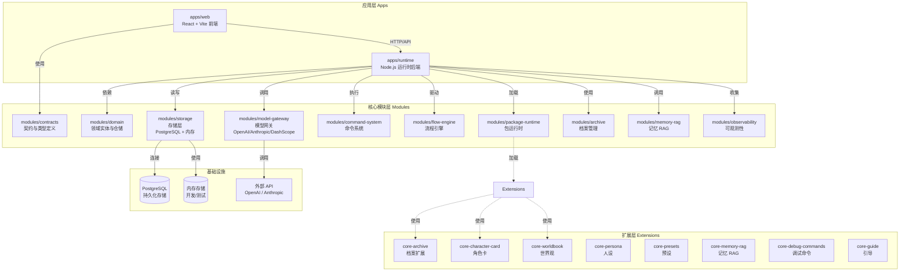
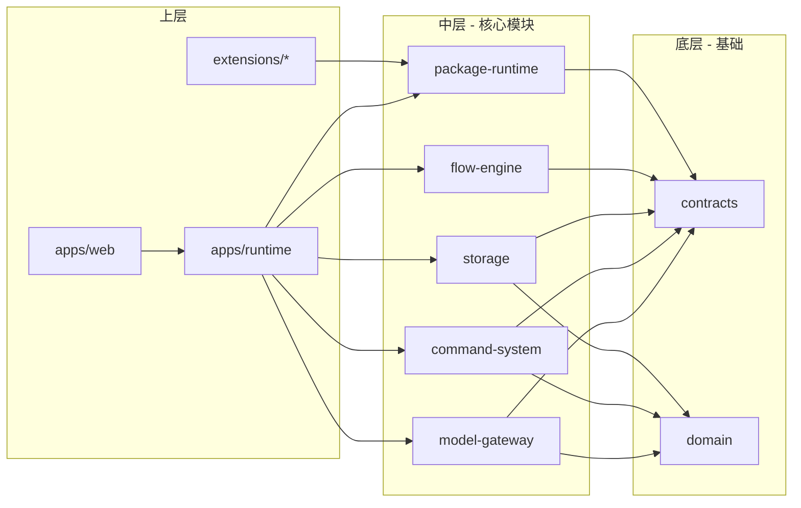
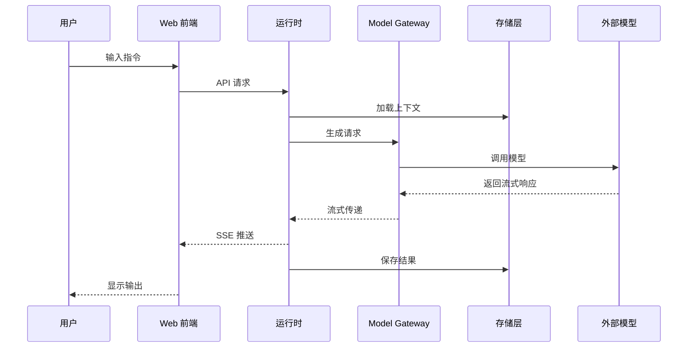

# Covel 项目架构图

## 整体架构

## 架构分层说明

### 1. 应用层 (Apps)

| 组件 | 技术栈 | 职责 |
|------|--------|------|
| `apps/web` | React 19 + Vite | 三栏式工作区界面，连接管理、任务预设编辑 |
| `apps/runtime` | Node.js + TSX | 运行时服务器，编排所有模块 |

### 2. 核心模块层 (Modules)

| 模块 | 核心职责 |
|------|----------|
| `contracts` | 跨层共享的类型定义、Schema、Locale 支持 |
| `domain` | 领域实体（Story, Session, Turn）、仓储接口 |
| `model-gateway` | 模型能力抽象（text/object/stream/embed/image/speech），支持多提供商 |
| `storage` | 统一存储端口，支持 PostgreSQL 和内存实现 |
| `command-system` | 斜杠命令注册与执行 |
| `flow-engine` | 任务流程编排引擎 |
| `package-runtime` | 扩展包加载与生命周期管理 |
| `archive` | 档案版本管理与血缘追溯 |
| `memory-rag` | 记忆检索与向量存储 |
| `observability` | 日志、追踪、Langfuse 集成 |

### 3. 扩展层 (Extensions)

所有扩展都通过 `package-runtime` 加载，提供具体业务能力：

- **core-archive**: 档案相关功能
- **core-character-card**: 角色卡管理
- **core-worldbook**: 世界观设定
- **core-persona**: 角色人设
- **core-presets**: 任务预设
- **core-memory-rag**: 记忆增强生成
- **core-debug-commands**: 开发调试命令
- **core-guide**: 用户引导

## 关键依赖关系

## 数据流

## 技术约束

- **国际化**: 默认 `zh-CN`，可选 `en`，通过 `Accept-Language` 和 action locale 字段传递
- **存储**: 接口统一，支持 PostgreSQL 生产环境和内存开发环境
- **模型调用**: 所有模型流量必须通过 `model-gateway`，禁止直接调用提供商 SDK
- **Monorepo**: pnpm workspace，Turbo 构建加速
