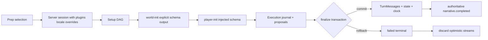

# Framework P1 Remediation Flow

```mermaid
flowchart LR
  A["Prep selection"] --> B["Server session with plugins locale overrides"]
  B --> C["Setup DAG"]
  C --> D["world-init explicit schema output"]
  D --> E["player-init injected schema"]
  E --> F["Execution journal + proposals"]
  F --> G{"finalize transaction"}
  G -->|commit| H["TurnMessages + state + clock"]
  G -->|rollback| I["failed terminal"]
  H --> J["authoritative narrative.completed"]
  I --> K["discard optimistic streams"]
```
