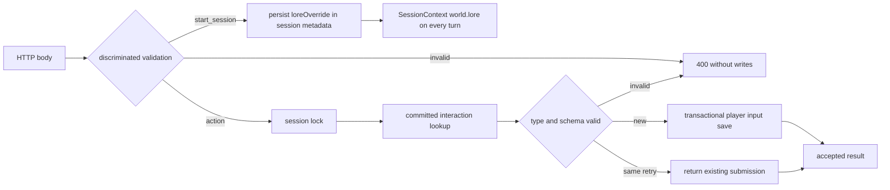

# Framework P2 Input Hardening Flow

```mermaid
flowchart LR
  A["HTTP body"] --> B{"discriminated validation"}
  B -->|invalid| C["400 without writes"]
  B -->|action| D["session lock"]
  B -->|start_session| J["persist loreOverride in session metadata"]
  J --> K["SessionContext world.lore on every turn"]
  D --> E["committed interaction lookup"]
  E --> F{"type and schema valid"}
  F -->|invalid| C
  F -->|new| G["transactional player input save"]
  F -->|same retry| H["return existing submission"]
  G --> I["accepted result"]
  H --> I
```
