# Long File Restructure

## Goal

Reduce maintenance pressure in the largest Covel source files by moving cohesive logic into local modules while preserving public imports, runtime behavior, and test contract entrypoints.

## Scope

Refactored in this pass:

- `packages/runtime/src/turn-executor.ts`
- `apps/web/src/stores/session-store.tsx`
- `apps/web/src/lib/catalog.tsx`
- `packages/store/src/contract/store-contract.ts`
- `apps/web/src/services/api.ts`
- `packages/runtime/src/session-kernel.ts`
- `apps/server/src/world-data/session-import.ts`
- `apps/web/src/components/session/session-prep-screen.tsx`
- `apps/web/src/routes/debug.tsx`
- `packages/store/src/media-store.ts`
- `packages/store/src/memory/memory-store.ts`
- `packages/store/src/indexeddb/idb-store.ts`
- `apps/server/src/routes/misc-api.ts`
- `apps/desktop/src/main.ts`
- `apps/desktop/src/logging.ts`
- `apps/desktop/src/windows.ts`
- `apps/server/src/routes/api/plugin-rpc.ts`

## Assumptions

- Public entrypoints remain stable: `@/stores/session-store.js`, `@/lib/catalog.js`, `runStoreContractTests`, `executeTurn`, and `resumeSuspendedRuntime`.
- File moves are behavior-preserving unless noted below.
- Framework code continues to discover plugin-owned UI/data by manifest and UI specs instead of hardcoding plugin IDs.

## Changes

### Runtime

- Kept `turn-executor.ts` as the turn orchestration entrypoint.
- Moved exported executor types and recursion error into `turn-executor-types.ts`.
- Moved suspended-runtime resume flow into `turn-resume.ts`.
- Moved single-runtime dispatch into `turn-runtime-execution.ts`.
- Split runtime execution modes into:
  - `turn-function-runtime.ts`
  - `turn-agent-guard.ts`
  - `turn-agent-runtime.ts`
  - `turn-agent-tool-loop.ts`

### Web Session Store

- Kept `session-store.tsx` as the public hook/store entrypoint.
- Moved state types, reducer, state extraction, SSE handling, persistent subscription, boot flow, game start, restore, and plugin-data hydration into `apps/web/src/stores/session-store/`.
- Replaced production hardcoded plugin-data hydration with UI-spec `dataSource.namespace` discovery.

### Catalog

- Kept `catalog.tsx` as the registry assembly point.
- Split renderers into catalog modules for core primitives, character, interactive UI, message forms, media, branch replies, and session helpers.
- Preserved `covelRegistry`, `resolveI18n`, `resolveIcon`, and `useI18nResolver` imports.

### Store Contract

- Kept `store-contract.ts` as the public suite registration entrypoint.
- Moved shared fixtures to `test-fixtures.ts`.
- Split contract suites into core, plugin-data, runtime-record, persistence, and integrity modules.

### Web API Service

- Kept `api.ts` as the public compatibility entrypoint.
- Split endpoint families into `apps/web/src/services/api/`: request helpers, types, worlds, sessions, packages, LLM/model settings, actions, plugin data, lorebook, plugin RPC, approvals, traces, health, overlay, and utility exports.
- Verified the actual `api.ts` export surface still has the same 151 module exports after the split.

### Runtime Session Kernel

- Kept `session-kernel.ts` as the public runtime output-processing facade.
- Split output normalization, runtime result processing, asset output checks, commit pipeline, commit handlers, commit event emission, kernel store typing, trace recording, and proposal helpers into adjacent `session-*` modules.

### Server World Data Import

- Kept `session-import.ts` as the public import/preflight/sync orchestration entrypoint.
- Split public types, world manifest/root utilities, write identity, preflight/schema validation, import planning, ledger/hash/conflict/delete logic, media materialization/finalization/cleanup, and store write helpers into `apps/server/src/world-data/session-import/`.

### Web Session Prep

- Kept `session-prep-screen.tsx` as the route-facing session setup entrypoint.
- Moved plugin-policy helpers, model slot helpers, session action helpers, and focused cards/panels into `apps/web/src/components/session/session-prep/`.
- Preserved the exported `defaultSelectedPluginIdsForWorld` and `isLockedCorePackage` test/helper surface from the original module.

### Web Debug Route

- Kept `debug.tsx` as the TanStack route shell.
- Moved trace/event helpers, page-data loading, event detail rendering, session data panels, and trace panels into `apps/web/src/routes/debug/`.
- Kept route search params and route component ownership in the original route file.

### Web Chat Messages

- Kept `chat-messages.tsx` as the session chat orchestration component for message filtering, timeline placement, asset rendering, and image RPC controls.
- Moved json-render block rendering, plugin-message rendering, raw JSON/system/footer primitives, and the empty-session hero into `apps/web/src/components/session/chat-messages/`.
- Preserved the existing branch-reply, plugin-message, submitted-selection, and disabled interactive-block behavior.

### Media Store

- Kept `media-store.ts` as the public media-store compatibility entrypoint.
- Split shared media-store types, factory/env backend selection, common byte/cleanup helpers, and backend implementations into `packages/store/src/media-store/`.
- Preserved existing exports for memory, SQLite, PostgreSQL, S3-compatible, and environment-created media stores.

### Store Backend Helpers

- Added `packages/store/src/common/pagination.ts` for Memory/IndexedDB list pagination.
- Added `packages/store/src/common/keys.ts` for in-memory composite key builders.
- Kept SQL and IndexedDB schema/index execution paths unchanged.
- Added SQLite/PostgreSQL backend-local value helpers for state entries, plugin data, worlds, working memory, world-data import ledger, and lorebook upserts.
- Added SQLite/PostgreSQL backend-local session cascade helpers for `deleteSession()` child-row cleanup.
- Moved SQLite/PostgreSQL plugin data, working memory, world-data import ledger, and lorebook CRUD families into backend-local `*-data-crud.ts` modules.
- Kept SQLite TEXT JSON serialization and PostgreSQL JSONB value shaping in separate backend modules.

### Server Misc API

- Kept `misc-api.ts` as the root-mounted miscellaneous API route entrypoint.
- Split plugin flow builders, package catalog builders, live plugin map loading, UI spec sync/building, and shared route helpers into `apps/server/src/routes/misc-api/`.
- Preserved the existing `/api/*` route prefixes and direct `createMiscApiRoutes(...)` test/import surface.

### Server Plugin RPC

- Kept `plugin-rpc.ts` as the Hono route entrypoint for action and runtime dispatch.
- Split request-body/header helpers into `apps/server/src/routes/api/plugin-rpc/body.ts`.
- Split `_jobs` plugin-data write helper and job value type into `apps/server/src/routes/api/plugin-rpc/jobs.ts`.
- Split runtime response and background follower job-status derivation into `apps/server/src/routes/api/plugin-rpc/runtime-response.ts`.
- Split manual runtime turn execution and deferred follower turn execution into `apps/server/src/routes/api/plugin-rpc/runtime-turn.ts`.
- Kept runtime execution, deferred follower scheduling, approval handling, and action dispatch in the route file for this pass.

### Desktop Main Process

- Kept `main.ts` as the Electron composition root for app lifecycle, sidecar orchestration, IPC, native menu, and windows.
- Split startup error classification, network/health polling, splash HTML, and env/key file helpers into `apps/desktop/src/{startup-errors,network,splash-screen,env-files}.ts`.
- Split rolling NDJSON desktop/server logging into `apps/desktop/src/logging.ts`, with `main.ts` wiring only app version, log directory, sidecar stream lines, and shell log calls.
- Split BrowserWindow creation, native menu template, context menu, title sync, external-link guard, splash load, and app navigation into `apps/desktop/src/windows.ts`.
- Kept sidecar config REST calls, stderr ring buffer, IPC handlers, and supervisor state in `main.ts` because they still depend on process-level state.

## Current Size Snapshot

- `packages/runtime/src/turn-executor.ts`: 1132 lines
- `packages/runtime/src/turn-runtime-execution.ts`: 316 lines
- `packages/runtime/src/turn-agent-runtime.ts`: 618 lines
- `packages/runtime/src/turn-agent-tool-loop.ts`: 699 lines
- `apps/web/src/stores/session-store.tsx`: 918 lines
- `apps/web/src/lib/catalog.tsx`: 151 lines
- `packages/store/src/contract/store-contract.ts`: 48 lines
- `apps/web/src/services/api.ts`: 47 lines
- `packages/runtime/src/session-kernel.ts`: 14 lines
- `apps/server/src/world-data/session-import.ts`: 459 lines
- `apps/web/src/components/session/session-prep-screen.tsx`: 499 lines
- `apps/web/src/components/session/chat-messages.tsx`: 627 lines
- `apps/web/src/components/session/chat-messages/message-blocks.tsx`: 420 lines
- `apps/web/src/components/session/chat-messages/message-primitives.tsx`: 107 lines
- `apps/web/src/components/session/chat-messages/session-canvas-hero.tsx`: 78 lines
- `apps/web/src/routes/debug.tsx`: 640 lines
- `packages/store/src/media-store.ts`: 30 lines
- `packages/store/src/media-store/memory.ts`: 179 lines
- `packages/store/src/media-store/pg.ts`: 261 lines
- `packages/store/src/media-store/s3.ts`: 278 lines
- `packages/store/src/media-store/sqlite.ts`: 267 lines
- `packages/store/src/memory/memory-store.ts`: 1073 lines
- `packages/store/src/indexeddb/idb-store.ts`: 1083 lines
- `packages/store/src/sqlite/sqlite-store.ts`: 1132 lines
- `packages/store/src/sqlite/sqlite-data-crud.ts`: 324 lines
- `packages/store/src/sqlite/sqlite-store-values.ts`: 196 lines
- `packages/store/src/sqlite/sqlite-session-cascade.ts`: 87 lines
- `packages/store/src/postgres/pg-store.ts`: 1068 lines
- `packages/store/src/postgres/pg-data-crud.ts`: 330 lines
- `packages/store/src/postgres/pg-store-values.ts`: 190 lines
- `packages/store/src/postgres/pg-session-cascade.ts`: 85 lines
- `apps/server/src/routes/misc-api.ts`: 429 lines
- `apps/server/src/routes/api/plugin-rpc.ts`: 913 lines
- `apps/server/src/routes/api/plugin-rpc/body.ts`: 38 lines
- `apps/server/src/routes/api/plugin-rpc/jobs.ts`: 31 lines
- `apps/server/src/routes/api/plugin-rpc/runtime-response.ts`: 74 lines
- `apps/server/src/routes/api/plugin-rpc/runtime-turn.ts`: 178 lines
- `apps/desktop/src/main.ts`: 762 lines
- `apps/desktop/src/logging.ts`: 147 lines
- `apps/desktop/src/windows.ts`: 307 lines
- `apps/desktop/src/env-files.ts`: 66 lines
- `apps/desktop/src/network.ts`: 55 lines
- `apps/desktop/src/splash-screen.ts`: 114 lines
- `apps/desktop/src/startup-errors.ts`: 38 lines

## Remaining Priority Queue

Future passes should focus on large maintenance files that are production code, have clear internal feature boundaries, and can be validated through package-level tests.

| Priority |                                                                 File |     Lines | Refactor boundary                                       | Validation focus                     |
| -------- | -------------------------------------------------------------------: | --------: | ------------------------------------------------------- | ------------------------------------ |
| 1        |                           `apps/server/src/routes/api/plugin-rpc.ts` |       913 | deferred follower scheduling, action dispatch           | Plugin RPC and approval route tests  |
| 2        | `packages/store/src/sqlite/sqlite-store.ts` / `postgres/pg-store.ts` | 1068-1132 | session CRUD, runtime records, conversation persistence | Store contract tests across backends |
| 3        |                                           `apps/desktop/src/main.ts` |       762 | IPC helpers, then supervisor                            | Desktop build smoke                  |

## Validation Run

- `timeout 120s mise exec -- pnpm --filter @covel/runtime lint`
- `timeout 120s mise exec -- pnpm --dir packages/runtime exec vitest run tests/turn-executor-events.test.ts`
- `timeout 180s mise exec -- pnpm --dir packages/runtime exec vitest run tests/turn-executor-suspend.test.ts tests/turn-executor.test.ts tests/turn-executor-recursive-call.test.ts tests/turn-executor-manual-trigger.test.ts`
- `timeout 180s mise exec -- pnpm --filter @covel/runtime test`
- `timeout 180s mise exec -- pnpm lint`
- `timeout 240s mise exec -- pnpm test`
- `timeout 120s mise exec -- pnpm exec prettier --check ...`
- `git diff --check`
- Second pass validation:
  - `timeout 120s mise exec -- pnpm --filter @covel/web lint`
  - `timeout 120s mise exec -- pnpm --filter @covel/runtime lint`
  - `timeout 120s mise exec -- pnpm --filter @covel/server lint`
  - `timeout 180s mise exec -- pnpm --filter @covel/web exec vitest run src/services/__tests__/api-session-plugins.test.ts src/services/__tests__/api-worlds-approvals.test.ts`
  - `timeout 180s mise exec -- pnpm --filter @covel/runtime exec vitest run tests/session-kernel.test.ts tests/session-kernel-txn.test.ts tests/hook-wire-session-kernel.test.ts tests/working-memory-commit.test.ts tests/proposal-source-invariant.test.ts tests/tool-executor-core-plugin-commit.test.ts tests/core-plugin-npc-graph-inject.test.ts`
  - `timeout 180s mise exec -- pnpm --filter @covel/server exec vitest run tests/lib/world-data-session-import.test.ts tests/lib/world-data-loader.test.ts`
  - `timeout 240s mise exec -- pnpm --filter @covel/web test`
  - `timeout 240s mise exec -- pnpm --filter @covel/runtime test`
  - `timeout 240s mise exec -- pnpm --filter @covel/server test`
  - `timeout 240s mise exec -- pnpm lint`
  - `timeout 360s mise exec -- pnpm test`
- Third pass validation:
  - `timeout 120s mise exec -- pnpm --filter @covel/web lint`
  - `timeout 120s mise exec -- pnpm --filter @covel/web exec vitest run src/components/session/__tests__/plugin-metadata.test.tsx src/lib/__tests__/session-plugin-selection.test.ts src/services/__tests__/api-worlds-approvals.test.ts`
  - `timeout 120s mise exec -- pnpm exec prettier --check apps/web/src/components/session/session-prep-screen.tsx apps/web/src/components/session/session-prep/*.ts apps/web/src/components/session/session-prep/*.tsx apps/web/src/routes/debug.tsx apps/web/src/routes/debug/*.ts apps/web/src/routes/debug/*.tsx`
  - `git diff --check`
  - `timeout 240s mise exec -- pnpm --filter @covel/web test`
  - `timeout 240s mise exec -- pnpm lint`
  - `timeout 360s mise exec -- pnpm test`
- Fourth pass validation:
  - `timeout 120s mise exec -- pnpm --filter @covel/store lint`
  - `timeout 180s mise exec -- pnpm --filter @covel/store exec vitest run tests/media-store.test.ts tests/store-factory-env.test.ts`
  - `timeout 240s mise exec -- pnpm --filter @covel/store test`
  - `timeout 180s mise exec -- pnpm --filter @covel/server exec vitest run tests/api/media.test.ts tests/api/media-cleanup.test.ts`
- Fifth pass validation:
  - `timeout 120s mise exec -- pnpm --filter @covel/store lint`
  - `timeout 180s mise exec -- pnpm --filter @covel/store exec vitest run tests/memory-store.test.ts tests/idb-store.test.ts tests/plugin-data-contract-extras.test.ts`
  - `timeout 240s mise exec -- pnpm --filter @covel/store test`
- Sixth pass validation:
  - `timeout 120s mise exec -- pnpm --filter @covel/server lint`
  - `timeout 180s mise exec -- pnpm --filter @covel/server exec vitest run tests/api/plugin-flow-routes.test.ts tests/api/ui-specs-session-aware.test.ts tests/api/ui-specs-user-plugins.test.ts tests/api/security-fixes.test.ts`
  - `timeout 240s mise exec -- pnpm --filter @covel/server test`
  - `timeout 240s mise exec -- pnpm lint`
  - `timeout 360s mise exec -- pnpm test`
- Seventh pass validation:
  - `timeout 180s mise exec -- pnpm --filter @covel/desktop build`
  - `timeout 240s mise exec -- pnpm lint`
  - `timeout 120s mise exec -- pnpm exec prettier --check apps/desktop/src/main.ts apps/desktop/src/env-files.ts apps/desktop/src/network.ts apps/desktop/src/splash-screen.ts apps/desktop/src/startup-errors.ts`
- Eighth pass validation:
  - `timeout 120s mise exec -- pnpm --filter @covel/store lint`
  - `timeout 180s mise exec -- pnpm --filter @covel/store exec vitest run tests/sqlite-store.test.ts tests/pg-store.test.ts tests/plugin-data-contract-extras.test.ts`
  - `timeout 240s mise exec -- pnpm --filter @covel/store test`
  - `timeout 120s mise exec -- pnpm exec prettier --check packages/store/src/sqlite/sqlite-store.ts packages/store/src/sqlite/sqlite-store-values.ts packages/store/src/postgres/pg-store.ts packages/store/src/postgres/pg-store-values.ts`
- Ninth pass validation:
  - `timeout 120s mise exec -- pnpm --filter @covel/store lint`
  - `timeout 180s mise exec -- pnpm --filter @covel/store exec vitest run tests/sqlite-store.test.ts tests/pg-store.test.ts`
  - `timeout 240s mise exec -- pnpm --filter @covel/store test`
  - `timeout 120s mise exec -- pnpm exec prettier --check packages/store/src/sqlite/sqlite-store.ts packages/store/src/sqlite/sqlite-session-cascade.ts packages/store/src/postgres/pg-store.ts packages/store/src/postgres/pg-session-cascade.ts`
- Tenth pass validation:
  - `timeout 120s mise exec -- pnpm --filter @covel/server lint`
  - `timeout 240s mise exec -- pnpm --filter @covel/server exec vitest run tests/api/plugin-rpc.test.ts tests/api/approvals.test.ts tests/api/plugin-data-routes.test.ts`
  - `timeout 120s mise exec -- pnpm exec prettier --check apps/server/src/routes/api/plugin-rpc.ts apps/server/src/routes/api/plugin-rpc/body.ts apps/server/src/routes/api/plugin-rpc/jobs.ts`
- Eleventh pass validation:
  - `timeout 120s mise exec -- pnpm --filter @covel/web lint`
  - `timeout 180s mise exec -- pnpm --filter @covel/web exec vitest run src/components/session/__tests__/plugin-rpc-ui.test.ts src/components/session/__tests__/plugin-metadata.test.tsx src/lib/__tests__/interaction-selection.test.ts src/components/asset-render/__tests__/AssetTurnSidebar.test.tsx`
  - `timeout 240s mise exec -- pnpm --filter @covel/web test`
  - `timeout 120s mise exec -- pnpm exec prettier --check apps/web/src/components/session/chat-messages.tsx apps/web/src/components/session/chat-messages/message-blocks.tsx apps/web/src/components/session/chat-messages/message-primitives.tsx apps/web/src/components/session/chat-messages/session-canvas-hero.tsx`
- Twelfth pass validation:
  - `timeout 120s mise exec -- pnpm --filter @covel/store lint`
  - `timeout 180s mise exec -- pnpm --filter @covel/store exec vitest run tests/sqlite-store.test.ts tests/pg-store.test.ts tests/plugin-data-contract-extras.test.ts`
  - `timeout 240s mise exec -- pnpm --filter @covel/store test`
  - `timeout 120s mise exec -- pnpm exec prettier --check packages/store/src/sqlite/sqlite-store.ts packages/store/src/sqlite/sqlite-data-crud.ts packages/store/src/postgres/pg-store.ts packages/store/src/postgres/pg-data-crud.ts`
- Thirteenth pass validation:
  - `timeout 120s mise exec -- pnpm --filter @covel/server lint`
  - `timeout 180s mise exec -- pnpm --filter @covel/server exec vitest run tests/api/plugin-rpc-runtime-response.test.ts tests/api/plugin-rpc.test.ts tests/api/approvals.test.ts tests/api/plugin-data-routes.test.ts`
  - `timeout 120s mise exec -- pnpm exec prettier --check apps/server/src/routes/api/plugin-rpc.ts apps/server/src/routes/api/plugin-rpc/runtime-response.ts apps/server/tests/api/plugin-rpc-runtime-response.test.ts`
- Fourteenth pass validation:
  - `timeout 120s mise exec -- pnpm --filter @covel/server lint`
  - `timeout 240s mise exec -- pnpm --filter @covel/server exec vitest run tests/api/plugin-rpc-runtime-response.test.ts tests/api/plugin-rpc.test.ts tests/api/approvals.test.ts tests/api/plugin-data-routes.test.ts`
  - `timeout 120s mise exec -- pnpm exec prettier --check apps/server/src/routes/api/plugin-rpc.ts apps/server/src/routes/api/plugin-rpc/runtime-turn.ts apps/server/src/routes/api/plugin-rpc/runtime-response.ts`
- Fifteenth pass validation:
  - `timeout 120s mise exec -- pnpm exec prettier --write apps/desktop/src/main.ts apps/desktop/src/logging.ts`
  - `timeout 180s mise exec -- pnpm --filter @covel/desktop build`
  - `timeout 240s mise exec -- pnpm lint`
- Sixteenth pass validation:
  - `timeout 120s mise exec -- pnpm exec prettier --write apps/desktop/src/main.ts apps/desktop/src/windows.ts`
  - `timeout 180s mise exec -- pnpm --filter @covel/desktop build`
  - `timeout 240s mise exec -- pnpm lint`
- Earlier in this pass, after web/store extraction:
  - `timeout 120s mise exec -- pnpm --filter @covel/web lint`
  - `timeout 120s mise exec -- pnpm --dir apps/web exec vitest run src/lib/__tests__/filter-container.test.tsx src/lib/__tests__/entry-card.test.tsx src/lib/__tests__/branch-reply-candidates.test.tsx src/stores/__tests__/session-store-game-state.test.ts src/stores/__tests__/session-store-assets.test.ts src/stores/__tests__/session-store-suspensions.test.ts src/stores/__tests__/plugin-data-store.test.ts`
  - `timeout 120s mise exec -- pnpm --filter @covel/store lint`
  - `timeout 180s mise exec -- pnpm --filter @covel/store test`

## Risks

- `turn-agent-tool-loop.ts` remains intentionally dense because LLM response handling, tool execution, suspend capture, and runtime-done semantics share mutable loop state.
- `session-store.tsx` still coordinates many side effects from the public Zustand store; future reductions should split store action factories only after broader UI flow tests are in place.
- `plugin-selection-card.tsx` is still sizeable because filtering, grouping, pack selection, and required/excluded policy rendering share local UI state; it is the next extraction candidate inside session prep after component behavior tests are expanded.
- `plugin-rpc.ts` still owns runtime execution and deferred follower scheduling; future passes should extract these only with the full runtime/background tests in scope.
- DataStore SQL backend files still contain repeated CRUD families. The next store pass should prefer focused backend-local helper families while keeping SQLite and PostgreSQL execution differences local.
- `main.ts` still owns sidecar supervisor state and broad IPC registration; the next desktop pass should split IPC handlers before attempting supervisor dependency injection.

## Rollback

Each extracted module has one original owner. Rollback can inline the module contents into the owner file, restore imports, and rerun the same targeted lint/test commands.

## Module Map

```mermaid
flowchart TD
  TurnExecutor["turn-executor.ts"] --> RuntimeExecution["turn-runtime-execution.ts"]
  RuntimeExecution --> FunctionRuntime["turn-function-runtime.ts"]
  RuntimeExecution --> AgentGuard["turn-agent-guard.ts"]
  RuntimeExecution --> AgentRuntime["turn-agent-runtime.ts"]
  AgentRuntime --> AgentToolLoop["turn-agent-tool-loop.ts"]
  TurnExecutor --> TurnResume["turn-resume.ts"]
  TurnExecutor --> TurnTypes["turn-executor-types.ts"]

  SessionStore["session-store.tsx"] --> SessionModules["session-store/*"]
  Catalog["catalog.tsx"] --> CatalogModules["catalog/*"]
  StoreContract["store-contract.ts"] --> StoreSuites["contract/suites/*"]
  StoreContract --> StoreFixtures["contract/test-fixtures.ts"]
  Api["api.ts"] --> ApiModules["services/api/*"]
  SessionKernel["session-kernel.ts"] --> KernelModules["session-*"]
  SessionImport["session-import.ts"] --> ImportModules["session-import/*"]
  SessionPrep["session-prep-screen.tsx"] --> SessionPrepModules["session-prep/*"]
  DebugRoute["debug.tsx"] --> DebugModules["routes/debug/*"]
  ChatMessages["chat-messages.tsx"] --> ChatMessageBlocks["chat-messages/message-blocks.tsx"]
  ChatMessages --> ChatMessagePrimitives["chat-messages/message-primitives.tsx"]
  ChatMessages --> SessionCanvasHero["chat-messages/session-canvas-hero.tsx"]
  MediaStore["media-store.ts"] --> MediaFactory["media-store/factory.ts"]
  MediaStore --> MediaBackends["media-store/{memory,sqlite,pg,s3}.ts"]
  MediaStore --> MediaCommon["media-store/{types,utils}.ts"]
  MemoryStore["memory-store.ts"] --> StoreCommon["common/{keys,pagination}.ts"]
  IdbStore["idb-store.ts"] --> StoreCommon
  SqliteStore["sqlite-store.ts"] --> SqliteValues["sqlite-store-values.ts"]
  SqliteStore --> SqliteCascade["sqlite-session-cascade.ts"]
  SqliteStore --> SqliteDataCrud["sqlite-data-crud.ts"]
  PgStore["pg-store.ts"] --> PgValues["pg-store-values.ts"]
  PgStore --> PgCascade["pg-session-cascade.ts"]
  PgStore --> PgDataCrud["pg-data-crud.ts"]
  MiscApi["misc-api.ts"] --> MiscModules["routes/misc-api/*"]
  PluginRpc["plugin-rpc.ts"] --> PluginRpcHelpers["plugin-rpc/{body,jobs,runtime-response,runtime-turn}.ts"]
  DesktopMain["desktop/main.ts"] --> DesktopLeaf["desktop/{startup-errors,network,splash-screen,env-files}.ts"]
  DesktopMain --> DesktopLogging["desktop/logging.ts"]
  DesktopMain --> DesktopWindows["desktop/windows.ts"]
```

