# Long File Restructure

## Goal

Reduce maintenance pressure in the largest Covel source files by moving cohesive logic into local modules while preserving public imports, runtime behavior, and test contract entrypoints.

## Scope

Refactored in this pass:

- `packages/runtime/src/turn-executor.ts`
- `packages/runtime/src/turn-agent-tool-loop.ts`
- `packages/runtime/src/turn-agent-tool-loop-messages.ts`
- `packages/context/src/prompt-assembler.ts`
- `packages/context/src/prompt-serialization.ts`
- `apps/web/src/stores/session-store.tsx`
- `apps/web/src/lib/catalog.tsx`
- `apps/web/src/lib/catalog/character-fields-renderer.tsx`
- `packages/store/src/contract/store-contract.ts`
- `apps/web/src/services/api.ts`
- `packages/runtime/src/session-kernel.ts`
- `apps/server/src/world-data/session-import.ts`
- `apps/web/src/components/session/session-prep-screen.tsx`
- `apps/web/src/routes/debug.tsx`
- `packages/store/src/media-store.ts`
- `packages/store/src/memory/memory-store.ts`
- `packages/store/src/indexeddb/idb-store.ts`
- `packages/store/src/indexeddb/idb-media-store.ts`
- `packages/store/src/indexeddb/idb-runtime-store.ts`
- `apps/server/src/routes/misc-api.ts`
- `apps/server/src/routes/api/bootstrap.ts`
- `apps/desktop/src/main.ts`
- `apps/desktop/src/ipc-handlers.ts`
- `apps/desktop/src/logging.ts`
- `apps/desktop/src/windows.ts`
- `apps/server/src/routes/api/plugin-rpc.ts`
- `packages/ai-provider/src/gateway.ts`
- `packages/test-runtime/src/runner.ts`
- `packages/test-runtime/src/runtime-loading.ts`
- `apps/web/src/settings/panes/LlmSlotsPane.tsx`
- `packages/shared/src/env/registry.ts`
- `apps/server/src/routes/api/bootstrap/memory.ts`
- `apps/server/src/routes/api/bootstrap/local-tools.ts`
- `packages/tools/src/builtin/character-tools.ts`
- `packages/tools/src/builtin/character-tool-helpers.ts`

## Assumptions

- Public entrypoints remain stable: `@/stores/session-store.js`, `@/lib/catalog.js`, `runStoreContractTests`, `executeTurn`, and `resumeSuspendedRuntime`.
- File moves are behavior-preserving unless noted below.
- Framework code continues to discover plugin-owned UI/data by manifest and UI specs instead of hardcoding plugin IDs.
- `bootstrapApi`, `runRuntimeDebug`, `runRuntimeCases`, `buildContextV2`, `runAgentToolLoop`, and plugin local-tool trust/activation behavior keep their public caller behavior.

## Changes

### Runtime

- Kept `turn-executor.ts` as the turn orchestration entrypoint.
- Moved exported executor types and recursion error into `turn-executor-types.ts`.
- Moved suspended-runtime resume flow into `turn-resume.ts`.
- Moved single-runtime dispatch into `turn-runtime-execution.ts`.
- Moved turn-result assembly, runtime/turn result persistence, auto-snapshot persistence, and `turn.completed` emission into `turn-result-finalizer.ts`.
- Moved emitted-event collection, depth-bounded event-chain fan-out, priority ordering, and background follower deferral into `turn-event-chain.ts`.
- Split runtime execution modes into:
  - `turn-function-runtime.ts`
  - `turn-agent-guard.ts`
  - `turn-agent-runtime.ts`
  - `turn-agent-tool-loop.ts`
- Split pure tool-loop follow-up message builders into `turn-agent-tool-loop-messages.ts`.
- Added focused tests for assistant tool-call preservation, hook-aborted tool results, normal tool results, and no-executor fallback messages.

### Prompt Assembly

- Kept `prompt-assembler.ts` as the context assembly entrypoint for segment construction, history insertion, author notes, and budget pruning.
- Split V2 system-prompt serialization and cache-breakpoint insertion into `packages/context/src/prompt-serialization.ts`.
- Added focused tests for V2 segment order, empty-segment joining, cacheable segment markers, and empty cacheable segment handling.

### Web Session Store

- Kept `session-store.tsx` as the public hook/store entrypoint.
- Moved state types, reducer, state extraction, SSE handling, persistent subscription, boot flow, game start, restore, and plugin-data hydration into `apps/web/src/stores/session-store/`.
- Replaced production hardcoded plugin-data hydration with UI-spec `dataSource.namespace` discovery.

### Catalog

- Kept `catalog.tsx` as the registry assembly point.
- Split renderers into catalog modules for core primitives, character, interactive UI, message forms, media, branch replies, and session helpers.
- Split schema-aware `CharacterFieldsView` into `apps/web/src/lib/catalog/character-fields-renderer.tsx`, leaving blueprint and scene-cast renderers in `character-renderers.tsx`.
- Added focused `CharacterFieldsView` tests for schema discovery, category rendering, default values, nested/free-form fields, and JSON fallback.
- Preserved `covelRegistry`, `resolveI18n`, `resolveIcon`, and `useI18nResolver` imports.

### Store Contract

- Kept `store-contract.ts` as the public suite registration entrypoint.
- Moved shared fixtures to `test-fixtures.ts`.
- Split contract suites into core, plugin-data, runtime-record, persistence, and integrity modules.

### Web API Service

- Kept `api.ts` as the public compatibility entrypoint.
- Split endpoint families into `apps/web/src/services/api/`: request helpers, types, worlds, sessions, packages, LLM/model settings, actions, plugin data, lorebook, plugin RPC, approvals, traces, health, overlay, and utility exports.
- Verified the actual `api.ts` export surface still has the same 151 module exports after the split.

### Runtime Session Kernel

- Kept `session-kernel.ts` as the public runtime output-processing facade.
- Split output normalization, runtime result processing, asset output checks, commit pipeline, commit handlers, commit event emission, kernel store typing, trace recording, and proposal helpers into adjacent `session-*` modules.

### Server World Data Import

- Kept `session-import.ts` as the public import/preflight/sync orchestration entrypoint.
- Split public types, world manifest/root utilities, write identity, preflight/schema validation, import planning, ledger/hash/conflict/delete logic, media materialization/finalization/cleanup, and store write helpers into `apps/server/src/world-data/session-import/`.

### Web Session Prep

- Kept `session-prep-screen.tsx` as the route-facing session setup entrypoint.
- Moved plugin-policy helpers, model slot helpers, session action helpers, and focused cards/panels into `apps/web/src/components/session/session-prep/`.
- Preserved the exported `defaultSelectedPluginIdsForWorld` and `isLockedCorePackage` test/helper surface from the original module.

### Web Debug Route

- Kept `debug.tsx` as the TanStack route shell.
- Moved trace/event helpers, page-data loading, event detail rendering, session data panels, and trace panels into `apps/web/src/routes/debug/`.
- Kept route search params and route component ownership in the original route file.

### Web Chat Messages

- Kept `chat-messages.tsx` as the session chat orchestration component for message filtering, timeline placement, asset rendering, and image RPC controls.
- Moved json-render block rendering, plugin-message rendering, raw JSON/system/footer primitives, and the empty-session hero into `apps/web/src/components/session/chat-messages/`.
- Preserved the existing branch-reply, plugin-message, submitted-selection, and disabled interactive-block behavior.

### Media Store

- Kept `media-store.ts` as the public media-store compatibility entrypoint.
- Split shared media-store types, factory/env backend selection, common byte/cleanup helpers, and backend implementations into `packages/store/src/media-store/`.
- Preserved existing exports for memory, SQLite, PostgreSQL, S3-compatible, and environment-created media stores.

### Store Backend Helpers

- Added `packages/store/src/common/pagination.ts` for Memory/IndexedDB list pagination.
- Added `packages/store/src/common/keys.ts` for in-memory composite key builders.
- Kept SQL and IndexedDB schema/index execution paths unchanged.
- Added SQLite/PostgreSQL backend-local value helpers for state entries, plugin data, worlds, working memory, world-data import ledger, and lorebook upserts.
- Added SQLite/PostgreSQL backend-local session cascade helpers for `deleteSession()` child-row cleanup.
- Moved SQLite/PostgreSQL plugin data, working memory, world-data import ledger, and lorebook CRUD families into backend-local `*-data-crud.ts` modules.
- Moved SQLite/PostgreSQL turn results, runtime results, tool calls, runtime outputs, and interaction record CRUD families into backend-local `*-runtime-records.ts` modules.
- Kept SQLite TEXT JSON serialization and PostgreSQL JSONB value shaping in separate backend modules.
- Split IndexedDB media record mapping, browser blob/byte normalization, SHA-256 id generation, ref-key construction, stable list sorting, and cleanup planning into `packages/store/src/indexeddb/idb-media-records.ts`.
- Split IndexedDB runtime record clone writes, session-index list helpers, timestamp sorting, limit/pagination, and runtime-output/interaction filtering into `packages/store/src/indexeddb/idb-record-helpers.ts`.
- Kept `createIndexedDbMediaStore()` and `createIdbRuntimeStore()` public behavior unchanged; the original files now own backend wiring and method orchestration.

### Server Misc API

- Kept `misc-api.ts` as the root-mounted miscellaneous API route entrypoint.
- Split plugin flow builders, package catalog builders, live plugin map loading, UI spec sync/building, and shared route helpers into `apps/server/src/routes/misc-api/`.
- Preserved the existing `/api/*` route prefixes and direct `createMiscApiRoutes(...)` test/import surface.

### Server Plugin RPC

- Kept `plugin-rpc.ts` as the Hono route entrypoint for action and runtime dispatch.
- Split request-body/header helpers into `apps/server/src/routes/api/plugin-rpc/body.ts`.
- Split `_jobs` plugin-data write helper and job value type into `apps/server/src/routes/api/plugin-rpc/jobs.ts`.
- Split runtime response and background follower job-status derivation into `apps/server/src/routes/api/plugin-rpc/runtime-response.ts`.
- Split manual runtime turn execution and deferred follower turn execution into `apps/server/src/routes/api/plugin-rpc/runtime-turn.ts`.
- Kept runtime execution, deferred follower scheduling, approval handling, and action dispatch in the route file for this pass.

### Server API Bootstrap

- Kept `bootstrap.ts` as the API composition root for plugin discovery, tool registration, RPC registration, hook registration, memory setup, dependency injection, and route mounting.
- Split the plugin-data store event proxy into `apps/server/src/routes/api/bootstrap/plugin-data-store-events.ts`.
- Split plugin discovery, manifest loading, semantic diagnostics, and registry registration into `apps/server/src/routes/api/bootstrap/plugin-discovery.ts`.
- Split Plugin RPC registry, executor, handler path containment, and approval gate wiring into `apps/server/src/routes/api/bootstrap/plugin-rpc-wiring.ts`.
- Split plugin hook-source collection and hook pipeline registration into `apps/server/src/routes/api/bootstrap/plugin-hooks.ts`.
- Split compactor summary-focus collection, estimator, fast-slot adapter, and `CompactorRunner` wiring into `apps/server/src/routes/api/bootstrap/compactor.ts`.
- Split memory V1 flag handling, slot resolution, memory-panel capability discovery, memory-system construction, and builtin memory tool creation into `apps/server/src/routes/api/bootstrap/memory.ts`.
- Split plugin-local tool loading, tools.local path containment, trusted eager loading, community lazy activation, and per-plugin tool access map construction into `apps/server/src/routes/api/bootstrap/local-tools.ts`.
- Preserved the public `wrapStoreWithPluginDataEvents` export from `bootstrap.ts` so existing route tests and callers keep their import path.
- Added focused bootstrap memory tests for disabled memory, preferred memory-slot LLM calls, builtin memory-tool creation, and memory-panel plugin mirroring.
- Added focused local-tool tests for access-map derivation, factory loading, root-escape rejection, missing-file warnings, trusted eager load, and community lazy activation.

### Desktop Main Process

- Kept `main.ts` as the Electron composition root for app lifecycle, sidecar orchestration, IPC, native menu, and windows.
- Split startup error classification, network/health polling, splash HTML, and env/key file helpers into `apps/desktop/src/{startup-errors,network,splash-screen,env-files}.ts`.
- Split rolling NDJSON desktop/server logging into `apps/desktop/src/logging.ts`, with `main.ts` wiring only app version, log directory, sidecar stream lines, and shell log calls.
- Split BrowserWindow creation, native menu template, context menu, title sync, external-link guard, splash load, and app navigation into `apps/desktop/src/windows.ts`.
- Split Electron IPC registration, open-directory handlers, settings/key fallback persistence, and plugin/world import dialogs into `apps/desktop/src/ipc-handlers.ts`.
- Kept sidecar config REST calls, stderr ring buffer, retry signal ownership, and supervisor state in `main.ts` because they still depend on process-level state.

### AI Provider Gateway

- Kept `gateway.ts` as the public `createGateway` entrypoint.
- Split target provider/model resolution, fallback eligibility, provider-error normalization, and lifecycle hook notifications into `packages/ai-provider/src/gateway-lifecycle.ts`.
- Split slot fallback resolution, per-request slot overrides, parameter override metadata, and public slot config resolution into `packages/ai-provider/src/gateway-slot-resolution.ts`.
- Preserved gateway fallback semantics and hook isolation behavior.

### Test Runtime Runner

- Kept `runner.ts` as the public debug/case runner entrypoint.
- Split plugin-data report collection, case expectation evaluation, expected-failure matching, and image artifact saving into `packages/test-runtime/src/reporting.ts`.
- Split case-file discovery, parsing, mode/name filtering, and per-case option merging into `packages/test-runtime/src/cases.ts`.
- Split deferred follower job execution and expected-background-follower failure job writing into `packages/test-runtime/src/execution.ts`.
- Split plugin discovery, runtime manifest preparation, runtime loading cache, plugin-local tool import, and path helpers into `packages/test-runtime/src/runtime-loading.ts`.
- Added focused reporting helper tests for runtime/event/log/plugin-data/asset assertions and expected runtime failures.
- Added focused case helper tests for file parsing, mode filtering, and option precedence.
- Added focused execution helper tests for `_jobs` rows, plugin-data commits, handler thrown failures, reported failures, missing manifests/handlers, and unavailable recursive calls.
- Added focused runtime-loading tests for plugin-id derivation, path expansion, upstream stripping without mutation, missing-runtime errors, local tool factories, path escape rejection, and missing local tool files.

### Web LLM Slots Pane

- Kept `LlmSlotsPane.tsx` as the Settings tab component.
- Split legacy slot ids, runtime-requested slot discovery, visible-slot merge logic, preset candidate collection, and auto-bind selection into `apps/web/src/settings/panes/llm-slots-model.ts`.
- Split capability tags, capability editor controls, token/price formatting, and modality/feature option lists into `apps/web/src/settings/panes/llm-capability-controls.tsx`.
- Added focused tests for runtime slot discovery, configured/legacy slot merging, auto-bind priority, and preset source marking.
- Added focused component tests for capability tag rendering, token/price formatting, modality/feature toggles, and numeric/pricing override patches.

### Shared Env Registry

- Kept `registry.ts` as the public compatibility entrypoint for env registry exports.
- Split env variable definitions, feature flag names, and literal env-name types into `packages/shared/src/env/registry-definitions.ts`.
- Split env source readers, provider API-key mapping, SQLite path derivation, and runtime env shaping into `packages/shared/src/env/registry-readers.ts`.
- Preserved `@covel/shared` and `../src/env/index.js` import surfaces.

### Builtin Character Tools

- Kept `character-tools.ts` as the public builtin tool factory entrypoint.
- Split character tool store/dependency types, snapshot conversion, schema loading, plugin-data mirroring, field formatting, text truncation, list sorting, and fields-Zod construction into `packages/tools/src/builtin/character-tool-helpers.ts`.
- Preserved `createCharacterTools`, `buildSessionCharacterWriteTools`, `mirrorCharacterToPluginData`, `CharacterStore`, `CharacterToolDeps`, and `CharacterSnapshot` exports from the original module path.
- Added focused helper tests for schema loading, plugin-data mirroring, formatting, truncation, sorting, snapshot conversion, and generic/schema-aware fields-Zod construction.

## Current Size Snapshot

- `packages/shared/src/env/registry.ts`: 2 lines
- `packages/shared/src/env/registry-definitions.ts`: 792 lines
- `packages/shared/src/env/registry-readers.ts`: 189 lines
- `packages/runtime/src/turn-executor.ts`: 450 lines
- `packages/runtime/src/turn-runtime-execution.ts`: 316 lines
- `packages/runtime/src/turn-result-finalizer.ts`: 185 lines
- `packages/runtime/src/turn-event-chain.ts`: 115 lines
- `packages/runtime/src/turn-agent-runtime.ts`: 618 lines
- `packages/runtime/src/turn-agent-tool-loop.ts`: 692 lines
- `packages/runtime/src/turn-agent-tool-loop-messages.ts`: 53 lines
- `packages/runtime/tests/turn-agent-tool-loop-messages.test.ts`: 74 lines
- `packages/context/src/prompt-assembler.ts`: 613 lines
- `packages/context/src/prompt-serialization.ts`: 41 lines
- `packages/context/tests/prompt-serialization.test.ts`: 90 lines
- `packages/tools/src/builtin/character-tools.ts`: 430 lines
- `packages/tools/src/builtin/character-tool-helpers.ts`: 249 lines
- `packages/tools/tests/character-tool-helpers.test.ts`: 184 lines
- `apps/web/src/stores/session-store.tsx`: 77 lines
- `apps/web/src/lib/catalog.tsx`: 151 lines
- `apps/web/src/lib/catalog/character-renderers.tsx`: 346 lines
- `apps/web/src/lib/catalog/character-fields-renderer.tsx`: 356 lines
- `apps/web/src/lib/__tests__/character-fields-renderer.test.tsx`: 148 lines
- `packages/store/src/contract/store-contract.ts`: 48 lines
- `apps/web/src/services/api.ts`: 47 lines
- `packages/runtime/src/session-kernel.ts`: 14 lines
- `apps/server/src/world-data/session-import.ts`: 459 lines
- `apps/web/src/components/session/session-prep-screen.tsx`: 499 lines
- `apps/web/src/components/session/chat-messages.tsx`: 627 lines
- `apps/web/src/components/session/chat-messages/message-blocks.tsx`: 420 lines
- `apps/web/src/components/session/chat-messages/message-primitives.tsx`: 107 lines
- `apps/web/src/components/session/chat-messages/session-canvas-hero.tsx`: 78 lines
- `apps/web/src/routes/debug.tsx`: 640 lines
- `packages/store/src/media-store.ts`: 30 lines
- `packages/store/src/media-store/memory.ts`: 179 lines
- `packages/store/src/media-store/pg.ts`: 261 lines
- `packages/store/src/media-store/s3.ts`: 278 lines
- `packages/store/src/media-store/sqlite.ts`: 267 lines
- `packages/store/src/memory/memory-store.ts`: 44 lines
- `packages/store/src/indexeddb/idb-store.ts`: 57 lines
- `packages/store/src/indexeddb/idb-media-store.ts`: 210 lines
- `packages/store/src/indexeddb/idb-media-records.ts`: 204 lines
- `packages/store/src/indexeddb/idb-runtime-store.ts`: 285 lines
- `packages/store/src/indexeddb/idb-record-helpers.ts`: 101 lines
- `packages/store/src/indexeddb/idb-plugin-store.ts`: 135 lines
- `packages/store/src/indexeddb/idb-persistence-store.ts`: 138 lines
- `packages/store/src/indexeddb/idb-world-data-store.ts`: 150 lines
- `packages/store/src/sqlite/sqlite-store.ts`: 85 lines
- `packages/store/src/sqlite/sqlite-data-crud.ts`: 324 lines
- `packages/store/src/sqlite/sqlite-runtime-records.ts`: 272 lines
- `packages/store/src/sqlite/sqlite-store-values.ts`: 196 lines
- `packages/store/src/sqlite/sqlite-session-cascade.ts`: 87 lines
- `packages/store/src/postgres/pg-store.ts`: 76 lines
- `packages/store/src/postgres/pg-data-crud.ts`: 330 lines
- `packages/store/src/postgres/pg-runtime-records.ts`: 280 lines
- `packages/store/src/postgres/pg-store-values.ts`: 190 lines
- `packages/store/src/postgres/pg-session-cascade.ts`: 85 lines
- `packages/ai-provider/src/gateway.ts`: 638 lines
- `packages/ai-provider/src/gateway-lifecycle.ts`: 147 lines
- `packages/ai-provider/src/gateway-slot-resolution.ts`: 311 lines
- `packages/test-runtime/src/runner.ts`: 660 lines
- `packages/test-runtime/src/runtime-loading.ts`: 155 lines
- `packages/test-runtime/src/runtime-loading.test.ts`: 122 lines
- `packages/test-runtime/src/execution.ts`: 263 lines
- `packages/test-runtime/src/execution.test.ts`: 432 lines
- `packages/test-runtime/src/cases.ts`: 92 lines
- `packages/test-runtime/src/cases.test.ts`: 110 lines
- `packages/test-runtime/src/reporting.ts`: 290 lines
- `packages/test-runtime/src/reporting.test.ts`: 86 lines
- `apps/web/src/settings/panes/LlmSlotsPane.tsx`: 418 lines
- `apps/web/src/settings/panes/llm-slots-model.ts`: 127 lines
- `apps/web/src/settings/panes/__tests__/llm-slots-model.test.ts`: 131 lines
- `apps/web/src/settings/panes/llm-capability-controls.tsx`: 369 lines
- `apps/web/src/settings/panes/__tests__/llm-capability-controls.test.tsx`: 148 lines
- `apps/server/src/routes/misc-api.ts`: 429 lines
- `apps/server/src/routes/api/plugin-rpc.ts`: 513 lines
- `apps/server/src/routes/api/plugin-rpc/body.ts`: 86 lines
- `apps/server/src/routes/api/plugin-rpc/jobs.ts`: 111 lines
- `apps/server/src/routes/api/plugin-rpc/runtime-response.ts`: 74 lines
- `apps/server/src/routes/api/plugin-rpc/runtime-turn.ts`: 164 lines
- `apps/server/src/routes/api/bootstrap.ts`: 607 lines
- `apps/server/src/routes/api/bootstrap/compactor.ts`: 68 lines
- `apps/server/src/routes/api/bootstrap/local-tools.ts`: 191 lines
- `apps/server/src/routes/api/bootstrap/memory.ts`: 120 lines
- `apps/server/src/routes/api/bootstrap/plugin-data-store-events.ts`: 131 lines
- `apps/server/src/routes/api/bootstrap/plugin-discovery.ts`: 104 lines
- `apps/server/src/routes/api/bootstrap/plugin-rpc-wiring.ts`: 106 lines
- `apps/server/src/routes/api/bootstrap/plugin-hooks.ts`: 45 lines
- `apps/server/tests/api/bootstrap-local-tools.test.ts`: 253 lines
- `apps/server/tests/api/bootstrap-memory.test.ts`: 141 lines
- `apps/desktop/src/main.ts`: 585 lines
- `apps/desktop/src/ipc-handlers.ts`: 222 lines
- `apps/desktop/src/logging.ts`: 147 lines
- `apps/desktop/src/windows.ts`: 307 lines
- `apps/desktop/src/env-files.ts`: 69 lines
- `apps/desktop/src/network.ts`: 55 lines
- `apps/desktop/src/splash-screen.ts`: 114 lines
- `apps/desktop/src/startup-errors.ts`: 38 lines

## Remaining Priority Queue

Future passes should focus on large maintenance files that are production code, have clear internal feature boundaries, and can be validated through package-level tests.

| Priority |                                                                     File | Lines | Refactor boundary                             | Validation focus                     |
| -------- | -----------------------------------------------------------------------: | ----: | --------------------------------------------- | ------------------------------------ |
| 1        |                           `packages/runtime/src/turn-agent-tool-loop.ts` |   692 | LLM response loop and tool-call state machine | Runtime tool-loop tests              |
| 2        |                                    `packages/test-runtime/src/runner.ts` |   660 | live adapter setup and case orchestration     | Test-runtime package tests           |
| 3        |                     `apps/web/src/lib/catalog/interactive-renderers.tsx` |   650 | interactive json-render components            | Web catalog/component tests          |
| 4        |                                          `apps/web/src/routes/debug.tsx` |   640 | trace/session debug panels                    | Web route/component tests            |
| 5        |                                    `packages/ai-provider/src/gateway.ts` |   638 | operation retry/fallback loop                 | AI provider gateway tests            |
| 6        | `apps/web/src/components/session/session-prep/plugin-selection-card.tsx` |   627 | plugin filtering and policy UI                | Web session-prep component tests     |
| 7        |                      `apps/web/src/components/session/chat-messages.tsx` |   627 | message orchestration and timeline rendering  | Web chat/component tests             |
| 8        |                               `packages/context/src/prompt-assembler.ts` |   613 | prompt segment assembly and budget pruning    | Context prompt tests                 |
| 9        |                                `apps/server/src/routes/api/bootstrap.ts` |   607 | remaining route composition and DI wiring     | Server bootstrap and API route tests |
| 10       |                                    `packages/create/src/create-world.ts` |   602 | world scaffold writing and asset generation   | Create package tests                 |

Very large generated/catalog/type-heavy files such as `known-models.ts`, `store/src/types.ts`, and `registry-definitions.ts` should stay lower priority unless a concrete maintenance problem appears.

## Validation Run

- `timeout 120s mise exec -- pnpm --filter @covel/runtime lint`
- `timeout 120s mise exec -- pnpm --dir packages/runtime exec vitest run tests/turn-executor-events.test.ts`
- `timeout 180s mise exec -- pnpm --dir packages/runtime exec vitest run tests/turn-executor-suspend.test.ts tests/turn-executor.test.ts tests/turn-executor-recursive-call.test.ts tests/turn-executor-manual-trigger.test.ts`
- `timeout 180s mise exec -- pnpm --filter @covel/runtime test`
- `timeout 180s mise exec -- pnpm lint`
- `timeout 240s mise exec -- pnpm test`
- `timeout 120s mise exec -- pnpm exec prettier --check ...`
- `git diff --check`
- Second pass validation:
  - `timeout 120s mise exec -- pnpm --filter @covel/web lint`
  - `timeout 120s mise exec -- pnpm --filter @covel/runtime lint`
  - `timeout 120s mise exec -- pnpm --filter @covel/server lint`
  - `timeout 180s mise exec -- pnpm --filter @covel/web exec vitest run src/services/__tests__/api-session-plugins.test.ts src/services/__tests__/api-worlds-approvals.test.ts`
  - `timeout 180s mise exec -- pnpm --filter @covel/runtime exec vitest run tests/session-kernel.test.ts tests/session-kernel-txn.test.ts tests/hook-wire-session-kernel.test.ts tests/working-memory-commit.test.ts tests/proposal-source-invariant.test.ts tests/tool-executor-core-plugin-commit.test.ts tests/core-plugin-npc-graph-inject.test.ts`
  - `timeout 180s mise exec -- pnpm --filter @covel/server exec vitest run tests/lib/world-data-session-import.test.ts tests/lib/world-data-loader.test.ts`
  - `timeout 240s mise exec -- pnpm --filter @covel/web test`
  - `timeout 240s mise exec -- pnpm --filter @covel/runtime test`
  - `timeout 240s mise exec -- pnpm --filter @covel/server test`
  - `timeout 240s mise exec -- pnpm lint`
  - `timeout 360s mise exec -- pnpm test`
- Third pass validation:
  - `timeout 120s mise exec -- pnpm --filter @covel/web lint`
  - `timeout 120s mise exec -- pnpm --filter @covel/web exec vitest run src/components/session/__tests__/plugin-metadata.test.tsx src/lib/__tests__/session-plugin-selection.test.ts src/services/__tests__/api-worlds-approvals.test.ts`
  - `timeout 120s mise exec -- pnpm exec prettier --check apps/web/src/components/session/session-prep-screen.tsx apps/web/src/components/session/session-prep/*.ts apps/web/src/components/session/session-prep/*.tsx apps/web/src/routes/debug.tsx apps/web/src/routes/debug/*.ts apps/web/src/routes/debug/*.tsx`
  - `git diff --check`
  - `timeout 240s mise exec -- pnpm --filter @covel/web test`
  - `timeout 240s mise exec -- pnpm lint`
  - `timeout 360s mise exec -- pnpm test`
- Fourth pass validation:
  - `timeout 120s mise exec -- pnpm --filter @covel/store lint`
  - `timeout 180s mise exec -- pnpm --filter @covel/store exec vitest run tests/media-store.test.ts tests/store-factory-env.test.ts`
  - `timeout 240s mise exec -- pnpm --filter @covel/store test`
  - `timeout 180s mise exec -- pnpm --filter @covel/server exec vitest run tests/api/media.test.ts tests/api/media-cleanup.test.ts`
- Fifth pass validation:
  - `timeout 120s mise exec -- pnpm --filter @covel/store lint`
  - `timeout 180s mise exec -- pnpm --filter @covel/store exec vitest run tests/memory-store.test.ts tests/idb-store.test.ts tests/plugin-data-contract-extras.test.ts`
  - `timeout 240s mise exec -- pnpm --filter @covel/store test`
- Sixth pass validation:
  - `timeout 120s mise exec -- pnpm --filter @covel/server lint`
  - `timeout 180s mise exec -- pnpm --filter @covel/server exec vitest run tests/api/plugin-flow-routes.test.ts tests/api/ui-specs-session-aware.test.ts tests/api/ui-specs-user-plugins.test.ts tests/api/security-fixes.test.ts`
  - `timeout 240s mise exec -- pnpm --filter @covel/server test`
  - `timeout 240s mise exec -- pnpm lint`
  - `timeout 360s mise exec -- pnpm test`
- Seventh pass validation:
  - `timeout 180s mise exec -- pnpm --filter @covel/desktop build`
  - `timeout 240s mise exec -- pnpm lint`
  - `timeout 120s mise exec -- pnpm exec prettier --check apps/desktop/src/main.ts apps/desktop/src/env-files.ts apps/desktop/src/network.ts apps/desktop/src/splash-screen.ts apps/desktop/src/startup-errors.ts`
- Eighth pass validation:
  - `timeout 120s mise exec -- pnpm --filter @covel/store lint`
  - `timeout 180s mise exec -- pnpm --filter @covel/store exec vitest run tests/sqlite-store.test.ts tests/pg-store.test.ts tests/plugin-data-contract-extras.test.ts`
  - `timeout 240s mise exec -- pnpm --filter @covel/store test`
  - `timeout 120s mise exec -- pnpm exec prettier --check packages/store/src/sqlite/sqlite-store.ts packages/store/src/sqlite/sqlite-store-values.ts packages/store/src/postgres/pg-store.ts packages/store/src/postgres/pg-store-values.ts`
- Ninth pass validation:
  - `timeout 120s mise exec -- pnpm --filter @covel/store lint`
  - `timeout 180s mise exec -- pnpm --filter @covel/store exec vitest run tests/sqlite-store.test.ts tests/pg-store.test.ts`
  - `timeout 240s mise exec -- pnpm --filter @covel/store test`
  - `timeout 120s mise exec -- pnpm exec prettier --check packages/store/src/sqlite/sqlite-store.ts packages/store/src/sqlite/sqlite-session-cascade.ts packages/store/src/postgres/pg-store.ts packages/store/src/postgres/pg-session-cascade.ts`
- Tenth pass validation:
  - `timeout 120s mise exec -- pnpm --filter @covel/server lint`
  - `timeout 240s mise exec -- pnpm --filter @covel/server exec vitest run tests/api/plugin-rpc.test.ts tests/api/approvals.test.ts tests/api/plugin-data-routes.test.ts`
  - `timeout 120s mise exec -- pnpm exec prettier --check apps/server/src/routes/api/plugin-rpc.ts apps/server/src/routes/api/plugin-rpc/body.ts apps/server/src/routes/api/plugin-rpc/jobs.ts`
- Eleventh pass validation:
  - `timeout 120s mise exec -- pnpm --filter @covel/web lint`
  - `timeout 180s mise exec -- pnpm --filter @covel/web exec vitest run src/components/session/__tests__/plugin-rpc-ui.test.ts src/components/session/__tests__/plugin-metadata.test.tsx src/lib/__tests__/interaction-selection.test.ts src/components/asset-render/__tests__/AssetTurnSidebar.test.tsx`
  - `timeout 240s mise exec -- pnpm --filter @covel/web test`
  - `timeout 120s mise exec -- pnpm exec prettier --check apps/web/src/components/session/chat-messages.tsx apps/web/src/components/session/chat-messages/message-blocks.tsx apps/web/src/components/session/chat-messages/message-primitives.tsx apps/web/src/components/session/chat-messages/session-canvas-hero.tsx`
- Twelfth pass validation:
  - `timeout 120s mise exec -- pnpm --filter @covel/store lint`
  - `timeout 180s mise exec -- pnpm --filter @covel/store exec vitest run tests/sqlite-store.test.ts tests/pg-store.test.ts tests/plugin-data-contract-extras.test.ts`
  - `timeout 240s mise exec -- pnpm --filter @covel/store test`
  - `timeout 120s mise exec -- pnpm exec prettier --check packages/store/src/sqlite/sqlite-store.ts packages/store/src/sqlite/sqlite-data-crud.ts packages/store/src/postgres/pg-store.ts packages/store/src/postgres/pg-data-crud.ts`
- Thirteenth pass validation:
  - `timeout 120s mise exec -- pnpm --filter @covel/server lint`
  - `timeout 180s mise exec -- pnpm --filter @covel/server exec vitest run tests/api/plugin-rpc-runtime-response.test.ts tests/api/plugin-rpc.test.ts tests/api/approvals.test.ts tests/api/plugin-data-routes.test.ts`
  - `timeout 120s mise exec -- pnpm exec prettier --check apps/server/src/routes/api/plugin-rpc.ts apps/server/src/routes/api/plugin-rpc/runtime-response.ts apps/server/tests/api/plugin-rpc-runtime-response.test.ts`
- Fourteenth pass validation:
  - `timeout 120s mise exec -- pnpm --filter @covel/server lint`
  - `timeout 240s mise exec -- pnpm --filter @covel/server exec vitest run tests/api/plugin-rpc-runtime-response.test.ts tests/api/plugin-rpc.test.ts tests/api/approvals.test.ts tests/api/plugin-data-routes.test.ts`
  - `timeout 120s mise exec -- pnpm exec prettier --check apps/server/src/routes/api/plugin-rpc.ts apps/server/src/routes/api/plugin-rpc/runtime-turn.ts apps/server/src/routes/api/plugin-rpc/runtime-response.ts`
- Fifteenth pass validation:
  - `timeout 120s mise exec -- pnpm exec prettier --write apps/desktop/src/main.ts apps/desktop/src/logging.ts`
  - `timeout 180s mise exec -- pnpm --filter @covel/desktop build`
  - `timeout 240s mise exec -- pnpm lint`
- Sixteenth pass validation:
  - `timeout 120s mise exec -- pnpm exec prettier --write apps/desktop/src/main.ts apps/desktop/src/windows.ts`
  - `timeout 180s mise exec -- pnpm --filter @covel/desktop build`
  - `timeout 240s mise exec -- pnpm lint`
- Seventeenth pass validation:
  - `timeout 120s mise exec -- pnpm exec prettier --write apps/server/src/routes/api/bootstrap.ts apps/server/src/routes/api/bootstrap/plugin-data-store-events.ts`
  - `timeout 120s mise exec -- pnpm --filter @covel/server lint`
  - `timeout 180s mise exec -- pnpm --filter @covel/server exec vitest run tests/api/plugin-data-delete-event.test.ts tests/api/subscribe-event-name.test.ts`
  - `timeout 240s mise exec -- pnpm --filter @covel/server exec vitest run tests/api/chat-mode-http-e2e.test.ts tests/api/e2e-narrator.test.ts tests/api/plugin-data-routes.test.ts`
  - `timeout 240s mise exec -- pnpm --filter @covel/server test`
  - `timeout 240s mise exec -- pnpm lint`
- Eighteenth pass validation:
  - `timeout 120s mise exec -- pnpm exec prettier --write apps/server/src/routes/api/bootstrap.ts apps/server/src/routes/api/bootstrap/plugin-discovery.ts`
  - `timeout 120s mise exec -- pnpm --filter @covel/server lint`
  - `timeout 240s mise exec -- pnpm --filter @covel/server exec vitest run tests/api/chat-mode-http-e2e.test.ts tests/api/e2e-narrator.test.ts tests/api/plugin-flow-routes.test.ts tests/api/ui-specs-session-aware.test.ts tests/api/security-fixes.test.ts`
  - `timeout 240s mise exec -- pnpm --filter @covel/server test`
  - `timeout 240s mise exec -- pnpm lint`
- Nineteenth pass validation:
  - `timeout 120s mise exec -- pnpm exec prettier --write packages/runtime/src/turn-executor.ts packages/runtime/src/turn-result-finalizer.ts`
  - `timeout 120s mise exec -- pnpm --filter @covel/runtime lint`
  - `timeout 180s mise exec -- pnpm --filter @covel/runtime exec vitest run tests/turn-executor-turn-result-always-saved.test.ts tests/turn-executor.test.ts`
  - `timeout 180s mise exec -- pnpm --filter @covel/server exec vitest run tests/api/snapshot.test.ts`
  - `timeout 240s mise exec -- pnpm --filter @covel/runtime test`
  - `timeout 240s mise exec -- pnpm lint`
- Twentieth pass validation:
  - `timeout 120s mise exec -- pnpm exec prettier --write packages/runtime/src/turn-executor.ts packages/runtime/src/turn-event-chain.ts`
  - `timeout 120s mise exec -- pnpm --filter @covel/runtime lint`
  - `timeout 180s mise exec -- pnpm --filter @covel/runtime exec vitest run tests/turn-executor-manual-trigger.test.ts tests/turn-executor-events.test.ts`
  - `timeout 240s mise exec -- pnpm --filter @covel/server exec vitest run tests/api/plugin-rpc.test.ts tests/api/plugin-rpc-runtime-response.test.ts`
  - `timeout 240s mise exec -- pnpm --filter @covel/runtime test`
  - `timeout 240s mise exec -- pnpm lint`
- Twenty-first pass validation:
  - `timeout 120s mise exec -- pnpm exec prettier --write apps/server/src/routes/api/bootstrap.ts apps/server/src/routes/api/bootstrap/plugin-rpc-wiring.ts`
  - `timeout 120s mise exec -- pnpm --filter @covel/server lint`
  - `timeout 240s mise exec -- pnpm --filter @covel/server exec vitest run tests/api/plugin-rpc.test.ts tests/api/plugin-rpc-runtime-response.test.ts tests/api/approvals.test.ts`
  - `timeout 240s mise exec -- pnpm --filter @covel/server test`
  - `timeout 240s mise exec -- pnpm lint`
- Twenty-second pass validation:
  - `timeout 120s mise exec -- pnpm exec prettier --write apps/server/src/routes/api/bootstrap.ts apps/server/src/routes/api/bootstrap/plugin-hooks.ts`
  - `timeout 120s mise exec -- pnpm --filter @covel/server lint`
  - `timeout 180s mise exec -- pnpm --filter @covel/server exec vitest run tests/api/hook-pipeline-integration.test.ts tests/api/chat-mode-http-e2e.test.ts`
  - `timeout 240s mise exec -- pnpm --filter @covel/server test`
  - `timeout 240s mise exec -- pnpm lint`
- Twenty-third pass validation:
  - `timeout 120s mise exec -- pnpm exec prettier --write apps/server/src/routes/api/bootstrap.ts apps/server/src/routes/api/bootstrap/compactor.ts`
  - `timeout 120s mise exec -- pnpm --filter @covel/server lint`
  - `timeout 180s mise exec -- pnpm --filter @covel/context exec vitest run tests/compactor.test.ts tests/context-builder.test.ts`
  - `timeout 240s mise exec -- pnpm --filter @covel/server test`
  - `timeout 240s mise exec -- pnpm lint`
- Twenty-fourth pass validation:
  - `timeout 120s mise exec -- pnpm --filter @covel/store lint`
  - `timeout 180s mise exec -- pnpm --filter @covel/store exec vitest run tests/sqlite-store.test.ts tests/pg-store.test.ts`
  - `timeout 240s mise exec -- pnpm --filter @covel/store test`
  - `timeout 120s mise exec -- pnpm exec prettier --check packages/store/src/sqlite/sqlite-store.ts packages/store/src/sqlite/sqlite-runtime-records.ts packages/store/src/postgres/pg-store.ts packages/store/src/postgres/pg-runtime-records.ts docs/refactor/2026-05-09_13-05_long-file-restructure.md`
  - `timeout 240s mise exec -- pnpm lint`
- Twenty-fifth pass validation:
  - `timeout 120s mise exec -- pnpm exec prettier --check packages/ai-provider/src/gateway.ts packages/ai-provider/src/gateway-lifecycle.ts docs/refactor/2026-05-09_13-05_long-file-restructure.md`
  - `timeout 120s mise exec -- pnpm --filter @covel/ai-provider lint`
  - `timeout 180s mise exec -- pnpm --filter @covel/ai-provider exec vitest run tests/gateway.test.ts tests/fixes.test.ts`
  - `timeout 240s mise exec -- pnpm --filter @covel/ai-provider test`
  - `timeout 240s mise exec -- pnpm lint`
- Twenty-sixth pass validation:
  - `timeout 120s mise exec -- pnpm exec prettier --check packages/test-runtime/src/runner.ts packages/test-runtime/src/reporting.ts packages/test-runtime/src/reporting.test.ts docs/refactor/2026-05-09_13-05_long-file-restructure.md`
  - `timeout 120s mise exec -- pnpm --filter @covel/test-runtime lint`
  - `timeout 180s mise exec -- pnpm --filter @covel/test-runtime test`
  - `timeout 240s mise exec -- pnpm lint`
- Twenty-seventh pass validation:
  - `timeout 120s mise exec -- pnpm exec prettier --check apps/web/src/settings/panes/LlmSlotsPane.tsx apps/web/src/settings/panes/llm-slots-model.ts apps/web/src/settings/panes/__tests__/llm-slots-model.test.ts docs/refactor/2026-05-09_13-05_long-file-restructure.md`
  - `timeout 120s mise exec -- pnpm --filter @covel/web lint`
  - `timeout 120s mise exec -- pnpm --filter @covel/web exec vitest run src/settings/panes/__tests__/llm-slots-model.test.ts`
  - `timeout 240s mise exec -- pnpm --filter @covel/web test`
  - `timeout 240s mise exec -- pnpm lint`
- Twenty-eighth pass validation:
  - `timeout 120s mise exec -- pnpm exec prettier --check packages/test-runtime/src/runner.ts packages/test-runtime/src/cases.ts packages/test-runtime/src/cases.test.ts packages/test-runtime/src/reporting.ts packages/test-runtime/src/reporting.test.ts docs/refactor/2026-05-09_13-05_long-file-restructure.md`
  - `timeout 120s mise exec -- pnpm --filter @covel/test-runtime lint`
  - `timeout 180s mise exec -- pnpm --filter @covel/test-runtime test`
  - `timeout 240s mise exec -- pnpm lint`
- Twenty-ninth pass validation:
  - `timeout 120s mise exec -- pnpm exec prettier --check packages/shared/src/env/registry.ts packages/shared/src/env/registry-definitions.ts packages/shared/src/env/registry-readers.ts docs/refactor/2026-05-09_13-05_long-file-restructure.md`
  - `timeout 120s mise exec -- pnpm --filter @covel/shared lint`
  - `timeout 180s mise exec -- pnpm --filter @covel/shared exec vitest run tests/env-registry.test.ts`
  - `timeout 180s mise exec -- pnpm --filter @covel/store exec vitest run tests/store-factory-env.test.ts`
  - `timeout 240s mise exec -- pnpm lint`
- Thirtieth pass validation:
  - `timeout 120s mise exec -- pnpm exec prettier --check apps/web/src/settings/panes/LlmSlotsPane.tsx apps/web/src/settings/panes/llm-capability-controls.tsx apps/web/src/settings/panes/__tests__/llm-capability-controls.test.tsx docs/refactor/2026-05-09_13-05_long-file-restructure.md`
  - `timeout 120s mise exec -- pnpm --filter @covel/web exec vitest run src/settings/panes/__tests__/llm-capability-controls.test.tsx`
  - `timeout 120s mise exec -- pnpm --filter @covel/web exec vitest run src/settings/panes/__tests__/llm-slots-model.test.ts`
  - `timeout 120s mise exec -- pnpm --filter @covel/web lint`
  - `timeout 240s mise exec -- pnpm --filter @covel/web test`
  - `timeout 240s mise exec -- pnpm lint`
- Thirty-first pass validation:
  - `timeout 120s mise exec -- pnpm exec prettier --check packages/ai-provider/src/gateway.ts packages/ai-provider/src/gateway-slot-resolution.ts docs/refactor/2026-05-09_13-05_long-file-restructure.md`
  - `timeout 120s mise exec -- pnpm --filter @covel/ai-provider lint`
  - `timeout 180s mise exec -- pnpm --filter @covel/ai-provider exec vitest run tests/gateway.test.ts tests/gateway-slot-overrides.test.ts tests/parameter-overrides.test.ts tests/embedding.test.ts tests/reasoning-thinking.test.ts`
  - `timeout 240s mise exec -- pnpm --filter @covel/ai-provider test`
  - `timeout 240s mise exec -- pnpm lint`
- Thirty-second pass validation:
  - `timeout 120s mise exec -- pnpm exec prettier --check packages/test-runtime/src/runner.ts packages/test-runtime/src/execution.ts packages/test-runtime/src/execution.test.ts docs/refactor/2026-05-09_13-05_long-file-restructure.md`
  - `timeout 120s mise exec -- pnpm --filter @covel/test-runtime lint`
  - `timeout 180s mise exec -- pnpm --filter @covel/test-runtime test`
  - `timeout 240s mise exec -- pnpm --filter @covel/runtime test`
  - `timeout 240s mise exec -- pnpm lint`
  - `git diff --check`
  - `timeout 360s mise exec -- pnpm test`
  - `timeout 240s mise exec -- pre-commit run --files docs/refactor/2026-05-09_13-05_long-file-restructure.md packages/test-runtime/src/runner.ts packages/test-runtime/src/execution.ts packages/test-runtime/src/execution.test.ts`
- Thirty-third pass validation:
  - `timeout 120s mise exec -- pnpm exec prettier --check packages/store/src/indexeddb/idb-media-store.ts packages/store/src/indexeddb/idb-runtime-store.ts packages/store/src/indexeddb/idb-media-records.ts packages/store/src/indexeddb/idb-record-helpers.ts packages/store/tests/idb-media-records.test.ts packages/store/tests/idb-record-helpers.test.ts docs/refactor/2026-05-09_13-05_long-file-restructure.md`
  - `timeout 120s mise exec -- pnpm --filter @covel/store lint`
  - `timeout 180s mise exec -- pnpm --filter @covel/store exec vitest run tests/idb-media-records.test.ts tests/idb-record-helpers.test.ts tests/idb-store.test.ts tests/media-store.test.ts`
  - `timeout 240s mise exec -- pnpm --filter @covel/store test`
  - `git diff --check`
- Thirty-fourth pass validation:
  - `timeout 120s mise exec -- pnpm exec prettier --check apps/server/src/routes/api/bootstrap.ts apps/server/src/routes/api/bootstrap/memory.ts apps/server/tests/api/bootstrap-memory.test.ts packages/test-runtime/src/runner.ts packages/test-runtime/src/runtime-loading.ts packages/test-runtime/src/runtime-loading.test.ts packages/runtime/src/turn-agent-tool-loop.ts packages/runtime/src/turn-agent-tool-loop-messages.ts packages/runtime/tests/turn-agent-tool-loop-messages.test.ts packages/context/src/prompt-assembler.ts packages/context/src/prompt-serialization.ts packages/context/tests/prompt-serialization.test.ts docs/refactor/2026-05-09_13-05_long-file-restructure.md`
  - `timeout 120s mise exec -- pnpm --filter @covel/server lint`
  - `timeout 180s mise exec -- pnpm --filter @covel/server exec vitest run tests/api/bootstrap-memory.test.ts tests/api/e2e-narrator.test.ts`
  - `timeout 120s mise exec -- pnpm --filter @covel/test-runtime lint`
  - `timeout 180s mise exec -- pnpm --filter @covel/test-runtime test`
  - `timeout 120s mise exec -- pnpm --filter @covel/runtime lint`
  - `timeout 240s mise exec -- pnpm --filter @covel/runtime test`
  - `timeout 120s mise exec -- pnpm --filter @covel/context lint`
  - `timeout 180s mise exec -- pnpm --filter @covel/context test`
  - `timeout 240s mise exec -- pnpm lint`
  - `git diff --check`
- Thirty-fifth pass validation:
  - `timeout 120s mise exec -- pnpm exec prettier --check apps/server/src/routes/api/bootstrap.ts apps/server/src/routes/api/bootstrap/local-tools.ts apps/server/tests/api/bootstrap-local-tools.test.ts docs/refactor/2026-05-09_13-05_long-file-restructure.md`
  - `timeout 180s mise exec -- pnpm --filter @covel/server exec vitest run tests/api/bootstrap-local-tools.test.ts`
  - `timeout 180s mise exec -- pnpm --filter @covel/server exec vitest run tests/api/bootstrap-local-tools.test.ts tests/api/bootstrap-memory.test.ts tests/api/approvals.test.ts tests/api/plugin-rpc.test.ts`
  - `timeout 120s mise exec -- pnpm --filter @covel/server lint`
  - `timeout 240s mise exec -- pnpm lint`
  - `git diff --check`
- Thirty-sixth pass validation:
  - `timeout 120s mise exec -- pnpm exec prettier --check apps/desktop/src/main.ts apps/desktop/src/ipc-handlers.ts docs/refactor/2026-05-09_13-05_long-file-restructure.md`
  - `timeout 180s mise exec -- pnpm --filter @covel/desktop build`
  - `timeout 240s mise exec -- pnpm lint`
  - `git diff --check`
- Thirty-seventh pass validation:
  - `timeout 120s mise exec -- pnpm exec prettier --write apps/web/src/lib/catalog.tsx apps/web/src/lib/catalog/character-renderers.tsx apps/web/src/lib/catalog/character-fields-renderer.tsx apps/web/src/lib/__tests__/character-fields-renderer.test.tsx`
  - `timeout 120s mise exec -- pnpm --filter @covel/web exec vitest run src/lib/__tests__/character-fields-renderer.test.tsx`
  - `timeout 120s mise exec -- pnpm --filter @covel/web lint`
  - `timeout 240s mise exec -- pnpm --filter @covel/web test`
  - `timeout 120s mise exec -- pnpm exec prettier --check apps/web/src/lib/catalog.tsx apps/web/src/lib/catalog/character-renderers.tsx apps/web/src/lib/catalog/character-fields-renderer.tsx apps/web/src/lib/__tests__/character-fields-renderer.test.tsx docs/refactor/2026-05-09_13-05_long-file-restructure.md`
  - `timeout 240s mise exec -- pnpm lint`
  - `git diff --check`
- Thirty-eighth pass validation:
  - `timeout 120s mise exec -- pnpm exec prettier --write packages/tools/src/builtin/character-tools.ts packages/tools/src/builtin/character-tool-helpers.ts packages/tools/tests/character-tool-helpers.test.ts`
  - `timeout 180s mise exec -- pnpm --filter @covel/tools exec vitest run tests/character-tool-helpers.test.ts tests/character-tools.test.ts tests/schema-to-zod.test.ts`
  - `timeout 120s mise exec -- pnpm --filter @covel/tools lint`
  - `timeout 180s mise exec -- pnpm --filter @covel/tools test`
  - `timeout 120s mise exec -- pnpm exec prettier --check packages/tools/src/builtin/character-tools.ts packages/tools/src/builtin/character-tool-helpers.ts packages/tools/tests/character-tool-helpers.test.ts docs/refactor/2026-05-09_13-05_long-file-restructure.md`
  - `timeout 240s mise exec -- pnpm lint`
  - `git diff --check`
- Earlier in this pass, after web/store extraction:
  - `timeout 120s mise exec -- pnpm --filter @covel/web lint`
  - `timeout 120s mise exec -- pnpm --dir apps/web exec vitest run src/lib/__tests__/filter-container.test.tsx src/lib/__tests__/entry-card.test.tsx src/lib/__tests__/branch-reply-candidates.test.tsx src/stores/__tests__/session-store-game-state.test.ts src/stores/__tests__/session-store-assets.test.ts src/stores/__tests__/session-store-suspensions.test.ts src/stores/__tests__/plugin-data-store.test.ts`
  - `timeout 120s mise exec -- pnpm --filter @covel/store lint`
  - `timeout 180s mise exec -- pnpm --filter @covel/store test`

## Risks

- `turn-agent-tool-loop.ts` remains intentionally dense because LLM response handling, tool execution, suspend capture, and runtime-done semantics share mutable loop state. The message helper split is intentionally pure and should not absorb executor state.
- `apps/web/src/stores/session-store/actions.ts` and `sse-handler.ts` now carry most of the session-store side effects; future reductions should target those leaf modules only after broader UI flow tests are in place.
- `plugin-selection-card.tsx` is still sizeable because filtering, grouping, pack selection, and required/excluded policy rendering share local UI state; it is the next extraction candidate inside session prep after component behavior tests are expanded.
- `plugin-rpc.ts` still owns runtime execution and deferred follower scheduling; future passes should extract these only with the full runtime/background tests in scope.
- `bootstrap.ts` still owns built-in tool registration, schema-aware character tool overrides, DI, and route composition. The plugin-local tool trust/activation path now lives in `local-tools.ts`; future passes should split one subsystem at a time and preserve bootstrapApi as the composition root.
- Store backend entrypoints are now small; future store passes should target focused helper families such as runtime/session records or media metadata only when tests can cover each backend's execution differences.
- `gateway.ts` still owns operation-level provider routing and retry loops. Future AI provider passes should keep retry/fallback loop changes covered by gateway, fixes, and stream tests.
- `runner.ts` still owns live adapter setup and case orchestration. `runtime-loading.ts` owns plugin discovery/runtime loading/local tool imports, while `execution.ts` owns test-runtime deferred follower execution; its `recursiveCall` behavior remains intentionally unavailable and covered by focused tests.
- `llm-capability-controls.tsx` now owns capability tag/editor rendering. Future settings passes should target model database refresh/status UI or split slot cards after component-level coverage exists.
- `registry-definitions.ts` still owns the full flat env variable catalog. Future grouping by env group should keep `COVEL_ENV_REGISTRY` as the stable flattened export.
- `main.ts` still owns sidecar supervisor state, retry lifecycle, heartbeat, and sidecar config REST calls. Future desktop passes should introduce a supervisor object only with explicit tests or build-level smoke coverage.
- `prompt-assembler.ts` still owns segment construction and post-history assembly. Future prompt passes should target one prompt phase at a time so cache-breakpoint and budget behavior stay covered.

## Rollback

Each extracted module has one original owner. Rollback can inline the module contents into the owner file, restore imports, and rerun the same targeted lint/test commands.

## Module Map

```mermaid
flowchart TD
  TurnExecutor["turn-executor.ts"] --> RuntimeExecution["turn-runtime-execution.ts"]
  RuntimeExecution --> FunctionRuntime["turn-function-runtime.ts"]
  RuntimeExecution --> AgentGuard["turn-agent-guard.ts"]
  RuntimeExecution --> AgentRuntime["turn-agent-runtime.ts"]
  AgentRuntime --> AgentToolLoop["turn-agent-tool-loop.ts"]
  AgentToolLoop --> ToolLoopMessages["turn-agent-tool-loop-messages.ts"]
  TurnExecutor --> TurnResume["turn-resume.ts"]
  TurnExecutor --> TurnTypes["turn-executor-types.ts"]
  TurnExecutor --> TurnResultFinalizer["turn-result-finalizer.ts"]
  TurnExecutor --> TurnEventChain["turn-event-chain.ts"]

  SessionStore["session-store.tsx"] --> SessionModules["session-store/*"]
  PromptAssembler["prompt-assembler.ts"] --> PromptSerialization["prompt-serialization.ts"]
  Catalog["catalog.tsx"] --> CatalogModules["catalog/*"]
  Catalog --> CharacterFieldsRenderer["catalog/character-fields-renderer.tsx"]
  StoreContract["store-contract.ts"] --> StoreSuites["contract/suites/*"]
  StoreContract --> StoreFixtures["contract/test-fixtures.ts"]
  Api["api.ts"] --> ApiModules["services/api/*"]
  SessionKernel["session-kernel.ts"] --> KernelModules["session-*"]
  SessionImport["session-import.ts"] --> ImportModules["session-import/*"]
  SessionPrep["session-prep-screen.tsx"] --> SessionPrepModules["session-prep/*"]
  DebugRoute["debug.tsx"] --> DebugModules["routes/debug/*"]
  ChatMessages["chat-messages.tsx"] --> ChatMessageBlocks["chat-messages/message-blocks.tsx"]
  ChatMessages --> ChatMessagePrimitives["chat-messages/message-primitives.tsx"]
  ChatMessages --> SessionCanvasHero["chat-messages/session-canvas-hero.tsx"]
  MediaStore["media-store.ts"] --> MediaFactory["media-store/factory.ts"]
  MediaStore --> MediaBackends["media-store/{memory,sqlite,pg,s3}.ts"]
  MediaStore --> MediaCommon["media-store/{types,utils}.ts"]
  MemoryStore["memory-store.ts"] --> StoreCommon["common/{keys,pagination}.ts"]
  IdbStore["idb-store.ts"] --> StoreCommon
  IdbMediaStore["idb-media-store.ts"] --> IdbMediaRecords["idb-media-records.ts"]
  IdbRuntimeStore["idb-runtime-store.ts"] --> IdbRecordHelpers["idb-record-helpers.ts"]
  Gateway["gateway.ts"] --> GatewayLifecycle["gateway-lifecycle.ts"]
  Gateway --> GatewaySlotResolution["gateway-slot-resolution.ts"]
  TestRuntimeRunner["test-runtime/runner.ts"] --> TestRuntimeReporting["test-runtime/reporting.ts"]
  TestRuntimeRunner --> TestRuntimeCases["test-runtime/cases.ts"]
  TestRuntimeRunner --> TestRuntimeExecution["test-runtime/execution.ts"]
  TestRuntimeRunner --> RuntimeLoading["test-runtime/runtime-loading.ts"]
  LlmSlotsPane["LlmSlotsPane.tsx"] --> LlmSlotsModel["llm-slots-model.ts"]
  LlmSlotsPane --> LlmCapabilityControls["llm-capability-controls.tsx"]
  EnvRegistry["env/registry.ts"] --> EnvDefinitions["env/registry-definitions.ts"]
  EnvRegistry --> EnvReaders["env/registry-readers.ts"]
  SqliteStore["sqlite-store.ts"] --> SqliteValues["sqlite-store-values.ts"]
  SqliteStore --> SqliteCascade["sqlite-session-cascade.ts"]
  SqliteStore --> SqliteDataCrud["sqlite-data-crud.ts"]
  SqliteStore --> SqliteRuntimeRecords["sqlite-runtime-records.ts"]
  PgStore["pg-store.ts"] --> PgValues["pg-store-values.ts"]
  PgStore --> PgCascade["pg-session-cascade.ts"]
  PgStore --> PgDataCrud["pg-data-crud.ts"]
  PgStore --> PgRuntimeRecords["pg-runtime-records.ts"]
  MiscApi["misc-api.ts"] --> MiscModules["routes/misc-api/*"]
  PluginRpc["plugin-rpc.ts"] --> PluginRpcHelpers["plugin-rpc/{body,jobs,runtime-response,runtime-turn}.ts"]
  BootstrapApi["bootstrap.ts"] --> BootstrapStoreEvents["bootstrap/plugin-data-store-events.ts"]
  BootstrapApi --> BootstrapCompactor["bootstrap/compactor.ts"]
  BootstrapApi --> BootstrapDiscovery["bootstrap/plugin-discovery.ts"]
  BootstrapApi --> BootstrapRpcWiring["bootstrap/plugin-rpc-wiring.ts"]
  BootstrapApi --> BootstrapHooks["bootstrap/plugin-hooks.ts"]
  BootstrapApi --> BootstrapMemory["bootstrap/memory.ts"]
  BootstrapApi --> BootstrapLocalTools["bootstrap/local-tools.ts"]
  DesktopMain["desktop/main.ts"] --> DesktopLeaf["desktop/{startup-errors,network,splash-screen,env-files}.ts"]
  DesktopMain --> DesktopIpc["desktop/ipc-handlers.ts"]
  DesktopMain --> DesktopLogging["desktop/logging.ts"]
  DesktopMain --> DesktopWindows["desktop/windows.ts"]
```

