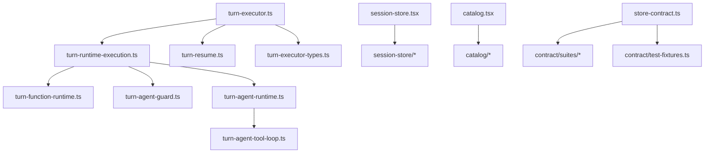

# Long File Restructure

## Goal

Reduce maintenance pressure in the largest Covel source files by moving cohesive logic into local modules while preserving public imports, runtime behavior, and test contract entrypoints.

## Scope

Refactored in this pass:

- `packages/runtime/src/turn-executor.ts`
- `apps/web/src/stores/session-store.tsx`
- `apps/web/src/lib/catalog.tsx`
- `packages/store/src/contract/store-contract.ts`
- `apps/web/src/services/api.ts`
- `packages/runtime/src/session-kernel.ts`
- `apps/server/src/world-data/session-import.ts`

## Assumptions

- Public entrypoints remain stable: `@/stores/session-store.js`, `@/lib/catalog.js`, `runStoreContractTests`, `executeTurn`, and `resumeSuspendedRuntime`.
- File moves are behavior-preserving unless noted below.
- Framework code continues to discover plugin-owned UI/data by manifest and UI specs instead of hardcoding plugin IDs.

## Changes

### Runtime

- Kept `turn-executor.ts` as the turn orchestration entrypoint.
- Moved exported executor types and recursion error into `turn-executor-types.ts`.
- Moved suspended-runtime resume flow into `turn-resume.ts`.
- Moved single-runtime dispatch into `turn-runtime-execution.ts`.
- Split runtime execution modes into:
  - `turn-function-runtime.ts`
  - `turn-agent-guard.ts`
  - `turn-agent-runtime.ts`
  - `turn-agent-tool-loop.ts`

### Web Session Store

- Kept `session-store.tsx` as the public hook/store entrypoint.
- Moved state types, reducer, state extraction, SSE handling, persistent subscription, boot flow, game start, restore, and plugin-data hydration into `apps/web/src/stores/session-store/`.
- Replaced production hardcoded plugin-data hydration with UI-spec `dataSource.namespace` discovery.

### Catalog

- Kept `catalog.tsx` as the registry assembly point.
- Split renderers into catalog modules for core primitives, character, interactive UI, message forms, media, branch replies, and session helpers.
- Preserved `covelRegistry`, `resolveI18n`, `resolveIcon`, and `useI18nResolver` imports.

### Store Contract

- Kept `store-contract.ts` as the public suite registration entrypoint.
- Moved shared fixtures to `test-fixtures.ts`.
- Split contract suites into core, plugin-data, runtime-record, persistence, and integrity modules.

### Web API Service

- Kept `api.ts` as the public compatibility entrypoint.
- Split endpoint families into `apps/web/src/services/api/`: request helpers, types, worlds, sessions, packages, LLM/model settings, actions, plugin data, lorebook, plugin RPC, approvals, traces, health, overlay, and utility exports.
- Verified the actual `api.ts` export surface still has the same 151 module exports after the split.

### Runtime Session Kernel

- Kept `session-kernel.ts` as the public runtime output-processing facade.
- Split output normalization, runtime result processing, asset output checks, commit pipeline, commit handlers, commit event emission, kernel store typing, trace recording, and proposal helpers into adjacent `session-*` modules.

### Server World Data Import

- Kept `session-import.ts` as the public import/preflight/sync orchestration entrypoint.
- Split public types, world manifest/root utilities, write identity, preflight/schema validation, import planning, ledger/hash/conflict/delete logic, media materialization/finalization/cleanup, and store write helpers into `apps/server/src/world-data/session-import/`.

## Current Size Snapshot

- `packages/runtime/src/turn-executor.ts`: 1132 lines
- `packages/runtime/src/turn-runtime-execution.ts`: 316 lines
- `packages/runtime/src/turn-agent-runtime.ts`: 618 lines
- `packages/runtime/src/turn-agent-tool-loop.ts`: 699 lines
- `apps/web/src/stores/session-store.tsx`: 918 lines
- `apps/web/src/lib/catalog.tsx`: 151 lines
- `packages/store/src/contract/store-contract.ts`: 48 lines
- `apps/web/src/services/api.ts`: 47 lines
- `packages/runtime/src/session-kernel.ts`: 14 lines
- `apps/server/src/world-data/session-import.ts`: 459 lines

## Remaining Priority Queue

Future passes should focus on large maintenance files that are production code, have clear internal feature boundaries, and can be validated through package-level tests.

| Priority |                                                                                                                       File |     Lines | Refactor boundary                                               | Validation focus                                     |
| -------- | -------------------------------------------------------------------------------------------------------------------------: | --------: | --------------------------------------------------------------- | ---------------------------------------------------- |
| 1        |                                                                                            `apps/web/src/routes/debug.tsx` |      1906 | route shell plus debug panels/actions                           | Web lint and debug-route smoke tests where available |
| 2        |                                                                  `apps/web/src/components/session/session-prep-screen.tsx` |      1597 | world/plugin/preset selection panels and action helpers         | Session-prep component tests, web lint               |
| 3        | `packages/store/src/sqlite/sqlite-store.ts` / `postgres/pg-store.ts` / `memory/memory-store.ts` / `indexeddb/idb-store.ts` | 1090-1596 | shared backend helper extraction after contract coverage review | Store contract tests across backends                 |
| 4        |                                                                                                 `apps/desktop/src/main.ts` |      1492 | desktop app bootstrap, config, window, sidecar, IPC helpers     | Desktop lint/build smoke                             |
| 5        |                                                                                        `packages/store/src/media-store.ts` |      1248 | media metadata, refs, cleanup, filesystem helpers               | Media store tests and server media API tests         |

## Validation Run

- `timeout 120s mise exec -- pnpm --filter @covel/runtime lint`
- `timeout 120s mise exec -- pnpm --dir packages/runtime exec vitest run tests/turn-executor-events.test.ts`
- `timeout 180s mise exec -- pnpm --dir packages/runtime exec vitest run tests/turn-executor-suspend.test.ts tests/turn-executor.test.ts tests/turn-executor-recursive-call.test.ts tests/turn-executor-manual-trigger.test.ts`
- `timeout 180s mise exec -- pnpm --filter @covel/runtime test`
- `timeout 180s mise exec -- pnpm lint`
- `timeout 240s mise exec -- pnpm test`
- `timeout 120s mise exec -- pnpm exec prettier --check ...`
- `git diff --check`
- Second pass validation:
  - `timeout 120s mise exec -- pnpm --filter @covel/web lint`
  - `timeout 120s mise exec -- pnpm --filter @covel/runtime lint`
  - `timeout 120s mise exec -- pnpm --filter @covel/server lint`
  - `timeout 180s mise exec -- pnpm --filter @covel/web exec vitest run src/services/__tests__/api-session-plugins.test.ts src/services/__tests__/api-worlds-approvals.test.ts`
  - `timeout 180s mise exec -- pnpm --filter @covel/runtime exec vitest run tests/session-kernel.test.ts tests/session-kernel-txn.test.ts tests/hook-wire-session-kernel.test.ts tests/working-memory-commit.test.ts tests/proposal-source-invariant.test.ts tests/tool-executor-core-plugin-commit.test.ts tests/core-plugin-npc-graph-inject.test.ts`
  - `timeout 180s mise exec -- pnpm --filter @covel/server exec vitest run tests/lib/world-data-session-import.test.ts tests/lib/world-data-loader.test.ts`
  - `timeout 240s mise exec -- pnpm --filter @covel/web test`
  - `timeout 240s mise exec -- pnpm --filter @covel/runtime test`
  - `timeout 240s mise exec -- pnpm --filter @covel/server test`
  - `timeout 240s mise exec -- pnpm lint`
  - `timeout 360s mise exec -- pnpm test`
- Earlier in this pass, after web/store extraction:
  - `timeout 120s mise exec -- pnpm --filter @covel/web lint`
  - `timeout 120s mise exec -- pnpm --dir apps/web exec vitest run src/lib/__tests__/filter-container.test.tsx src/lib/__tests__/entry-card.test.tsx src/lib/__tests__/branch-reply-candidates.test.tsx src/stores/__tests__/session-store-game-state.test.ts src/stores/__tests__/session-store-assets.test.ts src/stores/__tests__/session-store-suspensions.test.ts src/stores/__tests__/plugin-data-store.test.ts`
  - `timeout 120s mise exec -- pnpm --filter @covel/store lint`
  - `timeout 180s mise exec -- pnpm --filter @covel/store test`

## Risks

- `turn-agent-tool-loop.ts` remains intentionally dense because LLM response handling, tool execution, suspend capture, and runtime-done semantics share mutable loop state.
- `session-store.tsx` still coordinates many side effects from the public Zustand store; future reductions should split store action factories only after broader UI flow tests are in place.

## Rollback

Each extracted module has one original owner. Rollback can inline the module contents into the owner file, restore imports, and rerun the same targeted lint/test commands.

## Module Map

