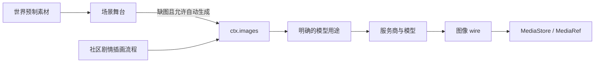

# 图像生成

世界素材、插件流程、模型用途和图像协议各有独立职责。安装生图插件不会配置模型，也不会让场景补图自动使用该插件的设置。

| 部分          | 职责                                     | 选择入口                                                                                            |
| ------------- | ---------------------------------------- | --------------------------------------------------------------------------------------------------- |
| 世界包        | 提供预制背景、角色图和画风描述           | `worldData` 中的 `stage.scene-assets@1`、`stage.scenes@1`、`character.portrait-assets@1` 等数据契约 |
| `scene-stage` | 使用已有背景，按设置为缺失场景补图       | 插件设置 `autoGenerateScenes`、`modelPresetId`，默认用途 `image`                                    |
| 社区插画插件  | 从剧情生成提示词，提供手动生成入口和画廊 | 会话启用插件，选择其 `modelPresetId`；主仓不内置这些业务流程                                        |
| 模型用途      | 把任务需要的角色绑定到服务商与模型       | 设置中的用途分配，或当前生效的 `llm.toml`                                                           |
| 图像 wire     | 编码请求、解析图片响应、处理供应商协议   | 模型用途的 `providerRequestMetadata.imageWire`                                                      |
| `ctx.images`  | 解析模型、调用 wire、去重并保存媒体      | function runtime 调用 `ctx.images.generate()`                                                       |

## 加载与激活

世界包的 `pluginPolicy` 表达推荐与排除意图；插件声明的契约和会话授权决定最终激活集。舞台叙事依赖 `scene-stage@1`，不依赖“安装某个生图插件”。预制素材通过活动插件公开的数据契约导入，未配置生成模型也能展示已有图片。`character-presence` 保存、投影角色媒体，不承担生图任务。

社区插件可以安装在 `~/.covel/plugins`，开发时也可以链接源码目录。安装、允许执行服务端代码、在会话中启用是三个不同步骤。`media.image-flow@1` 只声明手动插画的入口 runtime 和资产 runtime；它是单提供者扩展点，同一会话只能选择一个此类插画流程。它不选择场景背景模型，也不注册图像协议。

需要自定义协议的插件在 entry 中调用 `covel.registerWires`，注册名为 `<pluginId>/<wireId>`。该插件的代码必须经过授权并完成 entry 注册。模型配置引用不存在的 wire 时明确失败，不自动换成另一协议。内核仍提供通用的 `openai-images` 和 `dashscope-wan`，社区插画流程可以直接复用。详见[媒体存储](media-store.md)。

## 模型选择

`modelPresetId` 保存用途名称，不保存模型 ID、地址或密钥。默认使用 `image`；需要分开配置场景背景和剧情插画时，创建两个具名用途，再分别选择。function runtime 的这个设置与 agent 的 `runtimeModelOverrides` 独立。

图片调用按名称精确解析角色或 preset，并验证 image 输出能力。省略名称时，`ctx.images.generate()` 和 `ctx.gateway.resolveSlot({ fallbackTag: "image" })` 都解析 `image`。没有配置、名称拼错或绑定到文本模型时，在网络请求前返回 `CONFIG_ERROR`，不会选择第一个其它图片用途。浏览器提交的用途绑定与模型能力限制仍然生效。

`tag = "image"` 表示用途能力；`imageWire` 选择传输协议，两者不能互相代替。插件名称和模型名称不会自动选择协议。OpenAI 兼容图像接口使用 `openai-images`，DashScope 原生接口使用 `dashscope-wan`；配置示例见仓库 `llm.toml.example` 的 image generation 部分。

### 配置文件来源

- 显式 `COVEL_LLM_TOML` 优先。
- 源码开发优先使用仓库根目录的 `llm.toml`，没有该文件时才使用用户目录配置。
- 桌面端由桌面宿主指定用户配置路径，通常是 `~/.covel/llm.toml`。
- 设置页的本地用途绑定随请求覆盖文件配置，不回写 TOML。

因此，家目录里有图像用途，不代表开发服务正在读取它。修改正确的文件后，在模型设置里重新加载 TOML；检查实际生效的服务商和模型。完整解析规则见[模型用途](slots.md)。

## 可选能力与跳过

世界包包含图片用途，并不要求玩家提供图像模型。`ctx.images.isAvailable(presetId)` 只检查当前用途能否解析为图像模型，不请求服务商，也不重试。`scene-stage` 先使用预制或已生成背景；需要补图但未配置模型时保留无背景状态，不写 pending，不发生成事件。已排队的补图任务执行前也会检查，配置被撤销时返回 skipped。后续补好配置，再次处理场景事件即可生成。

社区插画流程在写入 pending 画廊记录和发起图像调用前做同样的检查，缺能力时返回 skipped。已排队的任务可能仍会有一条跳过记录，但不会产生失败图片或自动重试。function 主动返回 `outcome: "skipped"` 且提交成功时，后台任务以 `done` 结束，runtime 记录保留 `skipped`；依赖门控、实际执行错误和提交失败仍是失败。该检查不验证 API Key、余额或远端模型可用性；发出生成请求后的网络、授权或供应商错误仍按实际失败处理。直接调用低层生成接口时，配置错误仍以 `CONFIG_ERROR` 返回。

## 缓存与失败处理

DashScope 异步任务的轮询期限覆盖等待间隔、HTTP 请求和响应读取。到期会中止当前轮询，不接受迟到的成功结果；调用方取消同样传递到轮询请求。遇到可重试的 HTTP 错误时，先取消未使用的响应体再继续，避免长时间重试占用连接。同步图像端点仍使用调用方的执行期限。

图像去重包含实际解析的服务商、模型、端点、协议、wire 配置和生成参数。切换同一用途的模型或 wire 后，同一提示词会重新生成；密钥与认证头不进入缓存身份。已有媒体和插件已保存的场景索引仍保留，换模型不会自动重画已完成的场景。

低层 `ctx.gateway.generateImage()` 返回必填的 `target`，记录实际派发时的模型身份。`ctx.images` 使用它保存缓存键，避免配置在异步查缓存期间切换而把结果写到另一模型名下。实现或模拟 `PluginRuntimeGateway` 时必须提供该字段；模拟 `ImagesContext` 时也必须提供 `isAvailable()`。

未配置图像模型时，跳过生成不影响已有素材和剧情。开启场景自动补图且已配置模型时会调用图像 API；只使用世界预制图时可关闭 `autoGenerateScenes`。社区插画插件只为其自己的流程和画廊负责。

当前契约取消了图片用途的隐式同 tag 回退。原先依赖拼错名称也能工作的配置，应改成实际用途名称。图像缓存身份变更后，下一次生成可能不命中旧缓存；不会迁移或删除旧媒体。

共享 image-generation handler 的首张结果沿用预写 pending 记录的 `imageId`，后续图片使用 `<imageId>-2`、`<imageId>-3` 等键。提交批量 effects 后，基础记录被首张 done 结果替换，不留下永久 pending 卡片；实际返回图片数决定记录数。
