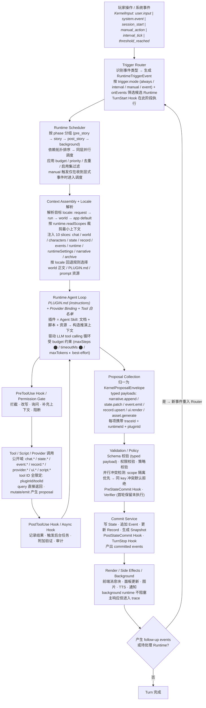
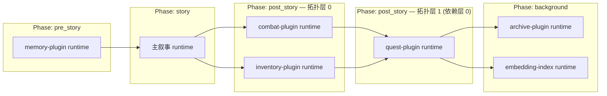

# 运行时执行链流程图

时间：2026-03-30
状态：草案
关联：framework-architecture.md §9

## 核心执行链



## 并行拓扑调度示意



## 插件 = Agent Skill 的结构映射

```text
plugin/
  plugin.json          ← manifest: 能力声明 + 元数据 + i18n
  PLUGIN.md            ← instructions: runtime 的推演规则文档（= agent skill prompt）
  schemas/             ← 输入输出 schema
  server/              ← runtime / tool / hook 实现
  client/              ← UI slot 扩展
  scripts/             ← 确定性脚本（dice roll、公式计算等）
  references/          ← 规则资料（RAG 源、world lore 补充）
```

插件作为 "Agent Skill" 的核心思路：

- **PLUGIN.md** 是 runtime 的核心指令文档，等价于 agent 的 system prompt + skill description
- **scripts/** 提供确定性计算能力，避免让 LLM 做数学
- **references/** 提供检索资料，在 context assembly 阶段按需注入
- **schemas/** 提供输入输出约束，让 validation 层有据可依
- runtime 通过 provider binding 调用 LLM，通过 tool 白名单控制能力面

## 全链路追踪字段

每个阶段都携带以下追踪字段，确保可观测性：

```
traceId → runId → branchId → turnId → runtimeId → pluginId
```
