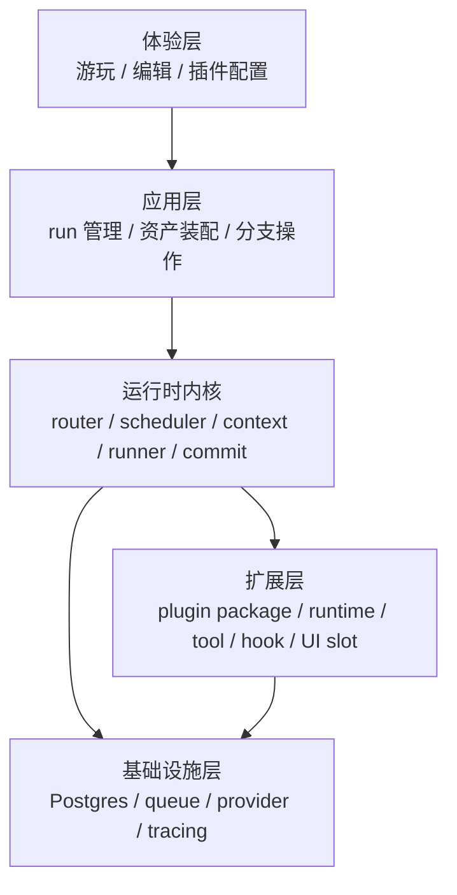
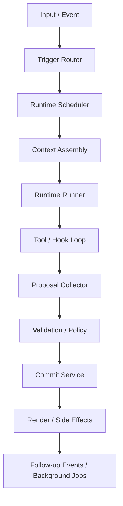

# AI RPG 插件式框架架构

时间：2026-03-29  
状态：草案  
类型：系统架构主文档

## 1. 目的

定义当前项目首轮实现的系统架构，明确：

- 系统边界
- 核心对象
- 运行时执行模型
- 插件扩展模型
- 数据与持久化模型
- 首轮必须固定的架构约束

本文件是单一主文档。  
理解当前框架，不应依赖其他架构材料。

## 2. 范围

### 2.1 纳入范围

- 玩家游玩闭环
- 世界观、角色卡、插件三类内容资产
- 插件式 runtime / tool / hook 扩展机制
- 状态、事件、记录、快照、分支模型
- 首轮部署形态与模块边界

### 2.2 不纳入范围

- 商业平台运营流程
- 多组织后台
- 插件市场审核机制
- 微服务部署方案
- 详细数据库字段设计
- Prompt 草案与作者教程

## 3. 架构驱动

系统架构必须同时满足以下驱动：

### D1. 插件承载主要玩法逻辑

核心玩法不应持续堆叠到内核中。  
内核负责原语和编排，玩法通过插件接入。

### D2. 世界状态必须长期演化

系统不能只依赖聊天历史。  
必须具备结构化状态、事件、记录、快照和分支能力。

### D3. 内容资产必须独立存在

世界观、角色卡、插件必须可导入、导出、组合和复用。  
资产格式不能绑定某个未来平台服务。

### D4. 扩展边界必须稳定

插件一旦形成生态，Public Plugin API 的不稳定会直接导致高昂重构成本。  
因此首轮必须提前固定扩展边界。

### D5. 首轮必须可实现

架构必须服务当前项目，而不是为了未来假设场景提前做重型设计。

### D6. 多语言必须是显式系统能力

`i18n` 不能只停留在 UI 文案层。  
world、plugin metadata、runtime context、AI 输出和 UI 扩展都需要明确的 locale 边界。

## 4. 核心架构决策

### A1. 系统形态采用模块化单体

首轮采用模块化单体，不采用微服务。

原因：

- 当前复杂度在执行链与扩展边界，不在服务拆分
- 单体更适合快速迭代、调试和统一追踪
- 后续若需要拆分，可沿模块边界演进

### A2. 插件是分发单位，不是执行原语

系统的一等执行原语固定为：

- `Runtime`
- `Tool`
- `Hook`
- `Context`
- `Proposal`

`Plugin Package` 仅负责：

- 打包
- 安装
- 版本管理
- 能力声明
- UI 与资源组织

### A3. 所有写操作统一经过提交链

任何会改变系统事实的动作都必须经过：

`proposal -> validate -> commit`

禁止插件直接写数据库、直接修改全局状态、直接绕过审计链提交。

### A4. 资产格式本地优先

以下资产必须具备稳定的本地格式：

- `World Package`
- `Character Pack`
- `Plugin Package`

后续平台托管只能建立在这三类本地资产格式之上。

### A5. Provider 统一接入

LLM、图片、TTS、脚本宿主不得在业务模块中分散接入。  
所有外部执行能力统一通过 provider binding 接入。

### A6. Locale 作为显式上下文进入执行链

系统不得通过猜测决定当前输出语言。  
locale 必须作为显式字段进入输入、run 设置、runtime context 和 UI 渲染。  
系统默认语言固定为 `zh-CN`，最低支持语言集合固定为 `zh-CN` 和 `en-US`。

补充约束：

- 前端页面必须支持多语言
- 前端当前选择的语言是本轮上下文构建的首选语言
- 插件、world 文档和 prompt 组装都必须同步该语言选择
- 若缺失对应语言内容，则先回退到设置中的默认语言

### A7. Runtime 是完整的独立 LLM 运行时单元

`Runtime` 的定义固定为一个完整的 LLM 运行时单元，至少包含：

- provider binding
- context assembly contract
- tool whitelist
- hook set
- budget / failure policy

它必须可以被单独调用，而不是只能附着在某个主回合流程里被动执行。

### A8. 主叙事后触发是默认 profile，不是唯一时机

首轮默认 gameplay profile 采用：

- 主叙事 runtime 先执行
- 其他 gameplay 插件 runtime 默认在其后执行

但插件也可以在其他时机执行，例如：

- `pre_story`
- `background`
- 手动按钮触发
- 显式事件触发

### A9. 插件默认并行，依赖先做拓扑排序

同一阶段内的插件 runtime 默认并行执行。  
若存在依赖，则必须先做依赖拓扑排序，再按拓扑层并行调度。

## 5. 系统上下文

系统中存在三类直接参与者：

- 玩家：游玩、分支、恢复、导入导出内容
- 内容作者：编写世界观、角色卡、配置插件组合
- 插件作者：提供 runtime、tool、hook、UI 扩展

系统中存在五层核心结构：



## 6. 分层职责

### 6.1 体验层

负责：

- 玩家游玩界面
- 世界观与角色卡编辑
- 插件启停与配置
- 分支、快照、恢复入口
- 前端语言切换与多语言 UI 渲染

不负责：

- 执行玩法规则
- 直接改写内核状态

### 6.2 应用层

负责：

- 创建和管理 `Run`
- 装配世界观、角色卡与插件
- 处理 fork / restore 等系统操作
- 触发 turn 执行

不负责：

- 具体 runtime 推演
- 插件内部规则判断

### 6.3 运行时内核

负责：

- 路由输入和事件
- 调度 runtime
- 组装 context
- 执行 tool / hook 链
- 收集 proposal
- 校验并提交
- 生成渲染结果和后续事件

不负责：

- 具体玩法规则
- 具体 world 内容
- 前端页面实现细节

### 6.4 扩展层

负责：

- 承载主要玩法逻辑
- 扩展系统能力
- 在标准 slot 内扩展 UI

不负责：

- 绕过系统边界直接访问内部实现

### 6.5 基础设施层

负责：

- 关系型存储
- 队列
- Provider 接入
- Trace / Log / Audit

不直接暴露给插件。

## 7. 核心领域模型

### 7.1 内容资产

- `World Package`
  世界观内容包。包含世界描述、角色字段契约、插件依赖声明。
- `Character Pack`
  角色卡集合。包含初始角色数据与附属资源。
- `Plugin Package`
  插件内容包。包含 manifest、运行时说明、服务端与客户端扩展代码。

### 7.2 执行对象

- `Run`
  长期游玩会话根对象。
- `Branch`
  世界线分支。
- `Snapshot`
  可恢复状态点。
- `Turn`
  单次输入驱动的执行轮次。
- `Runtime`
  单一职责的推演单元。
- `Proposal`
  尚未提交的结构化变更提案。

### 7.3 数据对象

- `State`
  当前成立的结构化事实。
- `Event`
  追加写入的业务事件。
- `Record`
  可检索的长期知识与关系。

## 8. 内容资产架构

### 8.1 World Package

世界观采用 `Markdown + YAML frontmatter` 作为主格式。

最小字段：

- `schemaVersion`
- `id`
- `name`
- `version`
- `summary`
- `defaultLocale`
- `supportedLocales`
- `characterSchema`
- `requiredPlugins`
- `recommendedPlugins`
- `contentVariants`

约束：

- world 是内容资产，不是运行期状态
- world 可以声明必需和推荐插件
- world 必须能独立导入导出
- world 应声明默认语言与支持语言集合
- world 正文首轮允许只维护一份默认语言内容，但元数据必须支持扩展为多语言
- world package 至少必须提供一个 Markdown 正文版本
- 作者可以选择是否提供额外语言版本，不强制要求为每种支持语言都维护独立正文
- 请求了缺失正文的 locale 时，系统回退到默认语言正文
- `supportedLocales` 表示 package 级 locale 支持与协商范围
- 实际提供的 Markdown 正文版本由 `contentVariants` 表达

内容选择规则：

1. 前端当前选择的语言
2. 设置中的默认语言
3. world package 默认语言正文

推荐形式：

- `contentVariants[0]` 对应默认语言 Markdown 正文
- 其余 `contentVariants` 为可选翻译版本

### 8.2 Character Pack

角色卡必须同时支持：

- 初始定义
- 动态成长
- 历史回溯

约束：

- 角色卡字段受 world 绑定 schema 约束
- 角色卡不是只读资料页
- 角色卡应支持长期演化
- 角色卡的结构化字段应尽量保持语言无关
- 角色卡的展示性文本允许按 locale 做本地化扩展

### 8.3 Plugin Package

推荐目录：

```text
plugin/
  plugin.json
  PLUGIN.md
  schemas/
  server/
  client/
  scripts/
  references/
```

职责：

- `plugin.json`：元数据、入口、兼容与权限声明
- `PLUGIN.md`：运行时规则与说明
- `server/`：runtime / tool / hook
- `client/`：UI 扩展
- `scripts/`：确定性脚本
- `references/`：规则资料

插件包中的以下内容必须支持多语言：

- `displayName`
- `description`
- 设置面板文案
- UI 扩展展示文本

插件 prompt / 说明上下文选择规则：

1. 前端当前选择的语言版本
2. 设置中的默认语言版本
3. 插件默认语言版本

## 9. 运行时执行模型

系统级执行链固定如下：



### 9.1 Trigger Router

输入：用户输入或系统事件。  
输出：候选 runtime 列表。

职责：

- 识别事件类型
- 根据 trigger 规则筛选候选 runtime

### 9.2 Runtime Scheduler

职责：

- 按 phase、order、priority、budget 调度 runtime
- 避免重复执行
- 区分同步链与后台链

首轮 phase：

- `pre_story`
- `story`
- `post_story`
- `background`

默认 plugin timing：

- gameplay / mechanics plugins 默认进入 `post_story`
- image / TTS / asset plugins 默认采用手动触发，可在插件设置中切换为自动触发
- 其他插件可根据功能绑定到 `pre_story`、`background` 或显式事件时机

### 9.3 Context Assembly

职责：

- 按 runtime 需要组装最小上下文
- 根据 read scope 裁剪数据
- 控制 token 和 payload 规模
- 解析并注入当前 turn 的目标 locale

首轮 context slices：

- `chat`
- `world`
- `characters`
- `state`
- `record`
- `events`
- `runtime`
- `runtimeSettings`
- `narrative`
- `archive`

规则：

- locale 必须显式进入 runtime context，而不是依赖 prompt 猜测
- 默认 gameplay loop 中，插件阶段可以额外看到主叙事 runtime 的 narrative 输出和当前状态快照
- scheduler 需要先计算依赖拓扑层，再在层内并行调度
- runtime 的触发时间取决于 hook 和 trigger 条件，而不只取决于某次对话后
- prompt 组装必须同步前端当前选择的语言
- 若 world / plugin / prompt 资源缺失对应语言版本，则回退到设置中的默认语言

### 9.4 Runtime Runner

职责：

- 调用具体 runtime
- 绑定 instructions、provider、tools、hooks
- 驱动内部 tool calling 循环

首轮 runtime kind：

- `story`
- `plugin`
- `background`

### 9.5 Tool / Hook Loop

规则：

1. runtime 基于 context 决定动作
2. runtime 调用允许的 tool / script / provider
3. hook 在生命周期点介入
4. observation 回到 runtime
5. runtime 继续推演或输出 proposal

### 9.6 Proposal Collector

职责：

- 汇总 narrative、state、event、record、UI、副作用提案
- 为提交链提供统一输入格式

首轮 proposal kinds：

- `narrative.append`
- `state.patch`
- `event.emit`
- `record.upsert`
- `ui.render`
- `asset.generate`

### 9.7 Validation / Policy

职责：

- schema 校验
- 权限校验
- 策略校验
- 冲突与幂等检查

### 9.8 Commit Service

职责：

- 写入 `State`
- 追加 `Event`
- 更新 `Record`
- 生成 `Snapshot`
- 产出 follow-up events

### 9.9 默认 gameplay loop

首轮默认 gameplay loop 应采用如下编排剖面：

1. 应用层构建本轮 turn 输入
2. kernel 组装主叙事 runtime 的最小上下文
3. 主模型仅生成 narrative，不直接承担结构化机制输出
4. narrative 完成后，调度默认位于 `post_story` 的插件 runtime
5. 插件阶段读取 narrative、状态快照和启用配置，产出 proposal
6. 统一走 `validate -> commit -> render`
7. turn 结束后，可选触发 memory、archive 和其他 background runtime

### 9.10 手动触发型插件

图片、TTS 等资产类插件首轮默认不应在每轮自动执行。

默认触发方式：

- 玩家点击某个按钮
- 应用层将动作转为显式触发事件
- kernel 只调度匹配该事件的 runtime

同时，这类插件可通过插件设置切换为自动触发或间隔触发。

### 9.11 非对话触发型插件

插件并不只在某次对话后执行。首轮应支持的触发类型至少包括：

- session 开始时
- 每隔一段时间或每几轮对话
- context 达到某个阈值
- 某个目标或条件达成时
- 手动按钮或显式动作事件

例如：

- memory 插件可在 context 超阈值时触发
- quest 插件可在条件满足后触发检查
- image / TTS 插件可由按钮触发，也可在设置中改为自动触发

## 10. 国际化架构

### 10.1 目标

国际化在本系统中承担三类职责：

- 决定玩家当前应看到什么语言
- 决定 runtime 和插件输出采用什么语言
- 决定资产元数据和展示文本如何按 locale 选择

### 10.2 默认策略

首轮默认语言与最低支持语言集合固定为：

- 应用默认语言：`zh-CN`
- 最低支持语言集合：`zh-CN`、`en-US`
- 不满足该集合的实现不应视为符合首轮稳定架构
- 前端 UI 必须完整支持该最低语言集合

### 10.3 Locale 层级

系统至少存在四个 locale 层级：

- `app default locale`
- `asset default locale`
- `run locale`
- `request locale`

### 10.4 Locale 解析顺序

当前 turn 的目标 locale 应按以下顺序解析：

1. `request locale`
2. `run locale`
3. `world default locale`
4. `app default locale`

对当前产品而言，`request locale` 默认来自前端当前选择的语言。

### 10.5 Locale 回退顺序

对于 world 文档、插件文案和 prompt 资源的实际取值，回退顺序应为：

1. 前端当前选择的语言
2. 设置中的默认语言
3. 资产自身默认语言

### 10.6 资产层规则

资产层需要区分两类文本：

- 结构化事实字段
- 展示性文本

首轮推荐：

- plugin manifest 的 `displayName` 和 `description` 使用 `I18nText`
- world metadata 保留 `defaultLocale` 与 `supportedLocales`
- 框架内置 UI、核心插件 metadata、内核可见用户文案至少提供 `zh-CN` 与 `en-US`
- world 正文和 `PLUGIN.md` 首轮允许只维护默认语言版本，但必须明确 locale coverage，并在英文请求下提供显式 fallback
- prompt 资源应尽量按 locale 提供版本，缺失时按回退顺序选取

### 10.7 运行时规则

运行时必须遵守以下规则：

- `RuntimeContextView.locale` 是当前轮次的目标输出语言
- narrative、UI block、提示文案和工具返回的用户可见文本应默认遵循该 locale
- state、event、record 的结构化字段不因 locale 变化而改变 key
- 若生成内容暂时无法完全本地化，也必须保留明确的 fallback 行为
- front-end 选择语言变化后，后续 turn 的 prompt 上下文必须同步切换

### 10.8 插件规则

插件必须具备最小多语言能力：

- metadata 支持 `I18nText`
- `defaultLocale` 默认应为 `zh-CN`
- `supportedLocales` 至少包含 `zh-CN` 和 `en-US`
- runtime 输出应适配 `context.locale`
- UI 扩展不得把用户可见文本硬编码为不可替换字符串
- 不满足最低语言集合的插件不应被视为首轮稳定插件

### 10.9 持久化规则

首轮建议：

- `State` 以语言无关字段为主
- `Event` 可记录发生时的 `locale`
- `Record` 允许保存 canonical text 与 locale-aware summary

### 10.10 为什么 i18n 必须在首轮进入架构

如果首轮不把 locale 放进资产、context 和插件契约，后续补多语言会牵动：

- world 格式
- plugin manifest
- runtime context
- UI 扩展
- 数据回放与展示

## 11. Runtime 架构

每个 runtime 是独立可调度对象，而不是插件整体的隐式代码块。

最小字段：

- `id`
- `pluginId`
- `kind`
- `phase`
- `trigger`
- `instructions`
- `providerBinding`
- `tools`
- `hooks`
- `budget`
- `failurePolicy`
- `isolation`

架构含义：

- 一个插件可以包含多个 runtime
- 每个 runtime 拥有独立上下文、预算和权限面
- 调度粒度是 runtime，不是 plugin

首轮作者模型：

- runtime 是完整的独立运行时单元
- 一个插件通常提供一个主 runtime
- 后续可扩展为一个插件提供多个 runtime
- runtime 可以被单独调用，不必依附于主对话链路

Budget 说明：

- `maxSteps` 和 `timeoutMs` 为硬性限制
- `maxTokens` 为 best-effort 约束：runner 在每次 LLM 调用后累加 token 消耗，接近上限时截断循环，但不保证精确限制
- 首轮优先依赖 `maxSteps` 和 `timeoutMs`

### 11.1 主模型与辅助模型

首轮建议区分两类模型角色：

- `primary narrative model`
  用于主叙事 runtime
- `auxiliary plugin model`
  用于插件/机制 runtime

默认策略：

- 若未提供辅助模型配置，插件 runtime 回退到主模型
- 若提供辅助模型配置，插件 runtime 默认共享同一辅助模型
- 后续可扩展到 runtime 级 providerBinding 覆盖

建议优先级：

1. request overrides
2. run overrides
3. runtime providerBinding
4. project model preset
5. app default model

### 11.2 插件启用集解析

首轮启用集应按配置驱动合并，而不是手写条件分支。

推荐顺序：

1. required plugins
2. world required / recommended defaults
3. default enabled plugins
4. user explicit enable / disable
5. dependency auto-enable
6. supersede / conflict suppression

依赖调度规则：

- 依赖关系先在启用集解析阶段补全
- 调度阶段按依赖拓扑分层
- 同层 runtime 可并行执行

### 11.3 Runtime Settings 合并

插件运行时配置应作为一等输入进入 turn context。

推荐来源：

1. 字段默认值
2. project overrides
3. run overrides
4. request overrides

解析结果应同时提供：

- flat values
- by-plugin values
- schema fields

## 12. Tool 架构

tool 是插件影响系统的主能力面。

首轮稳定公开域：

- `chat.*`
- `state.*`
- `event.*`
- `record.*`
- `provider.*`
- `ui.*`
- `script.*`

首轮不公开：

- `db.*`
- `graph.*`
- `branch.*`
- `runtime.*`

原因：

- 公开出去的能力需要长期兼容
- 高风险能力应尽量留在内核内部

tool 约束：

- 必须有 schema
- 必须声明权限
- 只读查询优先直接返回
- 写操作优先产生 proposal，而不是直接提交

## 13. Hook 架构

hook 是控制面，不是普通回调。

首轮生命周期点：

- `TurnStart`
- `PreToolUse`
- `PostToolUse`
- `PreStateCommit`
- `PostStateCommit`
- `TurnStop`

hook 职责：

- 守卫
- 改写
- 审计
- 阻断

hook 不承担主要推演逻辑。

hook 排序规则：

同一生命周期点存在多个 hook 时，执行顺序按以下优先级确定：

1. 依赖拓扑层：被依赖的插件的 hook 先执行
2. `plugin.loadingOrder`：拓扑层相同时按 loadingOrder 排序
3. hook 注册顺序：loadingOrder 也相同时，按 manifest 中 hooks 数组的声明顺序

守卫型 hook（effect = `deny`）一旦触发立即终止链路，不执行后续 hook。

## 14. UI 扩展架构

插件 UI 扩展仅允许通过标准 slot 注入。

首轮 slot：

- `settings_panel`
- `message_block`
- `world_panel`
- `action_panel`

约束：

- 插件不得侵入页面骨架
- UI 扩展不改变内核主执行链
- UI 扩展仅作为体验层补充能力
- UI 扩展应通过 locale-aware 文本源输出用户可见文本

## 15. Public Plugin API

插件只能依赖公开契约。

公开面：

- manifest contract
- runtime spec contract
- runtime context view
- tool registration contract
- hook registration contract
- UI slot contract
- provider binding contract
- proposal output contract

不公开：

- 数据库表名
- ORM 细节
- 内核内部排序策略
- 前端私有组件树
- 任意内部 helper

Public Plugin API 是未来最重要的稳定边界之一。  
其中 i18n 字段和 locale 传播规则同样属于稳定契约。

运行时配置声明与解析规则同样属于稳定公开面的一部分。

## 16. 权限与隔离

首轮最低隔离要求：

- runtime 工具白名单
- context read scope 限制
- 所有写操作经过提交链
- 脚本执行进入 trace
- 高风险能力必须显式权限声明

首轮不要求：

- 极复杂多层沙箱
- 完整平台级安全治理体系

但必须预留挂点，避免未来补安全时重写主链。

## 17. 状态与持久化架构

运行期核心对象固定为：

- `Run`
- `Branch`
- `Snapshot`
- `State`
- `Event`
- `Record`

职责边界：

- `State`：当前事实
- `Event`：历史动作
- `Record`：长期知识
- `Snapshot`：恢复点

禁止把这些对象混成单一大 JSON 状态仓。

## 18. 提交模型

统一提交链：

`proposal -> validate -> commit`

首轮规则：

- 查询类操作直接返回
- 状态变更使用 `state.patch`
- 业务动作使用 `event.emit`
- 长期知识更新使用 `record.upsert`
- 长任务进入异步链

并行冲突策略：

- 每个插件的 `state.patch` 应声明不同的 scope 前缀，scope 不同的 patch 无冲突
- 同 scope 同 key 冲突时，首轮默认拒绝后提交的 proposal 并记录 trace
- 不同拓扑层的冲突，低层（先执行）优先
- 首轮不做自动合并，后续可扩展为 merge function 或 OT 策略

这条模型是审计、回放、差异比较和兼容迁移的基础。

## 19. 分支与恢复架构

`fork / restore` 是底层能力，不是外围功能。

首轮最小要求：

- 边界基于 `run / branch / snapshot`
- 支持整条世界线 fork
- restore 保留审计记录
- 分支间上下文隔离清晰

首轮不做：

- 对象级历史编辑器
- 局部状态回滚 UI

### 19.1 Run / Session 管理

首轮玩家可见的“会话切换”应映射为 `Run` 切换。  
一个项目可以拥有多个 run，每个 run 有自己的：

- turn 历史
- 插件启用集
- 当前 branch
- runtime settings 覆盖
- 归档与恢复记录

### 19.2 存档版本与恢复模式

首轮建议同时支持两类恢复模式：

- `hard restore`
  覆盖当前 branch 到某个 snapshot
- `fork restore`
  从某个 snapshot 派生新 branch

默认推荐 `fork restore`，因为它更适合叙事探索和回滚安全。

### 19.3 归档摘要

除结构化 snapshot 外，首轮还应支持可选的归档摘要能力，用于：

- 长会话回顾
- 自动压缩前的摘要抓取
- restore 列表的人类可读标题与摘要

归档摘要不替代 snapshot，只是 snapshot 的可读视图。

## 20. 持久化底座

首轮建议：

- `PostgreSQL`
- `Drizzle ORM`
- `pg-boss`

建议固定的持久化对象边界：

- `runs`
- `run_plugins`
- `characters`
- `branches`
- `snapshots`
- `state_entries`
- `state_patch_commits`
- `events`
- `records`
- `record_edges`

说明：

- 关系模型承载主对象与版本边界
- JSONB 仅用于扩展 payload，不替代核心建模
- 队列仅承担明确异步任务

## 21. 检索架构

系统检索重点不是通用问答，而是：

- 世界事实检索
- 关系扩展
- 长期上下文回忆

首轮优先：

- 关系表
- 全文检索
- 摘要缓存

后续增强：

- `pgvector`
- `pg_trgm`

原则：先保证检索结果可控、可解释。

## 22. 后台任务架构

异步链只处理明显不应阻塞主 turn 的工作：

- 图片生成
- TTS
- embedding / record 索引更新
- 清理和整理任务

主 turn 保持同步可理解。  
不要把主执行链拆成一组难以追踪的队列任务。

## 23. Provider 架构

外部能力统一通过 provider binding 接入。

包含：

- LLM
- 图片生成
- TTS
- 脚本宿主

固定边界：

- runtime 通过 binding 声明 provider
- provider 调用进入 trace
- provider 结果通过 runtime / proposal / side effect 回流系统

## 24. 可观测性与审计架构

核心对象和执行链必须保留以下追踪字段：

- `traceId`
- `runId`
- `branchId`
- `turnId`
- `runtimeId`
- `pluginId`

首轮至少追踪：

- runtime 调度
- tool 调用
- hook 决策
- provider 请求
- DB 提交

这不是未来平台需求，而是当前开发期可调试性的基本要求。

## 25. 首轮部署架构

首轮推荐部署形态：

- 一个 Web 客户端
- 一个 API / Kernel 进程
- 一个异步 Worker
- 一个 PostgreSQL

当前不建议拆分：

- 独立调度服务
- 独立插件服务
- 独立检索服务
- 独立资产服务

## 26. 首轮代码模块边界

建议模块结构：

```text
app/
  web/
  api/
kernel/
  router/
  scheduler/
  context/
  runner/
  tools/
  hooks/
  proposals/
  validation/
  commit/
  render/
domain/
  world/
  character/
  run/
  branch/
  snapshot/
  state/
  event/
  record/
plugins/
  loader/
  registry/
  permissions/
  ui/
providers/
  llm/
  image/
  tts/
infra/
  db/
  queue/
  tracing/
  storage/
```

目的：

- 为首轮实现提供清晰边界
- 为未来服务拆分提供自然演进路径

## 27. 首轮必须固定的架构不变量

以下内容在首轮必须固定，不应频繁变动：

1. `plugin` 是分发单位，不是执行原语。
2. `runtime / tool / hook / context / proposal` 是核心原语。
3. 所有写操作经过 `proposal -> validate -> commit`。
4. 插件只能依赖 Public Plugin API。
5. 资产格式独立于平台服务存在。
6. `Run / Branch / Snapshot / State / Event / Record` 口径固定。
7. provider 统一通过 binding 接入。
8. UI 扩展只能通过标准 slot 注入。
9. locale 必须作为显式上下文在资产、run、runtime、UI 之间传播。
10. runtime 是完整的独立 LLM 运行时单元，可被单独调用。
11. 主叙事后触发只是默认 profile，不是插件唯一时机。
12. 同阶段插件默认并行，但必须先满足依赖拓扑。

## 28. 首轮明确延期的能力

以下能力允许延期，不进入首轮核心架构：

- 微服务拆分
- 复杂平台治理
- 大量额外 runtime phase
- 过宽的工具域公开
- 复杂 UI slot 体系
- 重型工作流引擎
- 细粒度历史编辑器
- 完整多语言正文编辑工具链
- 大规模多 runtime 插件包作者模型
- 插件级生命周期钩子（onInstall / onEnable / onDisable / onUninstall）

## 29. 结论

当前项目最需要先稳定的不是平台功能，而是五个架构支点：

- 执行链
- 提交链
- 插件公共 API
- 资产格式
- 运行期核心对象

这五个支点稳定后，后续无论增加更复杂的分发、权限、托管或运营能力，通常都只是在现有架构外加层，而不是推翻内核。
