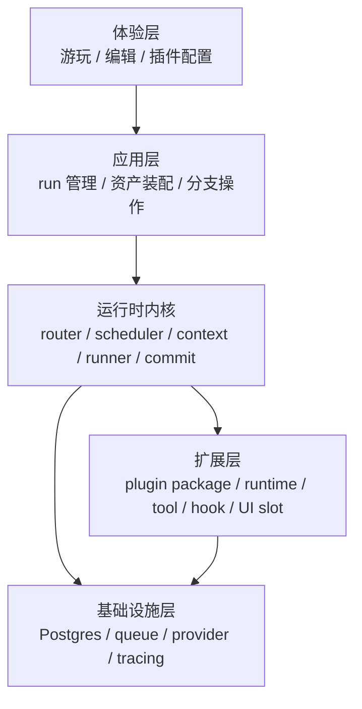
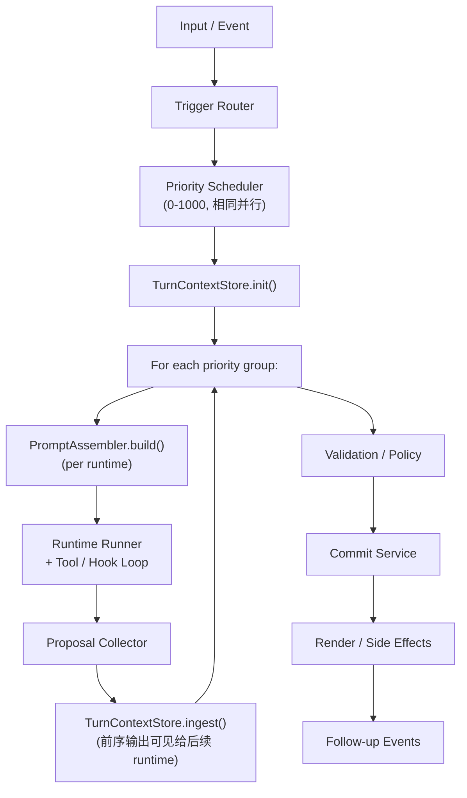

# AI RPG 插件式框架架构

时间：2026-03-29  
状态：草案  
类型：系统架构主文档

## 1. 目的

定义当前项目首轮实现的系统架构，明确：

- 系统边界
- 核心对象
- 运行时执行模型
- 插件扩展模型
- 数据与持久化模型
- 首轮必须固定的架构约束

本文件是单一主文档。  
理解当前框架，不应依赖其他架构材料。

## 2. 范围

### 2.1 纳入范围

- 玩家游玩闭环
- 世界观、角色卡、插件三类内容资产
- 插件式 runtime / tool / hook 扩展机制
- 状态、事件、记录、快照、分支模型
- 首轮部署形态与模块边界

### 2.2 不纳入范围

- 商业平台运营流程
- 多组织后台
- 插件市场审核机制
- 微服务部署方案
- 详细数据库字段设计
- Prompt 草案与作者教程

## 3. 架构驱动

系统架构必须同时满足以下驱动：

### D1. 插件承载主要玩法逻辑

核心玩法不应持续堆叠到内核中。  
内核负责原语和编排，玩法通过插件接入。

### D2. 世界状态必须长期演化

系统不能只依赖聊天历史。  
必须具备结构化状态、事件、记录、快照和分支能力。

### D3. 内容资产必须独立存在

世界观、角色卡、插件必须可导入、导出、组合和复用。  
资产格式不能绑定某个未来平台服务。

### D4. 扩展边界必须稳定

插件一旦形成生态，Public Plugin API 的不稳定会直接导致高昂重构成本。  
因此首轮必须提前固定扩展边界。

### D5. 首轮必须可实现

架构必须服务当前项目，而不是为了未来假设场景提前做重型设计。

### D6. 多语言必须是显式系统能力

`i18n` 不能只停留在 UI 文案层。  
world、plugin metadata、runtime context、AI 输出和 UI 扩展都需要明确的 locale 边界。

## 4. 核心架构决策

### A1. 系统形态采用模块化单体

首轮采用模块化单体，不采用微服务。

原因：

- 当前复杂度在执行链与扩展边界，不在服务拆分
- 单体更适合快速迭代、调试和统一追踪
- 后续若需要拆分，可沿模块边界演进

### A2. 插件是分发单位，不是执行原语

系统的一等执行原语固定为：

- `Runtime`
- `Tool`
- `Hook`
- `Context`
- `Proposal`

`Plugin Package` 仅负责：

- 打包
- 安装
- 版本管理
- 能力声明
- UI 与资源组织

### A3. 所有写操作统一经过提交链

任何会改变系统事实的动作都必须经过：

`proposal -> validate -> commit`

禁止插件直接写数据库、直接修改全局状态、直接绕过审计链提交。

### A4. 资产格式本地优先

以下资产必须具备稳定的本地格式：

- `World Package`
- `Character Pack`
- `Plugin Package`

后续平台托管只能建立在这三类本地资产格式之上。

### A5. Provider 统一接入

LLM、图片、TTS、脚本宿主不得在业务模块中分散接入。  
所有外部执行能力统一通过 provider binding 接入。

### A6. Locale 作为显式上下文进入执行链

系统不得通过猜测决定当前输出语言。  
locale 必须作为显式字段进入输入、run 设置、runtime context 和 UI 渲染。  
系统默认语言固定为 `zh-CN`，最低支持语言集合固定为 `zh-CN` 和 `en-US`。

补充约束：

- 前端页面必须支持多语言
- 前端当前选择的语言是本轮上下文构建的首选语言
- 插件、world 文档和 prompt 组装都必须同步该语言选择
- 若缺失对应语言内容，则先回退到设置中的默认语言

### A7. Runtime 是完整的独立 LLM 运行时单元

`Runtime` 的定义固定为一个完整的 LLM 运行时单元，至少包含：

- provider binding
- context assembly contract
- tool whitelist
- hook set
- budget / failure policy

它必须可以被单独调用，而不是只能附着在某个主回合流程里被动执行。

### A8. 统一优先级调度取代固定阶段

所有 runtime 通过 `priority`（0-1000）统一排序执行，取代原有的 `pre_story / story / post_story / background` 四阶段系统。

- 0 = 最高优先级 = 最先执行，1000 = 最低优先级
- 相同优先级的 runtime 并行执行
- 默认优先级 500
- 用户可在设置面板中调整 runtime 优先级

这使得执行顺序完全由优先级决定：主叙事 runtime（默认 400）先于一般插件（默认 500），但用户可自由调整。不再需要理解"阶段"概念。

### A9. 统一 Context 构建器管理所有提示词

系统中所有 prompt 组装、上下文分发、前序输出注入统一由 `@covel/context` 包管理。

- 硬编码 prompt 不应散落在各处，而应集中在 context 构建器中
- 每个 runtime 执行前，context 构建器根据其 readScopes 和当前累积上下文构建完整 prompt
- 前序 runtime 的输出（narrative 文本 + 全部 proposals）通过 context 构建器注入给后续 runtime
- 构建器早期可以简单（全量拼接），但接口设计必须支持未来的精细控制（按 scope 裁剪、token 预算、优先级排序等）

## 5. 系统上下文

系统中存在三类直接参与者：

- 玩家：游玩、分支、恢复、导入导出内容
- 内容作者：编写世界观、角色卡、配置插件组合
- 插件作者：提供 runtime、tool、hook、UI 扩展

系统中存在五层核心结构：



## 6. 分层职责

### 6.1 体验层

负责：

- 玩家游玩界面
- 世界观与角色卡编辑
- 插件启停与配置
- 分支、快照、恢复入口
- 前端语言切换与多语言 UI 渲染

不负责：

- 执行玩法规则
- 直接改写内核状态

### 6.2 应用层

负责：

- 创建和管理 `Run`
- 装配世界观、角色卡与插件
- 处理 fork / restore 等系统操作
- 触发 turn 执行

不负责：

- 具体 runtime 推演
- 插件内部规则判断

### 6.3 运行时内核

负责：

- 路由输入和事件
- 调度 runtime
- 组装 context
- 执行 tool / hook 链
- 收集 proposal
- 校验并提交
- 生成渲染结果和后续事件

不负责：

- 具体玩法规则
- 具体 world 内容
- 前端页面实现细节

### 6.4 扩展层

负责：

- 承载主要玩法逻辑
- 扩展系统能力
- 在标准 slot 内扩展 UI

不负责：

- 绕过系统边界直接访问内部实现

### 6.5 基础设施层

负责：

- 关系型存储
- 队列
- Provider 接入
- Trace / Log / Audit

不直接暴露给插件。

## 7. 核心领域模型

### 7.1 内容资产

- `World Package`
  世界观内容包。包含世界描述、角色字段契约、插件依赖声明。
- `Character Pack`
  角色卡集合。包含初始角色数据与附属资源。
- `Plugin Package`
  插件内容包。包含 manifest、运行时说明、服务端与客户端扩展代码。

### 7.2 执行对象

- `Run`
  长期游玩会话根对象。
- `Branch`
  世界线分支。
- `Snapshot`
  可恢复状态点。
- `Turn`
  单次输入驱动的执行轮次。
- `Runtime`
  单一职责的推演单元。
- `Proposal`
  尚未提交的结构化变更提案。

### 7.3 数据对象

- `State`
  当前成立的结构化事实。
- `Event`
  追加写入的业务事件。
- `Record`
  可检索的长期知识与关系。

## 8. 内容资产架构

### 8.1 World Package

世界观采用 `Markdown + YAML frontmatter` 作为主格式。

最小字段：

- `schemaVersion`
- `id`
- `name`
- `version`
- `summary`
- `defaultLocale`
- `supportedLocales`
- `characterSchema`
- `requiredPlugins`
- `recommendedPlugins`
- `contentVariants`

约束：

- world 是内容资产，不是运行期状态
- world 可以声明必需和推荐插件
- world 必须能独立导入导出
- world 应声明默认语言与支持语言集合
- world 正文首轮允许只维护一份默认语言内容，但元数据必须支持扩展为多语言
- world package 至少必须提供一个 Markdown 正文版本
- 作者可以选择是否提供额外语言版本，不强制要求为每种支持语言都维护独立正文
- 请求了缺失正文的 locale 时，系统回退到默认语言正文
- `supportedLocales` 表示 package 级 locale 支持与协商范围
- 实际提供的 Markdown 正文版本由 `contentVariants` 表达

内容选择规则：

1. 前端当前选择的语言
2. 设置中的默认语言
3. world package 默认语言正文

推荐形式：

- `contentVariants[0]` 对应默认语言 Markdown 正文
- 其余 `contentVariants` 为可选翻译版本

### 8.2 Character Pack

角色卡必须同时支持：

- 初始定义
- 动态成长
- 历史回溯

约束：

- 角色卡字段受 world 绑定 schema 约束
- 角色卡不是只读资料页
- 角色卡应支持长期演化
- 角色卡的结构化字段应尽量保持语言无关
- 角色卡的展示性文本允许按 locale 做本地化扩展

#### 8.2.1 角色卡数据模型

角色卡设计参考 SillyTavern Character Card V2/V3 规范，但核心区别在于：**角色卡不是静态模板，而是通过核心插件（core-char-tracker）动态维护的活数据**。

**基础字段（所有角色卡必须具备）：**

| 字段 | 类型 | 说明 |
|------|------|------|
| `id` | string | 唯一标识 |
| `worldId` | string | 所属世界 |
| `runId` | string | 所属 run |
| `name` | I18nText | 角色名 |
| `type` | enum | `player` / `npc` / `companion` |
| `description` | string | 角色描述（可由 LLM 动态生成） |
| `portrait` | string? | 头像资产引用 |
| `createdAt` | timestamp | 创建时间 |
| `version` | number | 版本号（每次 commit 递增） |

**动态字段（由 world schema + 插件共同定义）：**

- `fields: Record<string, unknown>` — 受 world `characterSchema` 约束
- 典型字段示例：`personality`、`background`、`stats`、`inventory`、`skills`、`relationships`
- 字段集合不固定，由世界观包声明，插件通过 `state.patch` 更新

**扩展字段（由插件命名空间管理）：**

- `extensions: Record<string, unknown>` — 按 pluginId 命名空间隔离
- 示例：`extensions["core-char-tracker"].mood`、`extensions["combat"].combatStats`
- 插件不得读写其他插件的 extension namespace

#### 8.2.2 角色卡生命周期

```text
1. 创建阶段
   init-wizard 插件通过 ui.render 输出动态创建表单
   → 玩家填写 → submit_block_response → char-tracker 创建角色 record

2. 成长阶段
   每个 turn 中，char-tracker 读取叙事和事件
   → 通过 state.patch + record.upsert 更新角色数据
   → 角色卡字段随游戏推进自然演化

3. 回溯阶段
   通过 snapshot 恢复到任意时间点的角色状态
   → 角色卡版本历史可追踪
   → fork restore 时角色状态随分支分叉
```

#### 8.2.3 角色卡创建的动态性

角色创建表单不是固定模板，而是由插件 runtime（LLM）根据当前上下文动态生成：

- init-wizard 读取 narrative context（开场叙事）和 world characterSchema
- LLM 根据故事背景决定需要收集哪些角色信息
- 输出 `ui.render` block，data 结构符合 `character_creation` block schema
- 前端根据 schema 或 custom renderer 渲染表单
- 表单字段、选项、placeholder 都可以根据叙事语境动态调整

示例：如果开场叙事是"你醒来在一艘漂泊的帆船上"，角色创建可能会问"你在船上的职务是什么？"而非通用的"选择你的职业"。

#### 8.2.4 角色间关系追踪

首轮通过 `Record` 对象存储角色间关系：

```typescript
// record.upsert 示例
{
  recordType: "character_relationship",
  fields: {
    fromCharacterId: "char_player",
    toCharacterId: "char_npc_blacksmith",
    type: "acquaintance",
    affinity: 30,
    notes: "帮助过锻造武器",
    lastInteractionTurnId: "turn_42"
  }
}
```

后续增强路线：

- `record_edges` 表构建关系图
- 接入 Graph RAG 实现跨 session 的关系推理
- 关系网络可视化（通过 UI slot 扩展）
- NPC 记忆系统：NPC 对玩家的印象随交互演化

#### 8.2.5 角色卡导出与分享

角色卡作为内容资产支持独立导出：

- **导出格式**：JSON（结构化数据）+ 可选头像图片
- **导出内容**：基础字段 + fields + extensions（可选择性包含）
- **版本快照**：可导出特定版本的角色卡
- **导入兼容**：导入时根据目标 world 的 characterSchema 做字段映射和校验
- **分享场景**：玩家可导出角色卡分享给其他玩家在相同世界观下使用

### 8.3 Plugin Package

推荐目录：

```text
plugin/
  plugin.json
  PLUGIN.md
  schemas/
  server/
  client/
  scripts/
  references/
```

职责：

- `plugin.json`：元数据、入口、兼容与权限声明
- `PLUGIN.md`：运行时规则与说明
- `server/`：runtime / tool / hook
- `client/`：UI 扩展
- `scripts/`：确定性脚本
- `references/`：规则资料

插件包中的以下内容必须支持多语言：

- `displayName`
- `description`
- 设置面板文案
- UI 扩展展示文本

插件 prompt / 说明上下文选择规则：

1. 前端当前选择的语言版本
2. 设置中的默认语言版本
3. 插件默认语言版本

## 9. 运行时执行模型

系统级执行链固定如下：



### 9.1 Trigger Router

输入：用户输入或系统事件。  
输出：候选 runtime 列表。

职责：

- 识别事件类型
- 根据 trigger 规则筛选候选 runtime

**注意**：Trigger Router、Scheduler、Context Assembly、Runtime Runner、Tool/Hook Loop 均通过会话级 Scoped Registry View 查询注册表，仅看到当前会话已激活插件的 runtime/tool/hook/context provider。详见 §11.2.1。

### 9.2 Runtime Scheduler（优先级调度）

所有 runtime 统一通过 `priority`（0-1000）排序调度，取代原有的固定阶段系统。

#### 9.2.1 调度规则

1. **排序**：所有候选 runtime 按 priority 升序排列（0 最先执行）
2. **分组**：相同 priority 的 runtime 组成一个并行执行组
3. **执行**：组间顺序执行，组内并行执行
4. **默认值**：未声明 priority 的 runtime 默认为 500

#### 9.2.2 推荐优先级区间

| 区间 | 用途 | 典型 runtime |
|------|------|-------------|
| 0-199 | 系统初始化 | persona 注入、session 初始化检查 |
| 200-399 | 预处理 | 条件判断、上下文预加载、审计前置 |
| 400-599 | 核心叙事 | 主叙事 narrator（400）、默认插件（500） |
| 600-799 | 后处理 | 角色追踪、选项面板、状态分析 |
| 800-999 | 后台任务 | 记忆归档、摘要生成 |
| 1000 | 清理/审计 | 审计日志、清理任务 |

#### 9.2.3 优先级来源与覆盖

解析顺序（后者覆盖前者）：

1. runtime spec 中的 `priority` 字段（插件作者声明的默认值）
2. 用户设置：`runtimeSettings.byRuntime[runtimeId].priority`（用户在设置面板中调整）

#### 9.2.4 与 trigger 的关系

priority 控制**执行顺序**，trigger 控制**是否执行**。两者正交：

- trigger router 先筛选出本轮应执行的候选 runtime
- scheduler 再按 priority 对候选 runtime 排序分组

#### 9.2.5 默认插件优先级

| 插件 | Runtime | 默认 Priority |
|------|---------|--------------|
| core-persona | persona-context | 100 |
| core-narrator | narrator | 400 |
| core-init-wizard | init-wizard | 450 |
| core-guide | guide | 600 |
| core-char-tracker | char-tracker | 600 |
| (未来) memory | memory-summarizer | 900 |
| (未来) archive | archiver | 950 |

### 9.3 Context Assembly（统一 Context 构建器）

Context 构建器（`@covel/context`）是系统中所有 prompt 组装和上下文分发的中心。

#### 9.3.1 职责

1. **积累**：维护 turn 级上下文存储（TurnContextStore），记录静态上下文和运行过程中的动态输出
2. **构建**：为每个 runtime 构建完整 prompt（PromptAssembler），包括系统指令、结构化上下文、对话历史
3. **注入**：将前序 runtime 的输出（narrative 文本 + 全部 proposals）注入给后续 runtime
4. **格式化**：将各类上下文数据渲染为 LLM 可理解的 prompt 文本

#### 9.3.2 TurnContextStore

turn 级上下文存储，生命周期为一个完整 turn。

```typescript
interface TurnContextStore {
  /** 初始化静态上下文（turn 开始时调用一次） */
  init(input: TurnContextInit): void;

  /** 注入已完成 runtime 的输出（每个优先级组执行完后调用） */
  ingest(runtimeId: string, output: RuntimeOutput): void;

  /** 获取当前累积的 narrative 文本 */
  getNarrative(): string;

  /** 获取当前累积的 state（已应用所有 patches） */
  getState(): Record<string, unknown>;

  /** 获取所有已完成 runtime 的 proposals */
  getProposals(): ProposalItem[];

  /** 获取所有已发出的 events */
  getEvents(): EventEntry[];

  /** 获取所有已更新的 records */
  getRecords(): Map<string, unknown>;
}

interface TurnContextInit {
  runId: string;
  branchId: string;
  turnId: string;
  locale: string;
  world: unknown;
  characters: CharacterCard[];
  chat: unknown;
  state: Record<string, unknown>;
  archive?: { activeVersion?: number; latestVersion?: number; summary?: string };
  runtimeSettings?: RuntimeSettingsMap;
}

interface RuntimeOutput {
  narrative?: string;
  proposals: ProposalItem[];
  usage?: { inputTokens: number; outputTokens: number };
}
```

#### 9.3.3 PromptAssembler

为单个 runtime 构建完整 prompt。

```typescript
interface PromptAssembler {
  /** 构建 runtime 的完整 prompt */
  build(store: TurnContextStore, runtime: RegisteredRuntime): PromptResult;
}

interface PromptResult {
  /** 最终消息序列，直接传给 LLM */
  messages: TextMessage[];
  /** token 估算值（用于预算检查） */
  tokenEstimate: number;
  /** 各 section 元信息（用于可观测性） */
  sections: SectionMeta[];
}
```

构建流程：

1. 加载 runtime 的 instructions（PLUGIN.md 文件内容）
2. 收集 context provider fragments（按 priority 排序）
3. 从 TurnContextStore 读取上下文数据
4. 按 runtime 的 readScopes 过滤（首轮可全量给出）
5. 组装结构化 prompt sections（XML 标签包裹）
6. 注入前序 runtime 的 narrative + proposals（如果本 runtime 不是最先执行的）
7. 拼接对话历史
8. 应用 token 预算裁剪

#### 9.3.4 Prompt 结构

每个 runtime 收到的 prompt 结构如下：

```
System Message:
  ┌─ Context Provider Fragments（按 priority 降序）
  │   例如：persona 风格指令、guide 选项生成指令
  ├─ Runtime Instructions（PLUGIN.md 内容）
  ├─ [Locale: zh-CN]
  ├─ <world>...</world>
  ├─ <characters>...</characters>
  ├─ <state>...</state>
  ├─ <records>...</records>
  ├─ <archive>...</archive>
  ├─ <settings>...</settings>
  └─ <previous_outputs>
       前序 runtime 的 narrative 文本和 proposals
     </previous_outputs>

Chat History:
  ┌─ 对话消息序列
  └─ 当前 turn 累积的 narrative（作为最近一条 assistant 消息）
```

#### 9.3.5 前序输出注入

当一个 runtime 执行时，所有更高优先级（更小 priority 数值）的 runtime 的输出都可见：

- **narrative 文本**：完整的叙事文本，按执行顺序拼接
- **proposals**：所有 proposal 条目（`narrative.append`, `state.patch`, `event.emit`, `record.upsert`, `ui.render` 等）
- **state patches**：已经 eager-apply 到 TurnContextStore 的 state 中

这确保了低优先级 runtime 能够基于高优先级 runtime 的输出做出决策。

#### 9.3.6 执行时序

```
Turn Start
  │
  ├─ TurnContextStore.init(world, characters, chat, state, ...)
  │
  ├─ Priority Group 100 (e.g., core-persona)
  │   ├─ PromptAssembler.build(store, persona) → prompt
  │   ├─ Execute → output
  │   └─ store.ingest("persona", output)
  │
  ├─ Priority Group 400 (e.g., core-narrator)
  │   ├─ PromptAssembler.build(store, narrator) → prompt
  │   │   (prompt 中包含 persona 的 context fragment 输出)
  │   ├─ Execute → narrative + proposals
  │   └─ store.ingest("narrator", output)
  │
  ├─ Priority Group 600 (e.g., tracker + guide, 并行)
  │   ├─ PromptAssembler.build(store, tracker) → prompt ┐
  │   ├─ PromptAssembler.build(store, guide) → prompt   ├─ 均可见 narrator 输出
  │   ├─ Parallel execute → proposals                    ┘
  │   └─ store.ingest(each output)
  │
  └─ Priority Group 900 (background)
      └─ ...

Post-Turn:
  Proposal Collector → Validation → Commit → Render
```

#### 9.3.7 设计原则

- locale 必须显式进入 runtime context，不依赖 prompt 猜测
- prompt 组装必须同步前端当前选择的语言
- 若 world / plugin / prompt 资源缺失对应语言版本，回退到设置中的默认语言
- 首轮 context builder 实现可以简单（全量拼接），但接口必须支持后续精细化
- 未来扩展方向：按 readScopes 裁剪、token 预算分配、section 优先级排序、agent 专用上下文模板

### 9.4 Runtime Runner

职责：

- 调用具体 runtime
- 绑定 instructions、provider、tools、hooks
- 驱动内部 tool calling 循环

首轮 runtime kind：

- `story`
- `plugin`
- `background`

### 9.5 Tool / Hook Loop

规则：

1. runtime 基于 context 决定动作
2. runtime 调用允许的 tool / script / provider
3. hook 在生命周期点介入
4. observation 回到 runtime
5. runtime 继续推演或输出 proposal

### 9.6 Proposal Collector

职责：

- 汇总 narrative、state、event、record、UI、副作用提案
- 为提交链提供统一输入格式

首轮 proposal kinds：

- `narrative.append`
- `state.patch`
- `event.emit`
- `record.upsert`
- `ui.render`
- `asset.generate`

### 9.7 Validation / Policy

职责：

- schema 校验
- 权限校验
- 策略校验
- 冲突与幂等检查

### 9.8 Commit Service

职责：

- 写入 `State`
- 追加 `Event`
- 更新 `Record`
- 生成 `Snapshot`
- 产出 follow-up events

### 9.9 默认 gameplay loop

首轮默认 gameplay loop 的优先级编排：

1. **Priority 100** — core-persona：context provider 注入叙事风格和世界观指令（无 LLM 调用）
2. **Priority 400** — core-narrator：基于完整上下文生成 narrative（主模型，仅负责叙事，不承担结构化输出）
3. **Priority 600** — core-guide + core-char-tracker（并行）：读取 narrator 输出的 narrative + state，分别产出选项面板和角色追踪 proposal
4. **Priority 900+** — 后台 runtime（memory、archive 等）：不阻塞主流程
5. **Post-turn** — 统一走 `validate -> commit -> render`

用户可通过设置面板调整任意 runtime 的优先级，改变执行顺序。例如将 guide 调到 400 使其与 narrator 并行，或将自定义审计插件调到 200 使其在叙事前执行。

### 9.10 手动触发型插件

图片、TTS 等资产类插件首轮默认不应在每轮自动执行。

默认触发方式：

- 玩家点击某个按钮
- 应用层将动作转为显式触发事件
- kernel 只调度匹配该事件的 runtime

同时，这类插件可通过插件设置切换为自动触发或间隔触发。

### 9.11 非对话触发型插件

插件并不只在某次对话后执行。首轮应支持的触发类型至少包括：

- session 开始时
- 每隔一段时间或每几轮对话
- context 达到某个阈值
- 某个目标或条件达成时
- 手动按钮或显式动作事件

例如：

- memory 插件可在 context 超阈值时触发
- quest 插件可在条件满足后触发检查
- image / TTS 插件可由按钮触发，也可在设置中改为自动触发

### 9.12 开局引导流程

玩家选择世界观并点击"开始游戏"后，系统自动执行 Turn 1 引导流程。

#### 9.12.1 完整时序

```text
前端                           后端 / 内核
──────                        ──────────
玩家点击"开始游戏"
  ↓
创建 Session (POST /sessions)
  ↓
发送 start_session action  ──→  Kernel 收到 session_start 事件
                                  ↓
                               Trigger Router 筛选候选 runtime
                               - core-persona (priority 100, always) ✓
                               - core-narrator (priority 400, always) ✓
                               - core-init-wizard (priority 450, event: session_start) ✓
                               - core-guide (priority 600, event: user.input) ✗
                               - core-char-tracker (priority 600, event: user.input) ✗
                                  ↓
                               Runtime Scheduler 按 priority 排序执行
                                  ↓
                               ┌─ Priority 100: core-persona (no-op handler)
                               │  → 不调用 LLM，通过 context provider 注入人设
                               │
                               ├─ Priority 400: core-narrator
                               │  → LLM 读取 world + persona context
                               │  → 生成开场叙事 (narrative.append)
                               │  → 2-4 段第二人称背景描写
                               │
                               └─ Priority 450: core-init-wizard
                                  → LLM 读取 narrative context + world characterSchema
                                  → 根据开场叙事动态生成角色创建表单
                                  → 输出 ui.render (character_creation block)
                                  ↓
                               Proposal → Validate → Commit → Render
                                  ↓
                        ←── SSE 事件流：
                            1. message.completed (开场叙事)
                            2. block.emitted (角色创建表单)
                            3. flow.completed
  ↓
前端渲染：
  叙事文字逐步显示
  角色创建表单出现在叙事下方
  Phase: init → character_creation
```

#### 9.12.2 Turn 2：角色创建

```text
玩家填写角色信息并提交
  ↓
发送 submit_block_response action
  ↓
Trigger Router 筛选：
  - core-narrator (always) ✓ → 读取玩家输入，继续叙事
  - core-char-tracker (event: user.input) ✓ → 创建角色 record
  - core-guide (event: user.input) ✓ → 生成首个引导选择
  - core-init-wizard (event: session_start) ✗ → 不再触发
  ↓
叙事继续 + 角色建立 + 引导选择面板
Phase: character_creation → playing
```

#### 9.12.3 设计原则

- **叙事优先**：先让玩家沉浸在故事中，再引导创建角色
- **语境适配**：角色创建表单的内容根据开场叙事动态调整，不是通用模板
- **Phase 驱动**：UI 根据 session phase 控制显示（init 阶段只显示开始按钮，character_creation 显示表单，playing 显示完整界面）
- **插件协作**：narrator 负责叙事，init-wizard 负责表单，char-tracker 负责持久化，三者通过 phase 排序和 context 共享协作

## 10. 国际化架构

### 10.1 目标

国际化在本系统中承担三类职责：

- 决定玩家当前应看到什么语言
- 决定 runtime 和插件输出采用什么语言
- 决定资产元数据和展示文本如何按 locale 选择

### 10.2 默认策略

首轮默认语言与最低支持语言集合固定为：

- 应用默认语言：`zh-CN`
- 最低支持语言集合：`zh-CN`、`en-US`
- 不满足该集合的实现不应视为符合首轮稳定架构
- 前端 UI 必须完整支持该最低语言集合

### 10.3 Locale 层级

系统至少存在四个 locale 层级：

- `app default locale`
- `asset default locale`
- `run locale`
- `request locale`

### 10.4 Locale 解析顺序

当前 turn 的目标 locale 应按以下顺序解析：

1. `request locale`
2. `run locale`
3. `world default locale`
4. `app default locale`

对当前产品而言，`request locale` 默认来自前端当前选择的语言。

### 10.5 Locale 回退顺序

对于 world 文档、插件文案和 prompt 资源的实际取值，回退顺序应为：

1. 前端当前选择的语言
2. 设置中的默认语言
3. 资产自身默认语言

### 10.6 资产层规则

资产层需要区分两类文本：

- 结构化事实字段
- 展示性文本

首轮推荐：

- plugin manifest 的 `displayName` 和 `description` 使用 `I18nText`
- world metadata 保留 `defaultLocale` 与 `supportedLocales`
- 框架内置 UI、核心插件 metadata、内核可见用户文案至少提供 `zh-CN` 与 `en-US`
- world 正文和 `PLUGIN.md` 首轮允许只维护默认语言版本，但必须明确 locale coverage，并在英文请求下提供显式 fallback
- prompt 资源应尽量按 locale 提供版本，缺失时按回退顺序选取

### 10.7 运行时规则

运行时必须遵守以下规则：

- `RuntimeContextView.locale` 是当前轮次的目标输出语言
- narrative、UI block、提示文案和工具返回的用户可见文本应默认遵循该 locale
- state、event、record 的结构化字段不因 locale 变化而改变 key
- 若生成内容暂时无法完全本地化，也必须保留明确的 fallback 行为
- front-end 选择语言变化后，后续 turn 的 prompt 上下文必须同步切换

### 10.8 插件规则

插件必须具备最小多语言能力：

- metadata 支持 `I18nText`
- `defaultLocale` 默认应为 `zh-CN`
- `supportedLocales` 至少包含 `zh-CN` 和 `en-US`
- runtime 输出应适配 `context.locale`
- UI 扩展不得把用户可见文本硬编码为不可替换字符串
- 不满足最低语言集合的插件不应被视为首轮稳定插件

### 10.9 持久化规则

首轮建议：

- `State` 以语言无关字段为主
- `Event` 可记录发生时的 `locale`
- `Record` 允许保存 canonical text 与 locale-aware summary

### 10.10 为什么 i18n 必须在首轮进入架构

如果首轮不把 locale 放进资产、context 和插件契约，后续补多语言会牵动：

- world 格式
- plugin manifest
- runtime context
- UI 扩展
- 数据回放与展示

## 11. Runtime 架构

每个 runtime 是独立可调度对象，而不是插件整体的隐式代码块。

最小字段：

- `id`
- `pluginId`
- `kind`
- `phase`
- `trigger`
- `instructions`
- `providerBinding`
- `tools`
- `hooks`
- `budget`
- `failurePolicy`
- `isolation`

架构含义：

- 一个插件可以包含多个 runtime
- 每个 runtime 拥有独立上下文、预算和权限面
- 调度粒度是 runtime，不是 plugin

首轮作者模型：

- runtime 是完整的独立运行时单元
- 一个插件通常提供一个主 runtime
- 后续可扩展为一个插件提供多个 runtime
- runtime 可以被单独调用，不必依附于主对话链路

Budget 说明：

- `maxSteps` 和 `timeoutMs` 为硬性限制
- `maxTokens` 为 best-effort 约束：runner 在每次 LLM 调用后累加 token 消耗，接近上限时截断循环，但不保证精确限制
- 首轮优先依赖 `maxSteps` 和 `timeoutMs`

### 11.1 Model Slot 系统

系统通过命名 Model Slot 实现模型路由，而非简单的主/辅二分。

#### 11.1.1 内置 Slot 定义

首轮定义以下 Model Slot：

| Slot ID    | 用途                           | 典型模型特征        |
|------------|-------------------------------|-------------------|
| `heavy`    | 主叙事、复杂推理               | 高质量、高 token 成本 |
| `fast`     | 插件默认、轻量判断              | 低延迟、低成本       |
| `balance`  | 裁判插件、复杂逻辑 agent        | 质量与速度平衡       |
| `image`    | 图片生成                       | 图像模型            |

#### 11.1.2 Slot 绑定规则

- 玩家至少必须配置一个 LLM 主模型（绑定到 `heavy` slot）
- 未单独配置的 slot 回退到 `heavy` slot 的模型
- `image` slot 为可选；未配置时图片生成功能不可用
- runtime 通过 `providerBinding` 引用 slot ID（如 `"providerBinding": "fast"`）
- 自定义 slot 允许后续扩展（如 `embed`、`tts`）

#### 11.1.3 解析优先级

当 runtime 需要解析实际模型时，按以下顺序：

1. request-level overrides（单次请求覆盖）
2. run-level overrides（会话级覆盖）
3. runtime `providerBinding`（manifest 中声明的 slot ID）
4. 默认 slot 回退链（`fast` → `heavy`，`balance` → `heavy`）
5. 玩家配置的主模型

#### 11.1.4 Preset 模板系统

Preset 是预填充的模型配置模板，降低玩家配置门槛。

**Preset 包含的预设字段：**

- `provider`：提供商标识（如 `deepseek`、`openai`、`anthropic`、`openrouter`）
- `baseUrl`：API 端点地址
- `model`：模型名称
- `protocol`：协议类型（如 `openai-chat-v1`）
- `tier`：模型定位（`small` / `medium` / `large`）
- `supportedModes`：支持的操作模式
- `defaultSlot`：建议绑定的 slot（如 DeepSeek Chat 建议为 `fast`）
- `fallbackPresetIds`：故障回退链

**需要玩家填写的字段：**

- `apiKey`：必填，仅存储在浏览器 localStorage，不上传服务器

**玩家可选覆盖的字段：**

- `baseUrl`：自定义 API 端点（适配自部署或代理）
- `model`：自定义模型名称

**自定义 Preset：**

- 玩家可完全手动填写所有字段，保存为自定义 Preset
- 自定义 Preset 存储在浏览器 localStorage
- 可导出为 JSON 文件分享给其他玩家（不含 API key）
- 导入时自动识别并加入 Preset 列表

#### 11.1.5 高级模型参数

模型参数采用"合理默认 + 可选覆盖"策略：

**默认不暴露的参数（使用 provider 默认值）：**

- `temperature`（OpenAI/Anthropic 默认 1.0）
- `topP`
- `topK`
- `maxOutputTokens`
- `frequencyPenalty`
- `presencePenalty`

**覆盖方式：**

- 前端提供高级参数面板，按 slot 分别配置
- 参数存储在浏览器 localStorage，随请求通过 header 传递
- 未设置的参数不传递，完全依赖 provider 默认值
- 参数通过 Vercel AI SDK 的 `defaultSettingsMiddleware` 注入模型实例

**参数作用域：**

- 全局默认参数 → slot 级覆盖 → runtime 级覆盖（未来）

#### 11.1.6 模型能力系统

每个 Model Slot 绑定的模型附带能力描述（ModelCapability），用于 UI 展示、功能可用性判断和成本控制。

**方向性模态设计（参考 OpenRouter）：**

能力描述区分**输入**和**输出**两个方向，而非单一标签：

```ts
interface ModelCapability {
  input:   InputModality[];   // 模型接受什么
  output:  OutputModality[];  // 模型产出什么
  features: ModelFeature[];   // 功能标签
  contextWindow?: number;     // 上下文窗口（token 数）
  maxOutputTokens?: number;   // 最大输出 token 数
  pricing?: ModelPricing;     // 价格信息
}

type InputModality  = "text" | "image" | "audio" | "video" | "file";
type OutputModality = "text" | "image" | "audio" | "embedding";
type ModelFeature   = "function_calling" | "structured_output" | "streaming"
                    | "reasoning" | "vision" | "prompt_caching"
                    | "web_search" | "computer_use";
```

关键区分：
- `image` 在 `input` = 看图（vision），在 `output` = 生图（image generation）
- `audio` 在 `input` = 语音识别（STT），在 `output` = 语音合成（TTS）
- 同一模型可同时出现在多个方向（如 Qwen-Omni：input=[text,image,audio,video]，output=[text,audio]）

**多源解析优先级：**

1. **前端用户覆盖**（最高）— localStorage 中的手动设置
2. **`llm.toml` 手动覆盖** — slot 定义中显式声明 `input`/`output`/`features` 等
3. **内置模型数据库** — 手工维护的常见模型（~60 条，毫秒级查找）
4. **LiteLLM 完整数据库** — 2597+ 模型，静态 JSON 内置 + 在线更新
5. **协议默认值**（兜底）— 如 openai-chat: text→text + function_calling

**模型数据库更新机制：**

- 项目内置 `packages/ai-provider/data/model-db.json`（LiteLLM 转换后的静态数据）
- 服务端 API 支持在线刷新（从 GitHub 拉取最新 LiteLLM 数据）
- 可持久化到 IndexedDB（浏览器端）或 PostgreSQL（服务端）
- 脚本 `pnpm --filter @covel/ai-provider update-model-db` 可手动更新内置数据

#### 11.1.7 API Key 安全策略

- API key 仅存储在玩家浏览器的 localStorage 中
- 每次请求通过 `X-Provider-Keys` header 以 base64 编码传递
- 服务端在请求结束后不保留 key
- Preset 导出时自动剥离 API key
- 前端显示 key 时做掩码处理（仅显示前后几位）

### 11.2 插件启用集解析

首轮启用集应按配置驱动合并，而不是手写条件分支。

推荐顺序：

1. required plugins
2. world required / recommended defaults
3. default enabled plugins
4. user explicit enable / disable
5. dependency auto-enable
6. supersede / conflict suppression

依赖调度规则：

- 依赖关系先在启用集解析阶段补全
- 调度阶段按依赖拓扑分层
- 同层 runtime 可并行执行

### 11.2.1 Session-Scoped Plugin Activation（会话级插件激活）

插件加载与激活分离：

- **全局加载**：服务端启动时，`PluginHost` 扫描 `plugins/` 目录，加载所有插件到全局注册表（RuntimeRegistry、ToolRegistry、HookRegistry、ContextProviderRegistry）。此过程不变。
- **会话级激活**：每个 `KernelSession` 持有一个 `SessionPluginScope`（本质是 `Set<string>` 存储已激活的 pluginId）。所有注册表查询通过 Scoped View 过滤：

| Scoped View | 全局注册表 | 过滤逻辑 |
|---|---|---|
| `ScopedRuntimeRegistry` | `RuntimeRegistry` | 仅返回 pluginId 在 scope 内的 runtime |
| `ScopedToolRegistry` | `ToolRegistry` | 仅返回 pluginId 在 scope 内的 tool |
| `ScopedHookRegistry` | `HookRegistry` | 仅返回 pluginId 在 scope 内的 hook |
| Scoped context providers | `ContextProviderRegistry` | 仅返回 pluginId 在 scope 内的 provider |

设计要点：

- **无数据复制**：Scoped View 不复制注册表数据，每次调用实时委托到全局注册表并过滤。
- **即时生效**：`enablePlugin` / `disablePlugin` 仅操作 `Set<string>`，下一轮 turn 的 trigger routing、scheduling、context assembly、runtime execution、tool execution、hook execution 均自动感知。
- **生命周期**：scope 在 session 创建时构建，与 session 共存亡。
- **初始种子**：session 创建时，world manifest 的 `requiredPlugins` 和 `recommendedPlugins` 用于种子化初始激活集。

`KernelSession` 接口新增：

- `enablePlugin(pluginId: string)` — 激活插件（下一轮生效）
- `disablePlugin(pluginId: string)` — 停用插件（下一轮生效）
- `listActivePlugins()` — 返回当前会话已激活的插件列表
- `listAvailablePlugins()` — 返回全局已加载但当前未激活的插件列表
- `pluginScope: SessionPluginScope` — 直接访问 scope 对象

API 端点：

- `GET /sessions/:id/plugins` — 查询当前会话的插件状态（激活/可用）
- `POST /sessions/:id/plugins/enable` — 激活指定插件
- `POST /sessions/:id/plugins/disable` — 停用指定插件

### 11.3 Runtime Settings 合并

插件运行时配置应作为一等输入进入 turn context。

推荐来源：

1. 字段默认值
2. project overrides
3. run overrides
4. request overrides

解析结果应同时提供：

- flat values
- by-plugin values
- schema fields

## 12. Tool 架构

tool 是插件影响系统的主能力面。

首轮稳定公开域：

- `chat.*`
- `state.*`
- `event.*`
- `record.*`
- `provider.*`
- `ui.*`
- `script.*`

首轮不公开：

- `db.*`
- `graph.*`
- `branch.*`
- `runtime.*`

原因：

- 公开出去的能力需要长期兼容
- 高风险能力应尽量留在内核内部

tool 约束：

- 必须有 schema
- 必须声明权限
- 只读查询优先直接返回
- 写操作优先产生 proposal，而不是直接提交

## 13. Hook 架构

hook 是控制面，不是普通回调。

首轮生命周期点：

- `TurnStart`
- `PreToolUse`
- `PostToolUse`
- `PreStateCommit`
- `PostStateCommit`
- `TurnStop`

hook 职责：

- 守卫
- 改写
- 审计
- 阻断

hook 不承担主要推演逻辑。

hook 排序规则：

同一生命周期点存在多个 hook 时，执行顺序按以下优先级确定：

1. 依赖拓扑层：被依赖的插件的 hook 先执行
2. `plugin.loadingOrder`：拓扑层相同时按 loadingOrder 排序
3. hook 注册顺序：loadingOrder 也相同时，按 manifest 中 hooks 数组的声明顺序

守卫型 hook（effect = `deny`）一旦触发立即终止链路，不执行后续 hook。

## 14. UI 扩展架构

插件 UI 扩展仅允许通过标准 slot 注入。

首轮 slot：

- `settings_panel`
- `message_block`
- `world_panel`
- `action_panel`

约束：

- 插件不得侵入页面骨架
- UI 扩展不改变内核主执行链
- UI 扩展仅作为体验层补充能力
- UI 扩展应通过 locale-aware 文本源输出用户可见文本

### 14.1 Schema-Driven Block 渲染系统

插件通过 `ui.render` proposal 输出 UI block。前端采用三层渲染策略，实现"已知类型高质量、未知类型自动降级"。

#### 14.1.1 三层渲染策略

```text
Block 到达前端
  ↓
1. Custom Renderer（手写 React 组件，最高质量）
  ↓ 未命中
2. Schema Renderer（根据 block schema 自动生成 UI）
  ↓ 未命中
3. Raw Fallback（JSON 原始展示）
```

| 层级 | 来源 | 质量 | 适用场景 |
|------|------|------|---------|
| Custom | 插件 `client/` 中注册的 React 组件 | 高 | 核心交互（角色创建、选择面板、战斗界面） |
| Schema | 插件 `plugin.json` 中声明的 block schema | 中 | 新插件快速出 UI、长尾 block 类型 |
| Raw | 无需声明 | 低 | 开发调试、未适配的 block |

#### 14.1.2 Block Schema 声明

插件在 `plugin.json` 的 `blockSchemas` 字段中声明 block 类型及其 schema：

```json
{
  "blockSchemas": [
    {
      "type": "character_creation",
      "interactive": true,
      "meta": {
        "displayName": { "zh-CN": "角色创建", "en-US": "Character Creation" },
        "description": "Character creation form"
      },
      "dataSchema": "schemas/character-creation.json",
      "submitSchema": "schemas/character-creation-submit.json"
    }
  ]
}
```

`dataSchema` 使用 JSON Schema（可从 Zod 通过 `zod-to-json-schema` 导出），定义 block data payload 的结构。

`submitSchema` 定义交互式 block 的提交值结构（可选）。

#### 14.1.3 Schema Renderer 行为

当 block type 命中 schema 层时：

- **展示型字段**：根据 schema type 自动选择渲染组件（string → text、number → 数值、array → 列表、enum → tag）
- **交互型 block**（`interactive: true`）：自动生成表单，字段类型由 schema 决定
- **提交行为**：表单数据经 `submitSchema` 校验后序列化为 JSON，通过 `submit_block_response` action 发送

首轮 schema renderer 基于 JSON Schema 生成 UI，不引入重型表单库。  
后续可扩展为支持 UI Schema（字段排序、widget 选择、条件显示等）。

#### 14.1.4 LLM 输出与 Block Schema 的关系

插件 runtime 的 LLM 在调用 `ui.render` tool 时，tool schema 应约束输出格式。

流程：

1. 插件声明 `blockSchemas`，定义允许输出的 block 类型和格式
2. 内核将 block schema 转换为 tool 的 `inputSchema`（或注入 PLUGIN.md 作为约束说明）
3. LLM 输出结构化 JSON，conforming to schema
4. proposal validator 校验 block data 是否符合声明的 schema
5. 前端根据 block type + data 选择渲染层级

关键原则：**LLM 决定 block 内容，schema 约束 block 结构，renderer 负责 block 展示**。

#### 14.1.5 Custom Renderer 注册

插件通过 `client/` 目录提供自定义 renderer（首轮为静态注册，后续支持动态加载）：

```tsx
// plugins/core-init-wizard/client/index.ts
import { blockRegistry } from "@covel/web/blocks";
import { CharacterCreationBlock } from "./components/character-creation";

blockRegistry.registerRenderer("character_creation", CharacterCreationBlock);
```

Custom renderer 接收标准 `BlockRendererProps`：

```typescript
interface BlockRendererProps {
  data: Record<string, unknown>;   // Block data payload
  onSubmit: (value: string) => void; // 提交回调
  disabled?: boolean;               // 执行中禁用交互
}
```

#### 14.1.6 首轮内置 Custom Renderer

| Block Type | 来源插件 | 说明 |
|-----------|---------|------|
| `choice_set` | core-guide | 选择面板 |
| `character_creation` | core-init-wizard | 角色创建表单 |

其他插件的 block（如 quest、combat、item_update 等）首轮通过 schema renderer 自动生成。

## 15. Public Plugin API

插件只能依赖公开契约。

公开面：

- manifest contract
- runtime spec contract
- runtime context view
- tool registration contract
- hook registration contract
- UI slot contract
- provider binding contract
- proposal output contract

不公开：

- 数据库表名
- ORM 细节
- 内核内部排序策略
- 前端私有组件树
- 任意内部 helper

Public Plugin API 是未来最重要的稳定边界之一。  
其中 i18n 字段和 locale 传播规则同样属于稳定契约。

运行时配置声明与解析规则同样属于稳定公开面的一部分。

## 16. 权限与隔离

首轮最低隔离要求：

- runtime 工具白名单
- context read scope 限制
- 所有写操作经过提交链
- 脚本执行进入 trace
- 高风险能力必须显式权限声明

首轮不要求：

- 极复杂多层沙箱
- 完整平台级安全治理体系

但必须预留挂点，避免未来补安全时重写主链。

## 17. 状态与持久化架构

运行期核心对象固定为：

- `Run`
- `Branch`
- `Snapshot`
- `State`
- `Event`
- `Record`

职责边界：

- `State`：当前事实
- `Event`：历史动作
- `Record`：长期知识
- `Snapshot`：恢复点

禁止把这些对象混成单一大 JSON 状态仓。

## 18. 提交模型

统一提交链：

`proposal -> validate -> commit`

首轮规则：

- 查询类操作直接返回
- 状态变更使用 `state.patch`
- 业务动作使用 `event.emit`
- 长期知识更新使用 `record.upsert`
- 长任务进入异步链

并行冲突策略：

- 每个插件的 `state.patch` 应声明不同的 scope 前缀，scope 不同的 patch 无冲突
- 同 scope 同 key 冲突时，首轮默认拒绝后提交的 proposal 并记录 trace
- 不同拓扑层的冲突，低层（先执行）优先
- 首轮不做自动合并，后续可扩展为 merge function 或 OT 策略

这条模型是审计、回放、差异比较和兼容迁移的基础。

## 19. 分支与恢复架构

`fork / restore` 是底层能力，不是外围功能。

首轮最小要求：

- 边界基于 `run / branch / snapshot`
- 支持整条世界线 fork
- restore 保留审计记录
- 分支间上下文隔离清晰

首轮不做：

- 对象级历史编辑器
- 局部状态回滚 UI

### 19.1 Run / Session 管理

首轮玩家可见的”会话切换”应映射为 `Run` 切换。  
一个项目可以拥有多个 run，每个 run 有自己的：

- turn 历史
- 插件启用集
- 当前 branch
- runtime settings 覆盖
- 归档与恢复记录

### 19.2 Session Phase 状态机

Run 具有显式的 phase 状态，控制 UI 行为和插件触发条件：

```text
init → character_creation → playing → ended
  ↑         ↑                  ↑
  │         │                  └── 玩家可主动结束或归档
  │         └── 角色创建完成后自动转入
  └── session 创建后的初始状态
```

| Phase | UI 行为 | 可触发的插件 |
|-------|--------|------------|
| `init` | 显示开始按钮、世界观预览 | 无 |
| `character_creation` | 显示叙事 + 角色创建表单 | core-narrator（开场叙事）、core-init-wizard（角色创建） |
| `playing` | 完整游戏界面（输入框、选择面板、状态面板） | 所有已启用插件按正常触发规则 |
| `ended` | 只读回顾、可 fork | 无 |

Phase 转换规则：

- `init → character_creation`：玩家点击”开始游戏”，系统发出 `session_start` 事件
- `character_creation → playing`：角色创建完成（char-tracker 确认角色 record 已创建）
- `playing → ended`：玩家主动结束 或 world 结局条件触发
- 任意 phase 均可 fork 为新 branch

Phase 字段存储在 `RunDescriptor.phase` 中，每次 phase 变更通过 `event.emit` 记录。

### 19.3 存档版本与恢复模式

首轮建议同时支持两类恢复模式：

- `hard restore`
  覆盖当前 branch 到某个 snapshot
- `fork restore`
  从某个 snapshot 派生新 branch

默认推荐 `fork restore`，因为它更适合叙事探索和回滚安全。

### 19.4 归档摘要

除结构化 snapshot 外，首轮还应支持可选的归档摘要能力，用于：

- 长会话回顾
- 自动压缩前的摘要抓取
- restore 列表的人类可读标题与摘要

归档摘要不替代 snapshot，只是 snapshot 的可读视图。

### 19.5 Session 导出与分享

玩家可以完整备份 session 内容，随时继续、导出和分享。

#### 19.5.1 导出内容

完整导出包含：

| 数据 | 说明 |
|------|------|
| `RunDescriptor` | session 元数据（phase、locale、创建时间等） |
| `Branch[]` | 所有分支（含分支关系树） |
| `Snapshot[]` | 所有快照点 |
| `State` | 每个 branch 的当前状态 |
| `Event[]` | 完整事件流（append-only 审计日志） |
| `Record[]` | 长期知识记录（角色卡、关系、百科等） |
| `ChatHistory` | 对话消息历史 |
| `PluginSet` | 启用的插件列表及版本 |
| `RuntimeSettings` | 运行时配置覆盖 |

**不包含：**

- API key（安全原因）
- provider 配置（由导入方自行配置）
- 二进制资产（图片等通过引用，首轮可选内联 base64）

#### 19.5.2 导出格式

```json
{
  “format”: “covel-session-export”,
  “version”: “1.0”,
  “exportedAt”: “2026-04-01T...”,
  “worldId”: “...”,
  “worldName”: “...”,
  “run”: { /* RunDescriptor */ },
  “branches”: [ /* Branch[] */ ],
  “snapshots”: [ /* Snapshot[] */ ],
  “state”: { /* current state entries */ },
  “events”: [ /* Event[] */ ],
  “records”: [ /* Record[] */ ],
  “messages”: [ /* ChatMessage[] */ ],
  “plugins”: { /* plugin set + versions */ },
  “settings”: { /* runtime settings overrides */ }
}
```

#### 19.5.3 导入与兼容

- 导入时检查 world 兼容性（worldId 或 world schema 匹配）
- 导入时检查所需插件是否已安装
- 缺失插件给出警告但允许继续（功能降级）
- 导入创建新 Run，不覆盖已有数据
- 版本迁移：导出格式携带 version，导入时按需执行迁移脚本

#### 19.5.4 分享场景

- **存档分享**：玩家导出 session JSON，其他玩家导入继续游玩
- **分支分享**：仅导出特定 branch 及其依赖的 snapshot 和 state
- **回放分享**：导出事件流，其他玩家可回放观看（只读模式）
- **Fork 分享**：从分享的 snapshot 创建新 branch，各自独立演化

## 20. 持久化底座

首轮建议：

- `PostgreSQL`
- `Drizzle ORM`
- `pg-boss`

建议固定的持久化对象边界：

- `runs`
- `run_plugins`
- `characters`
- `branches`
- `snapshots`
- `state_entries`
- `state_patch_commits`
- `events`
- `records`
- `record_edges`

说明：

- 关系模型承载主对象与版本边界
- JSONB 仅用于扩展 payload，不替代核心建模
- 队列仅承担明确异步任务

## 21. 检索架构

系统检索重点不是通用问答，而是：

- 世界事实检索
- 关系扩展
- 长期上下文回忆

首轮优先：

- 关系表
- 全文检索
- 摘要缓存

后续增强：

- `pgvector`
- `pg_trgm`

原则：先保证检索结果可控、可解释。

## 22. 后台任务架构

异步链只处理明显不应阻塞主 turn 的工作：

- 图片生成
- TTS
- embedding / record 索引更新
- 清理和整理任务

主 turn 保持同步可理解。  
不要把主执行链拆成一组难以追踪的队列任务。

## 23. Provider 架构

外部能力统一通过 provider binding 接入。

包含：

- LLM
- 图片生成
- TTS
- 脚本宿主

固定边界：

- runtime 通过 binding 声明 provider
- provider 调用进入 trace
- provider 结果通过 runtime / proposal / side effect 回流系统

## 24. 可观测性与审计架构

### 24.1 设计原则

1. **玩家数据主权**：所有 LLM 交互数据（prompt、response、tool calls）对玩家完全透明，可在前端调试页查看和导出。
2. **Runtime 为核心粒度**：每个 runtime 执行产生一条 `RuntimeTrace`，是最小可观测单元。Turn 级别聚合为 `TurnTrace`，Session 级别聚合为时间线。
3. **Delta 记录**：LLM 无状态，prompt 由历史拼接。Trace 只记录本轮新增的 context 部分（新 instructions、新 fragments、新 chat messages），不重复存储完整 prompt 历史。可选开启 `promptSnapshot` 存完整快照。
4. **双通道**：runtime trace 走结构化 trace 系统（`@covel/trace`），非 runtime 部分（server 启动、plugin 加载、DB 操作）走传统日志库（pino）。
5. **外部平台集成**：trace 数据结构与 Langfuse span 模型对齐，可选上报。

### 24.2 追踪字段链

核心对象和执行链必须保留以下追踪字段：

```
traceId → runId → branchId → turnId → runtimeId → pluginId
```

### 24.3 Trace 层级模型

```
SessionTimeline (session 维度)
  └── TurnTrace (每轮)
        ├── meta: { turnId, traceId, runId, branchId, turnNumber, locale, inputType }
        ├── triggerResult: { event, candidateCount, candidateRuntimeIds[] }
        ├── executionPlan: { groups: [{ priority, runtimeIds[] }] }
        └── runtimeTraces: RuntimeTrace[] (按执行顺序)
              ├── meta: { runtimeId, pluginId, priority, kind, triggerMode, isBackground }
              ├── provider: { presetId, provider, model, slotId }
              ├── context: { fragments[], instructionsPreview, newChatMessageCount, priorRuntimeOutputCount }
              ├── llmCalls: LlmCallTrace[] (每次 LLM 请求，记录 delta messages)
              ├── toolCalls: ToolCallTrace[] (input/output/duration/blocked)
              ├── proposals: ProposalTrace[] (kind/source/validated/rejected)
              ├── hooks: HookTrace[] (hookId/event/allowed)
              ├── usage: { inputTokens, outputTokens, durationMs, llmCallCount, toolCallCount }
              └── result: { status, text, error? }
```

### 24.4 采集架构

`@covel/trace` 包提供 `TraceCollector` 接口，kernel 在 executeTurn 中注入 trace 采集：

- Turn 开始时创建 `TurnTraceHandle`，记录调度结果和执行计划
- 每个 runtime 执行时创建 `RuntimeTraceHandle`，记录 provider 绑定、context delta、LLM 调用链、工具调用、提案产出
- Runtime runner 在 tool-calling loop 中通过 handle 记录每次 LLM call（delta messages + response）和每次 tool call（input/output）
- Turn 结束时记录 commit 结果并归档

首轮实现使用内存存储（`MemoryTraceCollector`），保留最近 N 个 turn 的 trace。

### 24.5 消费通道

| 通道 | 协议 | 用途 |
|------|------|------|
| REST API | `GET /api/trace/*` | 前端调试页查询历史 trace |
| SSE 推送 | `trace.*` 事件类型 | 前端调试页实时更新（可选订阅） |
| Langfuse | TraceExporter 接口 | 外部 trace 平台上报 |
| JSON 导出 | `GET /api/trace/sessions/:id/export` | 玩家下载完整 trace |

### 24.6 Prompt Delta 策略

- **Turn 内**（同一 runtime 的 tool-calling loop）：`LlmCallTrace.newMessages` 只存新增的 messages
- **Turn 间**（同一 runtime 跨 turn）：记录 `newChatMessageCount`、本轮 fragments 列表、`priorRuntimeOutputCount`
- **完整快照**：可选 `promptSnapshot` 字段，通过 `COVEL_TRACE_FULL_PROMPT=true` 或前端设置开启

### 24.7 Langfuse Span 映射

```
Langfuse Trace (traceId)
  └── Span: "turn" (turnId)
        ├── Span: "runtime:{runtimeId}"
        │     ├── Generation: "llm-call-{n}" (input=delta messages, output=response, model, usage)
        │     ├── Span: "tool:{qualifiedToolId}" (input, output, duration)
        │     └── ...
        └── Span: "commit" (proposalCount, rejectedCount)
```

现有的 `ProviderLifecycleHook`（gateway 级 LLM 请求追踪）保持兼容，`TraceExporter` 是更高层的 kernel 级接口。

### 24.8 日志双通道边界

| 场景 | 通道 | 说明 |
|------|------|------|
| Runtime 执行（LLM、工具、提案） | Trace | 结构化，前端可查 |
| Turn 调度（trigger、scheduler） | Trace | 属于 TurnTrace |
| Hook 执行 | Trace | 属于 RuntimeTrace |
| Server 请求处理 | Logger (pino) | Hono middleware |
| Plugin 加载/卸载 | Logger | 启动阶段 |
| DB 读写（非 commit） | Logger | 基础设施层 |
| SSE 连接管理 | Logger | 连接生命周期 |

### 24.9 前端调试页面

`/debug` 页面提供四个视图：

1. **Session Timeline** — 选择 session，查看 turn 时间线（turnNumber、inputType、runtime 数量、tokens、耗时），点击展开 execution plan
2. **Runtime Inspector** — 选中 runtime 的详细 LLM 交互流（每次 call 的 delta messages、response、tool calls）、工具调用列表（input/output/duration）、proposals 列表
3. **Prompt Viewer** — 完整 prompt 重建（System Prompt / Fragments / Instructions / Chat History / Tools），支持与上一轮 diff 高亮
4. **Data Explorer** — State diff viewer、Event log、Record browser

## 25. 首轮部署架构

首轮推荐部署形态：

- 一个 Web 客户端
- 一个 API / Kernel 进程
- 一个异步 Worker
- 一个 PostgreSQL

当前不建议拆分：

- 独立调度服务
- 独立插件服务
- 独立检索服务
- 独立资产服务

## 26. 首轮代码模块边界

建议模块结构：

```text
app/
  web/                  — React 前端
  server/               — Hono API 服务

packages/
  shared/               — 共享类型与契约
  ai-provider/          — 多 provider LLM 抽象、preset、slot 注册
  runtime/              — Runtime 执行引擎、prompt builder
  kernel/               — 调度、proposal、commit、render
  context/              — 统一 Context 构建器（TurnContextStore + PromptAssembler）
  plugin-runtime/       — 插件加载、注册表（tool/hook/runtime/command）、host

plugins/
  core-*/               — 核心插件包

domain/                 — (当前在 shared/types 中，未来可独立)
  world/ character/ run/ branch/ snapshot/
  state/ event/ record/

infra/
  db/ queue/ tracing/ storage/
```

`@covel/context` 包的内部结构：

```text
packages/context/
  src/
    store/
      turn-context-store.ts     — Turn 级上下文积累器
    assembler/
      prompt-assembler.ts       — Prompt 组装器
    sections/
      system-section.ts         — 系统指令格式化
      world-section.ts          — 世界数据格式化
      character-section.ts      — 角色卡格式化
      state-section.ts          — 游戏状态格式化
      narrative-section.ts      — 前序叙事格式化
      chat-section.ts           — 对话历史格式化
      previous-output-section.ts — 前序 runtime 输出（proposals）格式化
      directive-section.ts      — Locale 和格式指令
    types.ts                    — 共享类型
    index.ts                    — 公共导出
```

目的：

- 为首轮实现提供清晰边界
- 为未来服务拆分提供自然演进路径
- `@covel/context` 作为独立包，集中管理所有 prompt 组装逻辑

## 27. 首轮必须固定的架构不变量

以下内容在首轮必须固定，不应频繁变动：

1. `plugin` 是分发单位，不是执行原语。
2. `runtime / tool / hook / context / proposal` 是核心原语。
3. 所有写操作经过 `proposal -> validate -> commit`。
4. 插件只能依赖 Public Plugin API。
5. 资产格式独立于平台服务存在。
6. `Run / Branch / Snapshot / State / Event / Record` 口径固定。
7. provider 统一通过 binding 接入。
8. UI 扩展只能通过标准 slot 注入。
9. locale 必须作为显式上下文在资产、run、runtime、UI 之间传播。
10. runtime 是完整的独立 LLM 运行时单元，可被单独调用。
11. **runtime 通过 priority（0-1000）统一调度，相同优先级并行执行。**
12. **所有 prompt 组装通过统一 context 构建器（`@covel/context`），不在各处硬编码。**

## 28. 首轮明确延期的能力

以下能力允许延期，不进入首轮核心架构：

- 微服务拆分
- 复杂平台治理
- context 构建器的精细 readScope 过滤和 token 预算分配
- 过宽的工具域公开
- 复杂 UI slot 体系
- 重型工作流引擎
- 细粒度历史编辑器
- 完整多语言正文编辑工具链
- 大规模多 runtime 插件包作者模型
- 插件级生命周期钩子（onInstall / onUninstall）（注：会话级 enable/disable 已通过 SessionPluginScope 实现，见 §11.2.1）

## 29. 结论

当前项目最需要先稳定的不是平台功能，而是五个架构支点：

- 执行链
- 提交链
- 插件公共 API
- 资产格式
- 运行期核心对象

这五个支点稳定后，后续无论增加更复杂的分发、权限、托管或运营能力，通常都只是在现有架构外加层，而不是推翻内核。
