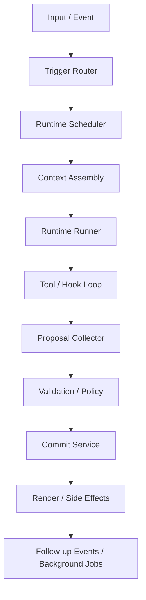

# Runtime Kernel 规格

时间：2026-03-29  
状态：草案  
类型：实现规格

## 1. 目的

定义运行时内核的模块边界、执行链、输入输出合同和首轮必须稳定的不变量。

本文件回答：

- kernel 负责什么
- kernel 不负责什么
- 一次 turn 如何执行
- proposal / validate / commit 如何衔接
- 首轮实现最少需要哪些模块

## 2. 范围

### 2.1 纳入范围

- 输入与事件入口
- runtime 选择与调度
- context 组装
- runtime 执行
- tool / hook 控制链
- proposal 收集
- validation / policy
- commit 与 render 衔接

### 2.2 不纳入范围

- 具体世界规则
- 具体插件内部逻辑
- 详细数据库字段实现
- 前端页面结构

## 3. Kernel 边界

### 3.1 Kernel 负责

- 接收用户输入和系统事件
- 将输入转为触发事件
- 根据 trigger 规则选择 runtime
- 按 priority 和 budget 调度 runtime
- 组装 runtime 需要的 context
- 驱动 runtime 的 tool / hook 循环
- 收集 proposal
- 调用 validation / policy / commit
- 输出渲染结果与 follow-up events

### 3.2 Kernel 不负责

- 写死具体玩法规则
- 直接暴露数据库给插件
- 直接持有某个具体 world 的业务逻辑
- 让插件绕过提交链写状态

### 3.3 Session-scoped Plugin Activation

所有插件在服务器启动时加载到全局注册表。每个 `KernelSession` 拥有独立的 `SessionPluginScope`，一个记录活跃插件 ID 的集合。

session 通过 scoped registry view（`ScopedRuntimeRegistry`、`ScopedToolRegistry`、`ScopedHookRegistry`）包装全局注册表，按活跃集合过滤。

- 插件可在 session 中途启用/禁用，变更在下一个 turn 生效
- world manifest 的 `requiredPlugins` / `recommendedPlugins` 用于初始化 session 的插件集合
- `KernelSession` 暴露 `enablePlugin()`、`disablePlugin()`、`listActivePlugins()`、`listAvailablePlugins()` 方法

## 4. 系统级执行链



首轮默认 gameplay profile：

- priority 400: 主叙事 runtime（heavy slot），负责 narrative 生成
- priority 500: 通用插件默认优先级
- priority 600: gameplay / mechanics 类插件（如 guide、char-tracker）
- priority 800+: 后台 runtime（memory、archive、索引），不阻塞主响应
- `manual` 触发型 runtime 仅在显式事件下进入调度

## 5. 核心模块

### 5.1 Trigger Router

职责：

- 识别输入类型
- 生成 `RuntimeTriggerEvent`
- 根据 runtime trigger 规则筛选候选 runtime
- 评估 hook + trigger 条件，而不是只按“对话后”理解触发时机

输入：

- `KernelInput`

输出：

- `RuntimeTriggerEvent`
- `CandidateRuntime[]`

首轮应支持的触发来源至少包括：

- session 开始
- narrative 结束事件
- 显式动作 / 按钮事件
- interval / 每 N 轮
- context 阈值
- 业务目标达成事件

### 5.2 Runtime Scheduler

职责：

- 根据 priority 排序规则选择执行顺序
- 应用 budget、去重规则
- 将后台任务与同步任务分流

排序规则：

1. `priority`（0-1000，升序；0 = 最高优先级 = 最先执行）
2. 同 priority 内按插件依赖拓扑分层
3. 层内并行执行
4. `plugin.loadingOrder` 作为稳定排序 tiebreaker

依赖拓扑分组：

- 同一 priority 组内，若存在插件声明了 `requires` 依赖关系，使用 Kahn 算法进行拓扑分层
- 被依赖的插件的 runtime 先执行
- 无依赖关系的 runtime 并行执行

规则：

- 同一 priority 组内无依赖关系的 runtime 并行执行
- `manual` 触发型 runtime 仅在显式触发事件下进入调度

后台任务分流：

- runtime 的 priority 达到 `backgroundThreshold`（默认 800）时，scheduler 将其分流为后台任务
- 后台任务不阻塞主响应，异步执行
- 后台任务结果通过 `onBackgroundTaskDone` 回调通知调用方
- 后台任务必须保留完整 trace（runtimeId、pluginId、traceId）
- `backgroundThreshold` 可由调用方配置覆盖

### 5.3 Context Assembly

职责：

- 依据 runtime spec 组装最小上下文
- 根据 read scopes 裁剪数据
- 保证 context 为只读视图
- 解析并注入当前 turn 的目标 locale
- 按 locale 回退规则选择 world / plugin / prompt 资源

首轮 slices：

- `chat`
- `world`
- `characters`
- `state`
- `record`
- `events`
- `runtime`
- `runtimeSettings`
- `narrative`
- `archive`

规则：

- 不返回全量系统状态
- 优先裁剪历史与检索结果
- 不裁剪 runtime 自身合同字段
- locale 必须显式进入 context
- 若当前 runtime 依赖主叙事结果，可在 context 中注入当前 turn 的 narrative 输出
- run 的 phase / status、当前 branch 以及必要的 archive summary 应作为可选 slice 注入
- prompt 组装必须优先使用前端当前选择的语言
- 缺失对应语言内容时，先回退到设置默认语言，再回退到资产默认语言

### 5.4 Runtime Runner

职责：

- 加载 runtime instructions
- 绑定 provider binding、tools、hooks、budget
- 驱动 tool calling 循环

首轮支持的 RuntimeKind：

- `story` — 主叙事类 runtime
- `plugin` — 通用插件类 runtime
- `background` — 后台异步类 runtime

首轮保留但不执行的 RuntimeKind：

- `verifier`

#### 5.4.1 Model Slot

runtime 通过 `providerBinding` 字段引用命名 model slot，而非直接指定具体模型。

首轮预定义 slot：

| Slot | 用途 | 典型场景 |
|------|------|----------|
| `heavy` | 主叙事、复杂推理 | core-narrator |
| `fast` | 轻量判断、插件默认 | core-guide, core-char-tracker |
| `balance` | 裁判类插件、复杂逻辑代理 | 未来扩展 |
| `image` | 图片生成（可选） | 未来扩展 |

回退链：请求 slot → `heavy` slot → 第一个可用 slot。

未配置的 slot 自动回退到 `heavy`。用户可通过前端配置面板为每个 slot 绑定不同的 provider preset。

runtime 只声明 slot 名称，不直接引用 provider SDK 或 API key。

#### 5.4.2 Model Capability

每个 slot 绑定的模型附带 `ModelCapability` 描述符，包含：

- **方向性模态**：`input: InputModality[]`（模型接受什么）、`output: OutputModality[]`（模型产出什么）
  - `InputModality`: `text | image | audio | video | file`
  - `OutputModality`: `text | image | audio | embedding`
  - 注意：`image` 在 input = 视觉理解，`image` 在 output = 图片生成。audio 同理。
- **功能标签**：`features: ModelFeature[]`（`function_calling | structured_output | streaming | reasoning | vision | prompt_caching | web_search | computer_use`）
- **Token 限制**：`contextWindow`（最大输入 token）、`maxOutputTokens`（最大输出 token）—— 供 Compactor 和记忆插件自动调用
- **价格信息**：`ModelPricing`（输入/输出/音频/图片每百万 token 单价 USD）—— 供前端成本控制

能力数据通过多源合并解析：
1. `llm.toml` 手动覆盖（最高优先级）
2. 手工精选已知模型库（~60 常见模型，总是可用）
3. LiteLLM 完整数据库（2597 模型，内置静态 JSON + 在线更新）
4. 协议默认值（兜底）

前端用户可在设置面板覆盖任意字段，存入 localStorage。

### 5.5 Tool / Hook Loop

职责：

- 执行 runtime 请求的 tool / script / provider
- 在生命周期点执行 hook
- 将 observation 回传 runtime

规则：

- runtime 仅可调用白名单中的 tools
- hook 可守卫、改写、审计、阻断
- hook 不应替代 runtime 做主要推演

Hook 排序规则：

同一生命周期点存在多个 hook 时，执行顺序按以下优先级确定：

1. 依赖拓扑层：被依赖的插件的 hook 先执行
2. `plugin.loadingOrder`：拓扑层相同时按 loadingOrder 排序
3. hook 注册顺序：loadingOrder 也相同时，按 manifest 中 hooks 数组的声明顺序

守卫型 hook（effect = `deny`）一旦触发立即终止链路，不执行后续 hook。

### 5.6 Proposal Collector

职责：

- 接收 runtime 与工具返回的 proposal-like 输出
- 统一归一为 `KernelProposalEnvelope`
- 维护 trace 与来源信息

首轮 proposal kinds：

- `narrative.append`
- `state.patch`
- `event.emit`
- `record.upsert`
- `ui.render`
- `asset.generate`

### 5.7 Validation / Policy

职责：

- schema 校验
- 权限校验
- policy 校验
- 幂等和冲突检查

输入：

- `KernelProposalEnvelope`

输出：

- `ValidatedProposalEnvelope`

### 5.8 Commit Service

职责：

- 写 `State`
- 追加 `Event`
- 更新 `Record`
- 生成 `Snapshot` 元数据
- 发出 committed events

输入：

- `ValidatedProposalEnvelope`
- 当前 `run / branch / snapshot` 信息

输出：

- `CommitResult`

### 5.9 Render / Side Effects

职责：

- 将 commit 结果映射到消息块、面板更新和副作用
- 触发 follow-up events 和后台任务

规则：

- 不绕过 commit 直接写状态
- 不重新解释业务事实

## 6. Turn 合同

### 6.1 输入合同

```ts
export interface KernelInput {
  runId: string;
  branchId: string;
  actorId: string;
  type: "user.input" | "system.event";
  locale?: string;
  payload: Record<string, unknown>;
}
```

### 6.2 输出合同

```ts
export interface KernelTurnResult {
  runId: string;
  branchId: string;
  turnId: string;
  traceId: string;
  locale: string;
  proposals: KernelProposalEnvelope[];
  commit?: CommitResult;
  render: RenderResult;
  followUpEvents: RuntimeTriggerEvent[];
}
```

## 7. Proposal 合同

```ts
export interface KernelProposalEnvelope {
  proposalId: string;
  runId: string;
  branchId: string;
  turnId: string;
  runtimeId: string;
  pluginId: string;
  traceId: string;
  items: KernelProposalItem[];
}
```

约束：

- proposal 必须带来源信息
- runtime 不直接落盘
- tool 的写结果必须归并为 proposal

## 8. Runtime Context 合同

```ts
export interface RuntimeContextView {
  run: {
    runId: string;
    worldId?: string;
    branchId: string;
    turnId: string;
    status?: string;
    phase?: string;
    defaultLocale?: string;
    activeBranchId?: string;
  };
  locale: string;
  world?: unknown;
  chat?: unknown;
  characters?: unknown[];
  state?: unknown;
  record?: unknown[];
  events?: RuntimeTriggerEvent[];
  runtimeSettings?: {
    flat?: Record<string, unknown>;
    byPlugin?: Record<string, Record<string, unknown>>;
  };
  narrative?: {
    content: string;
    messageId?: string;
  };
  archive?: {
    activeVersion?: number;
    latestVersion?: number;
    summary?: string;
  };
  runtime: {
    runtimeId: string;
    pluginId: string;
    kind: string;
    priority: number;
    allowedTools: string[];
    providerBinding?: string;
    budget?: RuntimeBudget;
    isolation?: RuntimeIsolationSpec;
  };
}
```

约束：

- context 为只读视图
- runtime 不能假设所有 slice 永远存在
- 修改系统事实只能经由 tool / proposal
- `locale` 是当前轮次的目标输出语言，而不是建议性提示

## 9. Locale 解析与传播

kernel 必须明确处理 locale，而不是把语言选择交给 runtime 或 provider 猜测。

首轮最低支持语言集合固定为：

- `zh-CN`
- `en-US`

解析顺序：

1. `KernelInput.locale`
2. `run.defaultLocale`
3. `world.defaultLocale`
4. 应用默认语言 `zh-CN`

传播规则：

- 解析出的 locale 进入 `RuntimeContextView.locale`
- render 层按该 locale 选择展示文本
- follow-up events 可继承当前 turn locale
- committed events 若包含用户可见文本，应记录生成时 locale
- 请求了超出最低支持集合的 locale 时，kernel 必须显式回退，默认回退到 `zh-CN`

资源选择回退规则：

1. 前端当前选择的语言
2. 设置中的默认语言
3. world / plugin 资源自身默认语言

## 10. 调度不变量

首轮必须满足：

1. 同一 runtime 在同一 turn 默认只执行一次。
2. 多步动作通过 tool calling 完成，而不是再次重新调度同一 runtime。
3. 单 runtime 的 tool calling 次数必须有上限。
4. `background` 不阻塞主响应，但必须有 trace。
5. 所有写操作统一进入 `proposal -> validate -> commit`。
6. 同一优先级先按依赖拓扑分层，再在层内并行执行。
7. `manual` 触发的 runtime 不得在未收到显式事件时自动调度。
8. `budget.maxTokens` 为 best-effort 约束：runner 应在每次 LLM 调用后累加 token 消耗，在接近上限时截断循环，但不保证精确限制（尤其在流式输出场景下）。首轮优先依赖 `maxSteps` 和 `timeoutMs` 作为硬性限制。

### 10.1 并行 Proposal 冲突策略

同层并行 runtime 可能同时产出 `state.patch` proposal 修改相同 scope 下的 key。首轮冲突解决策略：

1. **scope 隔离优先**：每个插件的 state.patch 应声明不同的 scope 前缀（如 `plugin.combat`、`plugin.inventory`），scope 不同的 patch 无冲突。
2. **同 scope 同 key 冲突检测**：若两个并行 runtime 修改了同一 scope 的同一 key，validation 层必须检测到冲突。
3. **默认策略为拒绝**：首轮检测到同 key 冲突时，默认拒绝后提交的 proposal 并记录 trace，不做自动合并。
4. **拓扑层优先级**：若冲突双方处于不同拓扑层，低层（先执行）的 proposal 优先。
5. **后续可扩展**：未来可引入 merge function、last-write-wins 或 OT 策略，但首轮不做。

## 11. 错误处理

首轮 failure policy：

- `continue`
- `stop`
- `retry`
- `disable_runtime`

规则：

- runtime 失败不得破坏已提交事实
- 未通过 validation 的 proposal 不得进入 commit
- background runtime 失败应记录 trace 和审计
- 因 locale 缺失导致的语言决策不得回退为隐式猜测，应使用明确 fallback

## 12. 可观测性

### 12.1 追踪字段链

kernel 全链路必须保留：`traceId → runId → branchId → turnId → runtimeId → pluginId`

### 12.2 Trace 采集点

kernel 在 `executeTurn` 中通过 `TraceCollector`（来自 `@covel/trace` 包）采集结构化 trace：

| 采集点 | 数据 | 归属 |
|--------|------|------|
| Trigger Router | triggerEvent、candidateRuntimeIds | TurnTrace |
| Scheduler | executionPlan（priority groups） | TurnTrace |
| Context Assembly | fragments、instructionsPreview、newChatMessageCount | RuntimeTrace |
| Provider Binding | slotId、presetId、provider、model | RuntimeTrace |
| LLM Call (每次) | delta messages、response、toolCalls、usage、duration | RuntimeTrace.llmCalls[] |
| Tool Execution (每次) | input、output、proposals、blocked、duration | RuntimeTrace.toolCalls[] |
| Hook Execution | hookId、event、allowed、reason | RuntimeTrace.hooks[] |
| Proposal Collection | kind、source、validated、rejected | RuntimeTrace.proposals[] |
| Commit | commitId、proposalCount、rejectedCount | TurnTrace |
| Locale 解析 | 最终 locale 和 fallback 路径 | TurnTrace |
| 依赖拓扑层 | Kahn 算法输出的 layer 结构 | TurnTrace.executionPlan |
| 触发原因 | triggerMode (always/event/interval/manual) | RuntimeTrace |

### 12.3 Delta 记录策略

LLM 无状态，prompt 由历史拼接。Trace 采用 delta 策略避免重复存储：

- **Turn 内**（tool-calling loop）：`LlmCallTrace.newMessages` 只存本次新增的 messages
- **Turn 间**（跨 turn 同 runtime）：记录 `newChatMessageCount` 和本轮 fragments 列表
- **完整快照**：可选 `promptSnapshot` 字段（`COVEL_TRACE_FULL_PROMPT=true` 开启）

### 12.4 消费通道

- **REST API**：`GET /api/trace/*` 供前端调试页查询
- **SSE 推送**：`trace.*` 事件类型，调试页可选订阅实时 trace
- **Langfuse**：`TraceExporter` 接口映射 trace 层级到 Langfuse Span 模型
- **JSON 导出**：玩家可下载 session 完整 trace

### 12.5 存储

首轮使用 `MemoryTraceCollector`（内存），保留最近 N 个 turn 的 trace（默认 50）。后续可扩展为持久化存储。

### 12.6 非 Runtime 日志

runtime trace 之外的基础设施日志（server 启动、plugin 加载、DB 操作、SSE 连接）使用 pino 结构化日志库，通过 child logger 携带 context 字段。

## 13. 首轮建议目录

```text
kernel/
  router/
  scheduler/
  context/
  runner/
  tools/
  hooks/
  proposals/
  validation/
  commit/
  render/
```

## 14. 首轮明确延期项

- 更细粒度的 priority 区间规范
- verifier runtime 调度
- 复杂并行 runtime 编排
- 跨小时 durable workflow
- 细粒度可视化回放系统
- 完整多语言内容编排器

## 15. 结论

Runtime Kernel 的核心不是“做更多事情”，而是保证所有运行时行为都经过统一、可追踪、可验证、可提交的执行链。  
只要这条主链稳定，玩法和插件数量的增加通常不会迫使内核整体重写。
