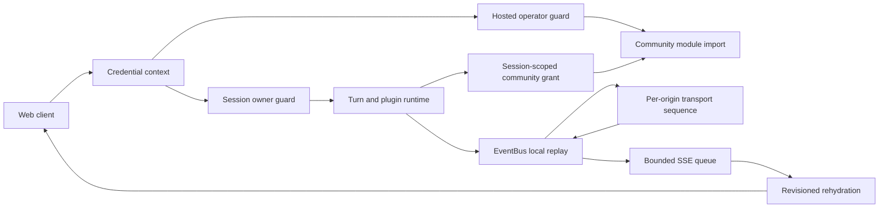

# Wave 3 remediation flow

```mermaid
flowchart LR
  Web[Web client] --> Auth[Credential context]
  Auth --> Global[Hosted operator guard]
  Auth --> Session[Session owner guard]
  Global --> Import[Community module import]
  Session --> Runtime[Turn and plugin runtime]
  Runtime --> Approval[Session-scoped community grant]
  Approval --> Import
  Runtime --> Bus[EventBus local replay]
  Bus --> Transport[Per-origin transport sequence]
  Transport --> Bus
  Bus --> SSE[Bounded SSE queue]
  SSE --> Reset[Revisioned rehydration]
  Reset --> Web
```
